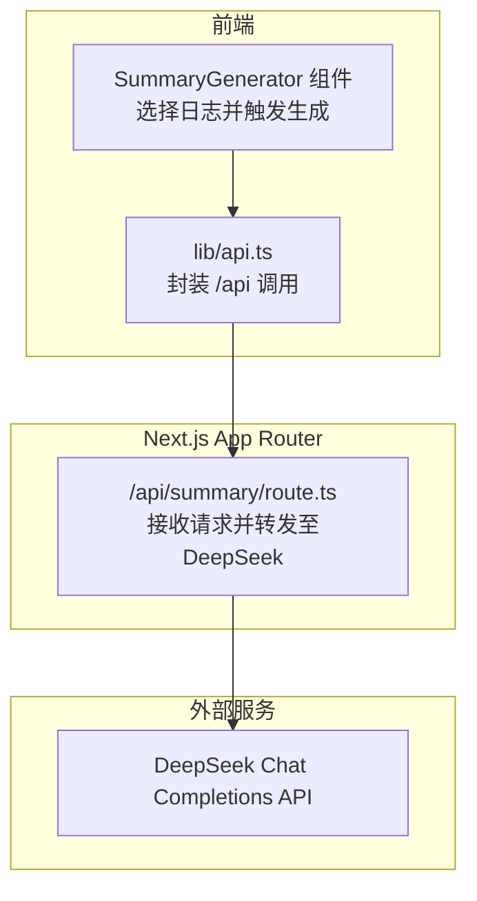
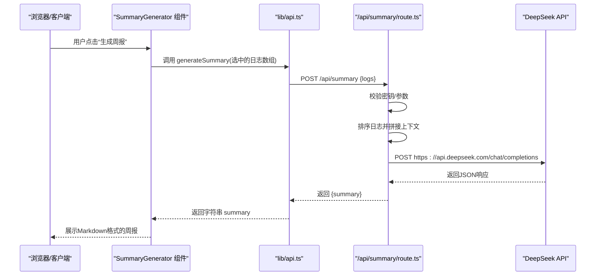
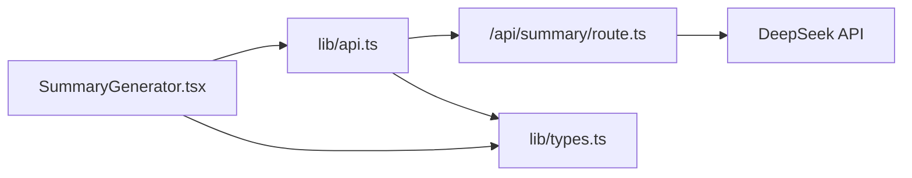

# AI接口调用实现

<cite>
**本文引用的文件列表**
- [app/api/summary/route.ts](file://app/api/summary/route.ts)
- [lib/api.ts](file://lib/api.ts)
- [components/SummaryGenerator.tsx](file://components/SummaryGenerator.tsx)
- [lib/types.ts](file://lib/types.ts)
- [app/api/logs/route.ts](file://app/api/logs/route.ts)
- [README.md](file://README.md)
- [config/env.example](file://config/env.example)
</cite>

## 目录
1. [简介](#简介)
2. [项目结构](#项目结构)
3. [核心组件](#核心组件)
4. [架构总览](#架构总览)
5. [详细组件分析](#详细组件分析)
6. [依赖关系分析](#依赖关系分析)
7. [性能与稳定性考量](#性能与稳定性考量)
8. [故障排查指南](#故障排查指南)
9. [结论](#结论)
10. [附录](#附录)

## 简介
本文件围绕 /api/summary 路由的AI接口调用实现进行深入解析，重点说明：
- 如何使用前端fetch或axios向DeepSeek API发送POST请求（请求头Authorization、Content-Type构造，请求体结构model、messages、temperature等参数）
- 服务端如何拼接多篇日志内容作为上下文输入，并设计system prompt引导生成符合周报格式的Markdown内容
- 流式响应处理（streaming）或普通响应的解析策略
- 前后端协作流程与错误处理机制

## 项目结构
该功能涉及前后端协作：前端通过组件触发生成请求，调用lib/api中的generateSummary方法；lib/api再向Next.js App Router的/api/summary路由发起POST请求；服务端路由对接DeepSeek API，返回生成结果。

图表来源
- [components/SummaryGenerator.tsx](file://components/SummaryGenerator.tsx#L1-L236)
- [lib/api.ts](file://lib/api.ts#L42-L56)
- [app/api/summary/route.ts](file://app/api/summary/route.ts#L1-L78)

章节来源
- [README.md](file://README.md#L1-L64)

## 核心组件
- /api/summary/route.ts：负责接收前端请求，拼接日志上下文，构造DeepSeek请求，解析响应并返回。
- lib/api.ts：提供统一的API封装，其中generateSummary方法向/api/summary发起POST请求。
- components/SummaryGenerator.tsx：UI层组件，负责日志选择、触发生成、展示结果与复制。
- lib/types.ts：定义日志实体类型LogEntry，供组件与API层共享。
- app/api/logs/route.ts：提供日志读取与创建等基础API，为周报生成提供数据来源。

章节来源
- [app/api/summary/route.ts](file://app/api/summary/route.ts#L1-L78)
- [lib/api.ts](file://lib/api.ts#L42-L56)
- [components/SummaryGenerator.tsx](file://components/SummaryGenerator.tsx#L1-L236)
- [lib/types.ts](file://lib/types.ts#L1-L34)
- [app/api/logs/route.ts](file://app/api/logs/route.ts#L1-L38)

## 架构总览
下图展示了从前端到服务端再到DeepSeek的完整调用链路与数据流向。

图表来源
- [components/SummaryGenerator.tsx](file://components/SummaryGenerator.tsx#L30-L43)
- [lib/api.ts](file://lib/api.ts#L42-L56)
- [app/api/summary/route.ts](file://app/api/summary/route.ts#L14-L76)

## 详细组件分析

### 服务端路由：/api/summary/route.ts
- 关键职责
  - 参数校验：检查DEEPSEEK_API_KEY是否存在；校验请求体中的logs是否为空
  - 上下文构建：按createTime升序排列日志，逐条拼接为promptContext
  - Prompt设计：system prompt明确要求输出结构化的周报（概述、完成事项、进行中、下周计划），并要求使用Markdown
  - DeepSeek调用：构造Authorization与Content-Type，发送POST请求，包含model、messages、temperature、max_tokens等参数
  - 响应解析：解析choices[0].message.content作为最终summary
  - 错误处理：对密钥缺失、参数缺失、上游API失败等情况返回相应错误信息

- 请求头与请求体要点
  - 请求头
    - Content-Type: application/json
    - Authorization: Bearer <DEEPSEEK_API_KEY>
  - 请求体
    - model: deepseek-chat
    - messages:
      - role: system
      - role: user（包含拼接后的promptContext）
    - temperature: 0.7
    - max_tokens: 2000

- 上下文拼接策略
  - 对传入logs按createTime升序排序，确保时间线清晰
  - 为每条日志添加分隔标记（日期、标题），随后追加content，形成结构化上下文

- 响应解析策略
  - 若response.ok为false，尝试解析错误消息并抛出
  - 成功时从choices[0].message.content提取summary，若不存在则回退为“生成摘要失败”

章节来源
- [app/api/summary/route.ts](file://app/api/summary/route.ts#L1-L78)

### 前端API封装：lib/api.ts
- generateSummary(logs)
  - 方法作用：向/api/summary发送POST请求，携带{ logs }，并在响应失败时抛出错误
  - 返回值：字符串summary
- 其他日志API（与周报生成相关）
  - fetchLogs：GET /api/logs
  - createLog/updateLog/deleteLog：对应REST操作

章节来源
- [lib/api.ts](file://lib/api.ts#L1-L56)
- [app/api/logs/route.ts](file://app/api/logs/route.ts#L1-L38)

### 前端组件：components/SummaryGenerator.tsx
- 功能概览
  - 日志选择：支持全选、反选、统计已选数量
  - 生成触发：调用generateSummary，显示loading与错误提示
  - 结果展示：将返回的Markdown文本渲染为结构化HTML
  - 复制功能：一键复制生成的周报文本

- 交互细节
  - 生成前会过滤出被选中的日志
  - 生成完成后提供“返回选择”与“复制周报”按钮
  - 展示阶段对Markdown进行简单渲染（标题、粗体、列表项）

章节来源
- [components/SummaryGenerator.tsx](file://components/SummaryGenerator.tsx#L1-L236)
- [lib/types.ts](file://lib/types.ts#L1-L34)

### 类型定义：lib/types.ts
- LogEntry：包含id、createTime、updateTime、status、creatorId、title、content等字段
- 该类型在组件与API层之间共享，保证数据结构一致

章节来源
- [lib/types.ts](file://lib/types.ts#L1-L34)

### 环境变量与配置
- DEEPSEEK_API_KEY：必须在环境变量中配置，否则服务端将直接返回错误
- 环境变量示例文件：config/env.example

章节来源
- [app/api/summary/route.ts](file://app/api/summary/route.ts#L1-L12)
- [README.md](file://README.md#L51-L60)
- [config/env.example](file://config/env.example#L1-L6)

## 依赖关系分析
- 组件依赖
  - SummaryGenerator依赖lib/api.ts中的generateSummary方法
  - generateSummary依赖Next.js App Router的/api/summary路由
- 路由依赖
  - /api/summary依赖process.env.DEEPSEEK_API_KEY
  - /api/summary依赖DeepSeek Chat Completions API
- 类型依赖
  - 所有模块共享lib/types.ts中的LogEntry定义

图表来源
- [components/SummaryGenerator.tsx](file://components/SummaryGenerator.tsx#L1-L236)
- [lib/api.ts](file://lib/api.ts#L42-L56)
- [app/api/summary/route.ts](file://app/api/summary/route.ts#L1-L78)
- [lib/types.ts](file://lib/types.ts#L1-L34)

## 性能与稳定性考量
- 请求参数优化
  - temperature=0.7：平衡创造性与稳定性，适合周报生成
  - max_tokens=2000：为长上下文留足空间，避免截断
- 上下文长度控制
  - 当日志较多时，建议限制选中日志数量或对content做预裁剪，以控制请求体积与延迟
- 错误恢复
  - 服务端对上游API失败进行降级处理（返回错误信息）
  - 前端对网络异常与解析失败进行友好提示
- 并发与节流
  - 在高频点击场景下，建议增加防抖或禁用重复提交按钮，避免重复请求

[本节为通用建议，不直接分析具体文件]

## 故障排查指南
- 环境变量未配置
  - 现象：服务端直接返回“请设置DEEPSEEK_API_KEY”的错误
  - 处理：在config/env.example基础上创建.env.local并填写DEEPSEEK_API_KEY
- 请求体缺失logs
  - 现象：返回“请选择要汇总的日志”
  - 处理：确认前端已正确选择日志并传递给generateSummary
- DeepSeek API返回错误
  - 现象：服务端解析错误消息并返回
  - 处理：检查API密钥有效性、配额与可用性
- 响应解析失败
  - 现象：summary为空或默认值
  - 处理：确认DeepSeek返回格式与choices结构是否符合预期

章节来源
- [app/api/summary/route.ts](file://app/api/summary/route.ts#L1-L20)
- [README.md](file://README.md#L51-L60)
- [config/env.example](file://config/env.example#L1-L6)

## 结论
/api/summary路由实现了从日志到周报的完整闭环：前端组件负责选择与触发，API封装负责统一调用，服务端路由负责上下文拼接与DeepSeek对接，最终返回结构化Markdown。当前实现采用普通JSON响应，未启用流式传输；如需实时进度反馈，可在服务端开启streaming并改造前端解析逻辑。

[本节为总结性内容，不直接分析具体文件]

## 附录

### 请求与响应规范（基于现有实现）
- 请求
  - 方法：POST
  - 路径：/api/summary
  - 请求头：Content-Type: application/json
  - 请求体：{ logs: LogEntry[] }
- 响应
  - 成功：{ summary: string }
  - 失败：{ error: string }

章节来源
- [lib/api.ts](file://lib/api.ts#L42-L56)
- [app/api/summary/route.ts](file://app/api/summary/route.ts#L14-L76)

### DeepSeek调用参数参考
- model: deepseek-chat
- messages:
  - system: system prompt（要求结构化周报与Markdown）
  - user: 拼接后的日志上下文
- temperature: 0.7
- max_tokens: 2000

章节来源
- [app/api/summary/route.ts](file://app/api/summary/route.ts#L44-L59)

### 流式响应（streaming）扩展建议
- 服务端
  - 在DeepSeek请求中启用streaming参数
  - 使用ReadableStream或EventSource逐步推送片段
- 前端
  - 使用fetch的ReadableStream或EventSource监听事件
  - 将片段实时拼接到UI，提升交互体验
- 注意事项
  - 控制缓冲区大小，避免内存占用过高
  - 增加错误重连与超时处理

[本节为概念性扩展建议，不直接分析具体文件]