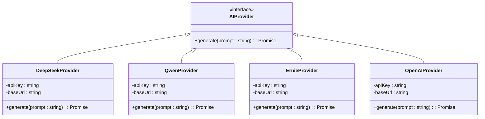

# AI服务商扩展指南

<cite>
**本文档引用的文件**  
- [app/api/summary/route.ts](file://app/api/summary/route.ts)
- [config/env.example](file://config/env.example)
- [README.md](file://README.md)
</cite>

## 目录
1. [简介](#简介)
2. [项目结构与AI集成位置](#项目结构与ai集成位置)
3. [核心迁移点分析](#核心迁移点分析)
4. [统一AI客户端接口设计建议](#统一ai客户端接口设计建议)
5. [不同模型提示词格式转换策略](#不同模型提示词格式转换策略)
6. [各平台速率限制与成本差异提醒](#各平台速率限制与成本差异提醒)
7. [迁移实施步骤](#迁移实施步骤)
8. [结论](#结论)

## 简介
本指南旨在为当前使用DeepSeek AI服务的系统提供向其他大模型平台（如通义千问、百度文心一言、OpenAI等）迁移的技术指导。通过抽象化AI客户端接口，实现多服务商支持的灵活性，并详细说明在迁移过程中需要修改的关键代码位置及注意事项。

## 项目结构与AI集成位置
当前项目中，AI功能主要用于生成工作周报摘要，其核心逻辑位于后端API路由中。前端组件`SummaryGenerator.tsx`调用`/api/summary`接口，由该接口负责与DeepSeek API通信并返回结果。

```mermaid
graph TB
A[前端 SummaryGenerator] --> B[/api/summary POST]
B --> C[调用 DeepSeek API]
C --> D[返回摘要结果]
```

**图示来源**  
- [app/api/summary/route.ts](file://app/api/summary/route.ts#L1-L80)

**本节来源**  
- [app/api/summary/route.ts](file://app/api/summary/route.ts#L1-L80)
- [components/SummaryGenerator.tsx](file://components/SummaryGenerator.tsx)

## 核心迁移点分析
要将AI服务从DeepSeek切换至其他平台，需重点关注以下几个核心配置和代码位置：

### 1. 环境变量配置
当前使用`DEEPSEEK_API_KEY`作为环境变量存储API密钥，迁移时应为新平台定义对应的密钥变量。

```env
# 当前配置（DeepSeek）
DEEPSEEK_API_KEY=your-deepseek-api-key

# 建议改为通用命名或按平台区分
AI_PROVIDER=deepseek|qwen|ernie|openai
AI_API_KEY=your-api-key
AI_API_BASE_URL=https://api.deepseek.com/chat/completions
```

**本节来源**  
- [config/env.example](file://config/env.example#L4-L5)
- [README.md](file://README.md#L54)

### 2. API地址与请求头
在`app/api/summary/route.ts`中硬编码了DeepSeek的API地址和鉴权方式：

- API地址：`https://api.deepseek.com/chat/completions`
- 请求头：`Authorization: Bearer ${DEEPSEEK_API_KEY}`

这些需要根据目标平台进行替换。

### 3. 请求体结构
当前请求体中的`model: 'deepseek-chat'`字段需根据目标平台支持的模型名称进行调整。例如：
- 通义千问：`qwen-max`
- 文心一言：`ernie-bot-4`
- OpenAI：`gpt-3.5-turbo` 或 `gpt-4`

### 4. 响应解析逻辑
虽然主流平台均采用类似JSON结构返回结果，但仍需验证响应字段是否一致（如`choices[0].message.content`），必要时需适配解析逻辑。

**本节来源**  
- [app/api/summary/route.ts](file://app/api/summary/route.ts#L3-L60)

## 统一AI客户端接口设计建议
为支持多AI服务商并便于未来扩展，建议抽象出统一的AI客户端接口。以下为推荐设计方案：



**图示来源**  
- [app/api/summary/route.ts](file://app/api/summary/route.ts#L1-L80)

**本节来源**  
- [app/api/summary/route.ts](file://app/api/summary/route.ts#L1-L80)
- [lib/api.ts](file://lib/api.ts)

## 不同模型提示词格式转换策略
不同大模型对系统提示词（system prompt）和用户输入格式的支持略有差异，建议采用如下转换策略：

| 平台 | 系统角色支持 | 提示词格式建议 | 备注 |
|------|-------------|----------------|------|
| DeepSeek | 支持 `system` 角色 | 使用多轮对话格式 | 当前已实现 |
| 通义千问 | 支持 `system` 角色 | 可直接迁移 | 需测试响应一致性 |
| 百度文心一言 | 不支持 `system` 角色 | 将系统提示合并至首条用户消息 | 如："你是一个专业的工作周报助手。请根据以下日志..." |
| OpenAI | 支持 `system` 角色 | 可直接迁移 | 兼容性最佳 |

建议在统一客户端中封装`formatPrompt`方法，根据不同提供商动态调整输入格式。

**本节来源**  
- [app/api/summary/route.ts](file://app/api/summary/route.ts#L27-L37)

## 各平台速率限制与成本差异提醒
在迁移前需充分评估各平台的调用限制与成本结构：

| 平台 | 免费额度 | 商业版速率限制 | 成本（每千token） | 备注 |
|------|----------|----------------|--------------------|------|
| DeepSeek | 有免费层 | 按API密钥限流 | 较低 | 国内访问稳定 |
| 通义千问 | 免费调用额度充足 | QPS限制 | 极低（部分模型免费） | 阿里云生态集成方便 |
| 百度文心一言 | 有免费额度 | 按应用限流 | 中等 | 需注册企业账号获取更高配额 |
| OpenAI | 无国内直连 | 区域性限流 | 较高 | 需解决网络访问问题 |

**提醒事项：**
- 生产环境务必配置合理的重试机制与降级策略
- 建议记录每次AI调用的token消耗用于成本监控
- 考虑实现熔断机制防止突发流量导致超额计费

**本节来源**  
- [app/api/summary/route.ts](file://app/api/summary/route.ts#L1-L80)
- [README.md](file://README.md#L29)

## 迁移实施步骤
1. **环境准备**：在`.env.local`中添加新的AI服务商配置项
2. **接口抽象**：创建统一的`AIProvider`接口及各平台实现类
3. **工厂模式注入**：根据环境变量`AI_PROVIDER`动态选择实现
4. **提示词适配**：实现平台特定的提示词格式转换逻辑
5. **错误处理统一**：封装异常处理，屏蔽底层差异
6. **测试验证**：对比各平台输出质量与性能表现
7. **灰度上线**：通过配置切换逐步迁移流量

## 结论
通过抽象统一AI客户端接口，不仅可以顺利实现从DeepSeek到其他大模型平台的迁移，还能为未来支持更多AI服务商打下良好基础。建议在迁移过程中重点关注API兼容性、提示词格式差异以及成本控制，确保系统稳定性与可持续发展。