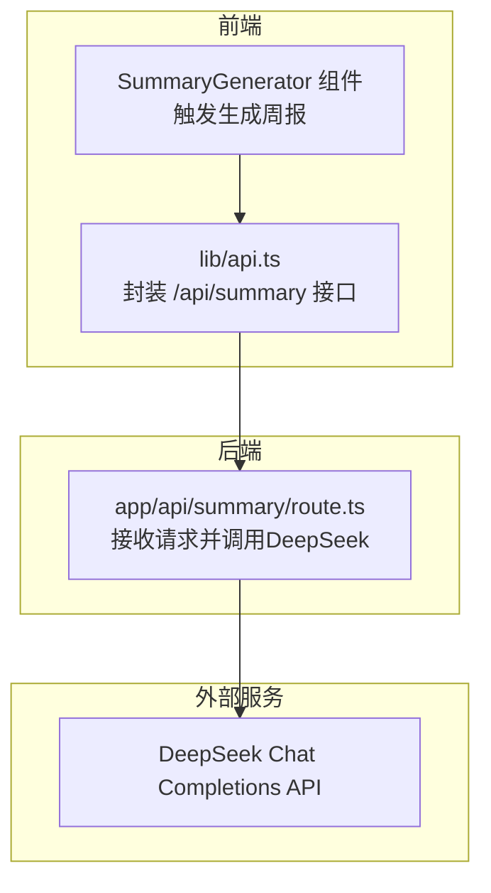
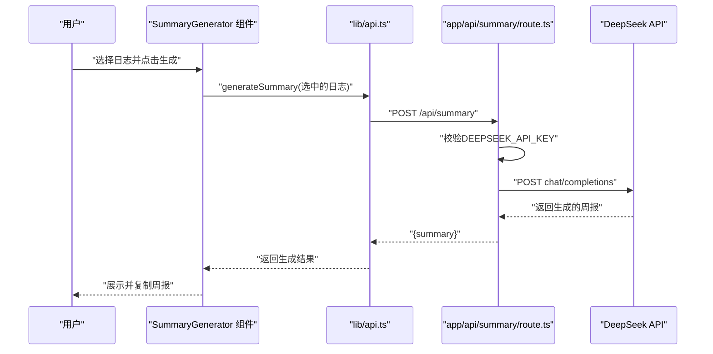
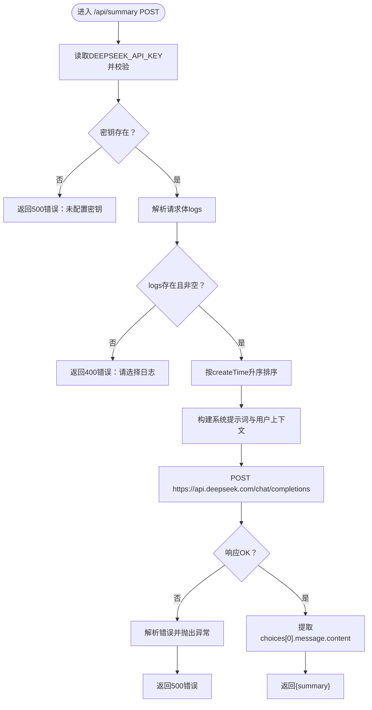
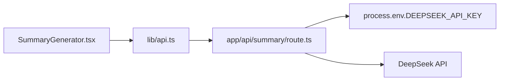

# AI配置说明

<cite>
**本文引用的文件**
- [config/env.example](file://config/env.example)
- [app/api/summary/route.ts](file://app/api/summary/route.ts)
- [.gitignore](file://.gitignore)
- [README.md](file://README.md)
- [lib/api.ts](file://lib/api.ts)
- [components/SummaryGenerator.tsx](file://components/SummaryGenerator.tsx)
</cite>

## 目录
1. [简介](#简介)
2. [项目结构](#项目结构)
3. [核心组件](#核心组件)
4. [架构总览](#架构总览)
5. [详细组件分析](#详细组件分析)
6. [依赖分析](#依赖分析)
7. [性能考虑](#性能考虑)
8. [故障排查指南](#故障排查指南)
9. [结论](#结论)
10. [附录](#附录)

## 简介
本文件面向开发者，系统性说明本项目的AI功能配置方式，重点围绕如何通过环境变量安全地配置DeepSeek API密钥与服务端点，并提供.env文件的创建流程、敏感信息保护机制、配置验证步骤，以及对config/env.example示例中各AI相关配置项的含义与可选项进行解读。同时，结合前端组件与后端API路由，给出端到端的调用链路与错误处理策略，帮助快速定位问题并稳定运行AI周报生成功能。

## 项目结构
本项目采用Next.js应用结构，AI功能位于后端API路由中，前端通过组件触发请求。关键位置如下：
- 后端API路由：app/api/summary/route.ts
- 前端组件：components/SummaryGenerator.tsx
- 前端API封装：lib/api.ts
- 环境变量示例：config/env.example
- 版本控制忽略规则：.gitignore
- 项目说明与环境变量清单：README.md

图表来源
- [components/SummaryGenerator.tsx](file://components/SummaryGenerator.tsx#L1-L237)
- [lib/api.ts](file://lib/api.ts#L42-L56)
- [app/api/summary/route.ts](file://app/api/summary/route.ts#L1-L78)

章节来源
- [README.md](file://README.md#L38-L64)

## 核心组件
- 环境变量示例与说明：config/env.example
- 后端AI路由：app/api/summary/route.ts（读取DEEPSEEK_API_KEY，向DeepSeek发起请求）
- 前端组件：components/SummaryGenerator.tsx（选择日志、触发生成、展示结果）
- 前端API封装：lib/api.ts（统一调用/api/summary）

章节来源
- [config/env.example](file://config/env.example#L1-L7)
- [app/api/summary/route.ts](file://app/api/summary/route.ts#L1-L78)
- [components/SummaryGenerator.tsx](file://components/SummaryGenerator.tsx#L1-L237)
- [lib/api.ts](file://lib/api.ts#L42-L56)

## 架构总览
AI周报生成功能的端到端流程如下：
1. 用户在前端界面选择若干日志条目。
2. 前端组件调用后端API接口 /api/summary。
3. 后端路由读取环境变量DEEPSEEK_API_KEY，构造DeepSeek请求体并发送请求。
4. DeepSeek返回生成的周报内容，后端返回给前端。
5. 前端展示并允许复制。

图表来源
- [components/SummaryGenerator.tsx](file://components/SummaryGenerator.tsx#L30-L43)
- [lib/api.ts](file://lib/api.ts#L42-L56)
- [app/api/summary/route.ts](file://app/api/summary/route.ts#L1-L78)

## 详细组件分析

### 环境变量与敏感信息保护
- 环境变量示例文件：config/env.example
  - 示例中定义了DEEPSEEK_API_KEY键，用于存放DeepSeek API密钥。
  - 该文件仅作为示例模板，不应直接提交到版本控制。
- 版本控制忽略规则：.gitignore
  - 明确忽略 .env*.local 与 .env，防止本地环境文件被提交。
  - 这是保护敏感信息的关键措施。
- README中的环境变量清单
  - 列出了DEEPSEEK_API_KEY的作用说明，便于开发者快速理解。

章节来源
- [config/env.example](file://config/env.example#L1-L7)
- [.gitignore](file://.gitignore#L26-L29)
- [README.md](file://README.md#L51-L56)

### 后端API路由（AI核心逻辑）
- 关键行为
  - 读取DEEPSEEK_API_KEY并校验是否存在；若缺失，直接返回错误。
  - 读取请求体中的logs数组，按createTime升序排序。
  - 构造系统提示词与用户上下文prompt，调用DeepSeek chat/completions。
  - 解析响应choices[0].message.content作为最终摘要。
  - 对HTTP非OK状态与异常进行捕获并返回标准化错误。
- 重要参数
  - 模型名称：deepseek-chat
  - 温度：0.7
  - 最大token数：2000
  - 请求头：Authorization使用Bearer方案携带DEEPSEEK_API_KEY

图表来源
- [app/api/summary/route.ts](file://app/api/summary/route.ts#L1-L78)

章节来源
- [app/api/summary/route.ts](file://app/api/summary/route.ts#L1-L78)

### 前端组件与API封装
- SummaryGenerator组件
  - 支持多选日志，点击“生成周报”按钮后调用generateSummary。
  - 展示加载状态、错误信息与生成结果。
  - 提供复制功能，提升用户体验。
- lib/api.ts
  - 封装generateSummary方法，向后端/api/summary发起POST请求。
  - 对非OK响应进行错误解析与抛出，便于上层组件处理。

章节来源
- [components/SummaryGenerator.tsx](file://components/SummaryGenerator.tsx#L1-L237)
- [lib/api.ts](file://lib/api.ts#L42-L56)

### 配置项说明与可选项
- DEEPSEEK_API_KEY
  - 作用：用于DeepSeek API鉴权的Bearer Token。
  - 来源：从DeepSeek平台获取。
  - 示例：见config/env.example。
  - 在后端路由中以process.env.DEEPSEEK_API_KEY读取。
- DEEPSEEK_API_URL
  - 当前实现固定为https://api.deepseek.com/chat/completions。
  - 若需切换或自定义，可在后端路由中调整该常量。
- 其他模型参数（在后端路由中硬编码）
  - model：deepseek-chat
  - temperature：0.7
  - max_tokens：2000

章节来源
- [config/env.example](file://config/env.example#L1-L7)
- [app/api/summary/route.ts](file://app/api/summary/route.ts#L1-L78)

## 依赖分析
- 组件耦合
  - 前端组件依赖lib/api.ts的generateSummary方法。
  - lib/api.ts依赖后端API路由/app/api/summary。
  - 后端路由依赖process.env中的DEEPSEEK_API_KEY。
- 外部依赖
  - DeepSeek Chat Completions API
- 潜在风险
  - 若DEEPSEEK_API_KEY未配置或为空，后端会直接返回错误，前端收到错误消息。
  - .env*.local与.env被.gitignore忽略，避免误提交。

图表来源
- [components/SummaryGenerator.tsx](file://components/SummaryGenerator.tsx#L1-L237)
- [lib/api.ts](file://lib/api.ts#L42-L56)
- [app/api/summary/route.ts](file://app/api/summary/route.ts#L1-L78)

章节来源
- [.gitignore](file://.gitignore#L26-L29)
- [README.md](file://README.md#L51-L56)

## 性能考虑
- 请求体大小
  - 生成周报时会将多条日志拼接为上下文，日志越多，上下文越大，可能导致请求体增大、响应时间延长。
- 模型参数
  - temperature与max_tokens影响生成长度与随机性，适当降低max_tokens可减少成本与延迟。
- 错误重试
  - 当前实现未内置自动重试逻辑，遇到网络波动可由前端引导用户重试或检查密钥配置。

## 故障排查指南
- 症状：后端返回“未配置DeepSeek API密钥”
  - 排查：确认DEEPSEEK_API_KEY是否存在于运行环境（例如部署平台的环境变量），或本地是否正确复制.env.example为.env.local并填写密钥。
  - 参考：后端路由对DEEPSEEK_API_KEY的校验逻辑。
- 症状：前端显示“生成周报失败”
  - 排查：查看后端日志中的错误信息；确认网络可达DeepSeek API；检查密钥有效性与配额。
  - 参考：后端对HTTP非OK状态与异常的捕获与返回。
- 症状：.env.local被提交到仓库
  - 排查：检查.gitignore是否包含.env*.local与.env；确保未将本地文件加入提交。
- 症状：生成内容不符合预期
  - 排查：检查logs选择是否合理；可尝试减少日志数量或调整系统提示词（当前在后端路由中硬编码）。

章节来源
- [app/api/summary/route.ts](file://app/api/summary/route.ts#L1-L78)
- [.gitignore](file://.gitignore#L26-L29)

## 结论
本项目通过明确的环境变量示例、严格的版本控制忽略规则与后端路由的健壮校验，实现了AI功能的安全与稳定配置。开发者只需在本地或部署平台正确设置DEEPSEEK_API_KEY，即可启用AI周报生成功能。建议在生产环境中进一步完善错误重试、日志监控与密钥轮换策略，以提升可用性与安全性。

## 附录

### A. .env文件创建与敏感信息保护流程
- 步骤
  - 复制config/env.example为本地文件（例如.env.local）。
  - 在新文件中填写DEEPSEEK_API_KEY。
  - 确保该文件未被提交到版本控制（.gitignore已忽略.env*.local与.env）。
- 验证
  - 在后端路由中读取DEEPSEEK_API_KEY并进行非空校验，若为空则返回错误，前端可据此提示用户检查配置。

章节来源
- [config/env.example](file://config/env.example#L1-L7)
- [.gitignore](file://.gitignore#L26-L29)
- [app/api/summary/route.ts](file://app/api/summary/route.ts#L1-L12)

### B. 配置验证步骤
- 本地验证
  - 启动应用后，打开前端页面，选择若干日志，点击“生成周报”，观察是否返回摘要或错误信息。
  - 若返回“未配置DeepSeek API密钥”，请检查DEEPSEEK_API_KEY是否正确设置。
- 部署验证
  - 在部署平台（如Vercel、云厂商平台）设置DEEPSEEK_API_KEY环境变量。
  - 重新构建并访问应用，复测AI周报生成功能。

章节来源
- [README.md](file://README.md#L28-L34)
- [app/api/summary/route.ts](file://app/api/summary/route.ts#L1-L12)

### C. 配置项对照表
- DEEPSEEK_API_KEY
  - 类型：字符串
  - 作用：用于DeepSeek API鉴权
  - 示例：见config/env.example
  - 参考：README.md中的环境变量说明
- DEEPSEEK_API_URL
  - 类型：字符串
  - 作用：DeepSeek Chat Completions API端点
  - 默认值：https://api.deepseek.com/chat/completions
  - 参考：后端路由中的常量定义

章节来源
- [config/env.example](file://config/env.example#L1-L7)
- [README.md](file://README.md#L51-L56)
- [app/api/summary/route.ts](file://app/api/summary/route.ts#L1-L7)