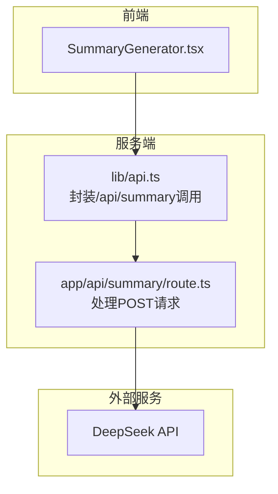
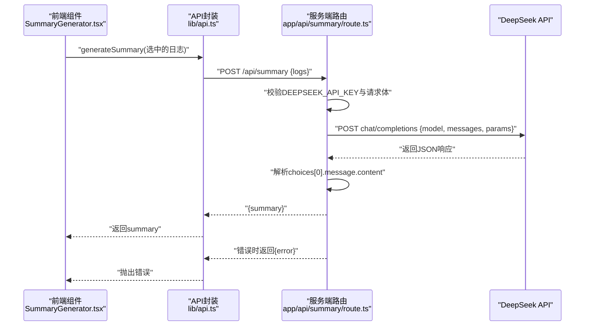
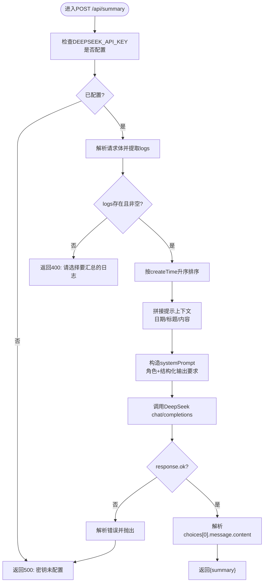
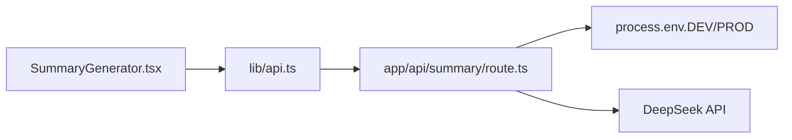

# AI集成配置

<cite>
**本文引用的文件**
- [app/api/summary/route.ts](file://app/api/summary/route.ts)
- [lib/api.ts](file://lib/api.ts)
- [components/SummaryGenerator.tsx](file://components/SummaryGenerator.tsx)
- [config/env.example](file://config/env.example)
- [lib/types.ts](file://lib/types.ts)
- [app/api/logs/route.ts](file://app/api/logs/route.ts)
- [lib/utils.ts](file://lib/utils.ts)
- [README.md](file://README.md)
</cite>

## 目录
1. [简介](#简介)
2. [项目结构](#项目结构)
3. [核心组件](#核心组件)
4. [架构总览](#架构总览)
5. [详细组件分析](#详细组件分析)
6. [依赖分析](#依赖分析)
7. [性能考虑](#性能考虑)
8. [故障排查指南](#故障排查指南)
9. [结论](#结论)
10. [附录](#附录)

## 简介
本文件系统性阐述本项目的AI功能集成方式，重点围绕DeepSeek API的调用机制展开，包括：
- 如何通过环境变量安全配置API密钥（DEEPSEEK_API_KEY），并将其注入到后端路由中
- 在/api/summary路由中如何构造请求参数（模型选择、提示词工程、上下文拼接）
- 提示词设计策略与多篇日志结构化输入，以生成高质量周报
- 错误处理（如API限流、超时重试）与响应解析逻辑
- 更换AI服务商的扩展指南

## 项目结构
本项目采用Next.js应用结构，AI集成位于服务端路由与前端组件之间，形成“前端选择日志 -> 调用后端生成接口 -> 调用DeepSeek API -> 返回结果”的闭环。

图表来源
- [components/SummaryGenerator.tsx](file://components/SummaryGenerator.tsx#L1-L237)
- [lib/api.ts](file://lib/api.ts#L42-L56)
- [app/api/summary/route.ts](file://app/api/summary/route.ts#L1-L78)

章节来源
- [README.md](file://README.md#L1-L64)

## 核心组件
- 服务端路由：负责接收前端请求、校验参数、构造DeepSeek请求、解析响应并返回结果
- 前端组件：负责日志选择、触发生成、展示结果与复制
- API封装：统一管理/api/summary的HTTP调用，向上抛出可读错误
- 类型定义：确保日志结构一致，便于前后端协作
- 环境变量：存放DEEPSEEK_API_KEY，供路由读取

章节来源
- [app/api/summary/route.ts](file://app/api/summary/route.ts#L1-L78)
- [lib/api.ts](file://lib/api.ts#L42-L56)
- [components/SummaryGenerator.tsx](file://components/SummaryGenerator.tsx#L1-L237)
- [lib/types.ts](file://lib/types.ts#L1-L34)
- [config/env.example](file://config/env.example#L1-L7)

## 架构总览
下图展示了从前端到服务端再到DeepSeek API的完整调用链路，以及错误处理与响应解析的关键节点。

图表来源
- [components/SummaryGenerator.tsx](file://components/SummaryGenerator.tsx#L1-L237)
- [lib/api.ts](file://lib/api.ts#L42-L56)
- [app/api/summary/route.ts](file://app/api/summary/route.ts#L1-L78)

## 详细组件分析

### 服务端路由：/api/summary
- 环境变量与密钥注入
  - 路由读取DEEPSEEK_API_KEY，若为空则直接返回500错误，避免在生产环境暴露密钥泄露风险
- 请求体解析与参数校验
  - 从请求体提取logs数组；若为空则返回400错误
- 上下文构建与提示词工程
  - 对日志按createTime升序排序，保证时间线清晰
  - 将每条日志的标题与内容拼接到提示上下文中，并标注日期
  - systemPrompt明确角色定位与输出结构（概述、完成事项、进行中、下周计划），并要求使用Markdown中文输出
- DeepSeek请求构造
  - 使用chat/completions端点，model固定为deepseek-chat
  - 通过Authorization头携带Bearer Token
  - 设置temperature与max_tokens等参数以平衡创造性与长度控制
- 响应解析与错误处理
  - 若response.ok为false，尝试解析错误消息并抛出异常
  - 成功时从choices[0].message.content提取summary
  - 捕获异常并返回统一的错误信息

图表来源
- [app/api/summary/route.ts](file://app/api/summary/route.ts#L1-L78)

章节来源
- [app/api/summary/route.ts](file://app/api/summary/route.ts#L1-L78)

### API封装：generateSummary
- 统一调用/api/summary，传入logs数组
- 对非2xx响应进行错误解析并抛出
- 成功时返回summary字符串

章节来源
- [lib/api.ts](file://lib/api.ts#L42-L56)

### 前端组件：SummaryGenerator
- 日志选择与全选
  - 支持点击勾选单条或多条日志，顶部显示已选数量
- 生成流程
  - 点击生成按钮后，调用generateSummary(selectedLogs)
  - 展示加载态，捕获错误并显示
- 结果展示与复制
  - 将生成的Markdown内容渲染为结构化展示
  - 提供复制按钮，复制成功有短暂反馈

章节来源
- [components/SummaryGenerator.tsx](file://components/SummaryGenerator.tsx#L1-L237)

### 类型定义：LogEntry
- 明确日志字段（id、createTime、updateTime、status、creatorId、title、content）
- 保证前后端一致的数据契约，便于排序、过滤与提示词拼接

章节来源
- [lib/types.ts](file://lib/types.ts#L1-L34)

### 环境变量：DEEPSEEK_API_KEY
- 示例文件提供DEEPSEEK_API_KEY的配置指引
- README强调需复制env.example为.env.local并填入密钥
- 路由在启动时读取该变量，未配置时直接拒绝请求

章节来源
- [config/env.example](file://config/env.example#L1-L7)
- [README.md](file://README.md#L28-L34)
- [app/api/summary/route.ts](file://app/api/summary/route.ts#L1-L12)

### 日志数据源：/api/logs
- 提供GET/POST接口，用于获取与创建日志
- 为AI周报提供原始数据来源，前端组件通过该接口拉取日志列表

章节来源
- [app/api/logs/route.ts](file://app/api/logs/route.ts#L1-L38)

### 辅助工具：Markdown解析与格式化
- parseMarkdownToBlocks与blocksToMarkdown用于将Markdown转换为内部块结构，便于后续处理
- extractUnfinishedTasks可提取未完成任务并保留上级标题上下文，有助于周报“进行中”部分的生成
- formatDate/formatShortDate用于人性化日期展示

章节来源
- [lib/utils.ts](file://lib/utils.ts#L1-L168)

## 依赖分析
- 组件耦合
  - SummaryGenerator依赖lib/api.ts进行网络调用
  - lib/api.ts依赖Next.js内置fetch与/app/api/summary路由
  - app/api/summary/route.ts依赖process.env读取DEEPSEEK_API_KEY
- 外部依赖
  - DeepSeek API：chat/completions端点
- 潜在问题
  - 当前未实现超时与重试逻辑，遇到限流或网络抖动可能直接失败
  - 建议在lib/api.ts或app/api/summary/route.ts中增加指数退避重试与超时控制

图表来源
- [components/SummaryGenerator.tsx](file://components/SummaryGenerator.tsx#L1-L237)
- [lib/api.ts](file://lib/api.ts#L42-L56)
- [app/api/summary/route.ts](file://app/api/summary/route.ts#L1-L78)

## 性能考虑
- 上下文长度控制
  - 通过max_tokens限制输出长度，避免超出模型上下文窗口
  - 对日志进行排序与结构化拼接，减少冗余信息
- 温度系数
  - temperature设置为0.7，兼顾创造性与稳定性
- 前端渲染
  - 生成完成后一次性渲染Markdown，避免频繁重绘
- 扩展建议
  - 对大量日志场景，可分批调用或裁剪历史日志
  - 引入缓存策略，对相同输入的摘要进行缓存

[本节为通用性能讨论，无需特定文件引用]

## 故障排查指南
- 环境变量未配置
  - 现象：服务端直接返回500，提示未配置DEEPSEEK_API_KEY
  - 处理：复制config/env.example为.env.local，填入DEEPSEEK_API_KEY
- 请求体缺失logs
  - 现象：返回400，提示请选择要汇总的日志
  - 处理：前端确保至少选择一条日志
- DeepSeek API返回错误
  - 现象：服务端解析错误并返回500
  - 处理：检查密钥有效性、配额与速率限制；查看DeepSeek平台日志
- 响应解析失败
  - 现象：summary为空或默认值
  - 处理：确认DeepSeek返回结构与choices/message字段是否存在
- 前端错误展示
  - 现象：组件显示红色错误提示
  - 处理：根据错误信息重试或检查网络连通性

章节来源
- [app/api/summary/route.ts](file://app/api/summary/route.ts#L1-L78)
- [lib/api.ts](file://lib/api.ts#L42-L56)
- [components/SummaryGenerator.tsx](file://components/SummaryGenerator.tsx#L1-L237)
- [README.md](file://README.md#L28-L34)
- [config/env.example](file://config/env.example#L1-L7)

## 结论
本项目通过简洁的三层架构实现了AI周报生成功能：前端负责交互与选择，API封装负责统一调用，服务端路由负责与DeepSeek对接。提示词工程与上下文拼接策略确保了输出结构化与可读性。建议后续引入超时与重试机制，以提升在高并发与不稳定网络下的鲁棒性。

[本节为总结性内容，无需特定文件引用]

## 附录

### 提示词设计策略
- 角色设定：明确AI为“工作周报助手”，限定输出风格与职责边界
- 结构化输出：在systemPrompt中明确要求输出结构（概述、完成事项、进行中、下周计划），并要求使用Markdown中文输出
- 上下文组织：按日期升序排列日志，为每条日志标注日期与标题，使AI能准确识别时间线与主题
- 输出约束：通过max_tokens与temperature控制输出长度与创造性，避免冗长或离题

章节来源
- [app/api/summary/route.ts](file://app/api/summary/route.ts#L27-L43)

### 更换AI服务商的扩展指南
- 抽象化路由层
  - 在app/api/summary/route.ts中引入配置项（如AI_PROVIDER、BASE_URL、MODEL_NAME、AUTH_HEADER等），通过环境变量切换不同服务商
- 统一封装
  - 在lib/api.ts中新增generateSummaryByProvider方法，按服务商分支构造请求参数与响应解析
- 响应兼容
  - 不同服务商的响应结构可能存在差异，需在解析阶段做兼容处理（如choices/message或data.choices等）
- 错误映射
  - 将各服务商的错误码与消息映射为统一的错误对象，保持上层调用一致性
- 测试与验证
  - 为每个服务商编写单元测试，覆盖正常路径、错误路径与边界条件

章节来源
- [app/api/summary/route.ts](file://app/api/summary/route.ts#L1-L78)
- [lib/api.ts](file://lib/api.ts#L42-L56)