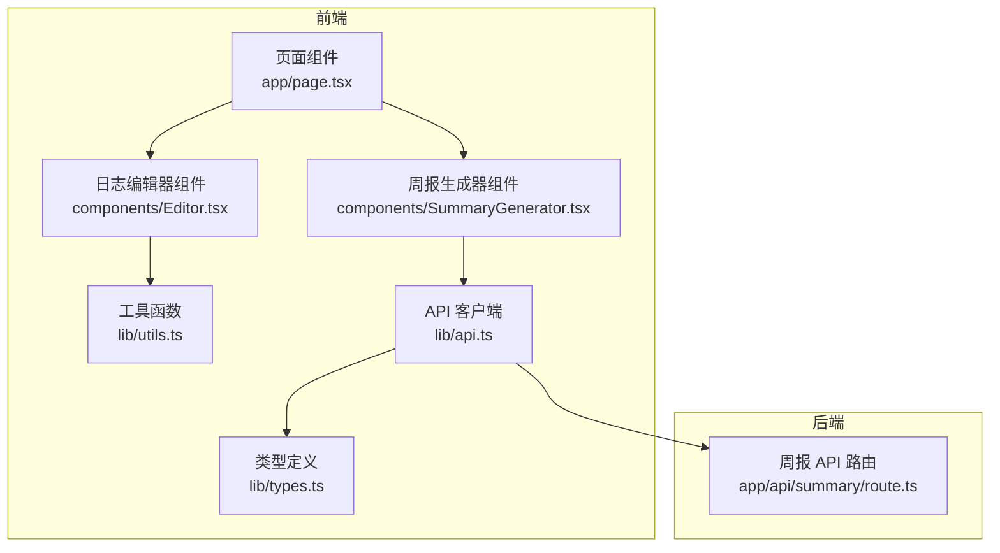
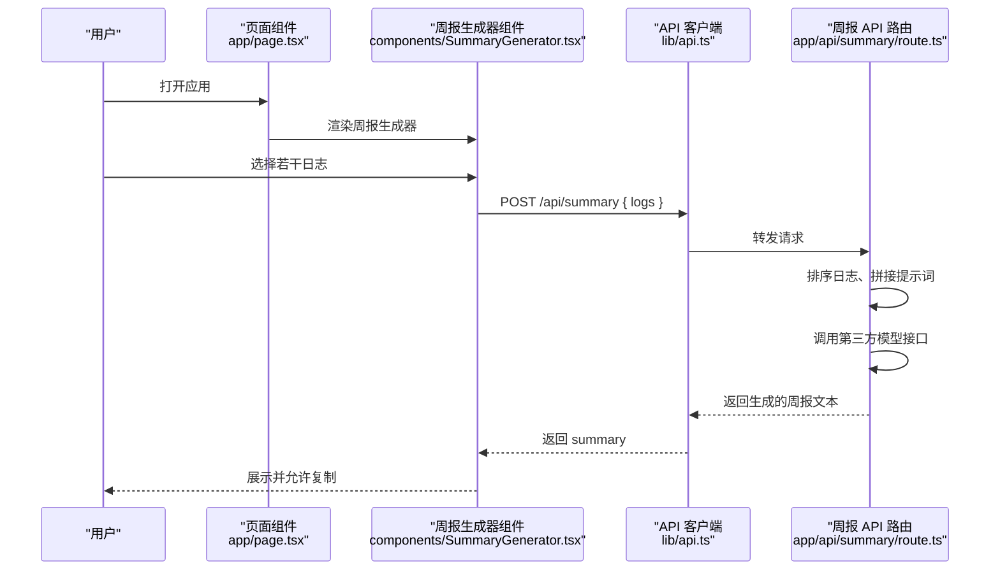
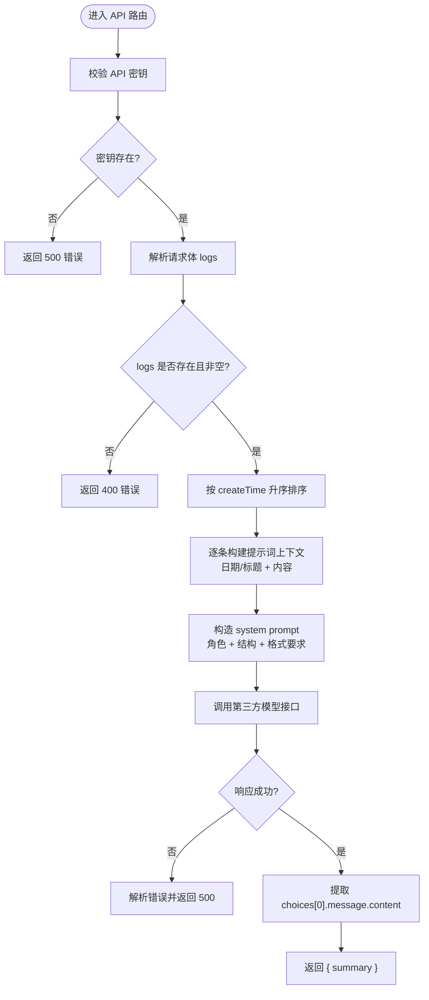
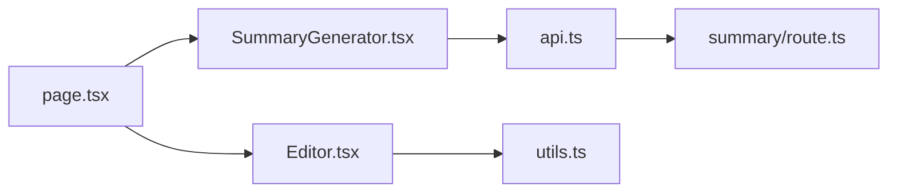

# 提示词工程设计

<cite>
**本文引用的文件**
- [README.md](file://README.md)
- [app/layout.tsx](file://app/layout.tsx)
- [app/page.tsx](file://app/page.tsx)
- [components/SummaryGenerator.tsx](file://components/SummaryGenerator.tsx)
- [components/Editor.tsx](file://components/Editor.tsx)
- [lib/api.ts](file://lib/api.ts)
- [lib/utils.ts](file://lib/utils.ts)
- [lib/types.ts](file://lib/types.ts)
- [app/api/summary/route.ts](file://app/api/summary/route.ts)
</cite>

## 目录
1. [引言](#引言)
2. [项目结构](#项目结构)
3. [核心组件](#核心组件)
4. [架构总览](#架构总览)
5. [详细组件分析](#详细组件分析)
6. [依赖分析](#依赖分析)
7. [性能考虑](#性能考虑)
8. [故障排查指南](#故障排查指南)
9. [结论](#结论)

## 引言
本文件围绕“用于生成周报的提示词（prompt）设计策略”展开，系统阐述如下主题：
- 如何通过 system message 明确 AI 角色（如“你是一个专业的技术主管”）、输出格式要求（Markdown 结构、章节划分）以及内容提炼规则（重点突出进展、问题与计划）。
- 用户日志内容如何被清洗、归类并注入到 prompt 中，以提升生成质量。
- 针对 token 长度控制、信息完整性保障与逻辑连贯性的优化建议。

该系统采用前端组件负责交互与选择，后端 API 路由负责拼接提示词并调用外部大模型服务，最终返回结构化周报文本。

## 项目结构
该项目基于 Next.js 构建，采用前后端分离的 API 设计：前端负责日志选择与展示，后端路由负责构造提示词并调用第三方模型接口。

图表来源
- [app/page.tsx](file://app/page.tsx#L1-L209)
- [components/SummaryGenerator.tsx](file://components/SummaryGenerator.tsx#L1-L237)
- [components/Editor.tsx](file://components/Editor.tsx#L1-L276)
- [lib/api.ts](file://lib/api.ts#L1-L56)
- [lib/utils.ts](file://lib/utils.ts#L1-L168)
- [lib/types.ts](file://lib/types.ts#L1-L34)
- [app/api/summary/route.ts](file://app/api/summary/route.ts#L1-L78)

章节来源
- [README.md](file://README.md#L1-L64)
- [app/layout.tsx](file://app/layout.tsx#L1-L29)

## 核心组件
- 周报生成器组件：负责日志选择、触发生成、展示结果与复制。
- API 客户端：封装 /api/summary 的请求，接收日志数组并返回生成的周报文本。
- 周报 API 路由：按时间排序日志，构造 system prompt 与 user prompt 上下文，调用第三方模型接口并返回结果。
- 工具函数：提供 Markdown 解析、块级结构转换、未完成任务提取等能力，辅助日志内容的清洗与结构化。

章节来源
- [components/SummaryGenerator.tsx](file://components/SummaryGenerator.tsx#L1-L237)
- [lib/api.ts](file://lib/api.ts#L1-L56)
- [app/api/summary/route.ts](file://app/api/summary/route.ts#L1-L78)
- [lib/utils.ts](file://lib/utils.ts#L1-L168)
- [lib/types.ts](file://lib/types.ts#L1-L34)

## 架构总览
周报生成的端到端流程如下：

图表来源
- [app/page.tsx](file://app/page.tsx#L150-L186)
- [components/SummaryGenerator.tsx](file://components/SummaryGenerator.tsx#L30-L43)
- [lib/api.ts](file://lib/api.ts#L42-L55)
- [app/api/summary/route.ts](file://app/api/summary/route.ts#L14-L77)

## 详细组件分析

### 周报生成器组件（SummaryGenerator）
职责与行为
- 支持多选日志，按时间倒序展示，便于用户筛选近期内容。
- 触发生成时，过滤出已选日志并调用 API 客户端发起请求。
- 展示生成结果，并提供复制功能与返回选择页的能力。
- 错误处理：捕获异常并显示错误信息。

提示词注入策略
- 该组件不直接构造提示词，仅负责选择日志并调用 API。
- 但其“按时间倒序展示”的特性，有助于用户在选择阶段就保证时间序列的连续性，间接提升提示词质量。

章节来源
- [components/SummaryGenerator.tsx](file://components/SummaryGenerator.tsx#L1-L237)

### API 客户端（lib/api.ts）
职责与行为
- 封装 /api/summary 的 POST 请求，将日志数组发送至后端路由。
- 对响应状态进行校验，抛出错误以便上层组件处理。

提示词注入策略
- 该模块不参与提示词构造，仅作为传输层。

章节来源
- [lib/api.ts](file://lib/api.ts#L1-L56)

### 周报 API 路由（app/api/summary/route.ts）
职责与行为
- 校验环境变量与请求体参数。
- 对传入日志按 createTime 升序排序，确保时间线清晰。
- 构造提示词上下文：为每条日志添加“日期与标题”分隔信息，再追加日志内容。
- 定义 system prompt：明确角色、输出结构（章节标题）、语言与格式要求。
- 调用第三方模型接口，解析返回内容，提取第一条候选消息作为最终摘要。
- 统一错误处理与响应格式。

提示词设计要点
- 角色定义：明确 AI 是“专业的工作周报助手”，限定角色边界，减少无关输出。
- 输出格式：要求使用 Markdown，并给出章节标题清单，便于前端渲染与一致性。
- 内容提炼规则：通过“本周概述/完成事项/进行中/下周计划”的结构化指令，引导模型聚焦关键信息。
- 时间组织：按时间升序排列日志，使提示词具备自然的时间线索，有利于生成连贯的周报。

图表来源
- [app/api/summary/route.ts](file://app/api/summary/route.ts#L1-L78)

章节来源
- [app/api/summary/route.ts](file://app/api/summary/route.ts#L1-L78)

### 工具函数与日志内容清洗（lib/utils.ts）
职责与行为
- 提供 Markdown 到块级结构的解析与反向转换，便于日志内容的结构化处理。
- 提供“提取未完成任务（含上级标题上下文）”的能力，有助于在生成周报前对内容进行二次筛选与组织。

提示词注入策略
- 该模块不直接参与提示词构造，但其“提取未完成任务”的能力可用于在前端层面预筛选日志，从而减少无效输入进入 LLM，提高生成质量与 token 效率。

章节来源
- [lib/utils.ts](file://lib/utils.ts#L1-L168)

### 类型定义（lib/types.ts）
职责与行为
- 定义日志条目、视图模式、块级结构与状态枚举等基础类型，确保前后端一致的数据契约。

章节来源
- [lib/types.ts](file://lib/types.ts#L1-L34)

## 依赖分析
- 组件耦合
  - 页面组件负责导航与视图切换，SummaryGenerator 与 Editor 通过 API 客户端与后端路由通信。
  - 前端组件与后端路由之间通过标准 HTTP 接口解耦，便于替换模型提供商或调整提示词策略。
- 外部依赖
  - 第三方模型接口（DeepSeek），通过环境变量配置密钥。
- 潜在循环依赖
  - 当前结构清晰，未发现循环依赖迹象。

图表来源
- [components/SummaryGenerator.tsx](file://components/SummaryGenerator.tsx#L1-L237)
- [lib/api.ts](file://lib/api.ts#L1-L56)
- [app/api/summary/route.ts](file://app/api/summary/route.ts#L1-L78)
- [components/Editor.tsx](file://components/Editor.tsx#L1-L276)
- [lib/utils.ts](file://lib/utils.ts#L1-L168)
- [app/page.tsx](file://app/page.tsx#L1-L209)

章节来源
- [lib/api.ts](file://lib/api.ts#L1-L56)
- [app/api/summary/route.ts](file://app/api/summary/route.ts#L1-L78)
- [components/SummaryGenerator.tsx](file://components/SummaryGenerator.tsx#L1-L237)
- [components/Editor.tsx](file://components/Editor.tsx#L1-L276)
- [app/page.tsx](file://app/page.tsx#L1-L209)

## 性能考虑
- 控制 token 长度
  - 在后端路由中对日志按时间升序排序后拼接，避免冗余信息；同时限制 max_tokens，防止超长上下文导致成本上升与延迟增加。
  - 若日志数量较多，可在前端进行“只选最近 N 天”的策略，减少上下文规模。
- 信息完整性
  - 使用“日期 + 标题 + 内容”的三段式上下文模板，确保模型能区分不同日志条目，降低混淆风险。
- 逻辑连贯性
  - 保持时间顺序与章节结构（概述/完成/进行中/计划）的一致性，有助于模型生成更连贯的周报。
- 错误与重试
  - 对第三方接口失败进行统一错误处理与状态码返回，便于前端展示与用户重试。

章节来源
- [app/api/summary/route.ts](file://app/api/summary/route.ts#L22-L77)

## 故障排查指南
常见问题与定位
- 环境变量缺失
  - 现象：后端返回 500，提示未配置 API 密钥。
  - 处理：在环境变量中设置密钥并重启服务。
- 请求体为空
  - 现象：后端返回 400，提示请选择日志。
  - 处理：确认前端已正确选择日志并传递给 API。
- 第三方接口失败
  - 现象：后端返回 5xx 或解析错误。
  - 处理：检查网络、密钥有效性与配额；查看响应体中的错误信息。
- 前端展示异常
  - 现象：复制按钮无反应或结果无法渲染。
  - 处理：确认已成功返回 summary 并检查前端复制逻辑与 Markdown 渲染路径。

章节来源
- [app/api/summary/route.ts](file://app/api/summary/route.ts#L6-L21)
- [lib/api.ts](file://lib/api.ts#L42-L55)
- [components/SummaryGenerator.tsx](file://components/SummaryGenerator.tsx#L30-L43)

## 结论
本系统通过“前端选择 + 后端提示词构造 + 第三方模型调用”的分层设计，实现了稳定、可扩展的周报生成能力。提示词工程的关键在于：
- 明确角色与输出结构，确保生成内容符合预期；
- 以时间顺序组织日志，提升逻辑连贯性；
- 控制上下文长度，避免 token 泄漏与成本失控；
- 在前端进行必要的内容清洗与筛选，进一步提升生成质量。

未来可演进方向
- 引入更细粒度的提示词模板（如按项目/模块分类），以适配不同角色与场景；
- 增加上下文压缩与摘要策略，应对长周期日志；
- 提供“手动微调提示词”的入口，满足个性化需求。