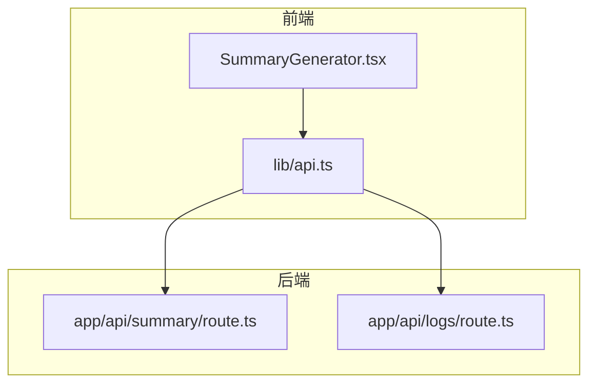
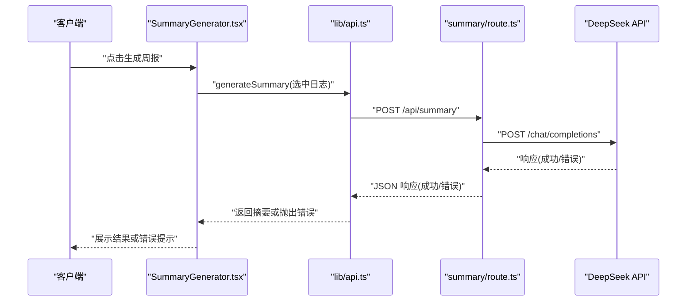
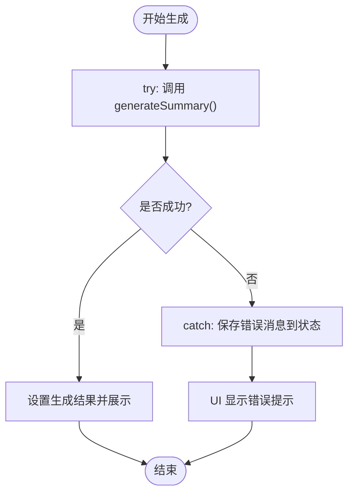
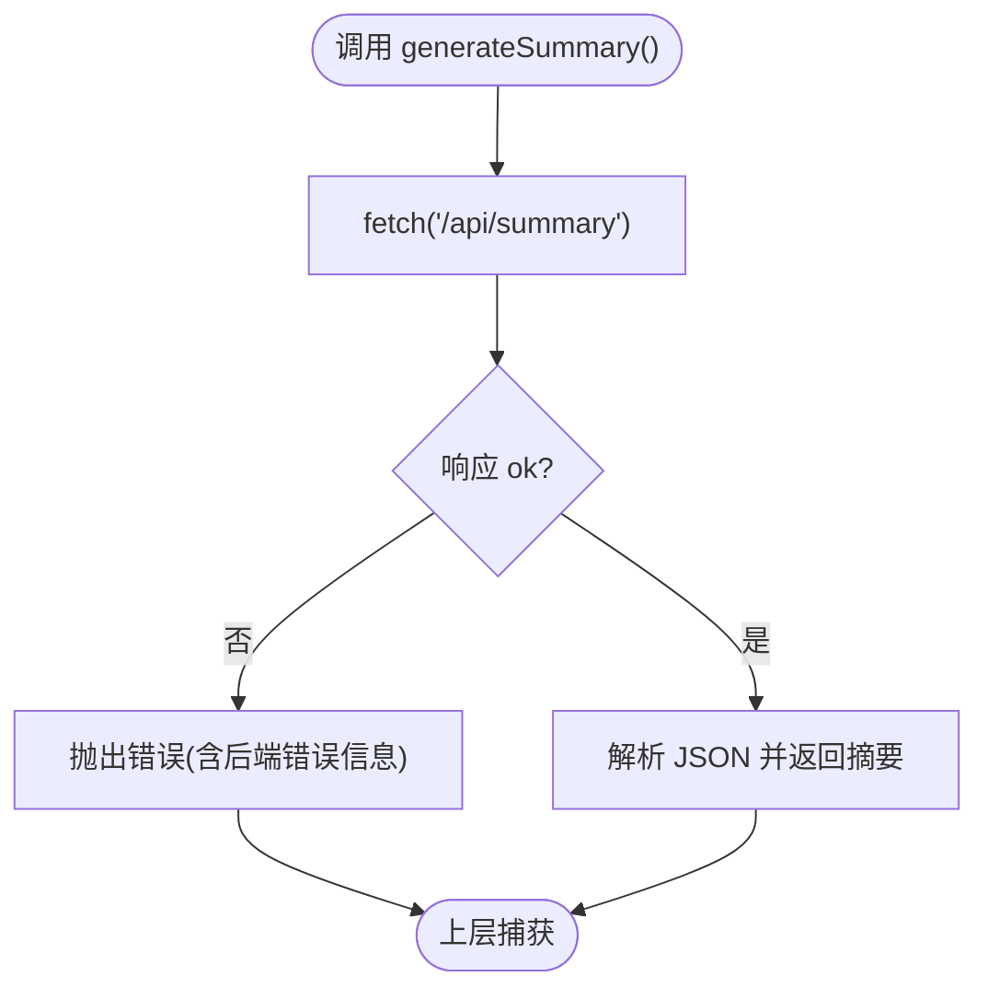
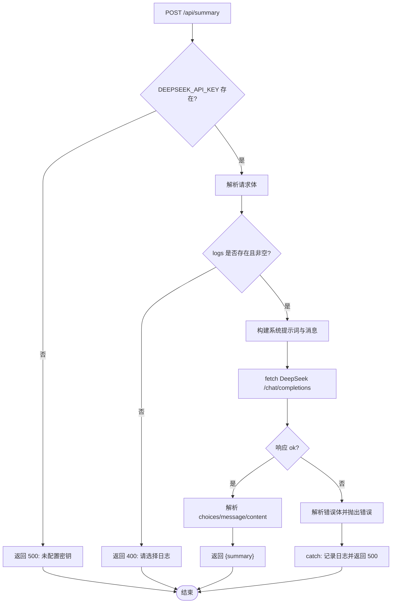

# 错误处理与重试机制

<cite>
**本文引用的文件**
- [README.md](file://README.md)
- [lib/api.ts](file://lib/api.ts)
- [lib/types.ts](file://lib/types.ts)
- [app/api/summary/route.ts](file://app/api/summary/route.ts)
- [app/api/logs/route.ts](file://app/api/logs/route.ts)
- [components/SummaryGenerator.tsx](file://components/SummaryGenerator.tsx)
- [package.json](file://package.json)
</cite>

## 目录
1. [简介](#简介)
2. [项目结构](#项目结构)
3. [核心组件](#核心组件)
4. [架构总览](#架构总览)
5. [详细组件分析](#详细组件分析)
6. [依赖分析](#依赖分析)
7. [性能考虑](#性能考虑)
8. [故障排查指南](#故障排查指南)
9. [结论](#结论)

## 简介
本文件聚焦于调用 DeepSeek API 过程中的异常处理与重试机制设计。通过对代码库的系统性分析，我们梳理了以下关键点：
- 异常场景覆盖：网络超时、API 限流（429）、认证失败（401）、服务器错误（5xx）等。
- 错误捕获机制：后端 API 路由层的 try-catch、前端组件层的 try-catch 与状态管理。
- 日志记录方式：后端使用控制台日志，前端通过用户界面反馈错误信息。
- 自动重试逻辑：当前代码未实现自动重试；本文提供基于指数退避的重试策略建议与实现路径。

## 项目结构
该应用采用 Next.js 的 App Router 结构，核心交互链路如下：
- 前端组件负责用户操作与 UI 展示，并通过 lib/api.ts 中的 fetch 函数发起请求。
- 后端路由 app/api/summary/route.ts 调用 DeepSeek API 并返回结果。
- app/api/logs/route.ts 提供日志 CRUD 的后端接口。
- lib/types.ts 定义数据模型，用于前后端一致性。

图表来源
- [components/SummaryGenerator.tsx](file://components/SummaryGenerator.tsx#L1-L237)
- [lib/api.ts](file://lib/api.ts#L1-L56)
- [app/api/summary/route.ts](file://app/api/summary/route.ts#L1-L78)
- [app/api/logs/route.ts](file://app/api/logs/route.ts#L1-L38)

章节来源
- [README.md](file://README.md#L1-L64)
- [package.json](file://package.json#L1-L30)

## 核心组件
- 前端摘要生成组件：负责选择日志、触发生成、展示结果与错误提示。
- 前端 API 封装：统一的 fetch 方法，封装日志与摘要生成的请求。
- 后端摘要路由：对接 DeepSeek API，处理鉴权、请求体构造、响应解析与错误回传。
- 后端日志路由：提供日志的增删改查，作为前端数据来源。

章节来源
- [components/SummaryGenerator.tsx](file://components/SummaryGenerator.tsx#L1-L237)
- [lib/api.ts](file://lib/api.ts#L1-L56)
- [app/api/summary/route.ts](file://app/api/summary/route.ts#L1-L78)
- [app/api/logs/route.ts](file://app/api/logs/route.ts#L1-L38)
- [lib/types.ts](file://lib/types.ts#L1-L34)

## 架构总览
下图展示了从前端到后端再到 DeepSeek API 的完整调用链及错误处理位置。

图表来源
- [components/SummaryGenerator.tsx](file://components/SummaryGenerator.tsx#L1-L237)
- [lib/api.ts](file://lib/api.ts#L43-L56)
- [app/api/summary/route.ts](file://app/api/summary/route.ts#L1-L78)

## 详细组件分析

### 前端错误捕获与用户反馈
- 捕获机制：组件内部使用 try-catch 包裹生成流程，将错误信息保存至本地状态并在 UI 中显示。
- 用户体验：在生成按钮禁用态、加载态与错误态之间切换，确保用户感知明确。
- 前端日志：组件未直接记录日志，但可通过浏览器开发者工具查看网络请求与错误堆栈。

图表来源
- [components/SummaryGenerator.tsx](file://components/SummaryGenerator.tsx#L30-L43)

章节来源
- [components/SummaryGenerator.tsx](file://components/SummaryGenerator.tsx#L1-L237)

### 前端 API 封装与错误传播
- 统一错误传播：当后端返回非 OK 状态时，API 封装会抛出错误，便于上层组件捕获。
- 摘要生成：对摘要接口的响应进行解析，若失败则从响应体提取错误信息并抛出。

图表来源
- [lib/api.ts](file://lib/api.ts#L43-L56)

章节来源
- [lib/api.ts](file://lib/api.ts#L1-L56)

### 后端摘要路由的错误处理
- 鉴权缺失：若未配置 DeepSeek API Key，直接返回 500 并提示配置问题。
- 输入校验：若未提供日志列表，返回 400。
- DeepSeek API 调用：对响应进行判断，非 OK 时解析错误体并抛出通用错误。
- 异常兜底：统一捕获异常，记录控制台日志并返回 500。

图表来源
- [app/api/summary/route.ts](file://app/api/summary/route.ts#L1-L78)

章节来源
- [app/api/summary/route.ts](file://app/api/summary/route.ts#L1-L78)

### 后端日志路由的错误处理
- 数据库查询/写入异常：统一捕获并记录控制台日志，返回 500。
- 成功路径：按状态过滤正常日志并按时间倒序返回。

章节来源
- [app/api/logs/route.ts](file://app/api/logs/route.ts#L1-L38)

### 数据模型与类型约束
- 日志条目包含主键、时间戳、状态、作者与内容字段，前端与后端通过类型保持一致。
- 类型定义有助于在编译期发现潜在的数据不一致问题。

章节来源
- [lib/types.ts](file://lib/types.ts#L1-L34)

## 依赖分析
- 前端依赖：Next.js、React、Prisma Client、TailwindCSS 等，未引入第三方重试库。
- 后端依赖：Next.js 内置 fetch，未引入外部重试库。
- 环境变量：DeepSeek API Key 通过环境变量注入，未在代码中硬编码。

章节来源
- [package.json](file://package.json#L1-L30)
- [README.md](file://README.md#L51-L60)
- [app/api/summary/route.ts](file://app/api/summary/route.ts#L1-L12)

## 性能考虑
- 当前未实现自动重试，意味着在网络抖动或服务瞬时不可用时，用户可能直接收到错误。
- 若引入重试，建议结合指数退避策略，避免对上游服务造成雪崩效应。
- 建议在前端增加“重试”按钮与最大重试次数限制，提升用户体验。

[本节为通用指导，无需特定文件来源]

## 故障排查指南

### 常见异常场景与定位
- 认证失败（401）
  - 现象：后端返回 500，提示未配置密钥或请求头缺少授权。
  - 排查：确认环境变量 DEEPSEEK_API_KEY 是否正确设置；检查 Authorization 头是否包含 Bearer Token。
  - 章节来源
    - [app/api/summary/route.ts](file://app/api/summary/route.ts#L1-L12)

- API 限流（429）
  - 现象：DeepSeek 返回 429，后端解析错误体并抛出通用错误。
  - 排查：观察响应体中的错误信息；如需重试，可在前端实现指数退避。
  - 章节来源
    - [app/api/summary/route.ts](file://app/api/summary/route.ts#L61-L64)

- 服务器错误（5xx）
  - 现象：DeepSeek 服务不可用或内部错误，后端统一捕获并返回 500。
  - 排查：查看后端控制台日志；确认服务可用性与网络连通性。
  - 章节来源
    - [app/api/summary/route.ts](file://app/api/summary/route.ts#L69-L76)

- 前端错误提示
  - 现象：组件捕获错误后显示红色提示框。
  - 排查：确认错误消息是否来自后端；检查网络面板与控制台。
  - 章节来源
    - [components/SummaryGenerator.tsx](file://components/SummaryGenerator.tsx#L96-L100)

### 日志记录方式
- 后端：使用控制台日志记录错误详情，便于运维排查。
- 前端：无专门日志模块，建议在生产环境接入轻量级日志上报（如 window.fetch 的拦截与上报）。

章节来源
- [app/api/summary/route.ts](file://app/api/summary/route.ts#L71-L76)
- [app/api/logs/route.ts](file://app/api/logs/route.ts#L13-L15)

### 自动重试策略建议
- 指数退避：首次延迟 T，随后每次翻倍，上限不超过 M 秒。
- 最大重试次数：建议 3–5 次，避免无限重试导致资源浪费。
- 退避抖动：加入随机抖动（例如 ±20%），降低同时重试引发的尖峰。
- 重试条件：仅对 429、502、503、504 等可恢复错误进行重试；401、400 等明确失败不重试。
- 实现路径：
  - 在前端 lib/api.ts 的 generateSummary 方法中封装重试逻辑。
  - 在组件层暴露“重试”按钮与进度反馈。
  - 后端保持幂等性设计，避免重复提交导致副作用。

[本节为通用指导，无需特定文件来源]

## 结论
- 当前代码在后端与前端均实现了基础的错误捕获与用户反馈，能够覆盖常见的网络与服务异常。
- 对于 DeepSeek API 的 429、401、5xx 等异常，后端已具备基本的错误解析与回传能力；前端提供了直观的错误提示。
- 为提升稳定性与用户体验，建议在前端实现指数退避的自动重试机制，并在必要时扩展后端的重试策略与限流保护。