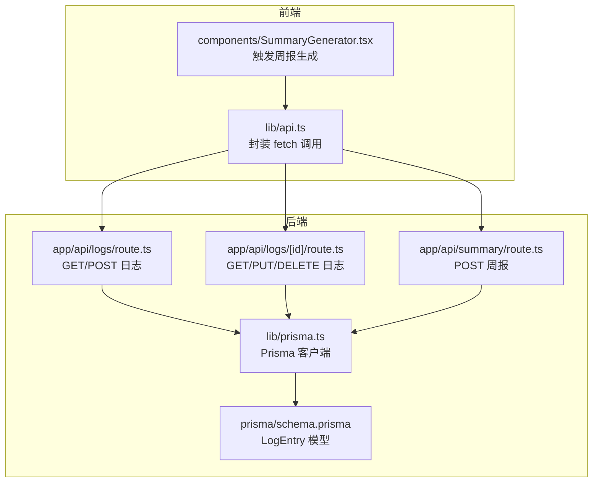
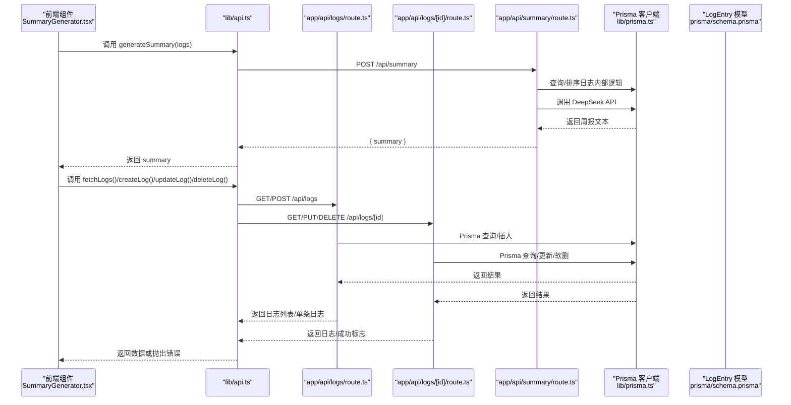
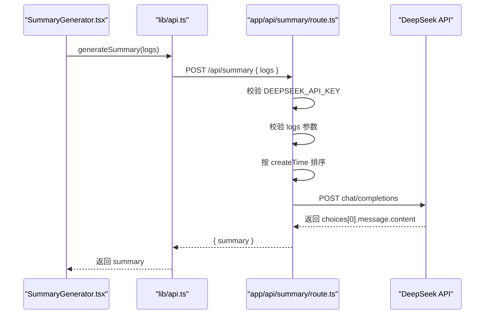

# API接口文档

<cite>
**本文引用的文件**
- [app/api/logs/route.ts](file://app/api/logs/route.ts)
- [app/api/logs/[id]/route.ts](file://app/api/logs/[id]/route.ts)
- [app/api/summary/route.ts](file://app/api/summary/route.ts)
- [lib/api.ts](file://lib/api.ts)
- [lib/types.ts](file://lib/types.ts)
- [lib/prisma.ts](file://lib/prisma.ts)
- [prisma/schema.prisma](file://prisma/schema.prisma)
- [README.md](file://README.md)
- [components/SummaryGenerator.tsx](file://components/SummaryGenerator.tsx)
</cite>

## 目录
1. [简介](#简介)
2. [项目结构](#项目结构)
3. [核心组件](#核心组件)
4. [架构总览](#架构总览)
5. [详细组件分析](#详细组件分析)
6. [依赖分析](#依赖分析)
7. [性能考虑](#性能考虑)
8. [故障排查指南](#故障排查指南)
9. [结论](#结论)

## 简介
本文件为 AI1_Log 的后端 API 接口标准化文档，覆盖以下接口：
- 日志管理接口
  - GET /api/logs：获取日志列表（仅返回状态为“正常”的日志，按创建时间倒序）
  - POST /api/logs：创建新日志
  - PUT /api/logs/[id]：更新指定日志
  - DELETE /api/logs/[id]：软删除指定日志（将状态置为“删除”）
- 周报生成接口
  - POST /api/summary：接收日志 ID 数组，调用 DeepSeek 生成 Markdown 周报

同时结合 lib/api.ts 中的前端调用示例，帮助开发者理解前后端交互模式与错误处理策略。

## 项目结构
- API 路由位于 app/api 下，采用 Next.js App Router 的文件系统路由约定
- 数据访问通过 Prisma 客户端实现，模型定义于 prisma/schema.prisma
- 类型定义位于 lib/types.ts，统一前后端数据契约
- 前端调用封装在 lib/api.ts，提供 fetch 风格的异步函数
- 周报生成功能在 components/SummaryGenerator.tsx 中被调用



图表来源
- [lib/api.ts](file://lib/api.ts#L1-L56)
- [components/SummaryGenerator.tsx](file://components/SummaryGenerator.tsx#L1-L237)
- [app/api/logs/route.ts](file://app/api/logs/route.ts#L1-L38)
- [app/api/logs/[id]/route.ts](file://app/api/logs/[id]/route.ts#L1-L69)
- [app/api/summary/route.ts](file://app/api/summary/route.ts#L1-L78)
- [lib/prisma.ts](file://lib/prisma.ts#L1-L12)
- [prisma/schema.prisma](file://prisma/schema.prisma#L1-L26)

章节来源
- [lib/api.ts](file://lib/api.ts#L1-L56)
- [lib/types.ts](file://lib/types.ts#L1-L34)
- [lib/prisma.ts](file://lib/prisma.ts#L1-L12)
- [prisma/schema.prisma](file://prisma/schema.prisma#L1-L26)
- [README.md](file://README.md#L1-L64)

## 核心组件
- 日志实体模型 LogEntry
  - 字段：id、createTime、updateTime、status、creatorId、title、content
  - 状态：0 表示删除，1 表示正常
- 前端 API 封装
  - 提供 fetchLogs、createLog、updateLog、deleteLog、generateSummary 等方法
  - 统一错误处理：非 2xx 响应抛出异常，便于 UI 层捕获
- 周报生成
  - 依赖环境变量 DEEPSEEK_API_KEY
  - 对传入日志按 createTime 排序，构造系统提示词，调用 DeepSeek Chat Completions

章节来源
- [lib/types.ts](file://lib/types.ts#L1-L34)
- [lib/api.ts](file://lib/api.ts#L1-L56)
- [app/api/summary/route.ts](file://app/api/summary/route.ts#L1-L78)
- [prisma/schema.prisma](file://prisma/schema.prisma#L1-L26)

## 架构总览
后端采用 Next.js App Router 文件系统路由，API 路由直接对接 Prisma 数据层。前端通过 lib/api.ts 发起请求，组件层负责展示与交互。



图表来源
- [components/SummaryGenerator.tsx](file://components/SummaryGenerator.tsx#L1-L237)
- [lib/api.ts](file://lib/api.ts#L1-L56)
- [app/api/logs/route.ts](file://app/api/logs/route.ts#L1-L38)
- [app/api/logs/[id]/route.ts](file://app/api/logs/[id]/route.ts#L1-L69)
- [app/api/summary/route.ts](file://app/api/summary/route.ts#L1-L78)
- [lib/prisma.ts](file://lib/prisma.ts#L1-L12)
- [prisma/schema.prisma](file://prisma/schema.prisma#L1-L26)

## 详细组件分析

### 日志列表接口
- 方法与路径
  - GET /api/logs
- 请求参数
  - 无查询参数
- 请求体
  - 无
- 成功响应
  - JSON 数组，元素为 LogEntry 对象（仅包含状态为“正常”的日志，按 createTime 降序）
- 错误响应
  - 500：服务端异常，返回 { error }
- 认证方式
  - 无需认证
- 前端调用参考
  - lib/api.ts 中的 fetchLogs()

章节来源
- [app/api/logs/route.ts](file://app/api/logs/route.ts#L1-L16)
- [lib/api.ts](file://lib/api.ts#L1-L10)
- [lib/types.ts](file://lib/types.ts#L1-L10)

### 创建日志接口
- 方法与路径
  - POST /api/logs
- 请求参数
  - 无
- 请求体（JSON）
  - title: 字符串（可选，默认值为“新日志”）
  - content: 字符串（可选，默认为空）
  - creatorId: 整数（可选，默认为 0）
- 成功响应
  - JSON 对象，为新创建的 LogEntry
- 错误响应
  - 500：服务端异常，返回 { error }
- 认证方式
  - 无需认证
- 前端调用参考
  - lib/api.ts 中的 createLog()

章节来源
- [app/api/logs/route.ts](file://app/api/logs/route.ts#L18-L38)
- [lib/api.ts](file://lib/api.ts#L12-L21)
- [lib/types.ts](file://lib/types.ts#L1-L10)

### 更新日志接口
- 方法与路径
  - PUT /api/logs/[id]
- 路径参数
  - id: 整数（日志 ID）
- 请求参数
  - 无
- 请求体（JSON）
  - title: 字符串（必填）
  - content: 字符串（必填）
- 成功响应
  - JSON 对象，为更新后的 LogEntry
- 错误响应
  - 404：日志不存在，返回 { error }
  - 500：服务端异常，返回 { error }
- 认证方式
  - 无需认证
- 前端调用参考
  - lib/api.ts 中的 updateLog()

章节来源
- [app/api/logs/[id]/route.ts](file://app/api/logs/[id]/route.ts#L28-L50)
- [lib/api.ts](file://lib/api.ts#L23-L32)
- [lib/types.ts](file://lib/types.ts#L1-L10)

### 删除日志接口（软删除）
- 方法与路径
  - DELETE /api/logs/[id]
- 路径参数
  - id: 整数（日志 ID）
- 请求参数
  - 无
- 请求体
  - 无
- 成功响应
  - JSON 对象：{ success: true }
- 错误响应
  - 500：服务端异常，返回 { error }
- 认证方式
  - 无需认证
- 前端调用参考
  - lib/api.ts 中的 deleteLog()

章节来源
- [app/api/logs/[id]/route.ts](file://app/api/logs/[id]/route.ts#L52-L69)
- [lib/api.ts](file://lib/api.ts#L34-L41)
- [lib/types.ts](file://lib/types.ts#L1-L10)

### 周报生成接口
- 方法与路径
  - POST /api/summary
- 请求参数
  - 无
- 请求体（JSON）
  - logs: 数组，元素为 LogEntry 对象（至少包含 id、title、content、createTime）
- 成功响应
  - JSON 对象：{ summary: "Markdown 格式的周报文本" }
- 错误响应
  - 400：未提供日志数组或数组为空，返回 { error }
  - 500：DeepSeek API 未配置或请求失败，返回 { error }
- 认证方式
  - 无需认证（但需要正确配置 DEEPSEEK_API_KEY 环境变量）
- 前端调用参考
  - lib/api.ts 中的 generateSummary()
  - components/SummaryGenerator.tsx 中的 handleGenerate 流程



图表来源
- [components/SummaryGenerator.tsx](file://components/SummaryGenerator.tsx#L1-L237)
- [lib/api.ts](file://lib/api.ts#L42-L56)
- [app/api/summary/route.ts](file://app/api/summary/route.ts#L1-L78)

章节来源
- [app/api/summary/route.ts](file://app/api/summary/route.ts#L1-L78)
- [lib/api.ts](file://lib/api.ts#L42-L56)
- [README.md](file://README.md#L51-L56)

## 依赖分析
- 组件耦合
  - API 路由直接依赖 Prisma 客户端
  - 前端 API 封装依赖 Next.js fetch 机制
- 外部依赖
  - DeepSeek Chat Completions（用于周报生成）
- 数据模型
  - LogEntry 模型包含基础字段与业务字段，状态字段用于软删除

```mermaid
classDiagram
class LogEntry {
+number id
+string|Date createTime
+string|Date updateTime
+number status
+number creatorId
+string title
+string content
}
class PrismaClient {
+findMany()
+create()
+findFirst()
+update()
}
class LogsRoute {
+GET()
+POST(request)
}
class LogsIdRoute {
+GET(request,{params})
+PUT(request,{params})
+DELETE(request,{params})
}
class SummaryRoute {
+POST(request)
}
LogsRoute --> PrismaClient : "使用"
LogsIdRoute --> PrismaClient : "使用"
SummaryRoute --> PrismaClient : "使用"
LogsRoute --> LogEntry : "返回"
LogsIdRoute --> LogEntry : "返回/更新"
```

图表来源
- [lib/types.ts](file://lib/types.ts#L1-L34)
- [lib/prisma.ts](file://lib/prisma.ts#L1-L12)
- [app/api/logs/route.ts](file://app/api/logs/route.ts#L1-L38)
- [app/api/logs/[id]/route.ts](file://app/api/logs/[id]/route.ts#L1-L69)
- [app/api/summary/route.ts](file://app/api/summary/route.ts#L1-L78)

章节来源
- [lib/types.ts](file://lib/types.ts#L1-L34)
- [lib/prisma.ts](file://lib/prisma.ts#L1-L12)
- [prisma/schema.prisma](file://prisma/schema.prisma#L1-L26)

## 性能考虑
- 日志列表查询
  - 使用按 createTime 降序排序，避免全表扫描
  - 仅查询状态为“正常”的日志，减少无效数据传输
- 周报生成
  - 前端已按 createTime 排序，后端再次排序确保稳定性
  - DeepSeek 请求使用合理的 temperature 和 max_tokens，平衡生成质量与成本
- 软删除
  - 通过状态字段实现软删除，避免物理删除带来的数据不可恢复风险

[本节为通用性能建议，不直接分析具体文件]

## 故障排查指南
- 周报生成失败
  - 确认 DEEPSEEK_API_KEY 是否在环境变量中正确配置
  - 检查 logs 参数是否为空或缺失
  - 查看后端返回的错误信息，定位是网络问题还是 API 返回错误
- 日志接口异常
  - 检查 Prisma 连接与数据库状态
  - 关注 500 错误，查看后端日志定位异常
- 前端调用失败
  - 使用 lib/api.ts 中的封装函数，注意其对非 2xx 响应会抛出异常
  - 在组件层捕获异常并展示友好提示

章节来源
- [app/api/summary/route.ts](file://app/api/summary/route.ts#L1-L78)
- [lib/api.ts](file://lib/api.ts#L1-L56)
- [README.md](file://README.md#L51-L56)

## 结论
本文档系统性地梳理了 AI1_Log 的日志管理与周报生成功能的 API 接口，明确了各接口的请求/响应格式、错误码与认证方式，并结合前端调用示例说明了前后端交互流程。建议在生产环境中：
- 明确环境变量配置（尤其是 DeepSeek API Key）
- 对外暴露的 API 增加鉴权与限流策略
- 对周报生成增加缓存与重试机制，提升用户体验