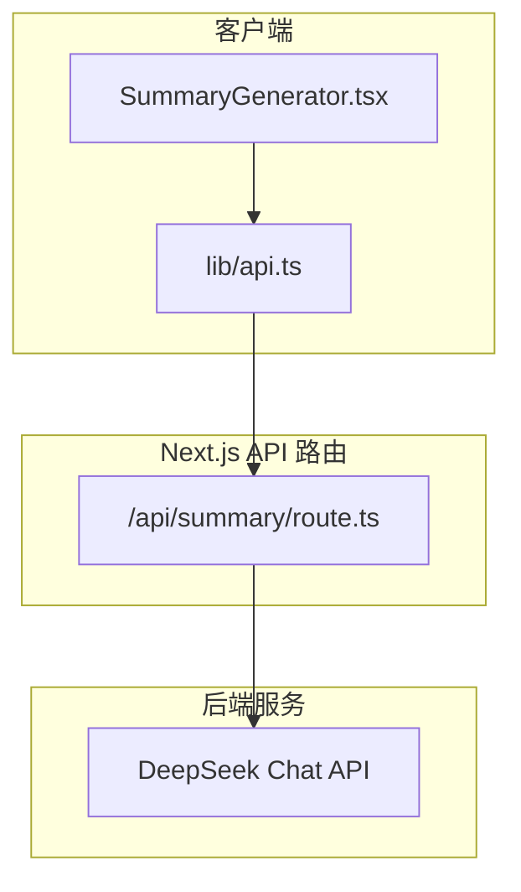
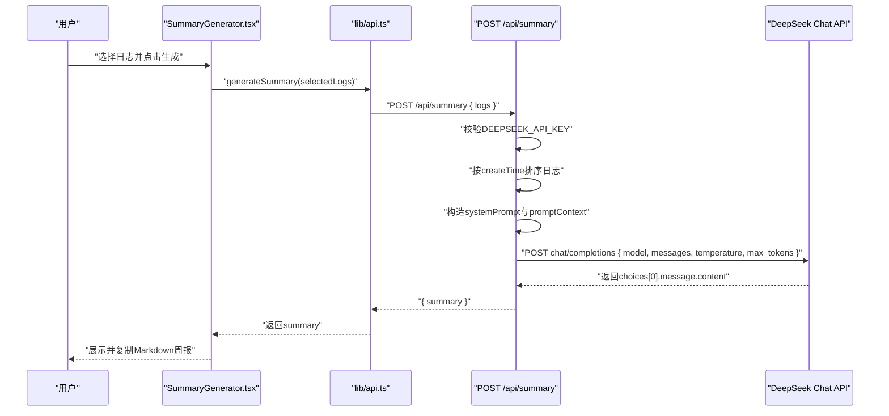
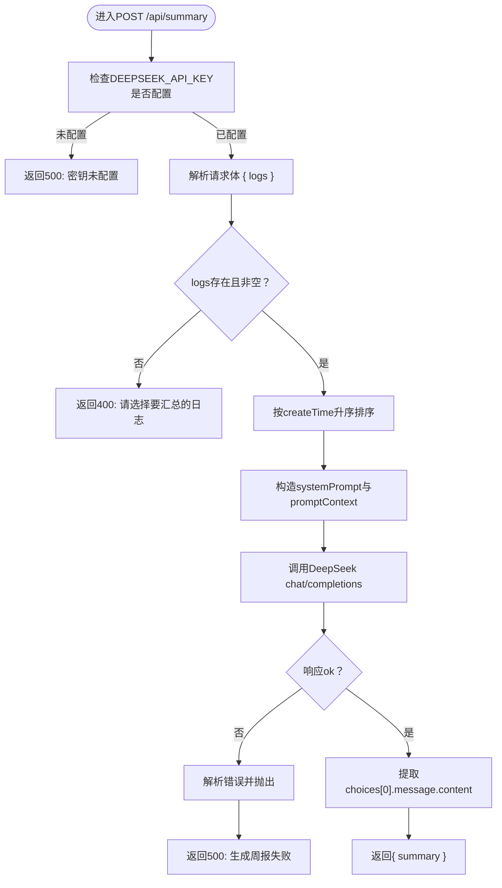
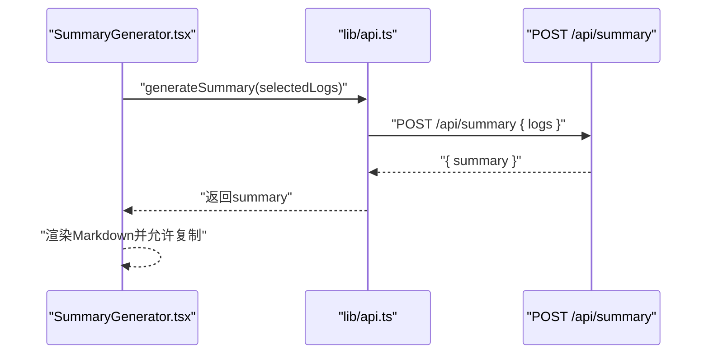
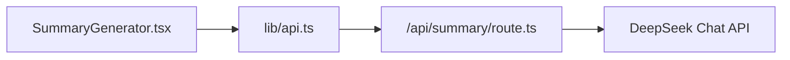

# 周报生成API

<cite>
**本文引用的文件**
- [app/api/summary/route.ts](file://app/api/summary/route.ts)
- [lib/api.ts](file://lib/api.ts)
- [components/SummaryGenerator.tsx](file://components/SummaryGenerator.tsx)
- [lib/types.ts](file://lib/types.ts)
- [app/api/logs/route.ts](file://app/api/logs/route.ts)
- [app/page.tsx](file://app/page.tsx)
- [config/env.example](file://config/env.example)
- [README.md](file://README.md)
</cite>

## 目录
1. [简介](#简介)
2. [项目结构](#项目结构)
3. [核心组件](#核心组件)
4. [架构总览](#架构总览)
5. [详细组件分析](#详细组件分析)
6. [依赖分析](#依赖分析)
7. [性能考虑](#性能考虑)
8. [故障排查指南](#故障排查指南)
9. [结论](#结论)
10. [附录](#附录)

## 简介
本文件面向“AI1_Log周报生成API”的使用者与维护者，全面说明POST /api/summary端点的功能与实现细节。该端点接收前端传入的日志数组，调用DeepSeek AI服务生成结构化的Markdown周报，并返回标准响应。文档覆盖请求与响应格式、认证方式、提示词工程、与AI服务交互细节、错误处理场景以及前端集成方式与调试建议。

## 项目结构
该应用采用Next.js App Router风格组织API路由与客户端组件，核心API位于app/api/summary/route.ts，前端通过lib/api.ts封装的generateSummary函数发起请求，组件层在components/SummaryGenerator.tsx中提供可视化交互。

图表来源
- [app/api/summary/route.ts](file://app/api/summary/route.ts#L1-L78)
- [lib/api.ts](file://lib/api.ts#L42-L56)
- [components/SummaryGenerator.tsx](file://components/SummaryGenerator.tsx#L1-L237)

章节来源
- [app/api/summary/route.ts](file://app/api/summary/route.ts#L1-L78)
- [lib/api.ts](file://lib/api.ts#L1-L56)
- [components/SummaryGenerator.tsx](file://components/SummaryGenerator.tsx#L1-L237)

## 核心组件
- API端点：POST /api/summary
  - 功能：接收日志数组，按时间排序，构造提示词，调用DeepSeek生成周报，返回结构化Markdown。
  - 认证：通过环境变量DEEPSEEK_API_KEY进行Bearer认证。
  - 错误处理：密钥未配置（500）、未选择日志（400）、AI服务调用失败（500）。
- 前端封装：lib/api.ts中的generateSummary函数
  - 作用：向/api/summary发送POST请求，解析响应并抛出错误。
- 前端界面：components/SummaryGenerator.tsx
  - 作用：选择日志、触发生成、展示结果、复制周报。

章节来源
- [app/api/summary/route.ts](file://app/api/summary/route.ts#L1-L78)
- [lib/api.ts](file://lib/api.ts#L42-L56)
- [components/SummaryGenerator.tsx](file://components/SummaryGenerator.tsx#L1-L237)

## 架构总览
下图展示了从用户操作到AI生成周报的整体流程。

图表来源
- [components/SummaryGenerator.tsx](file://components/SummaryGenerator.tsx#L30-L43)
- [lib/api.ts](file://lib/api.ts#L42-L56)
- [app/api/summary/route.ts](file://app/api/summary/route.ts#L6-L77)

## 详细组件分析

### API端点：POST /api/summary
- 请求方法与路径
  - 方法：POST
  - 路径：/api/summary
- 请求体格式
  - 结构：{ logs: LogEntry[] }
  - 类型定义参考：LogEntry接口
- 响应格式
  - 成功：{ summary: string }
  - 失败：{ error: string }
- 认证方式
  - Bearer Token：Authorization: Bearer <DEEPSEEK_API_KEY>
  - 来源：环境变量DEEPSEEK_API_KEY
- 内部逻辑
  - 环境校验：若未配置密钥，直接返回500。
  - 参数校验：若logs为空或长度为0，返回400。
  - 数据预处理：按createTime升序排序，构建提示上下文。
  - 提示词工程：
    - systemPrompt：指定角色与输出结构（Markdown），包含“本周概述”、“完成事项”、“进行中”、“下周计划”等部分。
    - userPrompt：拼接排序后的日志内容，包含日期、标题与正文。
  - AI调用：
    - 模型：deepseek-chat
    - 温度：0.7
    - 最大token：2000
    - 返回字段：取choices[0].message.content作为summary。
  - 错误处理：对fetch响应进行ok判断，非2xx时解析错误并抛出；捕获异常统一返回500。

图表来源
- [app/api/summary/route.ts](file://app/api/summary/route.ts#L6-L77)

章节来源
- [app/api/summary/route.ts](file://app/api/summary/route.ts#L1-L78)
- [lib/types.ts](file://lib/types.ts#L1-L10)

### 前端封装：lib/api.ts 的 generateSummary
- 功能：向/api/summary发送POST请求，序列化{ logs }，解析响应并返回summary；若响应非2xx，解析error并抛出。
- 集成点：components/SummaryGenerator.tsx在用户点击生成时调用该函数。

图表来源
- [lib/api.ts](file://lib/api.ts#L42-L56)
- [components/SummaryGenerator.tsx](file://components/SummaryGenerator.tsx#L30-L43)

章节来源
- [lib/api.ts](file://lib/api.ts#L42-L56)
- [components/SummaryGenerator.tsx](file://components/SummaryGenerator.tsx#L1-L237)

### 前端界面：components/SummaryGenerator.tsx
- 功能概览：
  - 展示日志列表，支持全选与单选。
  - 调用generateSummary生成周报，展示Markdown结果。
  - 提供复制周报文本的能力。
- 关键交互：
  - handleGenerate：收集选中日志，调用generateSummary，处理错误与加载态。
  - handleCopy：复制生成的summary到剪贴板。

章节来源
- [components/SummaryGenerator.tsx](file://components/SummaryGenerator.tsx#L1-L237)

### 数据模型：LogEntry
- 字段：id、createTime、updateTime、status、creatorId、title、content
- 用途：作为API请求体与响应体的基础类型。

章节来源
- [lib/types.ts](file://lib/types.ts#L1-L10)

### 日志管理API（辅助理解）
- GET /api/logs：获取状态正常的日志，按createTime降序。
- POST /api/logs：创建新日志。
- 作用：为周报生成提供日志数据来源。

章节来源
- [app/api/logs/route.ts](file://app/api/logs/route.ts#L1-L38)

### 页面入口与导航（辅助理解）
- app/page.tsx：主页面，负责加载日志、切换视图模式（编辑/预览/周报），并在侧边栏中触发周报生成。

章节来源
- [app/page.tsx](file://app/page.tsx#L1-L209)

## 依赖分析
- 组件耦合
  - SummaryGenerator.tsx依赖lib/api.ts的generateSummary。
  - lib/api.ts依赖Next.js内置fetch与本项目API根路径。
  - /api/summary/route.ts依赖环境变量DEEPSEEK_API_KEY与DeepSeek Chat API。
- 外部依赖
  - DeepSeek Chat API：chat/completions端点，模型deepseek-chat，温度0.7，max_tokens=2000。
- 潜在风险
  - 环境变量缺失导致500错误。
  - 前端未选择日志导致400错误。
  - AI服务不稳定或限流导致请求失败。

图表来源
- [components/SummaryGenerator.tsx](file://components/SummaryGenerator.tsx#L1-L237)
- [lib/api.ts](file://lib/api.ts#L42-L56)
- [app/api/summary/route.ts](file://app/api/summary/route.ts#L1-L78)

章节来源
- [components/SummaryGenerator.tsx](file://components/SummaryGenerator.tsx#L1-L237)
- [lib/api.ts](file://lib/api.ts#L42-L56)
- [app/api/summary/route.ts](file://app/api/summary/route.ts#L1-L78)

## 性能考虑
- 请求超时与重试
  - 当前实现未显式设置超时，建议在调用DeepSeek时增加timeout控制，避免长时间阻塞。
  - 对于网络不稳定场景，可在前端封装中加入重试策略（指数退避）。
- 响应内容校验
  - 建议对choices[0].message.content进行基本校验（非空、包含必要结构），若不符合预期，返回更明确的错误信息。
- 日志规模与token限制
  - deepseek-chat的max_tokens=2000，若日志过多可能被截断。建议在前端提示用户选择合理范围的日志，或在后端对日志总量做上限控制。
- 并发与节流
  - 在用户快速点击生成时，建议禁用按钮或节流请求，避免重复调用AI服务。
- 前端渲染优化
  - Markdown渲染可采用轻量库或服务端渲染，减少首屏压力。

## 故障排查指南
- 500：DeepSeek API密钥未配置
  - 现象：POST /api/summary直接返回500。
  - 处理：在环境变量中设置DEEPSEEK_API_KEY，并确保部署时生效。
  - 参考：[app/api/summary/route.ts](file://app/api/summary/route.ts#L7-L12)
- 400：未选择日志
  - 现象：请求体logs为空或长度为0，返回400。
  - 处理：确保至少选择一条日志再生成。
  - 参考：[app/api/summary/route.ts](file://app/api/summary/route.ts#L18-L20)
- 500：AI服务调用失败
  - 现象：fetch响应非2xx，解析错误并抛出。
  - 处理：检查网络连通性、DeepSeek服务状态、请求参数与模型可用性。
  - 参考：[app/api/summary/route.ts](file://app/api/summary/route.ts#L61-L69)
- 前端错误显示
  - 现象：generateSummary抛错，UI显示错误信息。
  - 处理：在SummaryGenerator.tsx中捕获错误并提示用户。
  - 参考：[lib/api.ts](file://lib/api.ts#L49-L55)，[components/SummaryGenerator.tsx](file://components/SummaryGenerator.tsx#L36-L42)
- 环境变量配置
  - 参考：[config/env.example](file://config/env.example#L1-L7)，[README.md](file://README.md#L51-L56)

章节来源
- [app/api/summary/route.ts](file://app/api/summary/route.ts#L6-L77)
- [lib/api.ts](file://lib/api.ts#L42-L56)
- [components/SummaryGenerator.tsx](file://components/SummaryGenerator.tsx#L30-L43)
- [config/env.example](file://config/env.example#L1-L7)
- [README.md](file://README.md#L51-L56)

## 结论
POST /api/summary端点通过清晰的提示词工程与稳定的DeepSeek集成，实现了从日志到结构化周报的自动化生成。前端通过lib/api.ts与SummaryGenerator.tsx提供了直观的交互体验。建议在生产环境中补充超时控制、重试机制与响应校验，以提升稳定性与用户体验。

## 附录
- 环境变量
  - DEEPSEEK_API_KEY：DeepSeek API密钥，用于Bearer认证。
  - 参考：[config/env.example](file://config/env.example#L1-L7)，[README.md](file://README.md#L51-L56)
- API端点定义
  - POST /api/summary
    - 请求体：{ logs: LogEntry[] }
    - 成功响应：{ summary: string }
    - 失败响应：{ error: string }
    - 认证：Authorization: Bearer <DEEPSEEK_API_KEY>
    - 参考：[app/api/summary/route.ts](file://app/api/summary/route.ts#L6-L77)
- 前端集成要点
  - 选择日志 -> 调用generateSummary -> 展示Markdown -> 复制
  - 参考：[components/SummaryGenerator.tsx](file://components/SummaryGenerator.tsx#L30-L43)，[lib/api.ts](file://lib/api.ts#L42-L56)