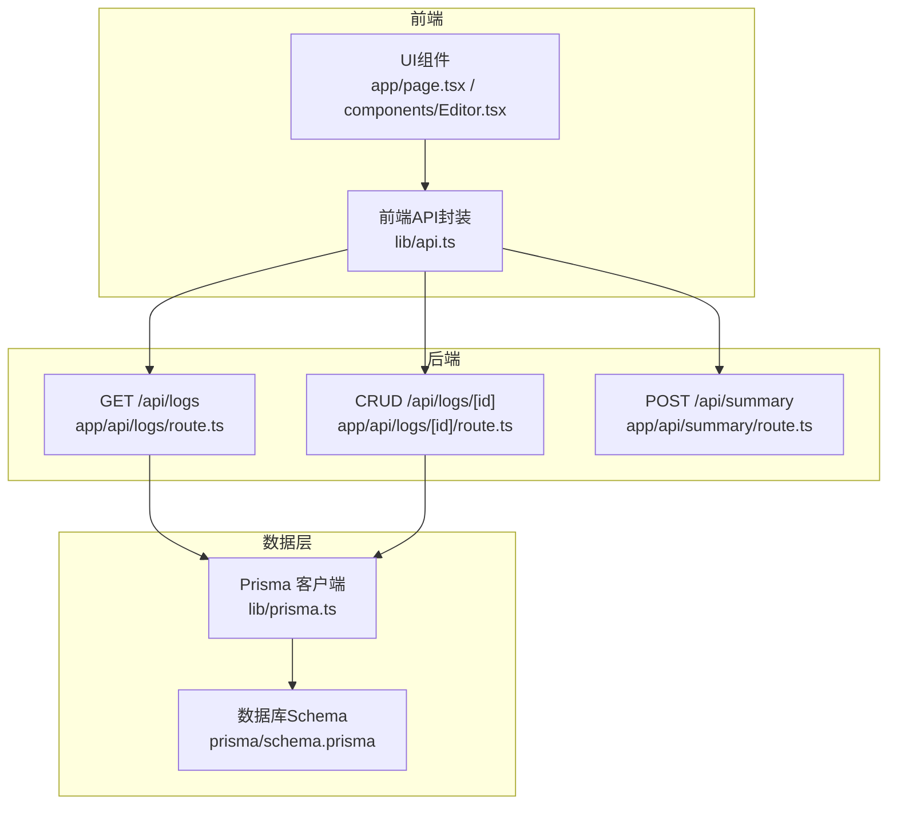
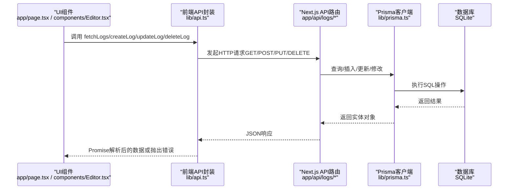
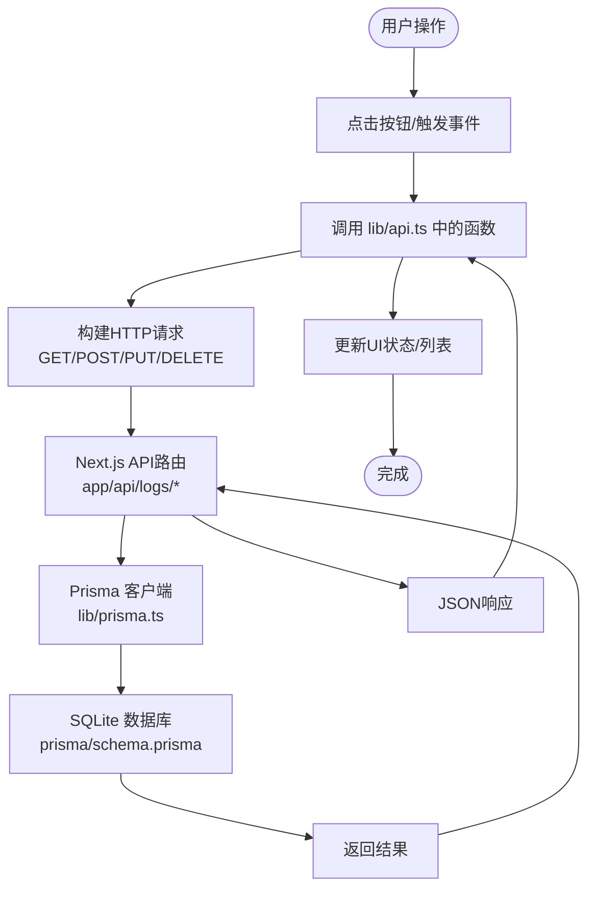
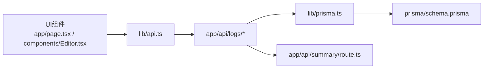
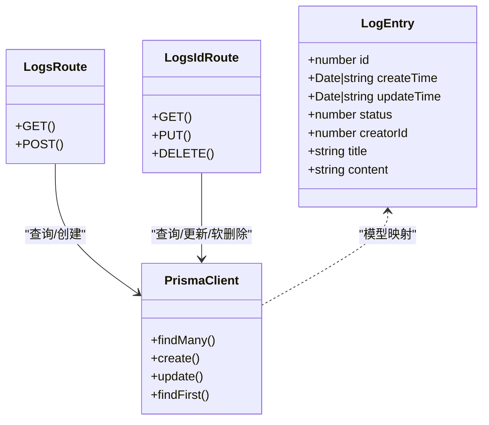

# 日志管理API

<cite>
**本文引用的文件**
- [app/api/logs/route.ts](file://app/api/logs/route.ts)
- [app/api/logs/[id]/route.ts](file://app/api/logs/[id]/route.ts)
- [lib/api.ts](file://lib/api.ts)
- [lib/prisma.ts](file://lib/prisma.ts)
- [lib/types.ts](file://lib/types.ts)
- [prisma/schema.prisma](file://prisma/schema.prisma)
- [app/page.tsx](file://app/page.tsx)
- [components/Editor.tsx](file://components/Editor.tsx)
- [app/api/summary/route.ts](file://app/api/summary/route.ts)
- [lib/utils.ts](file://lib/utils.ts)
- [README.md](file://README.md)
- [package.json](file://package.json)
</cite>

## 目录
1. [简介](#简介)
2. [项目结构](#项目结构)
3. [核心组件](#核心组件)
4. [架构总览](#架构总览)
5. [详细组件分析](#详细组件分析)
6. [依赖分析](#依赖分析)
7. [性能考虑](#性能考虑)
8. [故障排查指南](#故障排查指南)
9. [结论](#结论)
10. [附录](#附录)

## 简介
本文件面向“AI1_Log日志管理API”的使用者与维护者，系统性梳理以下四个端点：
- GET /api/logs：获取所有状态正常的日志列表，按创建时间倒序排列
- POST /api/logs：创建新日志，支持title、content、creatorId字段，默认标题为“新日志”
- PUT /api/logs/[id]：更新指定ID日志的内容
- DELETE /api/logs/[id]：软删除日志，通过status字段标记

文档同时结合前端lib/api.ts中的fetchLogs、createLog、updateLog、deleteLog函数，展示从UI组件→api.ts→API路由→Prisma→数据库的完整数据流，并说明软删除机制的设计意图与后续恢复可能性。

## 项目结构
该应用采用Next.js App Router风格的API路由组织方式，核心API位于app/api/logs与app/api/logs/[id]，数据访问通过lib/prisma.ts封装的Prisma客户端，类型定义位于lib/types.ts，数据库Schema位于prisma/schema.prisma。

图表来源
- [app/api/logs/route.ts](file://app/api/logs/route.ts#L1-L38)
- [app/api/logs/[id]/route.ts](file://app/api/logs/[id]/route.ts#L1-L69)
- [lib/api.ts](file://lib/api.ts#L1-L56)
- [lib/prisma.ts](file://lib/prisma.ts#L1-L12)
- [prisma/schema.prisma](file://prisma/schema.prisma#L1-L26)

章节来源
- [README.md](file://README.md#L1-L64)
- [package.json](file://package.json#L1-L30)

## 核心组件
- 类型定义：LogEntry接口与状态枚举，用于统一前后端数据契约
- Prisma客户端：全局单例PrismaClient，避免开发模式下重复实例化
- API路由：四个端点的实现，分别对应查询、创建、更新、软删除
- 前端API封装：基于fetch的异步函数，负责请求构建与错误抛出
- UI集成：页面与编辑器组件通过上述封装进行数据读写

章节来源
- [lib/types.ts](file://lib/types.ts#L1-L34)
- [lib/prisma.ts](file://lib/prisma.ts#L1-L12)
- [app/api/logs/route.ts](file://app/api/logs/route.ts#L1-L38)
- [app/api/logs/[id]/route.ts](file://app/api/logs/[id]/route.ts#L1-L69)
- [lib/api.ts](file://lib/api.ts#L1-L56)
- [app/page.tsx](file://app/page.tsx#L1-L209)
- [components/Editor.tsx](file://components/Editor.tsx#L1-L457)

## 架构总览
下图展示了从浏览器到数据库的完整链路：UI组件触发事件，调用lib/api.ts中的函数，经Next.js API路由处理，最终通过Prisma访问SQLite数据库。

图表来源
- [app/page.tsx](file://app/page.tsx#L1-L209)
- [components/Editor.tsx](file://components/Editor.tsx#L1-L457)
- [lib/api.ts](file://lib/api.ts#L1-L56)
- [app/api/logs/route.ts](file://app/api/logs/route.ts#L1-L38)
- [app/api/logs/[id]/route.ts](file://app/api/logs/[id]/route.ts#L1-L69)
- [lib/prisma.ts](file://lib/prisma.ts#L1-L12)
- [prisma/schema.prisma](file://prisma/schema.prisma#L1-L26)

## 详细组件分析

### GET /api/logs（获取所有状态正常的日志列表）
- 方法与路径：GET /api/logs
- 请求体：无
- 响应体：LogEntry数组（仅status为1的记录），按createTime降序排列
- 错误码：500（服务器内部错误）
- 处理逻辑：
  - 使用Prisma查询where条件为status=1
  - orderBy按createTime降序
  - 成功返回JSON数组；异常捕获并返回500

章节来源
- [app/api/logs/route.ts](file://app/api/logs/route.ts#L1-L16)
- [lib/types.ts](file://lib/types.ts#L1-L34)
- [prisma/schema.prisma](file://prisma/schema.prisma#L13-L26)

### POST /api/logs（创建新日志）
- 方法与路径：POST /api/logs
- 请求体（JSON）：title、content、creatorId（可选，默认0）
- 响应体：创建成功的LogEntry对象
- 默认行为：若title为空则默认为“新日志”，content为空字符串
- 错误码：500（服务器内部错误）
- 处理逻辑：
  - 解析请求体，解构title/content/creatorId
  - 使用Prisma创建LogEntry
  - 成功返回JSON；异常捕获并返回500

章节来源
- [app/api/logs/route.ts](file://app/api/logs/route.ts#L18-L38)
- [lib/types.ts](file://lib/types.ts#L1-L34)
- [prisma/schema.prisma](file://prisma/schema.prisma#L13-L26)

### PUT /api/logs/[id]（更新指定ID日志的内容）
- 方法与路径：PUT /api/logs/[id]
- 路径参数：id（数字）
- 请求体（JSON）：title、content（可选字段）
- 响应体：更新后的LogEntry对象
- 错误码：500（服务器内部错误）
- 处理逻辑：
  - 解析请求体，解构title/content
  - 使用Prisma按id更新记录
  - 成功返回JSON；异常捕获并返回500

章节来源
- [app/api/logs/[id]/route.ts](file://app/api/logs/[id]/route.ts#L28-L50)
- [lib/types.ts](file://lib/types.ts#L1-L34)
- [prisma/schema.prisma](file://prisma/schema.prisma#L13-L26)

### DELETE /api/logs/[id]（软删除日志）
- 方法与路径：DELETE /api/logs/[id]
- 路径参数：id（数字）
- 请求体：无
- 响应体：{ success: true }
- 错误码：500（服务器内部错误）
- 处理逻辑：
  - 将目标记录的status字段更新为0（软删除）
  - 成功返回成功标志；异常捕获并返回500

章节来源
- [app/api/logs/[id]/route.ts](file://app/api/logs/[id]/route.ts#L52-L69)
- [lib/types.ts](file://lib/types.ts#L1-L34)
- [prisma/schema.prisma](file://prisma/schema.prisma#L13-L26)

### 前端调用与错误处理模式（lib/api.ts）
- fetchLogs：GET /api/logs，返回Promise<LogEntry[]>
- createLog：POST /api/logs，返回Promise<LogEntry>
- updateLog：PUT /api/logs/:id，返回Promise<LogEntry>
- deleteLog：DELETE /api/logs/:id，返回Promise<void>
- 错误处理：当res.ok为false时抛出错误，便于UI层统一捕获

章节来源
- [lib/api.ts](file://lib/api.ts#L1-L56)
- [app/page.tsx](file://app/page.tsx#L1-L209)
- [components/Editor.tsx](file://components/Editor.tsx#L1-L457)

### 数据模型与状态语义（lib/types.ts 与 prisma/schema.prisma）
- LogEntry字段：id、createTime、updateTime、status、creatorId、title、content
- 状态枚举：ACTIVE=1、DELETED=0
- Schema默认值：status默认1，creatorId默认0，createTime默认now()

章节来源
- [lib/types.ts](file://lib/types.ts#L1-L34)
- [prisma/schema.prisma](file://prisma/schema.prisma#L13-L26)

### 软删除机制设计意图与恢复可能性
- 设计意图：
  - 保护数据完整性：删除操作不直接物理移除记录，避免不可逆的数据丢失
  - 支持审计与回滚：保留历史记录，便于追踪与恢复
  - 性能友好：软删除通常比物理删除更高效，避免重建索引等开销
- 恢复可能性：
  - 当前路由未提供恢复接口；如需恢复，可在服务端新增PATCH /api/logs/[id]将status改回1
  - 前端查询时应仅显示status=1的记录，确保“软删除”对用户透明

章节来源
- [app/api/logs/route.ts](file://app/api/logs/route.ts#L1-L16)
- [app/api/logs/[id]/route.ts](file://app/api/logs/[id]/route.ts#L52-L69)
- [lib/types.ts](file://lib/types.ts#L1-L34)

### 数据流与UI交互（从UI到API再到数据库）
- UI组件（app/page.tsx、components/Editor.tsx）通过lib/api.ts发起请求
- lib/api.ts封装fetch，统一处理错误
- Next.js API路由（app/api/logs/*）接收请求，调用lib/prisma.ts中的PrismaClient
- PrismaClient执行SQL，访问SQLite数据库（prisma/schema.prisma）

图表来源
- [app/page.tsx](file://app/page.tsx#L1-L209)
- [components/Editor.tsx](file://components/Editor.tsx#L1-L457)
- [lib/api.ts](file://lib/api.ts#L1-L56)
- [app/api/logs/route.ts](file://app/api/logs/route.ts#L1-L38)
- [app/api/logs/[id]/route.ts](file://app/api/logs/[id]/route.ts#L1-L69)
- [lib/prisma.ts](file://lib/prisma.ts#L1-L12)
- [prisma/schema.prisma](file://prisma/schema.prisma#L1-L26)

## 依赖分析
- 组件耦合：
  - UI层仅依赖lib/api.ts，降低对具体路由实现的耦合
  - API路由依赖lib/prisma.ts，Prisma依赖prisma/schema.prisma
- 外部依赖：
  - @prisma/client：数据库ORM
  - next：Web框架与API路由
  - lucide-react：图标库（UI层使用）
- 潜在循环依赖：
  - 本项目采用清晰的单向依赖：UI→API→Prisma→Schema，未发现循环

图表来源
- [app/page.tsx](file://app/page.tsx#L1-L209)
- [components/Editor.tsx](file://components/Editor.tsx#L1-L457)
- [lib/api.ts](file://lib/api.ts#L1-L56)
- [app/api/logs/route.ts](file://app/api/logs/route.ts#L1-L38)
- [app/api/logs/[id]/route.ts](file://app/api/logs/[id]/route.ts#L1-L69)
- [lib/prisma.ts](file://lib/prisma.ts#L1-L12)
- [prisma/schema.prisma](file://prisma/schema.prisma#L1-L26)
- [app/api/summary/route.ts](file://app/api/summary/route.ts#L1-L78)

章节来源
- [package.json](file://package.json#L1-L30)

## 性能考虑
- 查询优化：
  - GET /api/logs按createTime降序，适合大列表场景；如需分页，可在路由层增加limit/offset参数
- 写入优化：
  - POST/PUT使用批量更新时，建议合并变更，减少网络往返
- 软删除成本：
  - 软删除仅更新status字段，成本低；但查询时需过滤status=1，建议在数据库层面建立索引（可参考prisma/schema.prisma的索引策略）
- 前端缓存：
  - UI层可对最近一次查询结果做内存缓存，避免重复请求

## 故障排查指南
- 通用错误处理：
  - 前端：lib/api.ts在res.ok为false时抛出错误，UI层应try/catch并提示用户
  - 后端：各路由均捕获异常并返回500，日志中会打印错误堆栈
- 常见问题定位：
  - 数据库未初始化：确认已执行数据库推送命令
  - 环境变量缺失：如生成周报摘要需要DeepSeek密钥
- 具体端点排查：
  - GET /api/logs：检查status=1的记录是否存在
  - POST /api/logs：检查请求体字段是否符合LogEntry定义
  - PUT /api/logs/[id]：确认id存在且非软删除
  - DELETE /api/logs/[id]：确认id存在且status被置为0

章节来源
- [lib/api.ts](file://lib/api.ts#L1-L56)
- [app/api/logs/route.ts](file://app/api/logs/route.ts#L1-L38)
- [app/api/logs/[id]/route.ts](file://app/api/logs/[id]/route.ts#L1-L69)
- [README.md](file://README.md#L1-L64)

## 结论
本API围绕“日志管理”提供了简洁而稳健的增删改查能力，配合软删除与明确的状态语义，既保证了数据安全，又便于扩展。前端通过lib/api.ts实现了统一的调用与错误处理模式，UI层无需关心底层路由细节。未来可在路由层增加分页、搜索与恢复接口，进一步提升可用性与可维护性。

## 附录

### 接口一览与字段说明
- GET /api/logs
  - 请求：无
  - 响应：LogEntry[]
  - 说明：仅返回status=1的记录，按createTime降序
- POST /api/logs
  - 请求体：{ title?, content?, creatorId? }
  - 响应：LogEntry
  - 默认：title为空时为“新日志”，content为空字符串
- PUT /api/logs/[id]
  - 路径参数：id
  - 请求体：{ title?, content? }
  - 响应：LogEntry
- DELETE /api/logs/[id]
  - 路径参数：id
  - 响应：{ success: true }
  - 说明：将status置为0，属于软删除

章节来源
- [app/api/logs/route.ts](file://app/api/logs/route.ts#L1-L38)
- [app/api/logs/[id]/route.ts](file://app/api/logs/[id]/route.ts#L1-L69)
- [lib/types.ts](file://lib/types.ts#L1-L34)

### 数据模型（LogEntry）
- 字段：id、createTime、updateTime、status、creatorId、title、content
- 状态：ACTIVE=1、DELETED=0

章节来源
- [lib/types.ts](file://lib/types.ts#L1-L34)
- [prisma/schema.prisma](file://prisma/schema.prisma#L13-L26)

### 前端调用示例（路径）
- 获取日志列表：调用 [lib/api.ts](file://lib/api.ts#L1-L10)
- 创建日志：调用 [lib/api.ts](file://lib/api.ts#L12-L21)
- 更新日志：调用 [lib/api.ts](file://lib/api.ts#L23-L32)
- 删除日志：调用 [lib/api.ts](file://lib/api.ts#L34-L41)

章节来源
- [lib/api.ts](file://lib/api.ts#L1-L56)
- [app/page.tsx](file://app/page.tsx#L1-L209)
- [components/Editor.tsx](file://components/Editor.tsx#L1-L457)

### 数据流可视化（代码级）

图表来源
- [lib/types.ts](file://lib/types.ts#L1-L34)
- [lib/prisma.ts](file://lib/prisma.ts#L1-L12)
- [app/api/logs/route.ts](file://app/api/logs/route.ts#L1-L38)
- [app/api/logs/[id]/route.ts](file://app/api/logs/[id]/route.ts#L1-L69)