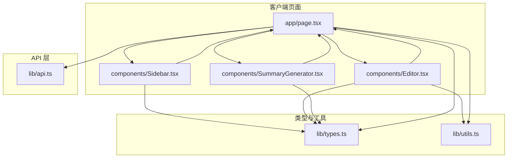
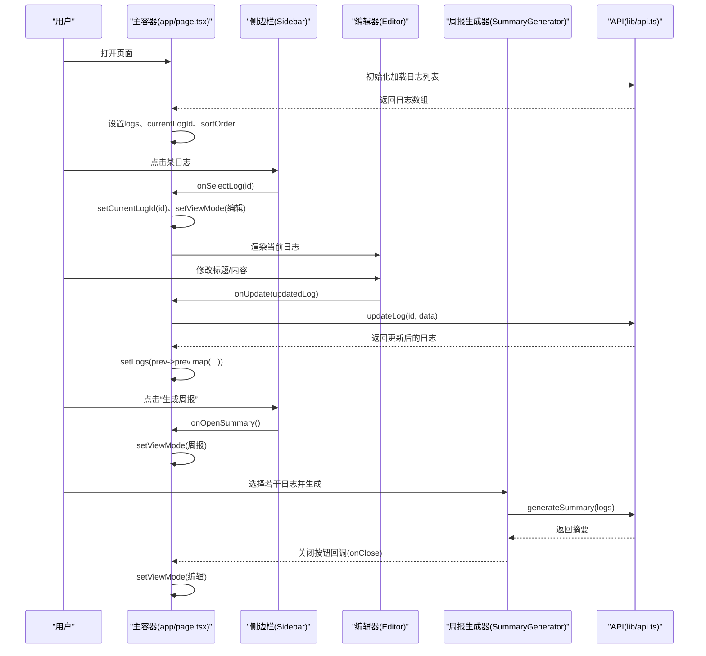
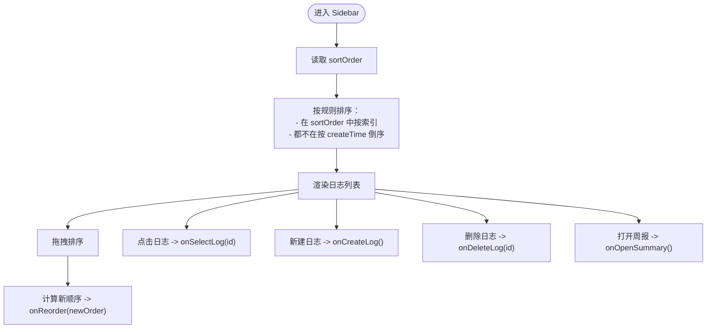
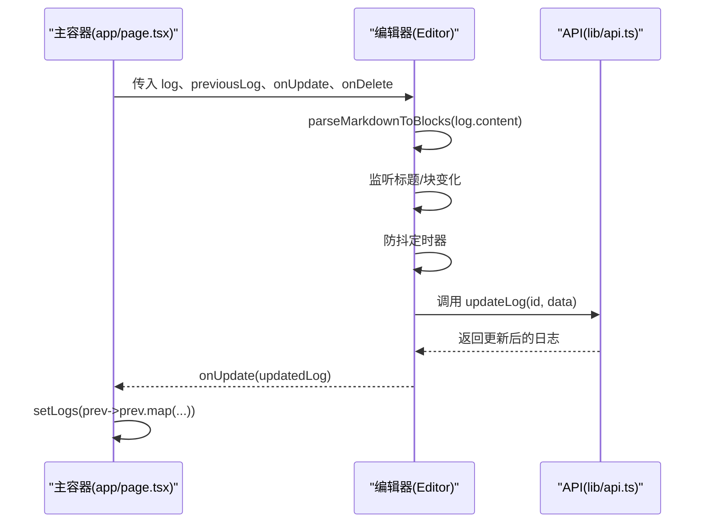
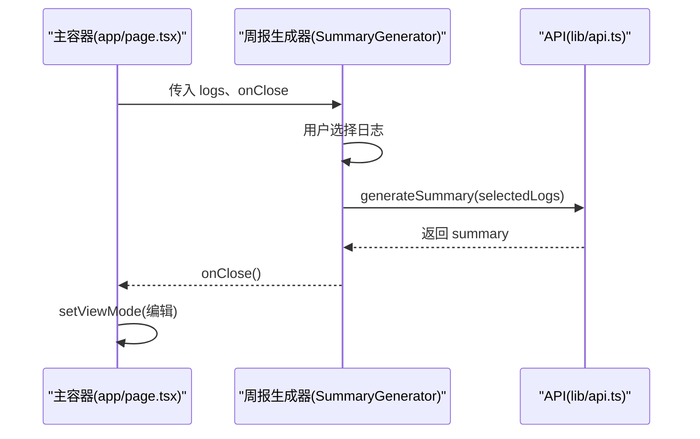
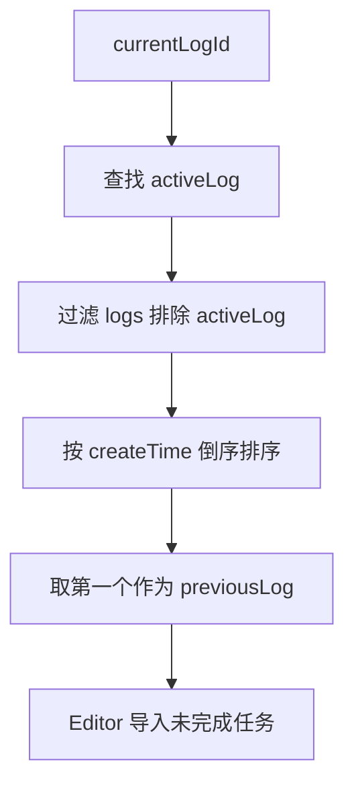
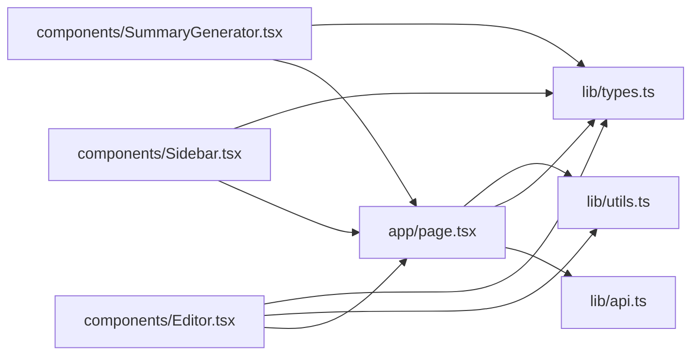

# 主页面容器组件

<cite>
**本文引用的文件**
- [app/page.tsx](file://app/page.tsx)
- [components/Sidebar.tsx](file://components/Sidebar.tsx)
- [components/Editor.tsx](file://components/Editor.tsx)
- [components/SummaryGenerator.tsx](file://components/SummaryGenerator.tsx)
- [lib/api.ts](file://lib/api.ts)
- [lib/types.ts](file://lib/types.ts)
- [lib/utils.ts](file://lib/utils.ts)
- [app/layout.tsx](file://app/layout.tsx)
</cite>

## 目录
1. [简介](#简介)
2. [项目结构](#项目结构)
3. [核心组件](#核心组件)
4. [架构总览](#架构总览)
5. [详细组件分析](#详细组件分析)
6. [依赖分析](#依赖分析)
7. [性能考量](#性能考量)
8. [故障排查指南](#故障排查指南)
9. [结论](#结论)

## 简介
本文件围绕 app/page.tsx 这一主容器组件进行系统性文档化，重点说明其如何协调 Sidebar、Editor 和 SummaryGenerator 三大 UI 组件，构建完整的日志编辑与周报生成工作流。文档涵盖：
- 全局状态管理策略：currentLogId、logs、sortOrder、viewMode、isMobileMenuOpen、isLoading 等状态的定义与更新机制
- 子组件间通信：通过回调函数实现 Sidebar 的日志选择、Editor 的日志更新与删除、SummaryGenerator 的视图切换
- 日志数据流：useEffect 初始化加载、创建、删除、排序后的 logs 同步更新
- 视图切换：isSummaryMode 控制编辑与周报生成器的显示/隐藏
- previousLog 计算逻辑及其在 Editor 中的应用
- 容器组件向子组件传递数据与回调，形成闭环工作流

## 项目结构
该应用采用 Next.js App Router 结构，页面容器位于 app/page.tsx，UI 组件位于 components 目录，业务 API 封装在 lib/api.ts，类型定义与工具函数位于 lib 目录。

图表来源
- [app/page.tsx](file://app/page.tsx#L1-L209)
- [components/Sidebar.tsx](file://components/Sidebar.tsx#L1-L234)
- [components/Editor.tsx](file://components/Editor.tsx#L1-L457)
- [components/SummaryGenerator.tsx](file://components/SummaryGenerator.tsx#L1-L237)
- [lib/api.ts](file://lib/api.ts#L1-L56)
- [lib/types.ts](file://lib/types.ts#L1-L34)
- [lib/utils.ts](file://lib/utils.ts#L1-L168)

章节来源
- [app/page.tsx](file://app/page.tsx#L1-L209)
- [app/layout.tsx](file://app/layout.tsx#L1-L30)

## 核心组件
- 主容器组件：负责全局状态管理、数据流控制、视图切换与子组件通信
- Sidebar：日志列表展示、拖拽排序、创建/删除日志、打开周报生成器
- Editor：日志编辑器，支持标题、待办、段落等块级编辑，防抖保存与导入上一条日志未完成任务
- SummaryGenerator：选择日志并生成周报摘要，支持复制与返回

章节来源
- [app/page.tsx](file://app/page.tsx#L1-L209)
- [components/Sidebar.tsx](file://components/Sidebar.tsx#L1-L234)
- [components/Editor.tsx](file://components/Editor.tsx#L1-L457)
- [components/SummaryGenerator.tsx](file://components/SummaryGenerator.tsx#L1-L237)

## 架构总览
主容器组件以“状态驱动视图”的方式组织，通过 useState 管理 logs、currentLogId、sortOrder、viewMode 等核心状态，并通过 useEffect 在首次挂载时从 API 获取日志列表，随后根据用户交互更新状态，驱动子组件渲染。

图表来源
- [app/page.tsx](file://app/page.tsx#L1-L209)
- [components/Sidebar.tsx](file://components/Sidebar.tsx#L1-L234)
- [components/Editor.tsx](file://components/Editor.tsx#L1-L457)
- [components/SummaryGenerator.tsx](file://components/SummaryGenerator.tsx#L1-L237)
- [lib/api.ts](file://lib/api.ts#L1-L56)

## 详细组件分析

### 主容器组件（app/page.tsx）设计要点
- 全局状态
  - logs：日志数组，用于 Sidebar 展示与 SummaryGenerator 选择
  - currentLogId：当前选中日志的标识，决定 Editor 渲染哪条日志
  - sortOrder：自定义排序顺序，持久化存储于本地，影响 Sidebar 的排序显示
  - viewMode：控制当前视图为编辑还是周报生成器
  - isMobileMenuOpen：移动端侧边栏开关
  - isLoading：初始化加载状态
- 初始化流程
  - 读取本地 sortOrder 并设置
  - 首次加载 logs，若存在则设置 currentLogId（优先使用保存的排序中的有效 ID，否则使用最新日志）
- 回调处理
  - Sidebar.onSelectLog：更新 currentLogId 并切换到编辑视图
  - Sidebar.onCreateLog：创建新日志，插入到 logs 首位并设为当前
  - Sidebar.onDeleteLog：删除日志，同步更新 logs，并在删除当前日志时切换到其他日志或清空
  - Sidebar.onOpenSummary：切换到周报生成器视图
  - Sidebar.onReorder：更新 sortOrder 并持久化
  - Editor.onUpdate：调用 API 更新日志，同步更新 logs
  - Editor.onDelete：调用 API 删除日志，同步更新 logs，并处理 currentLogId
  - SummaryGenerator.onClose：回到编辑视图
- 视图切换
  - viewMode 决定渲染 Editor 或 SummaryGenerator
- previousLog 计算
  - 基于 currentLogId 查找 activeLog，再从 logs 中过滤掉 activeLog，按 createTime 倒序取第一个作为 previousLog，供 Editor 导入未完成任务使用

章节来源
- [app/page.tsx](file://app/page.tsx#L1-L209)

### Sidebar（日志列表与排序）
- 接收 props：logs、currentLogId、onSelectLog、onCreateLog、onDeleteLog、onOpenSummary、isSummaryMode、sortOrder、onReorder
- 排序规则
  - 若某日志 ID 出现在 sortOrder 中，则按其在 sortOrder 中的索引排序
  - 若都不在 sortOrder 中，则按 createTime 倒序排列
- 拖拽排序
  - 使用原生拖拽事件，计算当前排序后的 ID 数组，重新排列后调用 onReorder
- 交互行为
  - 点击日志：触发 onSelectLog
  - 新建日志：触发 onCreateLog
  - 删除日志：触发 onDeleteLog
  - 打开周报：触发 onOpenSummary

图表来源
- [components/Sidebar.tsx](file://components/Sidebar.tsx#L1-L234)

章节来源
- [components/Sidebar.tsx](file://components/Sidebar.tsx#L1-L234)

### Editor（日志编辑器）
- 接收 props：log、previousLog、onUpdate、onDelete
- 状态与逻辑
  - 将 log.content 解析为块数组（Block[]），支持标题、待办、段落等
  - 防抖保存：在标题或块内容变化后延时触发保存，避免频繁请求
  - 键盘快捷键：回车、退格、上下方向键等行为控制块类型与插入/删除
  - 导入上一条日志未完成任务：提取 previousLog 中未完成的待办及上级标题，插入到当前日志末尾
  - 删除日志：调用 onDelete
- 与主容器协作
  - 当内容或标题发生变化时，通过 onUpdate 通知主容器更新后端与本地状态

图表来源
- [components/Editor.tsx](file://components/Editor.tsx#L1-L457)
- [lib/api.ts](file://lib/api.ts#L1-L56)
- [lib/utils.ts](file://lib/utils.ts#L1-L168)

章节来源
- [components/Editor.tsx](file://components/Editor.tsx#L1-L457)
- [lib/utils.ts](file://lib/utils.ts#L1-L168)

### SummaryGenerator（周报生成器）
- 接收 props：logs、onClose
- 功能
  - 选择多个日志，调用 generateSummary 生成摘要
  - 支持复制摘要、返回选择界面
- 与主容器协作
  - 生成完成后通过 onClose 回调回到编辑视图

图表来源
- [components/SummaryGenerator.tsx](file://components/SummaryGenerator.tsx#L1-L237)
- [lib/api.ts](file://lib/api.ts#L1-L56)

章节来源
- [components/SummaryGenerator.tsx](file://components/SummaryGenerator.tsx#L1-L237)

### 数据流与状态更新机制
- 初始化
  - useEffect 从 API 获取 logs，设置 currentLogId（优先使用保存的排序中的有效 ID，否则使用最新日志），并设置 isLoading=false
- 创建日志
  - handleCreateLog 调用 createLog，成功后将新日志插入 logs 首位并设为 currentLogId，同时回到编辑视图
- 更新日志
  - handleUpdateLog 调用 updateLog，成功后通过映射替换对应日志
- 删除日志
  - handleDeleteLog 调用 deleteLog，成功后从 logs 中移除该日志；若删除的是 currentLogId，则切换到其他日志或清空
- 排序
  - Sidebar.onReorder 更新 sortOrder 并持久化到本地存储
- 视图切换
  - Sidebar.onOpenSummary 切换到 SUMMARY 视图
  - SummaryGenerator.onClose 切换回 EDIT 视图

章节来源
- [app/page.tsx](file://app/page.tsx#L1-L209)
- [lib/api.ts](file://lib/api.ts#L1-L56)

### previousLog 的计算逻辑与应用
- 计算逻辑
  - 基于 currentLogId 定位 activeLog
  - 从 logs 中过滤掉 activeLog，按 createTime 倒序排序，取第一个作为 previousLog
- Editor 应用
  - Editor 接收 previousLog，提供“导入上一条日志未完成任务”功能，自动提取未完成的待办及上级标题并插入当前日志末尾

图表来源
- [app/page.tsx](file://app/page.tsx#L105-L115)
- [components/Editor.tsx](file://components/Editor.tsx#L89-L118)
- [lib/utils.ts](file://lib/utils.ts#L93-L146)

章节来源
- [app/page.tsx](file://app/page.tsx#L105-L115)
- [components/Editor.tsx](file://components/Editor.tsx#L89-L118)
- [lib/utils.ts](file://lib/utils.ts#L93-L146)

## 依赖分析
- 组件耦合
  - 主容器与 Sidebar/Editor/SummaryGenerator 之间通过 props 与回调函数解耦，职责清晰
  - Editor 依赖 utils 的解析与序列化函数，依赖 types 的类型定义
  - 主容器依赖 lib/api.ts 进行 CRUD 与摘要生成
- 外部依赖
  - Next.js App Router、React Hooks（useState/useEffect/useCallback）
  - 本地存储（localStorage）用于持久化排序顺序
  - 浏览器 Clipboard API 用于复制摘要

图表来源
- [app/page.tsx](file://app/page.tsx#L1-L209)
- [components/Sidebar.tsx](file://components/Sidebar.tsx#L1-L234)
- [components/Editor.tsx](file://components/Editor.tsx#L1-L457)
- [components/SummaryGenerator.tsx](file://components/SummaryGenerator.tsx#L1-L237)
- [lib/api.ts](file://lib/api.ts#L1-L56)
- [lib/types.ts](file://lib/types.ts#L1-L34)
- [lib/utils.ts](file://lib/utils.ts#L1-L168)

章节来源
- [app/page.tsx](file://app/page.tsx#L1-L209)
- [lib/api.ts](file://lib/api.ts#L1-L56)

## 性能考量
- 防抖保存：Editor 对标题与块内容变更进行防抖保存，减少网络请求频率
- 本地排序：Sidebar 的排序逻辑在内存中进行，避免每次渲染都发起请求
- 状态最小化：主容器仅维护必要状态（logs、currentLogId、sortOrder、viewMode），降低重渲染成本
- 本地存储：sortOrder 持久化于 localStorage，避免每次进入页面都重新计算

## 故障排查指南
- 初始化失败
  - 现象：页面长时间处于加载状态
  - 排查：确认 API /api/logs 是否可用；查看控制台错误日志
  - 参考路径：[app/page.tsx](file://app/page.tsx#L39-L62)，[lib/api.ts](file://lib/api.ts#L6-L10)
- 更新失败
  - 现象：修改日志后未生效
  - 排查：检查 updateLog 返回值与 setLogs 的映射是否正确；确认网络请求状态码
  - 参考路径：[app/page.tsx](file://app/page.tsx#L79-L86)，[lib/api.ts](file://lib/api.ts#L24-L31)
- 删除失败
  - 现象：删除日志后仍可见或 currentLogId 未切换
  - 排查：确认 deleteLog 请求是否成功；检查删除后 logs 的过滤逻辑与 currentLogId 切换逻辑
  - 参考路径：[app/page.tsx](file://app/page.tsx#L88-L103)
- 排序异常
  - 现象：拖拽排序后顺序不正确
  - 排查：确认 onReorder 是否被调用；检查 sortOrder 的持久化与 Sidebar 的排序算法
  - 参考路径：[components/Sidebar.tsx](file://components/Sidebar.tsx#L36-L51)，[app/page.tsx](file://app/page.tsx#L33-L36)
- 导入未完成任务无效
  - 现象：点击导入无反应或未出现待办
  - 排查：确认 previousLog 是否存在；检查 extractUnfinishedTasks 的输出是否为空
  - 参考路径：[app/page.tsx](file://app/page.tsx#L108-L114)，[lib/utils.ts](file://lib/utils.ts#L93-L146)，[components/Editor.tsx](file://components/Editor.tsx#L89-L118)

章节来源
- [app/page.tsx](file://app/page.tsx#L39-L103)
- [lib/api.ts](file://lib/api.ts#L6-L31)
- [lib/utils.ts](file://lib/utils.ts#L93-L146)
- [components/Editor.tsx](file://components/Editor.tsx#L89-L118)
- [components/Sidebar.tsx](file://components/Sidebar.tsx#L36-L51)

## 结论
app/page.tsx 作为主容器组件，通过明确的状态划分与回调机制，实现了 Sidebar、Editor、SummaryGenerator 的高效协同。其初始化加载、创建/删除/排序等操作均以 logs 为核心进行同步更新，配合 Editor 的防抖保存与 Sidebar 的本地排序，保证了良好的用户体验。previousLog 的计算逻辑进一步提升了编辑效率，使用户能够快速延续上一次的工作。整体架构清晰、职责分离、易于扩展与维护。