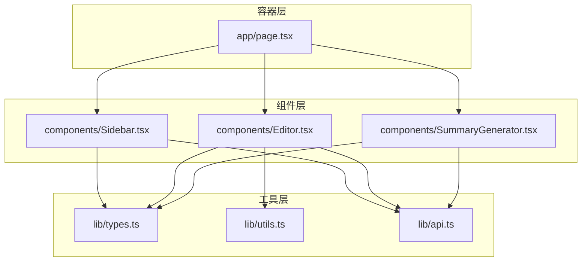
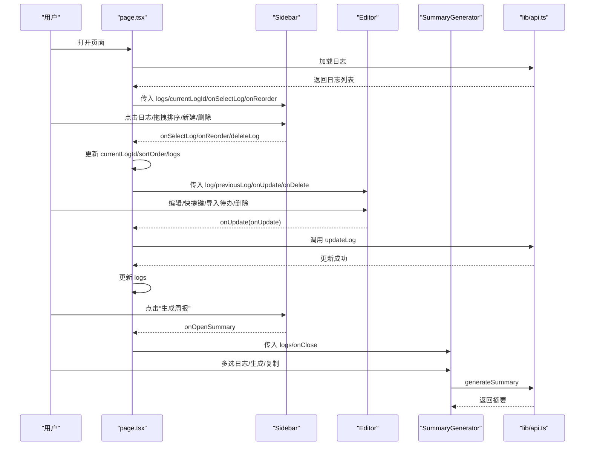
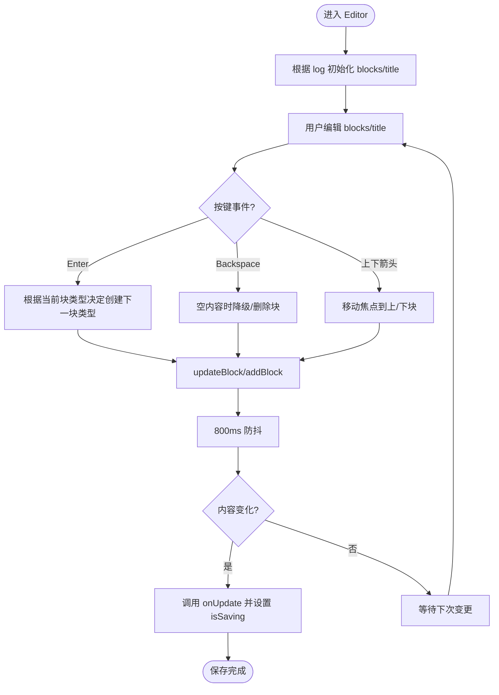
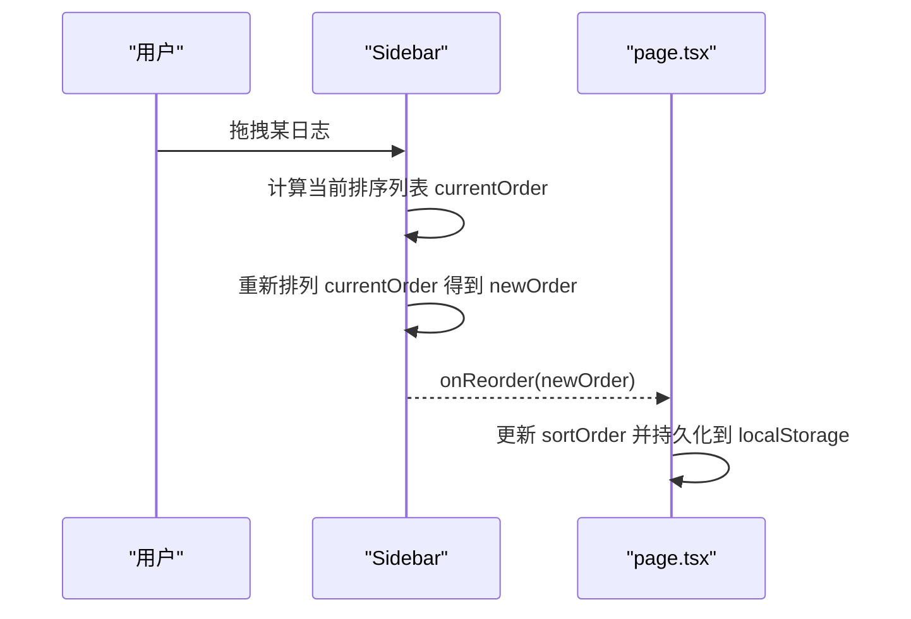
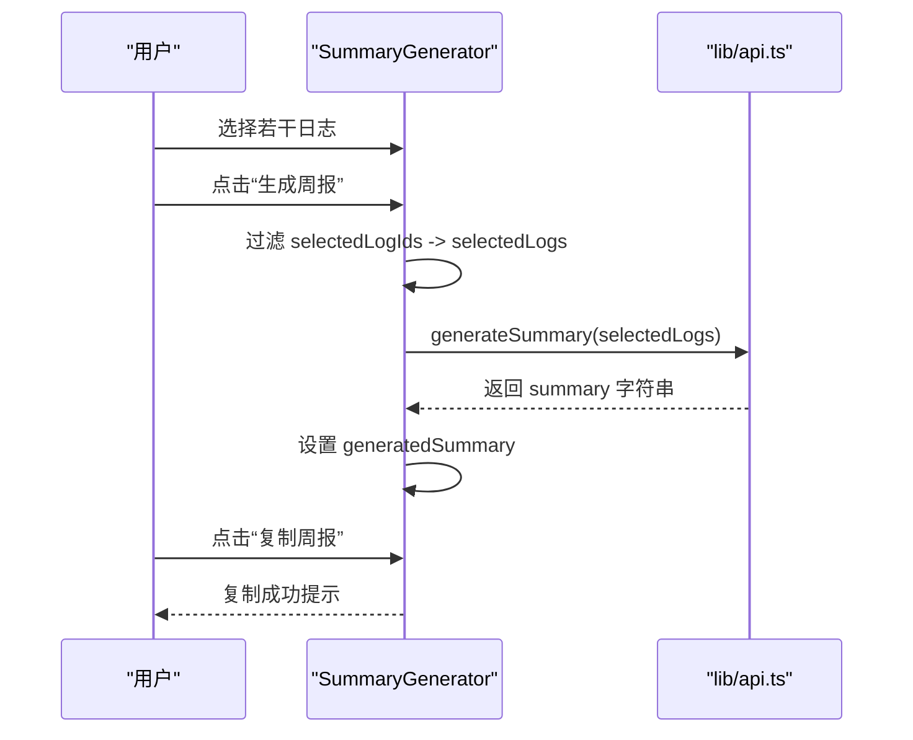
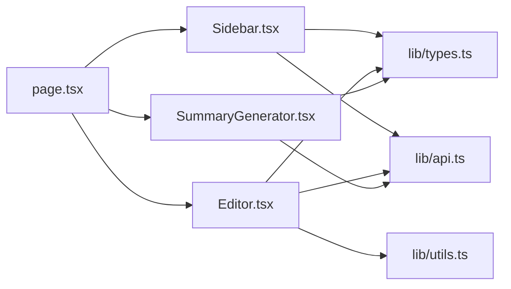

# 前端组件架构

<cite>
**本文引用的文件**
- [app/page.tsx](file://app/page.tsx)
- [components/Editor.tsx](file://components/Editor.tsx)
- [components/Sidebar.tsx](file://components/Sidebar.tsx)
- [components/SummaryGenerator.tsx](file://components/SummaryGenerator.tsx)
- [lib/types.ts](file://lib/types.ts)
- [lib/utils.ts](file://lib/utils.ts)
- [lib/api.ts](file://lib/api.ts)
- [README.md](file://README.md)
</cite>

## 目录
1. [简介](#简介)
2. [项目结构](#项目结构)
3. [核心组件](#核心组件)
4. [架构总览](#架构总览)
5. [组件详解](#组件详解)
6. [依赖关系分析](#依赖关系分析)
7. [性能考量](#性能考量)
8. [故障排查指南](#故障排查指南)
9. [结论](#结论)
10. [附录](#附录)

## 简介
本项目是一个基于 Next.js 的智能日志应用，围绕“日志编辑器 + 侧边栏 + AI 周报生成器”三大组件构建。page.tsx 作为根容器协调组件间的数据流与视图切换，通过状态提升实现跨组件共享。Editor 组件提供 Markdown 风格的块级编辑体验，支持段落、标题（H1-H3）、待办事项块与快捷键行为；Sidebar 实现日志列表的拖拽排序与渲染；SummaryGenerator 支持多选日志并通过 API 触发 AI 生成周报。类型系统由 lib/types.ts 定义，通用解析与工具函数由 lib/utils.ts 提供，数据访问由 lib/api.ts 抽象。

## 项目结构
- app/page.tsx：根容器，负责日志加载、排序持久化、当前日志与视图模式管理、以及向子组件传递 props。
- components/Editor.tsx：日志编辑器，内部维护块数组状态，处理键盘快捷键、标题菜单、待办勾选、防抖保存等。
- components/Sidebar.tsx：日志侧边栏，负责日志列表渲染、拖拽排序、删除与新建日志入口。
- components/SummaryGenerator.tsx：周报生成器，支持多选日志、调用 AI 生成摘要、复制结果。
- lib/types.ts：类型定义（日志、块、视图模式、状态枚举）。
- lib/utils.ts：Markdown 与块互转、未完成任务提取、日期格式化等工具。
- lib/api.ts：后端 API 封装（日志 CRUD、周报生成）。

图表来源
- [app/page.tsx](file://app/page.tsx#L1-L209)
- [components/Editor.tsx](file://components/Editor.tsx#L1-L457)
- [components/Sidebar.tsx](file://components/Sidebar.tsx#L1-L234)
- [components/SummaryGenerator.tsx](file://components/SummaryGenerator.tsx#L1-L237)
- [lib/types.ts](file://lib/types.ts#L1-L34)
- [lib/utils.ts](file://lib/utils.ts#L1-L168)
- [lib/api.ts](file://lib/api.ts#L1-L56)

章节来源
- [app/page.tsx](file://app/page.tsx#L1-L209)
- [README.md](file://README.md#L1-L64)

## 核心组件
- Editor：块级编辑器，支持标题层级切换、待办勾选、快捷键插入、导入上一条未完成任务、防抖保存与状态栏反馈。
- Sidebar：日志列表渲染与拖拽排序，支持新建、删除、选择日志、打开周报生成器。
- SummaryGenerator：多选日志、调用 AI 生成周报、复制结果、错误处理与 UI 流程控制。

章节来源
- [components/Editor.tsx](file://components/Editor.tsx#L1-L457)
- [components/Sidebar.tsx](file://components/Sidebar.tsx#L1-L234)
- [components/SummaryGenerator.tsx](file://components/SummaryGenerator.tsx#L1-L237)

## 架构总览
page.tsx 作为状态中心：
- 管理 logs、currentLogId、viewMode、sortOrder、移动端菜单开关等全局状态。
- 通过 props 下发给 Sidebar、Editor、SummaryGenerator。
- 负责日志 CRUD 与排序持久化，以及视图模式切换（编辑/预览/周报）。

图表来源
- [app/page.tsx](file://app/page.tsx#L1-L209)
- [components/Sidebar.tsx](file://components/Sidebar.tsx#L1-L234)
- [components/Editor.tsx](file://components/Editor.tsx#L1-L457)
- [components/SummaryGenerator.tsx](file://components/SummaryGenerator.tsx#L1-L237)
- [lib/api.ts](file://lib/api.ts#L1-L56)

## 组件详解

### Editor 组件
- 设计目标
  - 提供类 Markdown 的块级编辑体验，支持标题（H1-H3）、段落、待办事项块。
  - 内置快捷键与智能行为：回车自动创建下一块、Backspace 自动降级或删除、标题菜单切换层级、导入上一条未完成任务。
  - 防抖保存与状态栏反馈，确保编辑体验流畅。
- 内部状态
  - blocks：Block 数组，表示当前日志的块序列。
  - title：日志标题。
  - focusId：当前聚焦块的 id，用于自动聚焦。
  - isSaving：保存中状态。
  - headingMenuOpen：当前打开的标题菜单对应的块 id。
  - itemRefs：块元素引用映射，用于聚焦与高度自适应。
  - isLocalChange：本地变更标记，用于防抖保存判断。
  - lastLogId：上次日志 id，用于切换日志时初始化。
  - menuRef：标题菜单 DOM 引用，用于点击外部关闭。
- 关键交互
  - 键盘事件：Enter、Backspace、上下箭头移动焦点、快捷键转标题/待办。
  - 标题菜单：点击标题图标弹出菜单，支持切换 H1/H2/H3/正文。
  - 待办勾选：点击复选框切换 checked。
  - 导入上一条未完成任务：从 previousLog 中提取未完成任务，带标题上下文，插入到当前日志末尾。
  - 防抖保存：800ms 防抖，比较内容与标题变化后调用 onUpdate。
- Props 接口
  - log: LogEntry 当前日志
  - previousLog?: LogEntry 上一条日志（用于导入未完成任务）
  - onUpdate: (updatedLog: LogEntry) => void
  - onDelete: (id: number) => void
- 类型关联
  - LogEntry、Block、BlockType 定义见 lib/types.ts。
  - Markdown 解析/序列化、未完成任务提取、日期格式化见 lib/utils.ts。
- 性能与可用性
  - textarea 自适应高度，减少滚动跳变。
  - 防抖保存降低网络请求频率。
  - 空状态提示与“继续上次工作？”引导。

图表来源
- [components/Editor.tsx](file://components/Editor.tsx#L1-L457)
- [lib/utils.ts](file://lib/utils.ts#L1-L168)
- [lib/types.ts](file://lib/types.ts#L1-L34)

章节来源
- [components/Editor.tsx](file://components/Editor.tsx#L1-L457)
- [lib/types.ts](file://lib/types.ts#L1-L34)
- [lib/utils.ts](file://lib/utils.ts#L1-L168)

### Sidebar 组件
- 设计目标
  - 渲染日志列表，支持拖拽排序、删除、新建、选择日志、打开周报生成器。
  - 根据 sortOrder 与创建时间进行排序，未在排序中的日志排在前面。
- 关键交互
  - 拖拽排序：handleDragStart/handleDragOver/handleDrop 计算当前排序列表的新顺序，调用 onReorder。
  - 删除：点击删除按钮，阻止冒泡后调用 onDeleteLog。
  - 新建：点击“新建日志”，调用 onCreateLog。
  - 选择：点击条目，调用 onSelectLog。
  - 周报：点击“生成周报”，调用 onOpenSummary。
- Props 接口
  - logs: LogEntry[]
  - currentLogId: number | null
  - onSelectLog: (id: number) => void
  - onCreateLog: () => void
  - onDeleteLog: (id: number) => void
  - onOpenSummary: () => void
  - isSummaryMode: boolean
  - sortOrder: number[]
  - onReorder: (newOrder: number[]) => void
- 排序逻辑
  - 若某日志 id 在 sortOrder 中，则按其索引排序；否则排在前面；两者都存在时按创建时间倒序。

图表来源
- [components/Sidebar.tsx](file://components/Sidebar.tsx#L1-L234)
- [app/page.tsx](file://app/page.tsx#L1-L209)

章节来源
- [components/Sidebar.tsx](file://components/Sidebar.tsx#L1-L234)
- [app/page.tsx](file://app/page.tsx#L1-L209)

### SummaryGenerator 组件
- 设计目标
  - 多选日志，调用 AI 生成周报，支持复制结果与返回选择界面。
- 关键交互
  - 多选：点击日志卡片切换选中状态，顶部显示已选数量。
  - 全选：一键选择所有日志。
  - 生成：调用 generateSummary，捕获错误并显示。
  - 复制：复制生成的摘要到剪贴板，短暂提示成功。
  - 返回：从结果页返回选择页。
- Props 接口
  - logs: LogEntry[]
  - onClose: () => void
- 状态
  - selectedLogIds: Set<number> 已选日志 id
  - isGenerating: boolean
  - generatedSummary: string | null
  - copySuccess: boolean
  - error: string | null
- 类型关联
  - LogEntry、ViewMode 定义见 lib/types.ts。
  - AI 生成摘要由 lib/api.ts 的 generateSummary 提供。

图表来源
- [components/SummaryGenerator.tsx](file://components/SummaryGenerator.tsx#L1-L237)
- [lib/api.ts](file://lib/api.ts#L1-L56)
- [lib/types.ts](file://lib/types.ts#L1-L34)

章节来源
- [components/SummaryGenerator.tsx](file://components/SummaryGenerator.tsx#L1-L237)
- [lib/api.ts](file://lib/api.ts#L1-L56)
- [lib/types.ts](file://lib/types.ts#L1-L34)

### page.tsx 容器协调
- 状态提升
  - logs：日志列表
  - currentLogId：当前选中日志 id
  - viewMode：编辑/预览/周报
  - sortOrder：日志排序顺序（localStorage 持久化）
  - isLoading：初始加载状态
- 生命周期
  - 加载排序顺序（localStorage），加载日志（fetchLogs），设置 currentLogId。
  - 处理新建、更新、删除日志，必要时切换 currentLogId。
  - 处理拖拽排序，更新 sortOrder 并持久化。
- 视图切换
  - 编辑模式：渲染 Editor
  - 周报模式：渲染 SummaryGenerator
  - 无日志：提示创建第一条日志

章节来源
- [app/page.tsx](file://app/page.tsx#L1-L209)
- [lib/api.ts](file://lib/api.ts#L1-L56)

## 依赖关系分析
- 组件依赖
  - Editor 依赖 lib/utils.ts（parseMarkdownToBlocks、blocksToMarkdown、extractUnfinishedTasks、generateId、formatDate）与 lib/types.ts（LogEntry、Block）。
  - Sidebar 依赖 lib/types.ts（LogEntry）与 lib/utils.ts（formatDate）。
  - SummaryGenerator 依赖 lib/api.ts（generateSummary）与 lib/types.ts（LogEntry）。
- 容器依赖
  - page.tsx 依赖 lib/api.ts（fetchLogs、createLog、updateLog、deleteLog）与 lib/types.ts（LogEntry、ViewMode）。
- 外部依赖
  - 图标库 lucide-react（用于菜单、按钮图标）。
  - Tailwind CSS（样式框架）。

图表来源
- [app/page.tsx](file://app/page.tsx#L1-L209)
- [components/Editor.tsx](file://components/Editor.tsx#L1-L457)
- [components/Sidebar.tsx](file://components/Sidebar.tsx#L1-L234)
- [components/SummaryGenerator.tsx](file://components/SummaryGenerator.tsx#L1-L237)
- [lib/types.ts](file://lib/types.ts#L1-L34)
- [lib/utils.ts](file://lib/utils.ts#L1-L168)
- [lib/api.ts](file://lib/api.ts#L1-L56)

章节来源
- [lib/types.ts](file://lib/types.ts#L1-L34)
- [lib/utils.ts](file://lib/utils.ts#L1-L168)
- [lib/api.ts](file://lib/api.ts#L1-L56)

## 性能考量
- 防抖保存：Editor 对内容变更进行 800ms 防抖，减少网络请求次数。
- 本地状态与引用：Editor 使用 useRef 保存块引用与本地变更标记，避免不必要的重渲染。
- 列表渲染优化：Sidebar 仅在 logs 或排序变化时重新计算排序，避免每次渲染都排序。
- 懒加载与条件渲染：page.tsx 根据 viewMode 条件渲染 Editor 或 SummaryGenerator，减少不必要组件挂载。
- 本地存储：sortOrder 使用 localStorage 持久化，避免每次刷新重新计算排序。

## 故障排查指南
- 无法加载日志
  - 检查 API 端点 /api/logs 是否可达，确认服务端响应状态码。
  - 查看 page.tsx 中的错误日志输出。
- 保存失败
  - 确认 Editor 的 onUpdate 回调是否正确调用 updateLog，查看网络请求与响应。
- 拖拽排序无效
  - 确认 Sidebar 的 onReorder 是否被调用，以及 sortOrder 是否更新并写入 localStorage。
- 生成周报失败
  - 检查 /api/summary 的请求体是否包含正确的 logs 数组，查看错误消息并确认 DeepSeek API Key 配置。
- 标题菜单无法关闭
  - 确认 Editor 的点击外部关闭逻辑是否绑定，menuRef 是否正确引用。

章节来源
- [lib/api.ts](file://lib/api.ts#L1-L56)
- [components/Editor.tsx](file://components/Editor.tsx#L1-L457)
- [components/Sidebar.tsx](file://components/Sidebar.tsx#L1-L234)
- [components/SummaryGenerator.tsx](file://components/SummaryGenerator.tsx#L1-L237)
- [app/page.tsx](file://app/page.tsx#L1-L209)

## 结论
该前端组件体系以 page.tsx 为核心，通过状态提升实现了 Editor、Sidebar、SummaryGenerator 的数据共享与协作。Editor 提供了流畅的块级编辑体验与智能快捷键；Sidebar 实现了直观的拖拽排序与日志管理；SummaryGenerator 则将多选日志与 AI 生成流程整合在一起。类型系统与工具函数为组件提供了清晰的契约与可复用能力。整体架构简洁、职责明确，具备良好的扩展性与可维护性。

## 附录
- 组件 Props 一览
  - Editor
    - log: LogEntry
    - previousLog?: LogEntry
    - onUpdate: (updatedLog: LogEntry) => void
    - onDelete: (id: number) => void
  - Sidebar
    - logs: LogEntry[]
    - currentLogId: number | null
    - onSelectLog: (id: number) => void
    - onCreateLog: () => void
    - onDeleteLog: (id: number) => void
    - onOpenSummary: () => void
    - isSummaryMode: boolean
    - sortOrder: number[]
    - onReorder: (newOrder: number[]) => void
  - SummaryGenerator
    - logs: LogEntry[]
    - onClose: () => void
- 类型定义要点
  - LogEntry：id、createTime、updateTime、status、creatorId、title、content
  - Block：id、type、content、checked?
  - BlockType：'paragraph' | 'todo' | 'h1' | 'h2' | 'h3'
  - ViewMode：EDIT、PREVIEW、SUMMARY
  - Status：DELETED、ACTIVE

章节来源
- [lib/types.ts](file://lib/types.ts#L1-L34)
- [components/Editor.tsx](file://components/Editor.tsx#L1-L457)
- [components/Sidebar.tsx](file://components/Sidebar.tsx#L1-L234)
- [components/SummaryGenerator.tsx](file://components/SummaryGenerator.tsx#L1-L237)