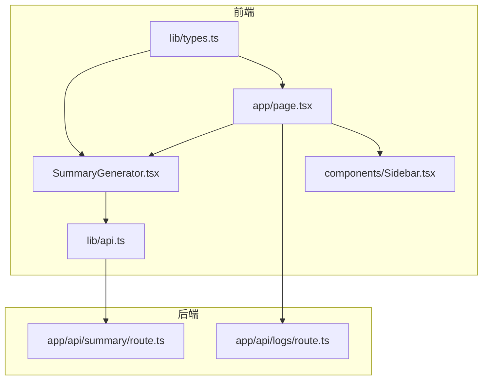
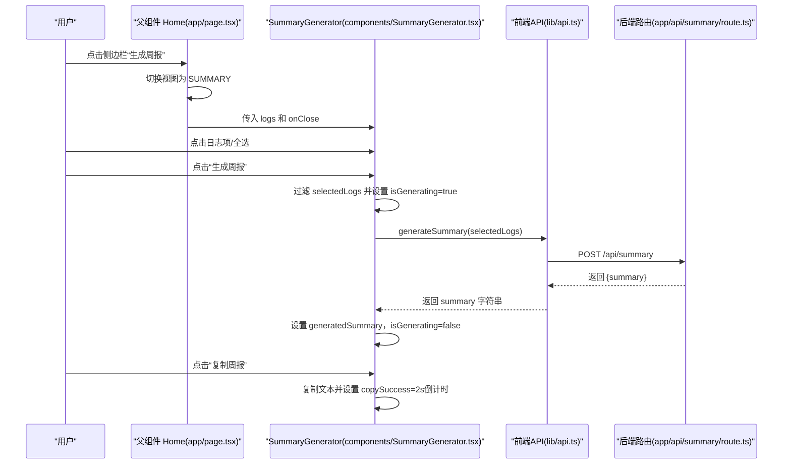
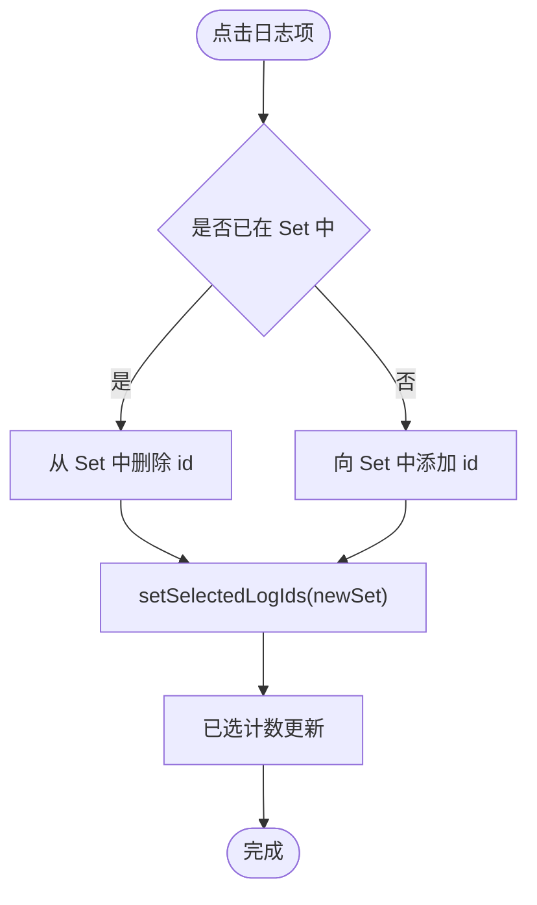
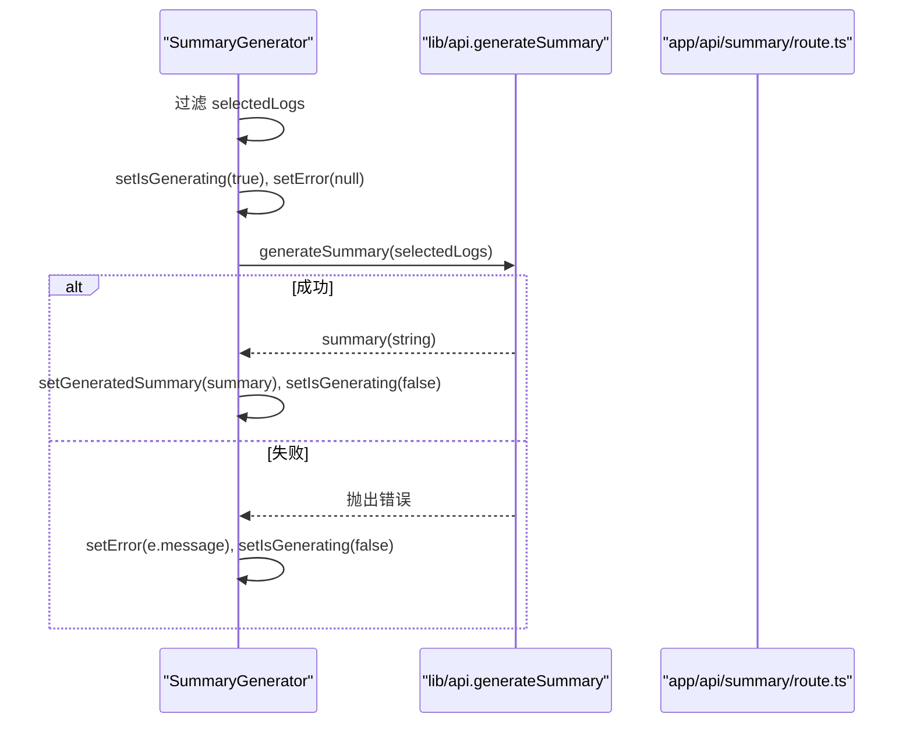
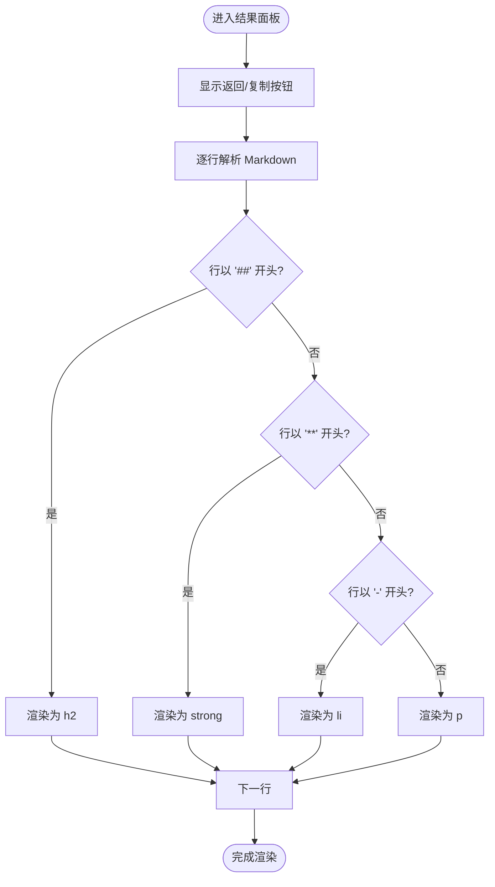
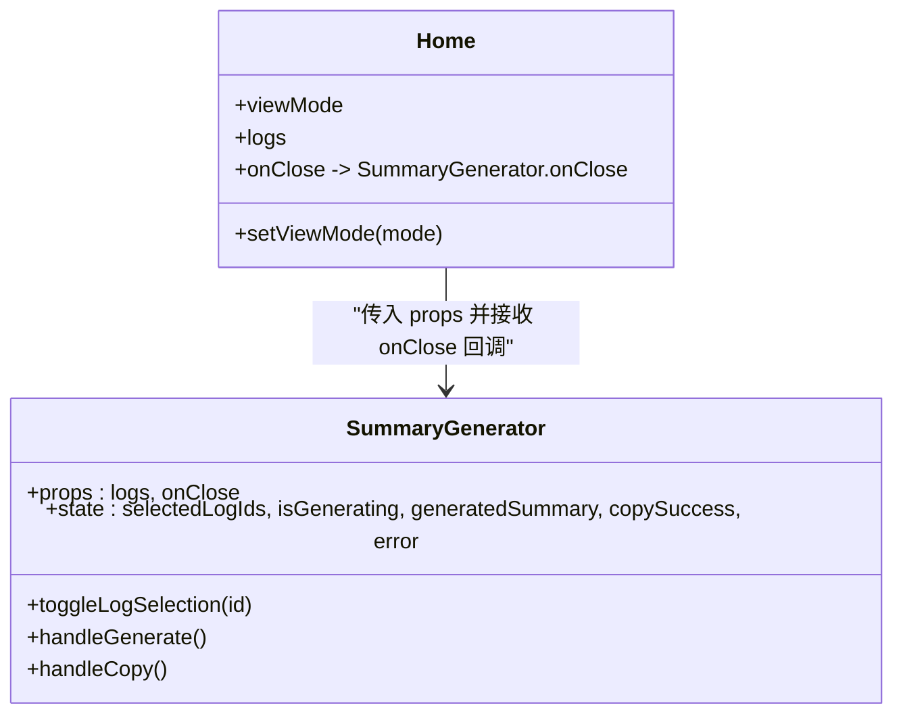
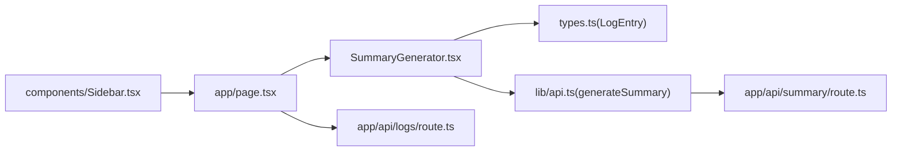

# 周报生成器组件

<cite>
**本文引用的文件**
- [components/SummaryGenerator.tsx](file://components/SummaryGenerator.tsx)
- [lib/api.ts](file://lib/api.ts)
- [app/api/summary/route.ts](file://app/api/summary/route.ts)
- [app/page.tsx](file://app/page.tsx)
- [lib/types.ts](file://lib/types.ts)
- [components/Sidebar.tsx](file://components/Sidebar.tsx)
- [app/api/logs/route.ts](file://app/api/logs/route.ts)
</cite>

## 目录
1. [简介](#简介)
2. [项目结构](#项目结构)
3. [核心组件](#核心组件)
4. [架构总览](#架构总览)
5. [详细组件分析](#详细组件分析)
6. [依赖关系分析](#依赖关系分析)
7. [性能考量](#性能考量)
8. [故障排查指南](#故障排查指南)
9. [结论](#结论)
10. [附录](#附录)

## 简介
本文件系统性记录 SummaryGenerator 组件的设计与实现，该组件提供“多日志选择 + AI 周报生成”的完整能力。文档覆盖：
- 状态管理机制：selectedLogIds（Set 数据结构）、isGenerating、generatedSummary、copySuccess、error 的使用场景与流转
- 日志选择交互：点击列表项切换选择状态、全选按钮实现、已选计数实时更新
- AI 周报生成流程：handleGenerate 如何过滤选中日志并调用 lib/api 中的 generateSummary，包含错误处理与加载状态管理
- 周报结果展示界面：返回按钮、复制功能（含 copySuccess 的 2 秒倒计时）、Markdown 内容解析渲染
- 组件 Props 接口（logs、onClose）及与父组件的通信协议
- 响应式布局：移动端底部固定生成按钮、桌面端侧边栏布局

## 项目结构
SummaryGenerator 位于 components 目录，通过 lib/api.ts 与后端 API 交互，并由 app/page.tsx 提供数据源与视图切换控制。

图表来源
- [components/SummaryGenerator.tsx](file://components/SummaryGenerator.tsx#L1-L237)
- [lib/api.ts](file://lib/api.ts#L1-L56)
- [app/api/summary/route.ts](file://app/api/summary/route.ts#L1-L78)
- [app/page.tsx](file://app/page.tsx#L1-L209)
- [lib/types.ts](file://lib/types.ts#L1-L34)
- [components/Sidebar.tsx](file://components/Sidebar.tsx#L1-L234)
- [app/api/logs/route.ts](file://app/api/logs/route.ts#L1-L38)

章节来源
- [components/SummaryGenerator.tsx](file://components/SummaryGenerator.tsx#L1-L237)
- [app/page.tsx](file://app/page.tsx#L150-L183)
- [lib/api.ts](file://lib/api.ts#L42-L56)
- [app/api/summary/route.ts](file://app/api/summary/route.ts#L1-L78)
- [lib/types.ts](file://lib/types.ts#L1-L34)
- [components/Sidebar.tsx](file://components/Sidebar.tsx#L212-L228)
- [app/api/logs/route.ts](file://app/api/logs/route.ts#L1-L38)

## 核心组件
- 组件名称：SummaryGenerator
- 功能定位：多日志选择 + AI 周报生成 + 结果展示与复制
- 关键状态：
  - selectedLogIds：Set<number>，存储已选日志 id
  - isGenerating：boolean，生成过程中的加载态
  - generatedSummary：string|null，最终生成的 Markdown 文本
  - copySuccess：boolean，复制成功的短暂提示
  - error：string|null，生成失败的错误信息
- Props：
  - logs：LogEntry[]，传入的日志列表
  - onClose：() => void，关闭周报生成器并返回编辑视图

章节来源
- [components/SummaryGenerator.tsx](file://components/SummaryGenerator.tsx#L8-L18)
- [lib/types.ts](file://lib/types.ts#L1-L10)

## 架构总览
SummaryGenerator 在父组件（Home 页面）中被条件渲染，当用户在侧边栏点击“生成周报”时进入 SUMMARY 视图，此时渲染 SummaryGenerator。组件内部通过 lib/api.ts 的 generateSummary 发起请求至 /api/summary，后端路由 app/api/summary/route.ts 调用第三方模型服务生成摘要，再返回给前端展示。

图表来源
- [app/page.tsx](file://app/page.tsx#L150-L183)
- [components/SummaryGenerator.tsx](file://components/SummaryGenerator.tsx#L30-L43)
- [lib/api.ts](file://lib/api.ts#L42-L56)
- [app/api/summary/route.ts](file://app/api/summary/route.ts#L1-L78)

## 详细组件分析

### 状态管理机制
- selectedLogIds（Set<number>）
  - 作用：维护用户已选择的日志 id 集合
  - 初始化：useState<Set<number>>(new Set())
  - 更新策略：每次点击切换时基于当前 Set 创建新 Set，避免直接修改原状态
  - 使用场景：过滤日志、全选、已选计数显示
- isGenerating（boolean）
  - 作用：控制生成按钮禁用与加载动画
  - 更新：发起生成前设为 true，finally 中恢复为 false
- generatedSummary（string|null）
  - 作用：存储后端返回的 Markdown 文本，决定展示结果面板
  - 更新：成功后赋值，返回选择时清空
- copySuccess（boolean）
  - 作用：复制按钮的状态提示，2 秒后自动清除
  - 更新：复制成功后立即设为 true，setTimeout 清除
- error（string|null）
  - 作用：捕获生成异常并显示错误信息
  - 更新：try/catch 中设置，finally 清空

章节来源
- [components/SummaryGenerator.tsx](file://components/SummaryGenerator.tsx#L13-L19)
- [components/SummaryGenerator.tsx](file://components/SummaryGenerator.tsx#L20-L28)
- [components/SummaryGenerator.tsx](file://components/SummaryGenerator.tsx#L30-L43)
- [components/SummaryGenerator.tsx](file://components/SummaryGenerator.tsx#L45-L51)

### 日志选择交互逻辑
- 列表项点击切换选择状态
  - 实现：toggleLogSelection 使用 Set 的 has/add/delete 行为切换
  - 视觉反馈：选中态改变边框、背景、图标与文字颜色
- 全选按钮
  - 实现：对排序后的日志列表取 id 构造新 Set 赋值
  - 排序依据：按 createTime 降序排列
- 已选计数实时更新
  - 显示：已选计数展示 selectedLogIds.size
  - 交互：随点击与全选即时变化

图表来源
- [components/SummaryGenerator.tsx](file://components/SummaryGenerator.tsx#L20-L28)
- [components/SummaryGenerator.tsx](file://components/SummaryGenerator.tsx#L84-L93)
- [components/SummaryGenerator.tsx](file://components/SummaryGenerator.tsx#L53-L55)

章节来源
- [components/SummaryGenerator.tsx](file://components/SummaryGenerator.tsx#L20-L28)
- [components/SummaryGenerator.tsx](file://components/SummaryGenerator.tsx#L53-L55)
- [components/SummaryGenerator.tsx](file://components/SummaryGenerator.tsx#L84-L93)

### AI 周报生成流程
- 过滤选中日志
  - 依据：selectedLogIds.has(log.id) 过滤 logs
- 调用 generateSummary
  - 参数：selectedLogs（LogEntry[]）
  - 返回：Promise<string>（Markdown 文本）
- 错误处理
  - try/catch 捕获异常，设置 error
  - finally 中统一恢复 isGenerating=false
- 加载状态管理
  - 生成按钮 disabled 逻辑：selectedLogIds.size===0 或 isGenerating
  - 生成中显示加载动画与文案

图表来源
- [components/SummaryGenerator.tsx](file://components/SummaryGenerator.tsx#L30-L43)
- [lib/api.ts](file://lib/api.ts#L42-L56)
- [app/api/summary/route.ts](file://app/api/summary/route.ts#L1-L78)

章节来源
- [components/SummaryGenerator.tsx](file://components/SummaryGenerator.tsx#L30-L43)
- [lib/api.ts](file://lib/api.ts#L42-L56)
- [app/api/summary/route.ts](file://app/api/summary/route.ts#L1-L78)

### 周报结果展示界面
- 返回按钮
  - 功能：清空 generatedSummary，回到日志选择界面
- 复制功能
  - 触发：点击“复制周报”
  - 行为：navigator.clipboard.writeText，设置 copySuccess=true，2 秒后清除
- Markdown 内容解析渲染
  - 方案：按行拆分，识别标题、粗体、列表等，映射到对应 HTML 标签
  - 容器：prose 类样式的容器，支持基础排版

图表来源
- [components/SummaryGenerator.tsx](file://components/SummaryGenerator.tsx#L190-L231)
- [components/SummaryGenerator.tsx](file://components/SummaryGenerator.tsx#L212-L229)

章节来源
- [components/SummaryGenerator.tsx](file://components/SummaryGenerator.tsx#L190-L231)
- [components/SummaryGenerator.tsx](file://components/SummaryGenerator.tsx#L212-L229)

### 组件 Props 接口与父组件通信协议
- Props
  - logs：LogEntry[]，父组件传入的全部日志
  - onClose：() => void，关闭周报生成器，返回编辑视图
- 父组件 Home 的通信协议
  - 通过 ViewMode 控制渲染：SUMMARY 模式渲染 SummaryGenerator
  - onClose 回调将视图切回 EDIT
  - logs 由父组件从后端拉取并传入

图表来源
- [components/SummaryGenerator.tsx](file://components/SummaryGenerator.tsx#L8-L18)
- [app/page.tsx](file://app/page.tsx#L150-L183)
- [lib/types.ts](file://lib/types.ts#L12-L17)

章节来源
- [components/SummaryGenerator.tsx](file://components/SummaryGenerator.tsx#L8-L18)
- [app/page.tsx](file://app/page.tsx#L150-L183)
- [lib/types.ts](file://lib/types.ts#L12-L17)

### 响应式布局设计
- 移动端
  - 生成按钮固定在底部，使用绝对定位，生成结果面板铺满屏幕
  - 通过 isGenerating 控制按钮可用状态
- 桌面端
  - 左侧为日志选择面板，右侧为生成按钮区域（宽度 1/3），结果面板在右侧剩余空间
  - 使用 md:flex-row 分屏布局

章节来源
- [components/SummaryGenerator.tsx](file://components/SummaryGenerator.tsx#L76-L187)
- [components/SummaryGenerator.tsx](file://components/SummaryGenerator.tsx#L150-L187)

## 依赖关系分析
- 组件依赖
  - lib/types.ts：LogEntry 接口定义
  - lib/api.ts：generateSummary 函数封装 /api/summary
  - app/api/summary/route.ts：后端路由，对接第三方模型服务
  - app/page.tsx：父组件，提供 logs 与视图切换
  - components/Sidebar.tsx：触发 SUMMARY 视图入口
  - app/api/logs/route.ts：提供日志数据源（GET）

图表来源
- [components/SummaryGenerator.tsx](file://components/SummaryGenerator.tsx#L1-L237)
- [lib/types.ts](file://lib/types.ts#L1-L10)
- [lib/api.ts](file://lib/api.ts#L42-L56)
- [app/api/summary/route.ts](file://app/api/summary/route.ts#L1-L78)
- [app/page.tsx](file://app/page.tsx#L150-L183)
- [components/Sidebar.tsx](file://components/Sidebar.tsx#L212-L228)
- [app/api/logs/route.ts](file://app/api/logs/route.ts#L1-L38)

章节来源
- [components/SummaryGenerator.tsx](file://components/SummaryGenerator.tsx#L1-L237)
- [lib/types.ts](file://lib/types.ts#L1-L10)
- [lib/api.ts](file://lib/api.ts#L42-L56)
- [app/api/summary/route.ts](file://app/api/summary/route.ts#L1-L78)
- [app/page.tsx](file://app/page.tsx#L150-L183)
- [components/Sidebar.tsx](file://components/Sidebar.tsx#L212-L228)
- [app/api/logs/route.ts](file://app/api/logs/route.ts#L1-L38)

## 性能考量
- 选择集操作
  - 使用 Set 进行 O(1) 查找与插入/删除，适合频繁切换
- 过滤日志
  - 过滤 logs 的复杂度为 O(n)，n 为日志总数；在 UI 层仅做内存过滤，开销可控
- 排序
  - 仅在渲染前对日志进行一次降序排序，避免重复计算
- 生成流程
  - 仅在用户点击“生成周报”时发起网络请求，避免不必要的调用
- 复制与提示
  - 复制成功后 2 秒倒计时，避免频繁交互造成的闪烁

[本节为通用性能建议，不直接分析具体代码文件]

## 故障排查指南
- 无法生成周报
  - 检查 selectedLogIds 是否为空；若为空，按钮会禁用
  - 查看 error 状态是否显示错误信息
  - 确认 /api/summary 路由可访问且 DEEPSEEK_API_KEY 已配置
- 复制失败
  - 确认浏览器允许剪贴板权限
  - 检查 generatedSummary 是否存在
- 日志为空
  - 确认父组件已正确拉取日志并传入 logs
  - 检查 /api/logs 路由返回状态

章节来源
- [components/SummaryGenerator.tsx](file://components/SummaryGenerator.tsx#L30-L43)
- [components/SummaryGenerator.tsx](file://components/SummaryGenerator.tsx#L45-L51)
- [app/api/summary/route.ts](file://app/api/summary/route.ts#L1-L20)
- [app/api/logs/route.ts](file://app/api/logs/route.ts#L1-L16)

## 结论
SummaryGenerator 通过清晰的状态机与简洁的交互设计，实现了“多日志选择 + AI 周报生成 + 结果展示”的完整闭环。组件在移动端与桌面端均具备良好的可用性，状态管理与错误处理完善，与父组件的通信协议简单明确。建议后续可考虑：
- 对生成结果增加预览与导出功能
- 优化日志选择面板的搜索与筛选能力
- 增加生成进度提示与取消机制

[本节为总结性内容，不直接分析具体代码文件]

## 附录
- 关键实现路径参考
  - 状态与交互：[components/SummaryGenerator.tsx](file://components/SummaryGenerator.tsx#L13-L51)
  - 生成流程：[components/SummaryGenerator.tsx](file://components/SummaryGenerator.tsx#L30-L43)、[lib/api.ts](file://lib/api.ts#L42-L56)、[app/api/summary/route.ts](file://app/api/summary/route.ts#L1-L78)
  - 父组件通信：[app/page.tsx](file://app/page.tsx#L150-L183)、[components/Sidebar.tsx](file://components/Sidebar.tsx#L212-L228)
  - 数据类型：[lib/types.ts](file://lib/types.ts#L1-L10)

[本节为补充信息，不直接分析具体代码文件]