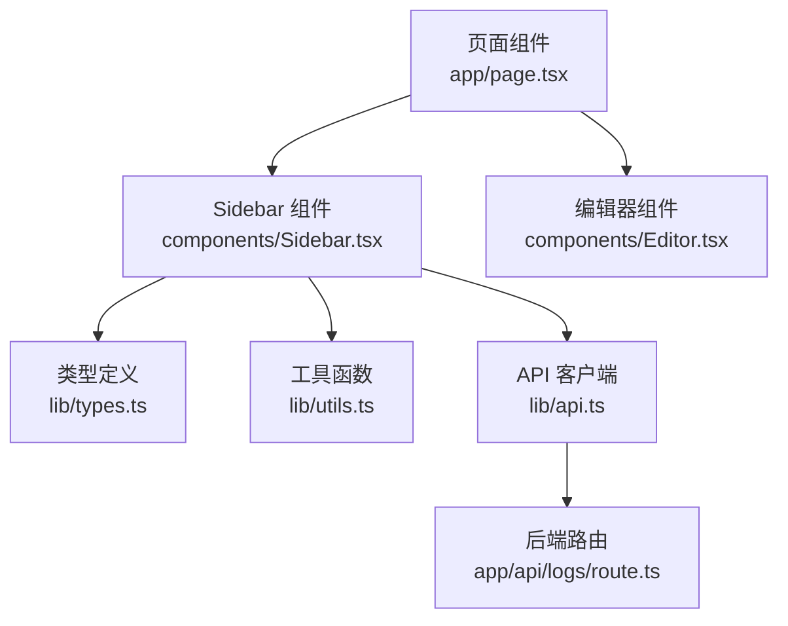
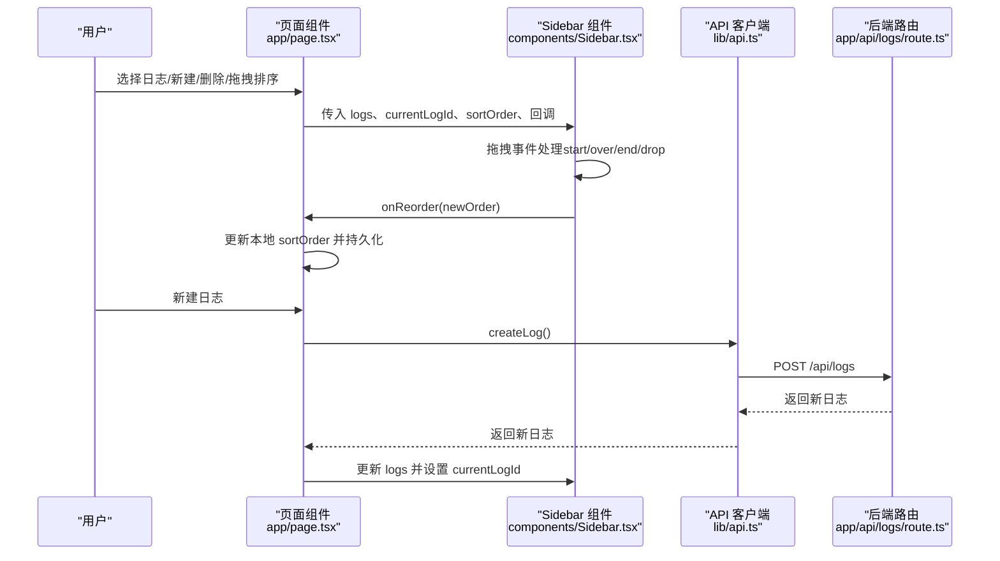
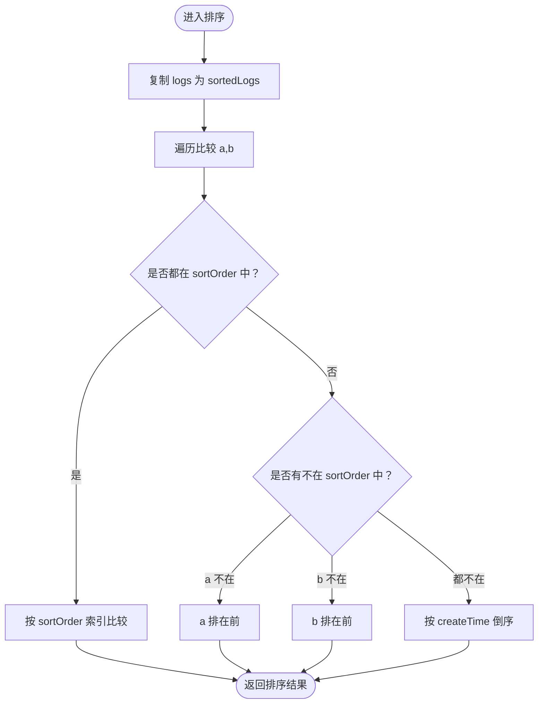
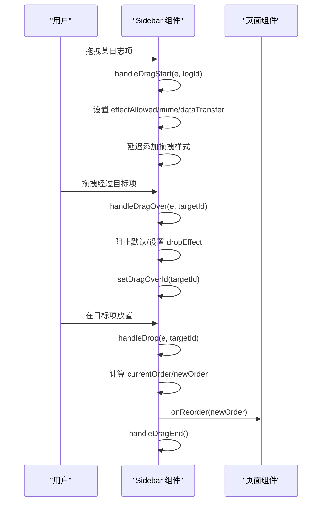
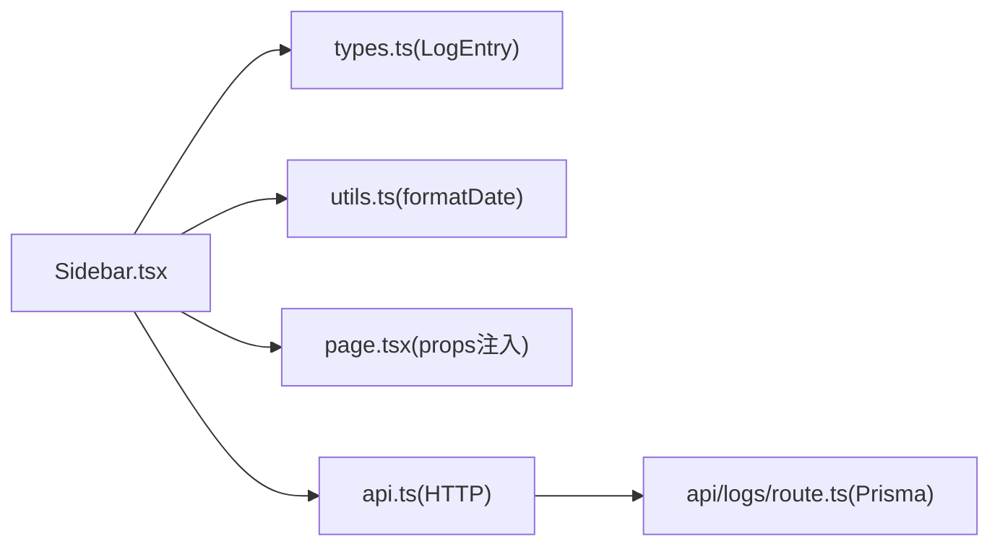

# 日志侧边栏组件

<cite>
**本文引用的文件**
- [components/Sidebar.tsx](file://components/Sidebar.tsx)
- [app/page.tsx](file://app/page.tsx)
- [lib/types.ts](file://lib/types.ts)
- [lib/utils.ts](file://lib/utils.ts)
- [lib/api.ts](file://lib/api.ts)
- [app/api/logs/route.ts](file://app/api/logs/route.ts)
- [components/Editor.tsx](file://components/Editor.tsx)
</cite>

## 目录
1. [简介](#简介)
2. [项目结构](#项目结构)
3. [核心组件](#核心组件)
4. [架构总览](#架构总览)
5. [详细组件分析](#详细组件分析)
6. [依赖分析](#依赖分析)
7. [性能考虑](#性能考虑)
8. [故障排查指南](#故障排查指南)
9. [结论](#结论)

## 简介
本文件系统性记录 Sidebar 组件的设计与实现，重点覆盖以下方面：
- 日志列表展示与拖拽排序功能
- 状态管理机制：hoveredLogId、draggedId、dragOverId 的协同工作
- 基于 sortOrder 数组的排序逻辑：优先按自定义顺序排列，未排序项按创建时间倒序显示
- HTML5 拖拽 API 实现细节：handleDragStart 设置 dataTransfer 和拖拽样式，handleDragOver 阻止默认行为并设置 dropEffect，handleDrop 计算新的排序数组并通过 onReorder 回调更新
- dragNodeRef 引用在拖拽过程中的透明度控制
- 组件 Props 接口及其在日志选择、创建、删除、周报生成中的作用
- 列表项交互样式：悬停效果、选中态、拖拽占位的视觉反馈

## 项目结构
Sidebar 组件位于 components 目录，作为主页面的左侧导航面板，负责日志列表的展示与交互。主页面通过 props 将日志数据、当前选中日志、排序顺序以及各类回调传递给 Sidebar，并在用户操作时更新状态。

图表来源
- [app/page.tsx](file://app/page.tsx#L1-L209)
- [components/Sidebar.tsx](file://components/Sidebar.tsx#L1-L234)
- [lib/types.ts](file://lib/types.ts#L1-L34)
- [lib/utils.ts](file://lib/utils.ts#L148-L168)
- [lib/api.ts](file://lib/api.ts#L1-L56)
- [app/api/logs/route.ts](file://app/api/logs/route.ts#L1-L38)
- [components/Editor.tsx](file://components/Editor.tsx#L1-L457)

章节来源
- [app/page.tsx](file://app/page.tsx#L1-L209)
- [components/Sidebar.tsx](file://components/Sidebar.tsx#L1-L234)

## 核心组件
Sidebar 是一个客户端组件，接收以下 Props：
- logs: LogEntry[] —— 日志列表
- currentLogId: number | null —— 当前选中日志 ID
- onSelectLog: (id: number) => void —— 选择日志回调
- onCreateLog: () => void —— 新建日志回调
- onDeleteLog: (id: number) => void —— 删除日志回调
- onOpenSummary: () => void —— 打开周报生成回调
- isSummaryMode: boolean —— 是否处于周报模式
- sortOrder: number[] —— 自定义排序 ID 序列
- onReorder: (newOrder: number[]) => void —— 拖拽排序变更回调

状态管理：
- hoveredLogId: number | null —— 鼠标悬停的日志 ID
- draggedId: number | null —— 正在拖拽的日志 ID
- dragOverId: number | null —— 拖拽悬停在其上的目标日志 ID
- dragNodeRef: React.RefObject<HTMLDivElement> —— 拖拽节点的引用，用于动态修改透明度

排序逻辑：
- 先以 sortOrder 中的索引为准进行稳定排序
- 未出现在 sortOrder 中的日志，按 createTime 倒序排在前面

拖拽流程：
- handleDragStart：设置 effectAllowed、dataTransfer、延迟添加拖拽样式
- handleDragOver：阻止默认行为、设置 dropEffect、更新 dragOverId
- handleDrop：计算当前排序后的 ID 序列，重新插入 draggedId 到 targetIndex，调用 onReorder
- handleDragEnd：清理状态并恢复透明度

章节来源
- [components/Sidebar.tsx](file://components/Sidebar.tsx#L8-L18)
- [components/Sidebar.tsx](file://components/Sidebar.tsx#L31-L34)
- [components/Sidebar.tsx](file://components/Sidebar.tsx#L36-L51)
- [components/Sidebar.tsx](file://components/Sidebar.tsx#L53-L110)

## 架构总览
Sidebar 与页面组件的交互关系如下：

图表来源
- [app/page.tsx](file://app/page.tsx#L1-L209)
- [components/Sidebar.tsx](file://components/Sidebar.tsx#L53-L110)
- [lib/api.ts](file://lib/api.ts#L13-L21)
- [app/api/logs/route.ts](file://app/api/logs/route.ts#L18-L38)

## 详细组件分析

### 排序逻辑与渲染
- 排序规则：
  - 若两个日志均在 sortOrder 中，则按 sortOrder 的索引升序
  - 若仅 a 不在 sortOrder 中，则 a 排在前面
  - 若仅 b 不在 sortOrder 中，则 b 排在前面
  - 若均不在 sortOrder 中，则按 createTime 倒序
- 渲染：
  - 使用 sortedLogs.map 渲染列表项，每个项具备 draggable 属性
  - 通过 className 动态组合选中态、悬停态、拖拽态样式

图表来源
- [components/Sidebar.tsx](file://components/Sidebar.tsx#L36-L51)

章节来源
- [components/Sidebar.tsx](file://components/Sidebar.tsx#L36-L51)

### HTML5 拖拽 API 实现
- handleDragStart
  - 设置 effectAllowed 为 move
  - 通过 dataTransfer.setData 保存被拖拽日志 ID
  - 延迟添加拖拽样式：将 dragNodeRef.current.style.opacity 设为 0.5
- handleDragOver
  - preventDefault 阻止默认行为
  - 设置 dropEffect 为 move
  - 当 draggedId !== logId 时，更新 dragOverId
- handleDragLeave
  - 清空 dragOverId
- handleDragEnd
  - 清空 draggedId、dragOverId
  - 恢复 dragNodeRef.current.style.opacity 为 1
- handleDrop
  - 防御性判断：若 draggedId 为空或与 targetId 相同则直接结束
  - 获取当前排序后的 ID 序列 currentOrder
  - 计算 draggedIndex 与 targetIndex
  - 通过 splice 移除并插入到目标位置，得到 newOrder
  - 调用 onReorder(newOrder)，随后执行 handleDragEnd

图表来源
- [components/Sidebar.tsx](file://components/Sidebar.tsx#L53-L110)

章节来源
- [components/Sidebar.tsx](file://components/Sidebar.tsx#L53-L110)

### 列表项交互样式
- 选中态：当 currentLogId === log.id 且非周报模式时，应用选中背景色与阴影
- 悬停态：hover:bg-gray-50
- 拖拽态：被拖拽项 opacity 降低至 0.5
- 拖拽悬停态：目标项 border-primary-400 边框与虚线、浅色背景叠加
- 拖拽手柄：仅在该项悬停时显示，提供可拖拽的视觉提示
- 删除按钮：仅在该项悬停时显示，支持点击删除

章节来源
- [components/Sidebar.tsx](file://components/Sidebar.tsx#L140-L209)

### Props 接口与职责
- logs: 日志列表，用于渲染与排序
- currentLogId: 控制当前选中项的高亮
- onSelectLog: 切换当前日志并进入编辑模式
- onCreateLog: 新建日志并更新 logs 与 currentLogId
- onDeleteLog: 删除日志并更新 logs 与 currentLogId
- onOpenSummary: 切换到周报模式
- isSummaryMode: 控制周报模式下的按钮样式
- sortOrder: 自定义排序序列，影响渲染顺序
- onReorder: 拖拽排序完成后更新 sortOrder 并持久化

章节来源
- [components/Sidebar.tsx](file://components/Sidebar.tsx#L8-L18)
- [app/page.tsx](file://app/page.tsx#L138-L159)

### 类型与工具
- LogEntry：包含 id、createTime、updateTime、status、creatorId、title、content
- formatDate：中文格式化日期，用于显示创建时间

章节来源
- [lib/types.ts](file://lib/types.ts#L1-L10)
- [lib/utils.ts](file://lib/utils.ts#L148-L168)

### 与后端的集成
- 页面组件通过 lib/api.ts 的 createLog/updateLog/deleteLog/fetchLogs 与后端交互
- app/api/logs/route.ts 提供 GET/POST 等路由，返回日志数据或错误信息

章节来源
- [lib/api.ts](file://lib/api.ts#L1-L56)
- [app/api/logs/route.ts](file://app/api/logs/route.ts#L1-L38)

## 依赖分析
- 组件内部依赖：
  - React 状态与引用：useState、useRef
  - 类型：LogEntry
  - 工具：formatDate
- 组件对外依赖：
  - 页面组件通过 Props 注入回调与数据
  - API 客户端用于 CRUD 操作
  - 后端路由提供数据源

图表来源
- [components/Sidebar.tsx](file://components/Sidebar.tsx#L1-L234)
- [lib/types.ts](file://lib/types.ts#L1-L10)
- [lib/utils.ts](file://lib/utils.ts#L148-L168)
- [app/page.tsx](file://app/page.tsx#L138-L159)
- [lib/api.ts](file://lib/api.ts#L1-L56)
- [app/api/logs/route.ts](file://app/api/logs/route.ts#L1-L38)

章节来源
- [components/Sidebar.tsx](file://components/Sidebar.tsx#L1-L234)
- [app/page.tsx](file://app/page.tsx#L138-L159)
- [lib/api.ts](file://lib/api.ts#L1-L56)
- [app/api/logs/route.ts](file://app/api/logs/route.ts#L1-L38)

## 性能考虑
- 排序复杂度：对每个渲染周期复制并排序 logs，时间复杂度 O(n log n)，空间复杂度 O(n)。由于 logs 通常较小，影响有限。
- 拖拽过程：仅在拖拽节点与目标节点更新样式，不触发深层重渲染。
- 本地持久化：sortOrder 通过 localStorage 存储，避免每次请求后端排序。
- 事件处理：handleDragStart 使用 setTimeout 延迟添加样式，减少主线程阻塞风险。

[本节为通用建议，无需特定文件来源]

## 故障排查指南
- 拖拽无效
  - 确认列表项设置了 draggable 属性
  - 检查 handleDragStart 是否正确设置 effectAllowed 与 dataTransfer
  - 确保 handleDragOver 阻止了默认行为并设置了 dropEffect
- 排序异常
  - 确认 sortOrder 与 logs 的 ID 对齐
  - 检查 handleDrop 中 currentOrder 与 splice 的索引计算
- 选中态不生效
  - 确认 currentLogId 与 isSummaryMode 的组合条件
  - 检查 className 的拼接逻辑
- 删除按钮不可见
  - 确认 hoveredLogId 的状态更新与删除按钮的可见性绑定

章节来源
- [components/Sidebar.tsx](file://components/Sidebar.tsx#L140-L209)
- [components/Sidebar.tsx](file://components/Sidebar.tsx#L53-L110)

## 结论
Sidebar 组件通过清晰的状态管理与 HTML5 拖拽 API 实现了直观的日志列表交互体验。其排序策略兼顾用户自定义偏好与默认时间顺序，拖拽流程完整且具备良好的视觉反馈。配合页面组件的 CRUD 与持久化策略，整体形成完整的日志管理闭环。