# 日志编辑器组件

<cite>
**本文引用的文件**
- [components/Editor.tsx](file://components/Editor.tsx)
- [lib/utils.ts](file://lib/utils.ts)
- [lib/types.ts](file://lib/types.ts)
- [app/page.tsx](file://app/page.tsx)
- [lib/api.ts](file://lib/api.ts)
</cite>

## 目录
1. [简介](#简介)
2. [项目结构](#项目结构)
3. [核心组件](#核心组件)
4. [架构总览](#架构总览)
5. [详细组件分析](#详细组件分析)
6. [依赖分析](#依赖分析)
7. [性能考虑](#性能考虑)
8. [故障排查指南](#故障排查指南)
9. [结论](#结论)
10. [附录](#附录)

## 简介
本文件系统性记录 Editor 组件的设计与实现，该组件作为 Markdown 编辑器，支持段落、标题（H1-H3）和待办事项块。文档重点覆盖：
- 内部状态管理：blocks、title、focusId 等状态的使用方式
- 标题级别切换：通过点击图标弹出菜单实现
- 待办事项复选框交互
- 实时自动保存的防抖实现（800ms）及 isLocalChange 引用的优化
- 从上一篇日志导入未完成任务的逻辑流程（extractUnfinishedTasks 工具函数调用与新块插入策略）
- 组件 Props 接口（log、previousLog、onUpdate、onDelete）与父组件通信
- 块级元素键盘事件处理（Enter、Backspace、ArrowUp/Down）
- 文本区域自适应高度
- itemRefs 引用对象对多个 textarea 的聚焦管理

## 项目结构
Editor 组件位于 components 目录，配合 lib 下的工具函数与类型定义，由页面入口 app/page.tsx 注入数据与回调，通过 lib/api.ts 进行后端交互。

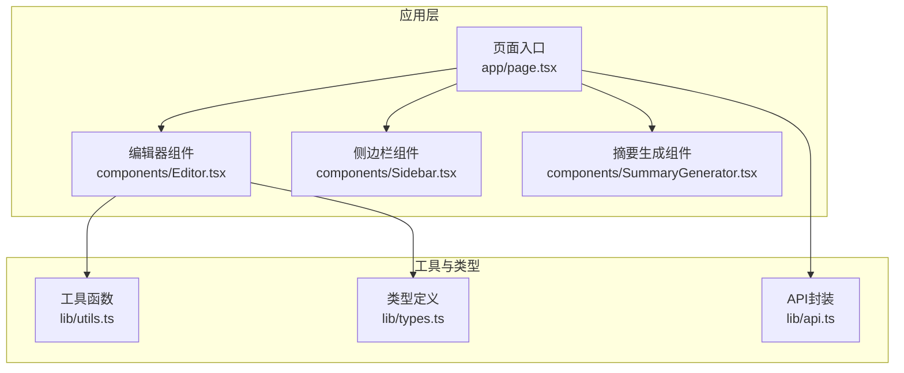

图表来源
- [app/page.tsx](file://app/page.tsx#L1-L208)
- [components/Editor.tsx](file://components/Editor.tsx#L1-L456)
- [lib/utils.ts](file://lib/utils.ts#L1-L168)
- [lib/types.ts](file://lib/types.ts#L1-L34)
- [lib/api.ts](file://lib/api.ts#L1-L56)

章节来源
- [app/page.tsx](file://app/page.tsx#L1-L208)
- [components/Editor.tsx](file://components/Editor.tsx#L1-L456)
- [lib/utils.ts](file://lib/utils.ts#L1-L168)
- [lib/types.ts](file://lib/types.ts#L1-L34)
- [lib/api.ts](file://lib/api.ts#L1-L56)

## 核心组件
- 组件职责
  - 将日志内容解析为块（blocks），支持标题、段落、待办三种类型
  - 提供标题级别切换菜单、待办复选框交互
  - 支持从上一篇日志导入未完成任务
  - 实时自动保存（防抖 800ms），并显示保存状态
  - 键盘快捷键处理与文本域自适应高度
  - 通过 props 与父组件通信（更新、删除）

- 关键状态
  - blocks：编辑器块数组，每个块含 id、type、content、checked
  - title：日志标题
  - focusId：当前需要聚焦的块 id
  - isSaving：保存中状态
  - headingMenuOpen：当前打开的标题菜单对应的块 id
  - isLocalChange：引用型布尔值，标记是否为本地用户输入导致的变更（用于防抖与保存节流）
  - lastLogId：最近一次切换的日志 id，用于仅在切换日志时初始化 blocks/title

- Props 接口
  - log: 当前日志条目
  - previousLog?: 上一条日志条目（用于导入未完成任务）
  - onUpdate: 父组件提供的更新回调，接收完整日志对象
  - onDelete: 父组件提供的删除回调，接收日志 id

章节来源
- [components/Editor.tsx](file://components/Editor.tsx#L14-L21)
- [components/Editor.tsx](file://components/Editor.tsx#L22-L31)
- [lib/types.ts](file://lib/types.ts#L1-L34)
- [app/page.tsx](file://app/page.tsx#L184-L189)

## 架构总览
Editor 与父组件的通信路径如下：父组件 app/page.tsx 传入 log 与 previousLog，并提供 onUpdate/onDelete 回调；Editor 在用户操作触发保存时，将最新内容与标题转换为 Markdown 并调用 onUpdate；删除按钮直接调用 onDelete。

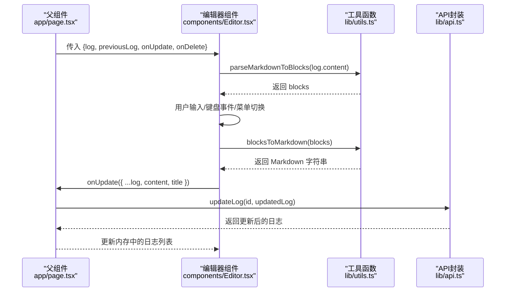

图表来源
- [app/page.tsx](file://app/page.tsx#L79-L86)
- [lib/api.ts](file://lib/api.ts#L23-L31)
- [lib/utils.ts](file://lib/utils.ts#L75-L91)
- [components/Editor.tsx](file://components/Editor.tsx#L43-L56)

## 详细组件分析

### 状态管理与初始化
- 切换日志时仅初始化 blocks 与 title，避免不必要的重渲染
- isLocalChange 作为引用型布尔值，确保防抖保存只响应用户输入导致的变更
- focusId 用于在渲染后自动聚焦到指定块

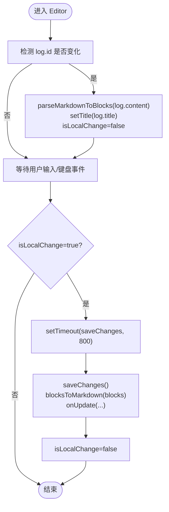

图表来源
- [components/Editor.tsx](file://components/Editor.tsx#L32-L41)
- [components/Editor.tsx](file://components/Editor.tsx#L43-L56)
- [components/Editor.tsx](file://components/Editor.tsx#L58-L64)
- [lib/utils.ts](file://lib/utils.ts#L75-L91)

章节来源
- [components/Editor.tsx](file://components/Editor.tsx#L32-L41)
- [components/Editor.tsx](file://components/Editor.tsx#L43-L56)
- [components/Editor.tsx](file://components/Editor.tsx#L58-L64)

### 标题级别切换菜单
- 点击标题左侧图标弹出菜单，支持切换到 H1/H2/H3 或降级为正文
- 点击外部区域关闭菜单
- 菜单状态由 headingMenuOpen 与 menuRef 协同控制

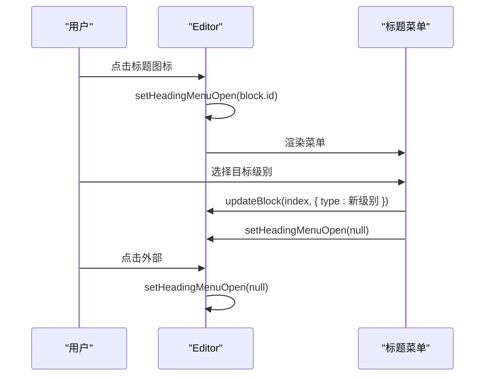

图表来源
- [components/Editor.tsx](file://components/Editor.tsx#L311-L379)
- [components/Editor.tsx](file://components/Editor.tsx#L331-L378)
- [components/Editor.tsx](file://components/Editor.tsx#L78-L87)

章节来源
- [components/Editor.tsx](file://components/Editor.tsx#L311-L379)
- [components/Editor.tsx](file://components/Editor.tsx#L78-L87)

### 待办事项复选框交互
- 点击复选框切换 checked 状态
- 根据状态应用样式与删除线效果

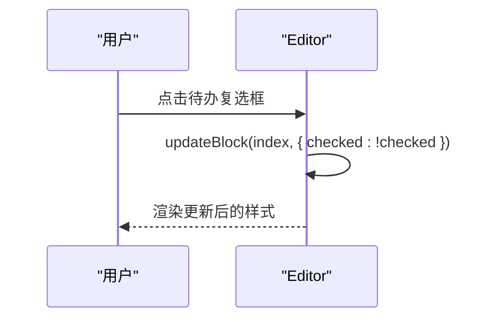

图表来源
- [components/Editor.tsx](file://components/Editor.tsx#L384-L397)

章节来源
- [components/Editor.tsx](file://components/Editor.tsx#L384-L397)

### 自动保存与防抖
- isLocalChange 为 true 时，800ms 后执行 saveChanges
- saveChanges 将 blocks 转换为 Markdown，若内容或标题发生变化则调用 onUpdate
- 保存完成后重置 isLocalChange

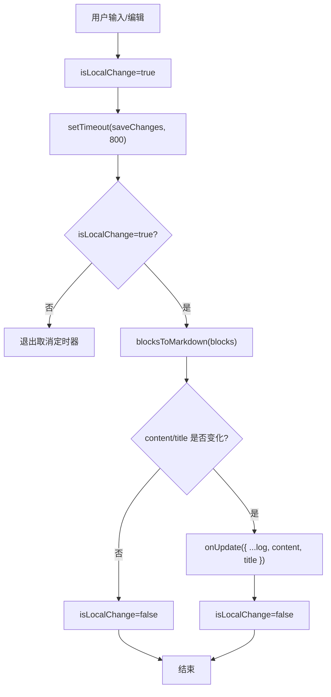

图表来源
- [components/Editor.tsx](file://components/Editor.tsx#L43-L56)
- [components/Editor.tsx](file://components/Editor.tsx#L58-L64)
- [lib/utils.ts](file://lib/utils.ts#L75-L91)

章节来源
- [components/Editor.tsx](file://components/Editor.tsx#L43-L56)
- [components/Editor.tsx](file://components/Editor.tsx#L58-L64)
- [lib/utils.ts](file://lib/utils.ts#L75-L91)

### 从上一篇日志导入未完成任务
- 调用 extractUnfinishedTasks(previousLog.content) 提取未完成任务（含上级标题上下文）
- 若无未完成任务，给出提示
- 插入策略：
  - 移除末尾空段落（若存在）
  - 添加分隔标题（包含上一条日志的创建时间）
  - 追加提取到的块集合

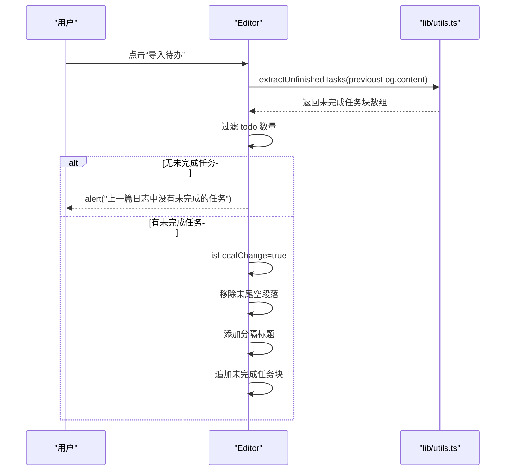

图表来源
- [components/Editor.tsx](file://components/Editor.tsx#L89-L117)
- [lib/utils.ts](file://lib/utils.ts#L93-L146)

章节来源
- [components/Editor.tsx](file://components/Editor.tsx#L89-L117)
- [lib/utils.ts](file://lib/utils.ts#L93-L146)

### 键盘事件处理（Enter、Backspace、ArrowUp/Down）
- Enter
  - 空待办转为段落
  - 空标题降级为段落
  - 其他情况下在当前块后插入同类型块（todo 后续继续 todo，标题后创建段落）
- Backspace
  - 空块时删除块或降级标题级别（H1→H2→H3→段落）
- ArrowUp/ArrowDown
  - 在相邻块之间移动焦点

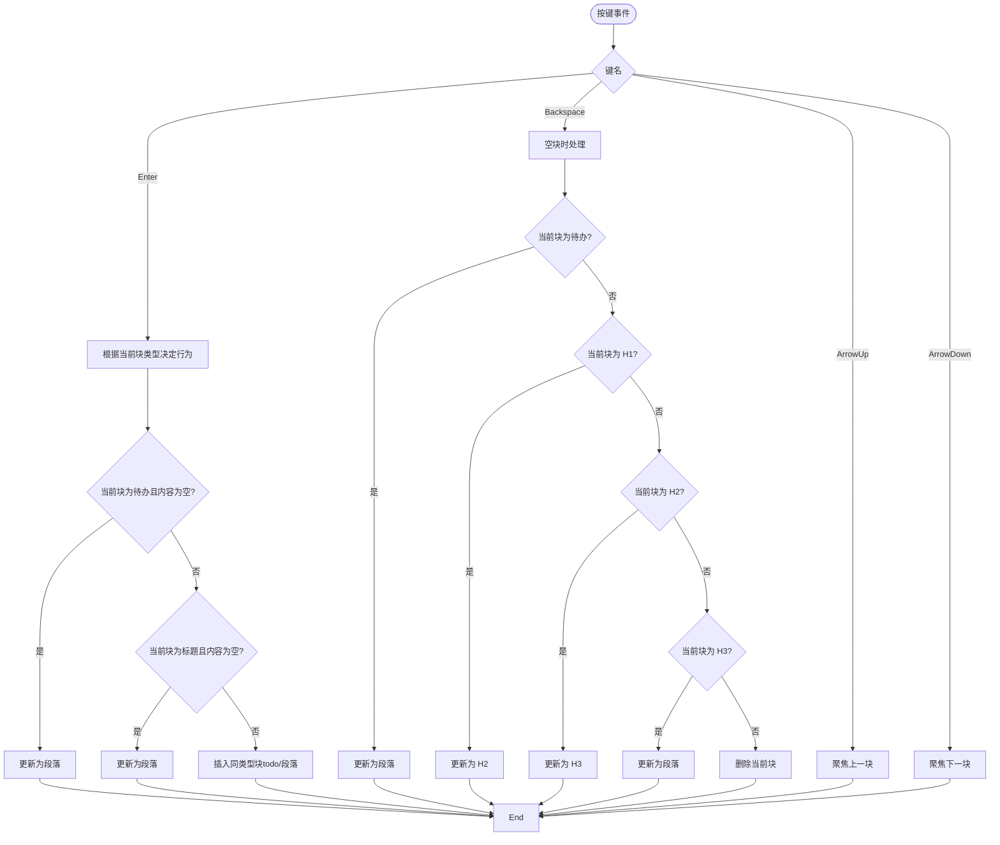

图表来源
- [components/Editor.tsx](file://components/Editor.tsx#L148-L191)
- [components/Editor.tsx](file://components/Editor.tsx#L181-L191)

章节来源
- [components/Editor.tsx](file://components/Editor.tsx#L148-L191)

### 文本区域自适应高度
- 输入时动态计算 scrollHeight 并设置 style.height
- 首次渲染时遍历所有块，同步调整 textarea 高度
- 标题块设置最小高度以保证可读性

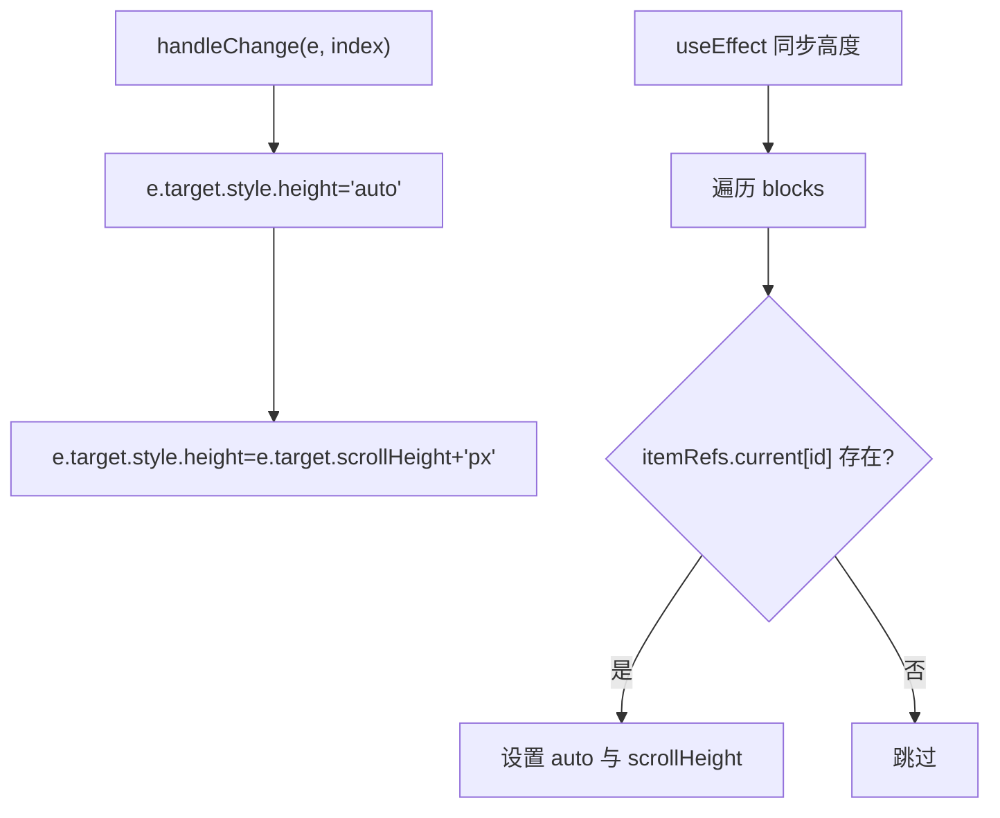

图表来源
- [components/Editor.tsx](file://components/Editor.tsx#L194-L204)
- [components/Editor.tsx](file://components/Editor.tsx#L231-L239)
- [components/Editor.tsx](file://components/Editor.tsx#L412-L422)

章节来源
- [components/Editor.tsx](file://components/Editor.tsx#L194-L204)
- [components/Editor.tsx](file://components/Editor.tsx#L231-L239)
- [components/Editor.tsx](file://components/Editor.tsx#L412-L422)

### itemRefs 引用对象与聚焦管理
- itemRefs 为块 id 到 textarea 的映射，用于跨渲染周期保持对 DOM 的引用
- focusId 与 useEffect 协作，在渲染后自动聚焦到对应块
- 支持键盘上下移动焦点

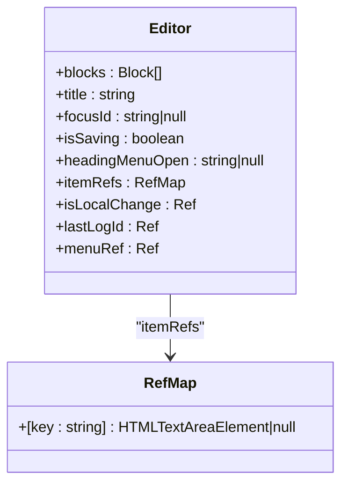

图表来源
- [components/Editor.tsx](file://components/Editor.tsx#L22-L31)
- [components/Editor.tsx](file://components/Editor.tsx#L66-L76)
- [components/Editor.tsx](file://components/Editor.tsx#L181-L191)

章节来源
- [components/Editor.tsx](file://components/Editor.tsx#L22-L31)
- [components/Editor.tsx](file://components/Editor.tsx#L66-L76)
- [components/Editor.tsx](file://components/Editor.tsx#L181-L191)

### 组件 Props 与父组件通信
- Props
  - log: 当前日志条目（包含 id、title、content 等）
  - previousLog?: 上一条日志条目（可选）
  - onUpdate: 更新日志的回调
  - onDelete: 删除日志的回调
- 父组件 app/page.tsx
  - 通过 getPreviousLog() 计算上一条日志
  - 提供 handleUpdateLog 与 handleDeleteLog 实现 onUpdate/onDelete
  - 调用 lib/api.ts 完成网络请求

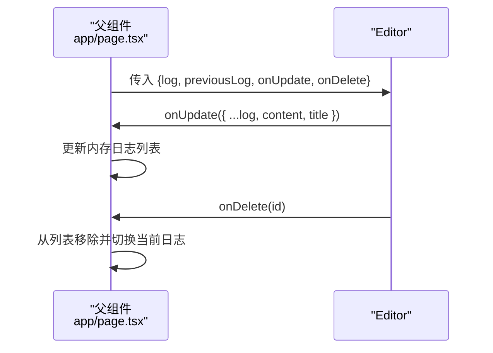

图表来源
- [app/page.tsx](file://app/page.tsx#L184-L189)
- [app/page.tsx](file://app/page.tsx#L79-L86)
- [app/page.tsx](file://app/page.tsx#L88-L103)
- [lib/api.ts](file://lib/api.ts#L23-L31)
- [lib/api.ts](file://lib/api.ts#L34-L40)

章节来源
- [app/page.tsx](file://app/page.tsx#L184-L189)
- [app/page.tsx](file://app/page.tsx#L79-L86)
- [app/page.tsx](file://app/page.tsx#L88-L103)
- [lib/api.ts](file://lib/api.ts#L23-L31)
- [lib/api.ts](file://lib/api.ts#L34-L40)

## 依赖分析
- 组件依赖
  - 类型定义：lib/types.ts
  - 工具函数：lib/utils.ts（parseMarkdownToBlocks、blocksToMarkdown、generateId、extractUnfinishedTasks、formatDate）
  - 父组件通信：app/page.tsx（提供 log、previousLog、onUpdate、onDelete）
  - API 封装：lib/api.ts（updateLog/deleteLog）
- 组件耦合
  - 与工具函数紧密耦合（解析/序列化、ID 生成、任务提取）
  - 与父组件通过 props 解耦，便于测试与替换
- 外部依赖
  - 图标库 lucide-react（用于标题图标、复选框、删除等）

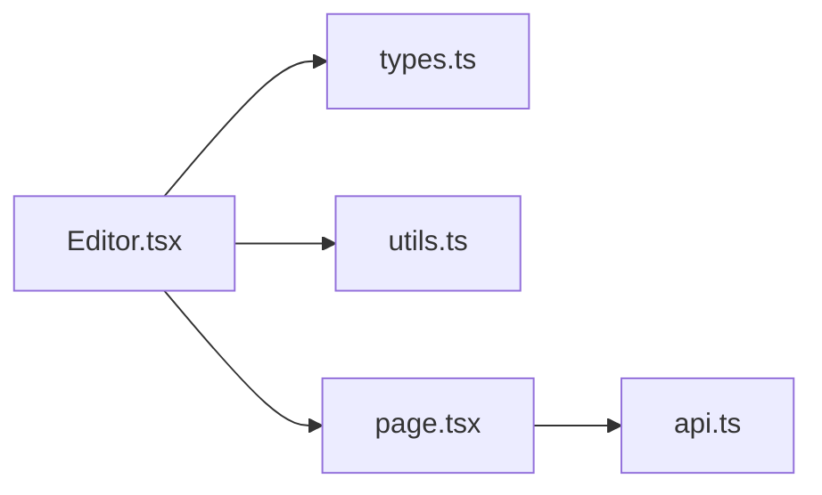

图表来源
- [components/Editor.tsx](file://components/Editor.tsx#L1-L13)
- [lib/types.ts](file://lib/types.ts#L1-L34)
- [lib/utils.ts](file://lib/utils.ts#L1-L168)
- [app/page.tsx](file://app/page.tsx#L1-L208)
- [lib/api.ts](file://lib/api.ts#L1-L56)

章节来源
- [components/Editor.tsx](file://components/Editor.tsx#L1-L13)
- [lib/types.ts](file://lib/types.ts#L1-L34)
- [lib/utils.ts](file://lib/utils.ts#L1-L168)
- [app/page.tsx](file://app/page.tsx#L1-L208)
- [lib/api.ts](file://lib/api.ts#L1-L56)

## 性能考虑
- 防抖保存（800ms）减少频繁网络请求，提升用户体验
- isLocalChange 引用型布尔值避免非用户输入导致的保存触发
- blocksToMarkdown 仅在内容或标题变化时调用 onUpdate，降低无效更新
- 自适应高度按需计算，避免全量重排
- 仅在切换日志时初始化 blocks/title，避免重复解析

## 故障排查指南
- 无法保存
  - 检查 isLocalChange 是否被正确置位（用户输入会置位）
  - 确认 saveChanges 是否被定时器触发（800ms）
  - 确认 onUpdate 回调是否正常调用
- 标题菜单不关闭
  - 检查 headingMenuOpen 与 menuRef 的协作逻辑
  - 确认点击外部事件监听是否注册与清理
- 导入未完成任务无效
  - 确认 previousLog 是否存在
  - 检查 extractUnfinishedTasks 是否返回非空结果
  - 确认插入分隔标题与追加块的逻辑
- 键盘事件异常
  - 检查 handleKeyDown 中的分支逻辑（Enter/Backspace/ArrowUp/Down）
  - 确认空块处理与类型降级逻辑
- 文本域高度不更新
  - 检查 handleChange 中的高度重置与计算
  - 确认首次渲染 useEffect 是否遍历所有块

章节来源
- [components/Editor.tsx](file://components/Editor.tsx#L43-L56)
- [components/Editor.tsx](file://components/Editor.tsx#L58-L64)
- [components/Editor.tsx](file://components/Editor.tsx#L78-L87)
- [components/Editor.tsx](file://components/Editor.tsx#L89-L117)
- [components/Editor.tsx](file://components/Editor.tsx#L148-L191)
- [components/Editor.tsx](file://components/Editor.tsx#L194-L204)
- [components/Editor.tsx](file://components/Editor.tsx#L231-L239)

## 结论
Editor 组件通过清晰的状态管理、完善的键盘交互与防抖保存机制，提供了流畅的 Markdown 编辑体验。其与父组件的解耦设计便于扩展与维护；工具函数的模块化提升了可测试性与复用性。导入未完成任务的功能增强了工作连续性，整体架构简洁而实用。

## 附录
- 工具函数要点
  - parseMarkdownToBlocks：按行解析为块，支持 H1/H2/H3、待办、普通段落
  - blocksToMarkdown：将块序列化为 Markdown
  - extractUnfinishedTasks：提取未完成任务并保留上级标题上下文
  - generateId：生成唯一块 id
  - formatDate：中文日期格式化

章节来源
- [lib/utils.ts](file://lib/utils.ts#L8-L91)
- [lib/utils.ts](file://lib/utils.ts#L93-L146)
- [lib/utils.ts](file://lib/utils.ts#L1-L7)
- [lib/utils.ts](file://lib/utils.ts#L148-L168)