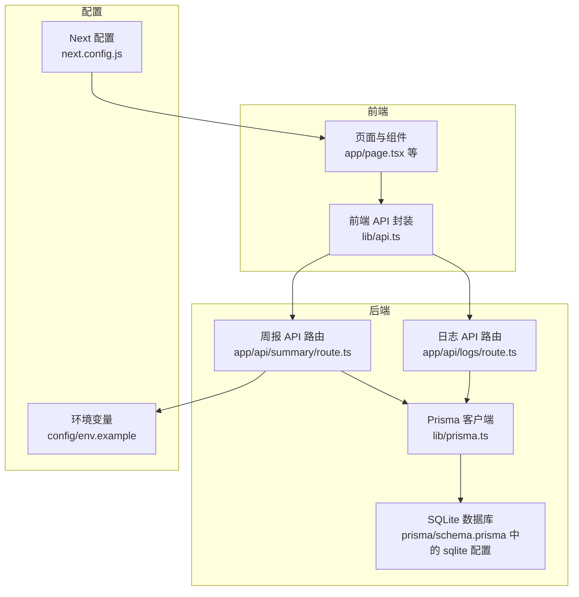
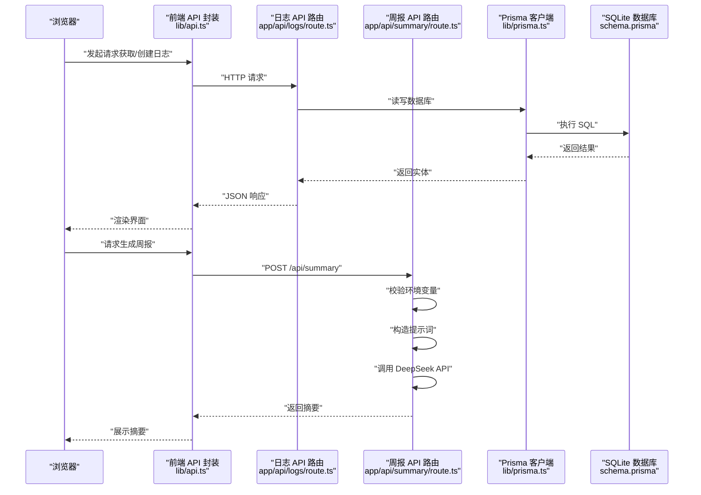
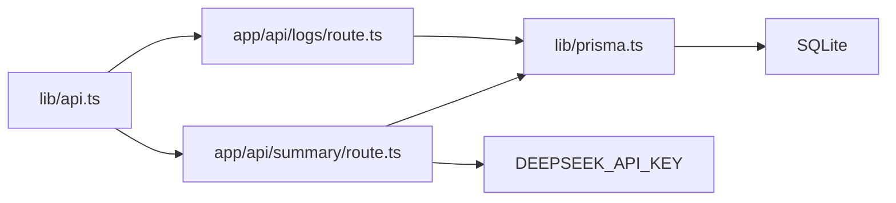

# 开发环境搭建

<cite>
**本文引用的文件**
- [package.json](file://package.json)
- [README.md](file://README.md)
- [config/env.example](file://config/env.example)
- [prisma/schema.prisma](file://prisma/schema.prisma)
- [lib/prisma.ts](file://lib/prisma.ts)
- [lib/api.ts](file://lib/api.ts)
- [app/api/logs/route.ts](file://app/api/logs/route.ts)
- [app/api/summary/route.ts](file://app/api/summary/route.ts)
- [next.config.js](file://next.config.js)
</cite>

## 目录
1. [简介](#简介)
2. [项目结构](#项目结构)
3. [核心组件](#核心组件)
4. [架构总览](#架构总览)
5. [详细组件分析](#详细组件分析)
6. [依赖分析](#依赖分析)
7. [性能注意事项](#性能注意事项)
8. [故障排查指南](#故障排查指南)
9. [结论](#结论)
10. [附录](#附录)

## 简介
本指南面向首次接触项目的开发者，提供从零开始搭建开发环境的完整流程，包括克隆仓库、安装依赖、配置环境变量、初始化数据库、启动开发服务器以及常见问题排查。目标是让新手也能顺利在本地运行本项目。

## 项目结构
该项目基于 Next.js 构建，采用 App Router 结构，配合 Prisma 进行 SQLite 数据库存取，前端通过 API 路由与后端交互，同时通过环境变量接入 DeepSeek AI 服务。

图表来源
- [lib/api.ts](file://lib/api.ts#L1-L56)
- [app/api/logs/route.ts](file://app/api/logs/route.ts#L1-L38)
- [app/api/summary/route.ts](file://app/api/summary/route.ts#L1-L78)
- [lib/prisma.ts](file://lib/prisma.ts#L1-L12)
- [prisma/schema.prisma](file://prisma/schema.prisma#L1-L26)
- [config/env.example](file://config/env.example#L1-L7)
- [next.config.js](file://next.config.js#L1-L8)

章节来源
- [README.md](file://README.md#L1-L64)
- [package.json](file://package.json#L1-L30)

## 核心组件
- 依赖管理与脚本
  - 使用 npm 管理依赖与脚本，包含开发、构建、预览、类型检查、数据库推送与 Studio 等命令。
- 数据库与 ORM
  - 使用 Prisma 管理 SQLite 数据库，模型定义在 schema.prisma 中，默认数据库文件位于项目根目录。
- API 层
  - Next.js App Router 的 API 路由负责处理日志查询、创建与周报生成；前端通过 lib/api.ts 发起请求。
- 环境变量
  - DeepSeek API 密钥需通过环境变量注入，用于调用外部 AI 接口。
- Next.js 配置
  - 基础配置启用严格模式，便于开发阶段发现潜在问题。

章节来源
- [package.json](file://package.json#L1-L30)
- [prisma/schema.prisma](file://prisma/schema.prisma#L1-L26)
- [lib/prisma.ts](file://lib/prisma.ts#L1-L12)
- [lib/api.ts](file://lib/api.ts#L1-L56)
- [app/api/logs/route.ts](file://app/api/logs/route.ts#L1-L38)
- [app/api/summary/route.ts](file://app/api/summary/route.ts#L1-L78)
- [config/env.example](file://config/env.example#L1-L7)
- [next.config.js](file://next.config.js#L1-L8)

## 架构总览
下面的时序图展示了从浏览器到数据库的整体调用链路，包括日志 CRUD 与周报生成两个主流程。

图表来源
- [lib/api.ts](file://lib/api.ts#L1-L56)
- [app/api/logs/route.ts](file://app/api/logs/route.ts#L1-L38)
- [app/api/summary/route.ts](file://app/api/summary/route.ts#L1-L78)
- [lib/prisma.ts](file://lib/prisma.ts#L1-L12)
- [prisma/schema.prisma](file://prisma/schema.prisma#L1-L26)

## 详细组件分析

### 依赖与脚本
- 关键脚本
  - 开发：启动 Next.js 开发服务器。
  - 构建：先生成 Prisma 客户端再进行构建。
  - 预览：启动生产服务器。
  - 类型检查：运行 Lint。
  - 数据库：推送数据库变更或打开 Studio。
- 依赖
  - 运行时：Next.js、React、@prisma/client、Lucide React。
  - 开发时：TypeScript、Prisma、TailwindCSS、PostCSS、Autoprefixer。

章节来源
- [package.json](file://package.json#L1-L30)

### 数据库与 Prisma
- 数据源
  - Provider：SQLite。
  - 数据库文件：默认位于项目根目录下的 dev.db 文件。
- 模型
  - LogEntry：包含基础字段（主键、创建/更新时间、状态、创建者 ID）与业务字段（标题、内容）。
- 客户端
  - 通过 lib/prisma.ts 导出单例客户端，避免开发模式下重复实例化。

章节来源
- [prisma/schema.prisma](file://prisma/schema.prisma#L1-L26)
- [lib/prisma.ts](file://lib/prisma.ts#L1-L12)

### API 路由与前端封装
- 日志 API
  - GET：按创建时间倒序返回状态正常的日志列表。
  - POST：接收标题、内容与可选创建者 ID，创建新日志。
- 周报 API
  - 校验 DeepSeek API 密钥是否存在。
  - 对传入日志按创建时间排序，拼接上下文提示词。
  - 调用 DeepSeek Chat Completions 接口生成摘要。
- 前端封装
  - 提供获取日志、创建日志、更新日志、删除日志（软删除）、生成周报摘要等方法。

章节来源
- [app/api/logs/route.ts](file://app/api/logs/route.ts#L1-L38)
- [app/api/summary/route.ts](file://app/api/summary/route.ts#L1-L78)
- [lib/api.ts](file://lib/api.ts#L1-L56)

### 环境变量与配置
- DeepSeek API 密钥
  - 必须在环境变量中配置，否则周报功能无法使用。
- Next.js 配置
  - 启用严格模式，有助于早期发现问题。

章节来源
- [config/env.example](file://config/env.example#L1-L7)
- [app/api/summary/route.ts](file://app/api/summary/route.ts#L1-L20)
- [next.config.js](file://next.config.js#L1-L8)

## 依赖分析
- 内部依赖
  - 前端 API 封装依赖 Next.js App Router 的 API 路由。
  - API 路由依赖 Prisma 客户端与 SQLite 数据库。
  - 周报路由依赖 DeepSeek API。
- 外部依赖
  - Next.js 生态（React、TypeScript、TailwindCSS、PostCSS、Autoprefixer）。
  - Prisma 与 @prisma/client。
  - Lucide React 图标库。

图表来源
- [lib/api.ts](file://lib/api.ts#L1-L56)
- [app/api/logs/route.ts](file://app/api/logs/route.ts#L1-L38)
- [app/api/summary/route.ts](file://app/api/summary/route.ts#L1-L78)
- [lib/prisma.ts](file://lib/prisma.ts#L1-L12)

章节来源
- [package.json](file://package.json#L1-L30)

## 性能注意事项
- 开发模式下使用单例 Prisma 客户端，避免重复连接带来的开销。
- 前端请求尽量合并与去抖，减少不必要的网络往返。
- SQLite 适合本地开发与小规模数据，若数据量增长较快，建议评估迁移至更合适的数据库方案。

## 故障排查指南

### 1. 端口占用
- 现象
  - 启动开发服务器时报端口被占用。
- 处理
  - 修改 Next.js 端口或关闭占用端口的进程。
  - 检查系统是否有其他 Node 进程在监听相同端口。

章节来源
- [next.config.js](file://next.config.js#L1-L8)

### 2. 依赖安装失败或冲突
- 现象
  - 执行安装命令时出现版本冲突、权限问题或网络超时。
- 处理
  - 清理缓存后重试安装。
  - 确保 Node.js 版本满足要求。
  - 若使用代理，请正确配置 npm/yarn 的代理设置。
  - 如遇权限问题，避免使用 sudo，优先修复目录权限。

章节来源
- [package.json](file://package.json#L1-L30)
- [README.md](file://README.md#L14-L20)

### 3. Prisma 初始化失败
- 现象
  - 执行数据库推送或生成客户端失败。
- 处理
  - 确认已安装 Prisma CLI 并具备相应权限。
  - 检查 schema.prisma 中的数据源配置是否正确（Provider 与数据库文件路径）。
  - 确保数据库文件所在目录存在且可写。
  - 若之前有旧的数据库文件，尝试删除后重新推送。
  - 如需可视化调试，可使用 Prisma Studio。

章节来源
- [prisma/schema.prisma](file://prisma/schema.prisma#L1-L26)
- [package.json](file://package.json#L1-L30)

### 4. 环境变量未生效
- 现象
  - 周报功能报错提示未配置 DeepSeek API 密钥。
- 处理
  - 复制示例文件为本地环境文件并填入密钥。
  - 确认密钥名称与代码中读取的一致。
  - 重启开发服务器使新环境变量生效。

章节来源
- [config/env.example](file://config/env.example#L1-L7)
- [app/api/summary/route.ts](file://app/api/summary/route.ts#L1-L20)

### 5. API 调用失败
- 现象
  - 前端调用日志或周报接口返回错误。
- 处理
  - 检查 API 路由是否正确响应（状态码与错误信息）。
  - 确认数据库已初始化且模型可用。
  - 对于周报接口，确认 DeepSeek API 密钥有效且网络可达。

章节来源
- [lib/api.ts](file://lib/api.ts#L1-L56)
- [app/api/logs/route.ts](file://app/api/logs/route.ts#L1-L38)
- [app/api/summary/route.ts](file://app/api/summary/route.ts#L1-L78)

## 结论
按照本指南完成克隆、安装、配置与初始化后，即可在本地成功运行本项目。开发过程中遇到问题时，可依据“故障排查指南”逐项定位并解决。随着项目演进，建议持续关注依赖版本与数据库迁移策略，确保开发体验与数据一致性。

## 附录

### 快速操作清单
- 克隆仓库后安装依赖。
- 初始化数据库。
- 配置环境变量（DeepSeek API 密钥）。
- 启动开发服务器。

章节来源
- [README.md](file://README.md#L19-L34)