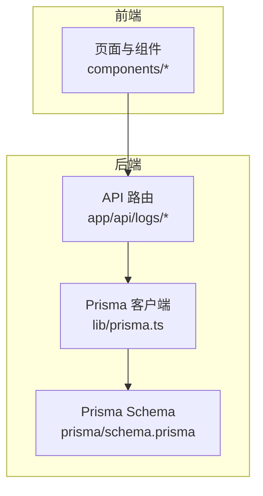
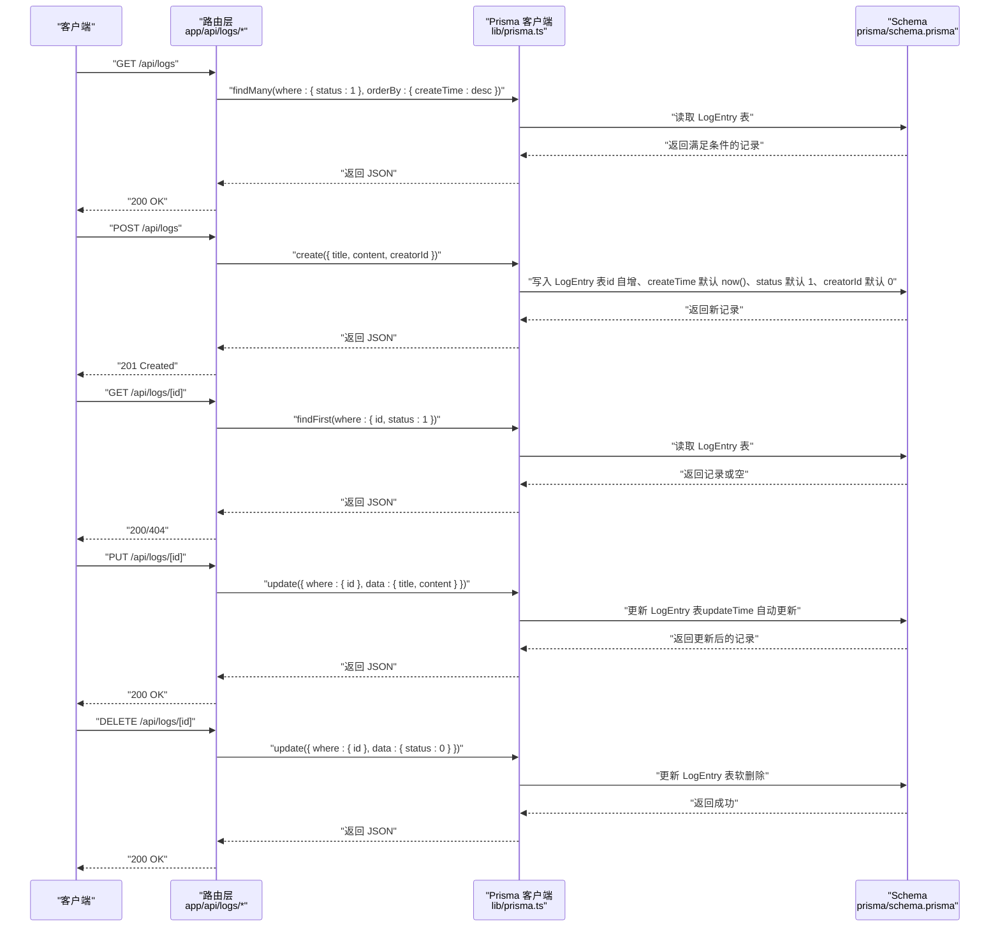
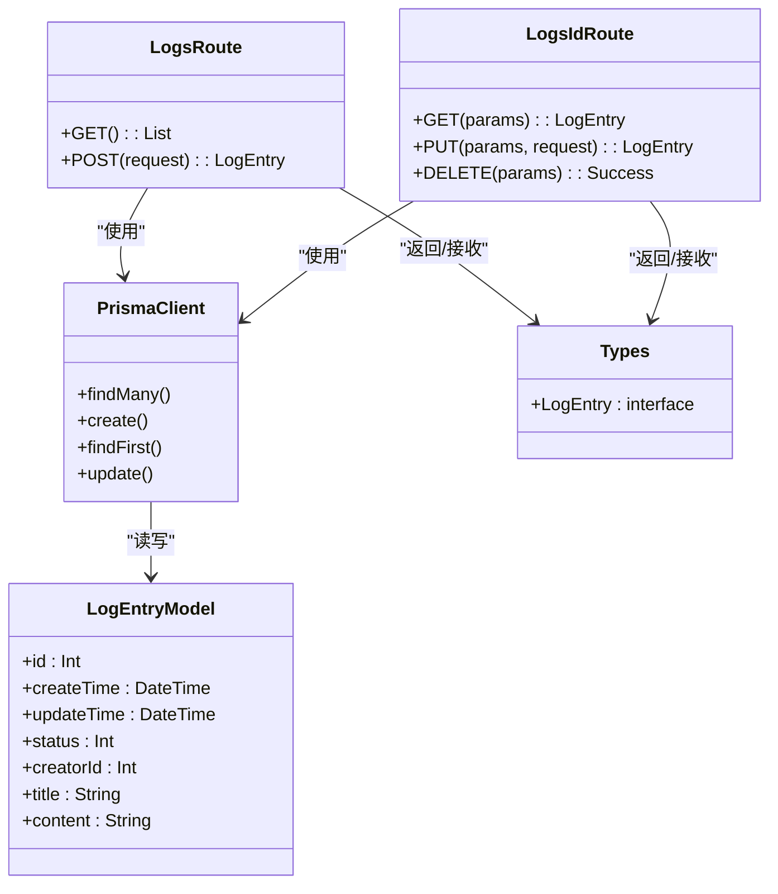

# 字段说明

<cite>
**本文引用的文件**
- [prisma/schema.prisma](file://prisma/schema.prisma)
- [app/api/logs/route.ts](file://app/api/logs/route.ts)
- [app/api/logs/[id]/route.ts](file://app/api/logs/[id]/route.ts)
- [lib/prisma.ts](file://lib/prisma.ts)
- [lib/types.ts](file://lib/types.ts)
- [config/数据库表规范.md](file://config/数据库表规范.md)
- [README.md](file://README.md)
</cite>

## 目录
1. [简介](#简介)
2. [项目结构](#项目结构)
3. [核心组件](#核心组件)
4. [架构总览](#架构总览)
5. [详细字段分析](#详细字段分析)
6. [依赖关系分析](#依赖关系分析)
7. [性能考量](#性能考量)
8. [故障排查指南](#故障排查指南)
9. [结论](#结论)

## 简介
本文件围绕 LogEntry 模型的字段进行技术实现与业务语义的深入解析，重点覆盖：
- id 作为自增主键在 Prisma 中的声明方式
- createTime 与 updateTime 的时间戳行为（@default(now()) 与 @updatedAt）
- status 字段在 API 中的使用逻辑（GET 查询时过滤 status=1，DELETE 时更新为 0）
- creatorId 的默认值处理
- title 与 content 的非空约束及前后端交互中的处理
- 结合 API 路由代码展示字段在 CRUD 操作中的流转过程
- 引用数据库规范文档说明命名一致性要求

## 项目结构
该项目采用 Next.js App Router + Prisma 的前后端一体化架构，数据库使用 SQLite。LogEntry 模型位于 Prisma Schema 中，API 路由位于 app/api/logs 下，Prisma 客户端通过 lib/prisma.ts 提供全局实例。

图表来源
- [app/api/logs/route.ts](file://app/api/logs/route.ts#L1-L38)
- [app/api/logs/[id]/route.ts](file://app/api/logs/[id]/route.ts#L1-L69)
- [lib/prisma.ts](file://lib/prisma.ts#L1-L12)
- [prisma/schema.prisma](file://prisma/schema.prisma#L1-L26)

章节来源
- [README.md](file://README.md#L38-L50)

## 核心组件
- LogEntry 模型：定义了 id、createTime、updateTime、status、creatorId、title、content 等字段，并通过 Prisma 注解声明主键、默认值与时间戳行为。
- API 路由：
  - 列表与创建：app/api/logs/route.ts
  - 单条读取、更新、删除：app/api/logs/[id]/route.ts
- Prisma 客户端：lib/prisma.ts 提供全局单例，避免重复实例化。
- 类型定义：lib/types.ts 定义 LogEntry 接口，统一前后端交互的数据形状。

章节来源
- [prisma/schema.prisma](file://prisma/schema.prisma#L13-L25)
- [app/api/logs/route.ts](file://app/api/logs/route.ts#L1-L38)
- [app/api/logs/[id]/route.ts](file://app/api/logs/[id]/route.ts#L1-L69)
- [lib/prisma.ts](file://lib/prisma.ts#L1-L12)
- [lib/types.ts](file://lib/types.ts#L1-L10)

## 架构总览
下图展示了 LogEntry 字段在 CRUD 流程中的流转路径，以及 Prisma Schema 对字段行为的约束如何影响 API 层的实现。

图表来源
- [app/api/logs/route.ts](file://app/api/logs/route.ts#L1-L38)
- [app/api/logs/[id]/route.ts](file://app/api/logs/[id]/route.ts#L1-L69)
- [lib/prisma.ts](file://lib/prisma.ts#L1-L12)
- [prisma/schema.prisma](file://prisma/schema.prisma#L13-L25)

## 详细字段分析

### id：自增主键
- Prisma 声明方式：在模型中以 @id 和 @default(autoincrement()) 声明自增主键。
- 业务语义：唯一标识每条日志记录，用于路由参数 [id] 与查询条件。
- 前后端交互：API 路由通过 parseInt(params.id) 将字符串转换为整数，确保与数据库字段类型一致。

章节来源
- [prisma/schema.prisma](file://prisma/schema.prisma#L16-L16)
- [app/api/logs/[id]/route.ts](file://app/api/logs/[id]/route.ts#L10-L14)

### createTime：创建时间
- Prisma 声明方式：@default(now())，表示插入时自动设置为当前时间。
- 业务语义：记录日志创建时刻，用于排序与审计。
- API 行为：创建接口不显式传入该字段，由数据库默认值填充；查询时按 createTime 降序排列。

章节来源
- [prisma/schema.prisma](file://prisma/schema.prisma#L17-L17)
- [app/api/logs/route.ts](file://app/api/logs/route.ts#L24-L30)
- [app/api/logs/route.ts](file://app/api/logs/route.ts#L7-L11)

### updateTime：更新时间
- Prisma 声明方式：@updatedAt，表示每次更新记录时自动刷新为当前时间。
- 业务语义：记录最近一次修改时间，便于追踪变更。
- API 行为：PUT 更新接口仅更新 title/content，updateTime 由 Prisma 自动更新。

章节来源
- [prisma/schema.prisma](file://prisma/schema.prisma#L18-L18)
- [app/api/logs/[id]/route.ts](file://app/api/logs/[id]/route.ts#L37-L43)

### status：状态（软删除）
- Prisma 声明方式：@default(1)，初始值为 1。
- 业务语义：0 表示“已删除”（软删除），1 表示“正常”。规范文档定义了状态含义。
- API 行为：
  - GET 列表：仅查询 status=1 的记录。
  - GET 单条：查询时同时校验 id 与 status=1。
  - DELETE：将 status 更新为 0，实现软删除。
- 前后端交互：前端删除按钮调用 DELETE 路由，后端返回成功响应。

章节来源
- [prisma/schema.prisma](file://prisma/schema.prisma#L19-L19)
- [config/数据库表规范.md](file://config/数据库表规范.md#L38-L44)
- [app/api/logs/route.ts](file://app/api/logs/route.ts#L7-L11)
- [app/api/logs/[id]/route.ts](file://app/api/logs/[id]/route.ts#L10-L14)
- [app/api/logs/[id]/route.ts](file://app/api/logs/[id]/route.ts#L58-L63)

### creatorId：创建者标识
- Prisma 声明方式：@default(0)，默认值为 0。
- 业务语义：记录创建者的用户标识，便于权限与归属管理。
- API 行为：创建接口从请求体提取 creatorId，默认 0；查询时未限制 creatorId，若需按用户隔离可在路由层扩展 where 条件。
- 前后端交互：前端传入 creatorId，后端直接写入数据库。

章节来源
- [prisma/schema.prisma](file://prisma/schema.prisma#L20-L20)
- [app/api/logs/route.ts](file://app/api/logs/route.ts#L22-L29)

### title：标题
- Prisma 约束：String 类型，未声明 @default 或 @db.*，因此默认允许为空字符串或 null（取决于数据库方言与 Prisma 版本）。但前端编辑器默认值为“新日志”，后端也做了兜底处理。
- 业务语义：日志标题，用于快速识别内容。
- API 行为：
  - 创建：若未提供 title，则后端将其设为“新日志”。
  - 更新：允许更新 title。
- 前后端交互：编辑器组件提供标题输入框，保存时随其他字段一起提交到后端。

章节来源
- [prisma/schema.prisma](file://prisma/schema.prisma#L23-L23)
- [app/api/logs/route.ts](file://app/api/logs/route.ts#L24-L30)
- [components/Editor.tsx](file://components/Editor.tsx#L246-L255)

### content：内容
- Prisma 约束：String 类型，未声明 @default 或 @db.*，默认允许为空字符串或 null。
- 业务语义：日志正文内容，支持多种块类型（段落、标题、待办等）。
- API 行为：
  - 创建：若未提供 content，则后端将其设为空字符串。
  - 更新：允许更新 content。
- 前后端交互：编辑器组件将块数组序列化为 Markdown 字符串，保存时随 title 一起提交到后端。

章节来源
- [prisma/schema.prisma](file://prisma/schema.prisma#L24-L24)
- [app/api/logs/route.ts](file://app/api/logs/route.ts#L24-L30)
- [components/Editor.tsx](file://components/Editor.tsx#L43-L56)

### 命名一致性与规范
- 表名与字段名：Prisma Schema 中模型名为 LogEntry（大驼峰），字段名采用小驼峰（如 createTime、creatorId），符合规范文档的命名约定。
- 时间字段：统一使用 DateTime 类型，保证跨平台一致性。
- 状态码：规范文档对状态值 0/1 的含义进行了定义，API 层严格遵循。

章节来源
- [config/数据库表规范.md](file://config/数据库表规范.md#L31-L44)
- [prisma/schema.prisma](file://prisma/schema.prisma#L13-L25)

## 依赖关系分析
- 模型依赖：LogEntry 模型依赖 Prisma 的注解能力（@id、@default、@updatedAt、@default(now())）。
- 路由依赖：API 路由依赖 Prisma 客户端执行查询与写入。
- 类型依赖：前端组件与后端接口共享 lib/types.ts 中的 LogEntry 接口，确保数据结构一致。

图表来源
- [prisma/schema.prisma](file://prisma/schema.prisma#L13-L25)
- [app/api/logs/route.ts](file://app/api/logs/route.ts#L1-L38)
- [app/api/logs/[id]/route.ts](file://app/api/logs/[id]/route.ts#L1-L69)
- [lib/prisma.ts](file://lib/prisma.ts#L1-L12)
- [lib/types.ts](file://lib/types.ts#L1-L10)

## 性能考量
- 查询优化：列表接口按 createTime 降序返回，适合时间线浏览；若数据量增大，建议在 createTime 上建立索引（可在 Prisma Schema 中通过 @index 声明，视数据库支持情况而定）。
- 写入优化：创建与更新均走 Prisma 客户端，避免重复实例化；开发环境下通过全局单例减少资源开销。
- 软删除成本：DELETE 仅更新 status 字段，避免全表扫描与重建索引，但查询时需始终带上 status=1 条件。

## 故障排查指南
- 创建失败：检查请求体是否包含 title 与 content，后端会做兜底处理；查看数据库连接与迁移状态。
- 查询不到数据：确认 status 是否为 1；确认 id 是否正确传递；检查数据库中是否存在该记录。
- 更新失败：确认 id 是否存在且 status=1；确认请求体字段是否正确。
- 删除失败：确认 DELETE 路由是否被调用；检查数据库是否支持更新操作。

章节来源
- [app/api/logs/route.ts](file://app/api/logs/route.ts#L7-L16)
- [app/api/logs/[id]/route.ts](file://app/api/logs/[id]/route.ts#L10-L26)
- [app/api/logs/[id]/route.ts](file://app/api/logs/[id]/route.ts#L58-L68)

## 结论
LogEntry 模型通过 Prisma 注解清晰地定义了主键、时间戳与状态字段的行为，API 路由严格遵循这些规则实现了 CRUD 流程。status 字段采用软删除策略，配合规范文档中的状态定义，使系统具备良好的可维护性与一致性。title 与 content 的非空约束在后端做了安全兜底，前端编辑器提供了良好的交互体验。命名规范与类型定义进一步提升了前后端协作效率与可读性。