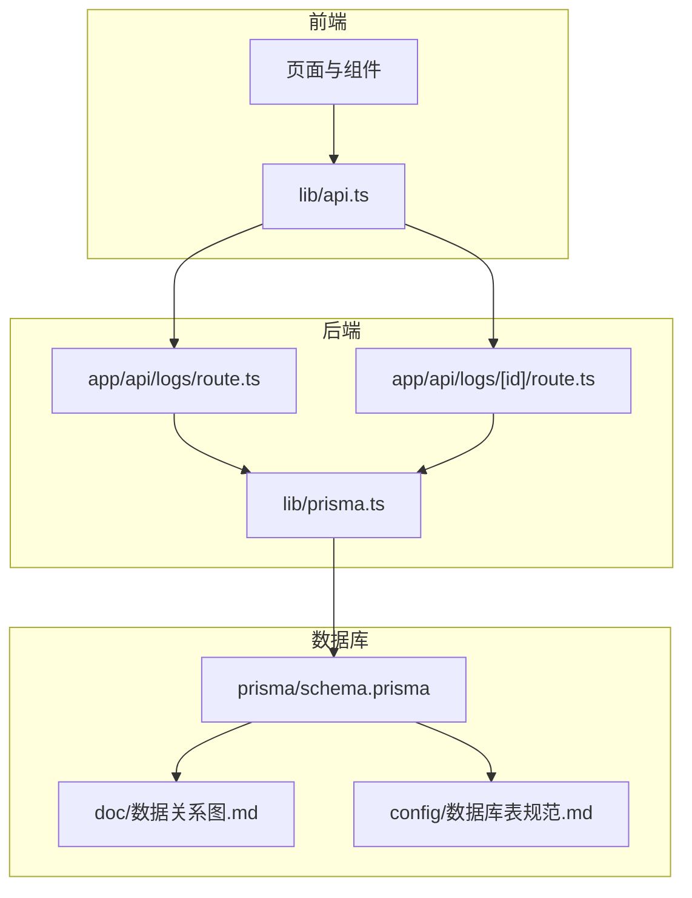
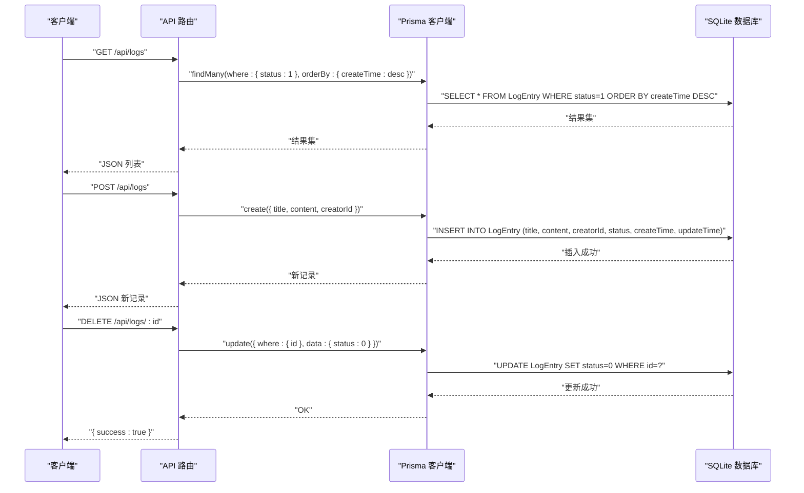
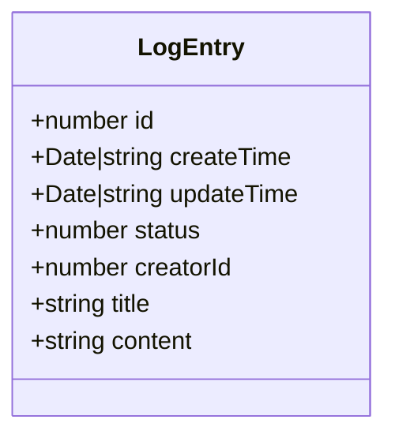
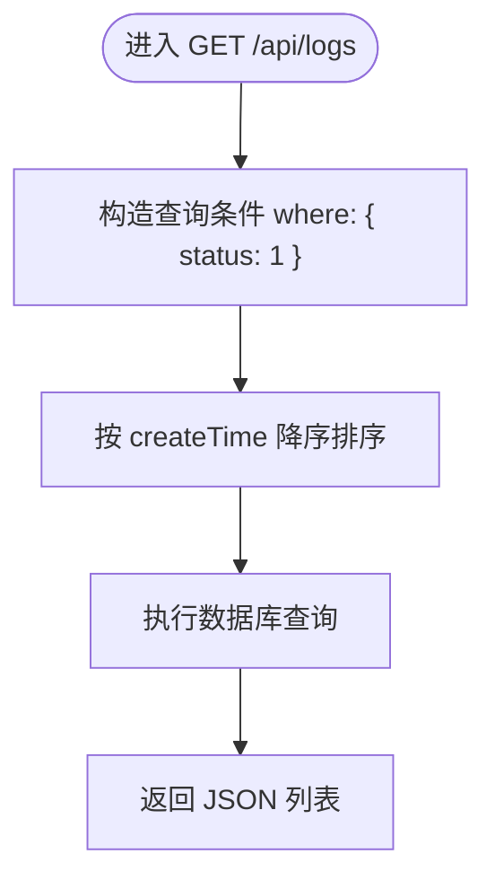
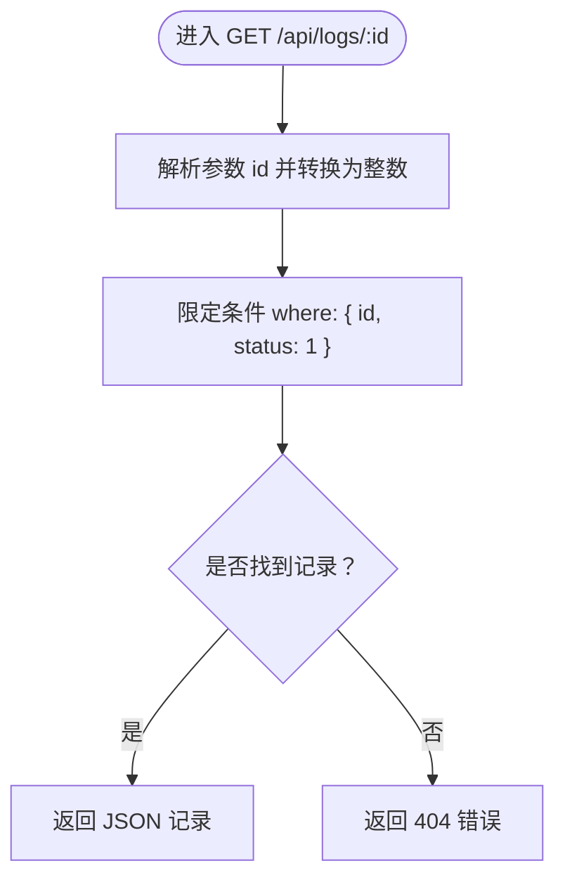
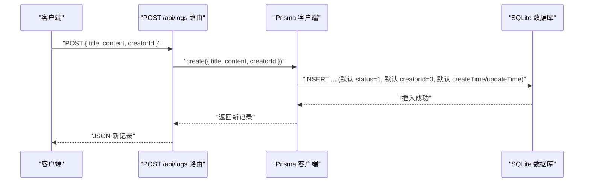
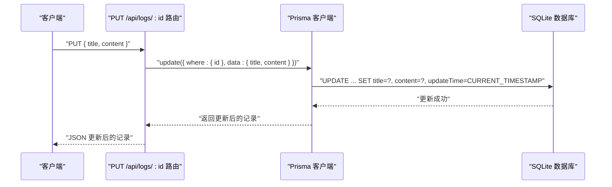
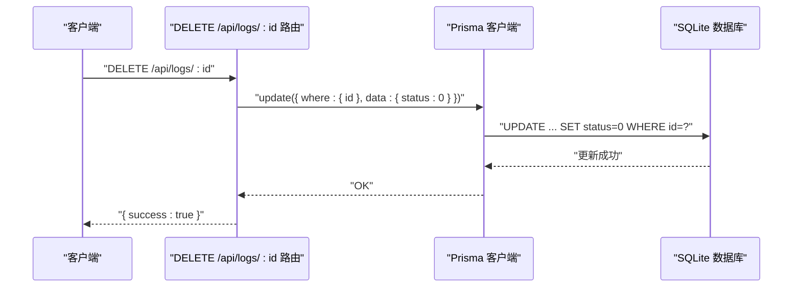
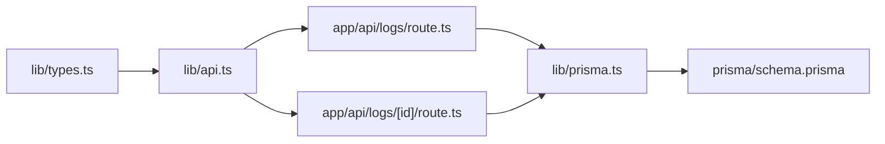

# 数据库设计

<cite>
**本文引用的文件**
- [prisma/schema.prisma](file://prisma/schema.prisma)
- [数据关系图.md](file://doc/数据关系图.md)
- [数据库表规范.md](file://config/数据库表规范.md)
- [lib/prisma.ts](file://lib/prisma.ts)
- [app/api/logs/route.ts](file://app/api/logs/route.ts)
- [app/api/logs/[id]/route.ts](file://app/api/logs/[id]/route.ts)
- [lib/types.ts](file://lib/types.ts)
- [lib/api.ts](file://lib/api.ts)
</cite>

## 目录
1. [简介](#简介)
2. [项目结构](#项目结构)
3. [核心组件](#核心组件)
4. [架构总览](#架构总览)
5. [详细组件分析](#详细组件分析)
6. [依赖分析](#依赖分析)
7. [性能考虑](#性能考虑)
8. [故障排查指南](#故障排查指南)
9. [结论](#结论)
10. [附录](#附录)

## 简介
本文件围绕 LogEntry 实体构建完整的数据模型文档，聚焦字段定义、约束与默认值、业务语义、软删除机制以及数据库初始化与迁移最佳实践。同时结合 Prisma Schema 语法展示模型定义，并通过数据关系图说明潜在扩展关系。

## 项目结构
该仓库采用前后端一体化的 Next.js 结构，数据库层由 Prisma 管理，LogEntry 是核心数据模型之一。关键位置如下：
- 数据模型定义：prisma/schema.prisma
- 数据库表规范与状态码定义：config/数据库表规范.md
- 数据关系图：doc/数据关系图.md
- API 层：app/api/logs/* 路由处理读写逻辑
- 客户端 Prisma 客户端：lib/prisma.ts
- 类型定义：lib/types.ts
- 前端 API 封装：lib/api.ts

图表来源
- [prisma/schema.prisma](file://prisma/schema.prisma#L1-L26)
- [app/api/logs/route.ts](file://app/api/logs/route.ts#L1-L38)
- [app/api/logs/[id]/route.ts](file://app/api/logs/[id]/route.ts#L1-L69)
- [lib/prisma.ts](file://lib/prisma.ts#L1-L12)
- [数据关系图.md](file://doc/数据关系图.md#L1-L31)
- [数据库表规范.md](file://config/数据库表规范.md#L1-L44)

章节来源
- [prisma/schema.prisma](file://prisma/schema.prisma#L1-L26)
- [数据关系图.md](file://doc/数据关系图.md#L1-L31)
- [数据库表规范.md](file://config/数据库表规范.md#L1-L44)

## 核心组件
本节聚焦 LogEntry 实体的字段定义、约束与默认值、业务含义与 Prisma 模型声明。

- 字段与类型
  - id：整数，主键，自增
  - createTime：日期时间，默认值为当前时间
  - updateTime：日期时间，使用 Prisma 的 @updatedAt 自动更新
  - status：整数，默认值为 1；0 表示删除（软删除），1 表示正常
  - creatorId：整数，默认值为 0
  - title：字符串，非空
  - content：字符串，非空

- 约束与默认值
  - 所有基础字段均为非空（NOT NULL）
  - createTime 默认值为 now()
  - status 默认值为 1
  - creatorId 默认值为 0
  - id 自增主键

- 业务含义
  - id：每条日志的唯一标识
  - createTime/updateTime：记录创建与最后修改时间，便于排序与审计
  - status：软删除开关，查询时默认仅返回 status=1 的记录
  - creatorId：标识创建者，便于后续权限或统计
  - title/content：日志标题与内容主体

- Prisma 模型定义（路径参考）
  - 参考：[prisma/schema.prisma](file://prisma/schema.prisma#L13-L25)

- 数据关系图（路径参考）
  - 参考：[数据关系图.md](file://doc/数据关系图.md#L5-L16)

章节来源
- [prisma/schema.prisma](file://prisma/schema.prisma#L13-L25)
- [数据关系图.md](file://doc/数据关系图.md#L5-L16)
- [数据库表规范.md](file://config/数据库表规范.md#L7-L13)

## 架构总览
LogEntry 的数据流从 API 路由进入 Prisma 客户端，再持久化到 SQLite 数据库。查询侧默认过滤 status=1 的记录，删除操作执行软删除（status=0）。

图表来源
- [app/api/logs/route.ts](file://app/api/logs/route.ts#L1-L38)
- [app/api/logs/[id]/route.ts](file://app/api/logs/[id]/route.ts#L1-L69)
- [lib/prisma.ts](file://lib/prisma.ts#L1-L12)
- [prisma/schema.prisma](file://prisma/schema.prisma#L13-L25)

## 详细组件分析

### LogEntry 数据模型类图

图表来源
- [lib/types.ts](file://lib/types.ts#L1-L10)
- [prisma/schema.prisma](file://prisma/schema.prisma#L13-L25)

章节来源
- [lib/types.ts](file://lib/types.ts#L1-L10)
- [prisma/schema.prisma](file://prisma/schema.prisma#L13-L25)

### 查询流程（仅返回正常状态）
- 全量查询：API 层在查询时显式限定 where: { status: 1 }，确保不返回已软删除的日志
- 排序：按 createTime 降序排列，便于最近日志优先展示

图表来源
- [app/api/logs/route.ts](file://app/api/logs/route.ts#L1-L16)

章节来源
- [app/api/logs/route.ts](file://app/api/logs/route.ts#L1-L16)

### 单条查询（软删除过滤）
- 单条查询时同样限定 where: { id, status: 1 }，若未找到则返回 404

图表来源
- [app/api/logs/[id]/route.ts](file://app/api/logs/[id]/route.ts#L1-L25)

章节来源
- [app/api/logs/[id]/route.ts](file://app/api/logs/[id]/route.ts#L1-L25)

### 创建流程（默认状态与默认值）
- 创建时可传入 title、content、creatorId；未传入时使用默认值
- 默认 creatorId 为 0，status 为 1，createTime 与 updateTime 由数据库/Prisma 自动生成

图表来源
- [app/api/logs/route.ts](file://app/api/logs/route.ts#L18-L38)
- [prisma/schema.prisma](file://prisma/schema.prisma#L13-L25)

章节来源
- [app/api/logs/route.ts](file://app/api/logs/route.ts#L18-L38)
- [prisma/schema.prisma](file://prisma/schema.prisma#L13-L25)

### 更新流程（标题与内容）
- 更新接口支持对 title 与 content 的部分更新，Prisma 自动维护 updateTime

图表来源
- [app/api/logs/[id]/route.ts](file://app/api/logs/[id]/route.ts#L28-L49)
- [prisma/schema.prisma](file://prisma/schema.prisma#L13-L25)

章节来源
- [app/api/logs/[id]/route.ts](file://app/api/logs/[id]/route.ts#L28-L49)
- [prisma/schema.prisma](file://prisma/schema.prisma#L13-L25)

### 删除流程（软删除）
- 删除请求将 status 更新为 0，实现软删除；查询侧默认过滤 status=1

图表来源
- [app/api/logs/[id]/route.ts](file://app/api/logs/[id]/route.ts#L52-L69)
- [prisma/schema.prisma](file://prisma/schema.prisma#L13-L25)

章节来源
- [app/api/logs/[id]/route.ts](file://app/api/logs/[id]/route.ts#L52-L69)
- [prisma/schema.prisma](file://prisma/schema.prisma#L13-L25)

### 软删除机制说明
- 状态码定义：0 表示删除，1 表示正常
- 查询默认过滤：API 层在查询时均限定 status=1，确保软删除记录不可见
- 更新时间：Prisma 的 @updatedAt 自动维护 updateTime，保证变更历史可追踪

章节来源
- [数据库表规范.md](file://config/数据库表规范.md#L37-L43)
- [app/api/logs/route.ts](file://app/api/logs/route.ts#L1-L16)
- [app/api/logs/[id]/route.ts](file://app/api/logs/[id]/route.ts#L1-L25)
- [prisma/schema.prisma](file://prisma/schema.prisma#L13-L25)

### 数据库初始化与迁移最佳实践
- 初始化
  - 使用 Prisma 管理 SQLite 开发数据库，首次运行会根据 schema.prisma 生成 dev.db
  - 参考：[prisma/schema.prisma](file://prisma/schema.prisma#L8-L11)
- 迁移
  - 本地开发：通过 Prisma CLI 生成迁移并应用
  - 生产环境：建议在 CI/CD 中执行迁移脚本，确保数据库结构与代码一致
- 版本控制
  - 将 schema.prisma 与迁移文件纳入版本控制，保持团队一致性
- 约束与默认值
  - 严格遵循规范中的默认值与约束，避免破坏现有查询逻辑
  - 参考：[数据库表规范.md](file://config/数据库表规范.md#L7-L13)

章节来源
- [prisma/schema.prisma](file://prisma/schema.prisma#L8-L11)
- [数据库表规范.md](file://config/数据库表规范.md#L7-L13)

## 依赖分析
- API 路由依赖 Prisma 客户端进行数据库访问
- Prisma 客户端在开发环境下以单例方式管理连接
- 类型定义与 API 封装为前端提供统一的数据契约

图表来源
- [lib/types.ts](file://lib/types.ts#L1-L10)
- [lib/api.ts](file://lib/api.ts#L1-L55)
- [app/api/logs/route.ts](file://app/api/logs/route.ts#L1-L38)
- [app/api/logs/[id]/route.ts](file://app/api/logs/[id]/route.ts#L1-L69)
- [lib/prisma.ts](file://lib/prisma.ts#L1-L12)
- [prisma/schema.prisma](file://prisma/schema.prisma#L13-L25)

章节来源
- [lib/types.ts](file://lib/types.ts#L1-L10)
- [lib/api.ts](file://lib/api.ts#L1-L55)
- [app/api/logs/route.ts](file://app/api/logs/route.ts#L1-L38)
- [app/api/logs/[id]/route.ts](file://app/api/logs/[id]/route.ts#L1-L69)
- [lib/prisma.ts](file://lib/prisma.ts#L1-L12)
- [prisma/schema.prisma](file://prisma/schema.prisma#L13-L25)

## 性能考虑
- 查询优化
  - 对 createTime 建立索引可提升排序与范围查询性能（建议在生产环境评估）
- 写入优化
  - 批量写入时注意事务边界，减少往返次数
- 软删除影响
  - 若未来需要统计删除数据，可在特定场景下放宽 status 过滤，但需权衡查询复杂度

## 故障排查指南
- 查询不到数据
  - 检查是否传入了正确的 id 且未被软删除（status=1）
  - 参考：[app/api/logs/[id]/route.ts](file://app/api/logs/[id]/route.ts#L1-L25)
- 创建失败
  - 检查请求体字段是否符合预期，确认 title 与 content 是否为空
  - 参考：[app/api/logs/route.ts](file://app/api/logs/route.ts#L18-L38)
- 更新失败
  - 确认 id 存在且未被软删除，检查 title 与 content 的更新是否正确
  - 参考：[app/api/logs/[id]/route.ts](file://app/api/logs/[id]/route.ts#L28-L49)
- 删除无效
  - 确认删除请求已发送至 /api/logs/:id，并检查响应
  - 参考：[app/api/logs/[id]/route.ts](file://app/api/logs/[id]/route.ts#L52-L69)

章节来源
- [app/api/logs/[id]/route.ts](file://app/api/logs/[id]/route.ts#L1-L69)
- [app/api/logs/route.ts](file://app/api/logs/route.ts#L18-L38)

## 结论
LogEntry 实体遵循统一的表设计规范，具备完善的软删除机制与默认值策略。API 层在查询侧默认过滤已删除记录，确保数据一致性与用户体验。通过 Prisma 管理数据库与迁移，配合严格的约束与默认值，能够有效支撑业务演进与团队协作。

## 附录
- 字段对照与默认值（参考）
  - 参考：[数据关系图.md](file://doc/数据关系图.md#L22-L30)
  - 参考：[数据库表规范.md](file://config/数据库表规范.md#L7-L13)
- Prisma 模型定义（参考）
  - 参考：[prisma/schema.prisma](file://prisma/schema.prisma#L13-L25)