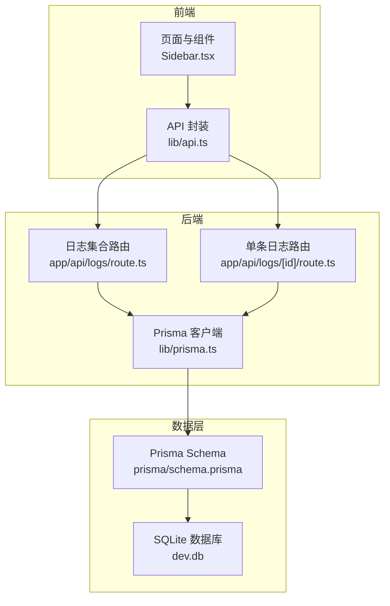
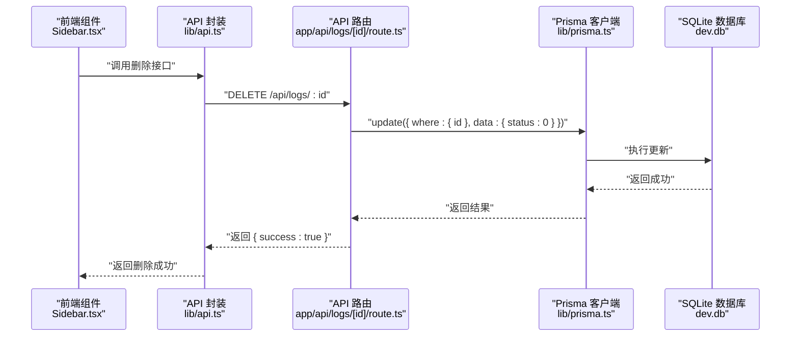
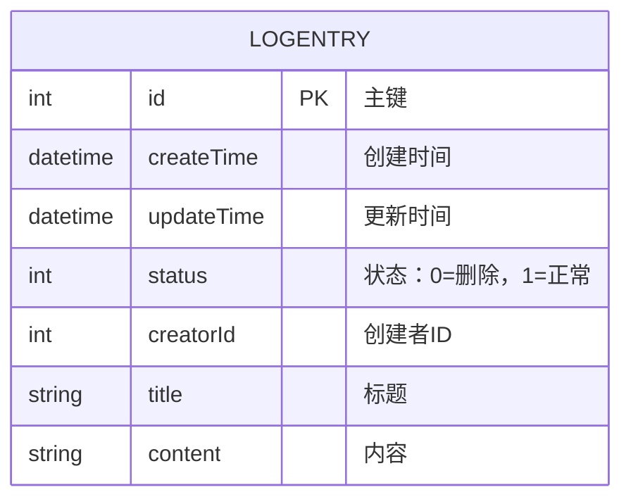
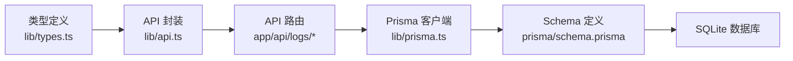

# 数据模型

<cite>
**本文引用的文件**
- [prisma/schema.prisma](file://prisma/schema.prisma)
- [数据库表规范.md](file://config/数据库表规范.md)
- [数据关系图.md](file://doc/数据关系图.md)
- [lib/types.ts](file://lib/types.ts)
- [lib/prisma.ts](file://lib/prisma.ts)
- [lib/api.ts](file://lib/api.ts)
- [app/api/logs/route.ts](file://app/api/logs/route.ts)
- [app/api/logs/[id]/route.ts](file://app/api/logs/[id]/route.ts)
- [components/Sidebar.tsx](file://components/Sidebar.tsx)
- [package.json](file://package.json)
</cite>

## 目录
1. [简介](#简介)
2. [项目结构](#项目结构)
3. [核心组件](#核心组件)
4. [架构总览](#架构总览)
5. [详细组件分析](#详细组件分析)
6. [依赖分析](#依赖分析)
7. [性能考虑](#性能考虑)
8. [故障排查指南](#故障排查指南)
9. [结论](#结论)
10. [附录](#附录)

## 简介
本文件围绕 LogEntry 实体构建完整数据模型文档，聚焦字段定义、约束与默认值、业务含义、软删除机制以及数据库初始化与迁移最佳实践。文档同时给出 Prisma Schema 语法示例与数据关系图，帮助开发者在前端与后端之间建立一致的数据契约。

## 项目结构
LogEntry 数据模型由 Prisma Schema 定义，配合 API 路由进行读写操作，前端组件消费 API 并渲染数据。整体采用 Next.js App Router 的 API 路由与 Prisma Client 的典型组合。

图表来源
- [lib/api.ts](file://lib/api.ts#L1-L55)
- [app/api/logs/route.ts](file://app/api/logs/route.ts#L1-L38)
- [app/api/logs/[id]/route.ts](file://app/api/logs/[id]/route.ts#L1-L69)
- [lib/prisma.ts](file://lib/prisma.ts#L1-L12)
- [prisma/schema.prisma](file://prisma/schema.prisma#L1-L26)

章节来源
- [prisma/schema.prisma](file://prisma/schema.prisma#L1-L26)
- [lib/prisma.ts](file://lib/prisma.ts#L1-L12)
- [lib/api.ts](file://lib/api.ts#L1-L55)
- [app/api/logs/route.ts](file://app/api/logs/route.ts#L1-L38)
- [app/api/logs/[id]/route.ts](file://app/api/logs/[id]/route.ts#L1-L69)

## 核心组件
本节从“字段定义、约束与默认值、业务含义”三个维度系统梳理 LogEntry 实体。

- id（主键自增）
  - 类型：整数
  - 约束：主键、自增
  - 默认值：自动递增
  - 业务含义：每条日志的唯一标识，用于关联与定位
  - 引用路径：[prisma/schema.prisma](file://prisma/schema.prisma#L16-L16)

- createTime（创建时间）
  - 类型：日期时间
  - 约束：非空
  - 默认值：当前时间
  - 业务含义：记录日志创建时刻，用于排序与审计
  - 引用路径：[prisma/schema.prisma](file://prisma/schema.prisma#L17-L17)，[数据库表规范.md](file://config/数据库表规范.md#L10-L10)

- updateTime（更新时间）
  - 类型：日期时间
  - 约束：非空
  - 默认值：自动更新
  - 业务含义：记录最近一次修改时间，便于追踪变更
  - 引用路径：[prisma/schema.prisma](file://prisma/schema.prisma#L18-L18)，[数据库表规范.md](file://config/数据库表规范.md#L11-L11)

- status（状态标识）
  - 类型：整数
  - 约束：非空
  - 默认值：1
  - 业务含义：0 表示已删除（软删除），1 表示正常
  - 引用路径：[prisma/schema.prisma](file://prisma/schema.prisma#L19-L19)，[数据库表规范.md](file://config/数据库表规范.md#L12-L12)，[lib/types.ts](file://lib/types.ts#L30-L33)

- creatorId（创建者）
  - 类型：整数
  - 约束：非空
  - 默认值：0
  - 业务含义：标识创建该日志的用户或来源，默认值用于匿名或临时场景
  - 引用路径：[prisma/schema.prisma](file://prisma/schema.prisma#L20-L20)，[数据库表规范.md](file://config/数据库表规范.md#L13-L13)

- title（标题）
  - 类型：字符串
  - 约束：非空
  - 默认值：无（需显式提供）
  - 业务含义：日志标题，用于快速识别
  - 引用路径：[prisma/schema.prisma](file://prisma/schema.prisma#L23-L23)，[数据库表规范.md](file://config/数据库表规范.md#L29-L29)

- content（内容）
  - 类型：字符串
  - 约束：非空
  - 默认值：无（需显式提供）
  - 业务含义：日志正文内容
  - 引用路径：[prisma/schema.prisma](file://prisma/schema.prisma#L24-L24)，[数据库表规范.md](file://config/数据库表规范.md#L30-L30)

章节来源
- [prisma/schema.prisma](file://prisma/schema.prisma#L16-L24)
- [数据库表规范.md](file://config/数据库表规范.md#L7-L14)
- [lib/types.ts](file://lib/types.ts#L1-L10)

## 架构总览
LogEntry 的数据流从 API 路由进入 Prisma 客户端，最终持久化到 SQLite。前端通过 API 封装调用后端接口，实现对 LogEntry 的增删改查。

图表来源
- [components/Sidebar.tsx](file://components/Sidebar.tsx#L1-L234)
- [lib/api.ts](file://lib/api.ts#L35-L40)
- [app/api/logs/[id]/route.ts](file://app/api/logs/[id]/route.ts#L52-L68)
- [lib/prisma.ts](file://lib/prisma.ts#L1-L12)

## 详细组件分析

### LogEntry 模型定义与约束
- Prisma Schema 语法要点
  - 主键与自增：使用注解声明主键与自增
  - 默认值：创建时间使用当前时间，状态与创建者使用默认值
  - 更新时间：使用自动更新注解
  - 业务字段：标题与内容为必填
- 引用路径
  - [prisma/schema.prisma](file://prisma/schema.prisma#L16-L24)

章节来源
- [prisma/schema.prisma](file://prisma/schema.prisma#L16-L24)

### 数据关系图
根据仓库中的 ER 图与表结构说明，LogEntry 的字段与约束如下所示：

图表来源
- [数据关系图.md](file://doc/数据关系图.md#L5-L16)

章节来源
- [数据关系图.md](file://doc/数据关系图.md#L18-L31)

### 软删除机制
- 实现方式
  - 删除请求将状态字段更新为 0，而非物理删除记录
  - 查询默认仅返回状态为 1 的记录，确保“删除”对查询透明
- 关键实现位置
  - 删除接口：将状态更新为 0
  - 查询接口：默认过滤 status=1
- 引用路径
  - [app/api/logs/[id]/route.ts](file://app/api/logs/[id]/route.ts#L52-L68)
  - [app/api/logs/route.ts](file://app/api/logs/route.ts#L4-L16)

章节来源
- [app/api/logs/[id]/route.ts](file://app/api/logs/[id]/route.ts#L52-L68)
- [app/api/logs/route.ts](file://app/api/logs/route.ts#L4-L16)

### 字段类型与默认值映射
- 字段类型
  - id：整数（主键）
  - createTime/updateTime：日期时间
  - status/creatorId：整数
  - title/content：字符串
- 默认值与约束
  - createTime 默认为当前时间
  - status 默认为 1（正常）
  - creatorId 默认为 0
  - 所有基础字段均为非空
- 引用路径
  - [prisma/schema.prisma](file://prisma/schema.prisma#L16-L24)
  - [数据库表规范.md](file://config/数据库表规范.md#L7-L14)

章节来源
- [prisma/schema.prisma](file://prisma/schema.prisma#L16-L24)
- [数据库表规范.md](file://config/数据库表规范.md#L7-L14)

### 前后端数据契约
- 前端类型定义
  - LogEntry 接口包含 id、createTime、updateTime、status、creatorId、title、content
- 引用路径
  - [lib/types.ts](file://lib/types.ts#L1-L10)

章节来源
- [lib/types.ts](file://lib/types.ts#L1-L10)

## 依赖分析
- 组件耦合
  - API 路由依赖 Prisma 客户端
  - 前端组件依赖 API 封装
  - Prisma 客户端与 Schema 定义强耦合
- 外部依赖
  - Prisma Client 与 SQLite
  - Next.js App Router
- 引用路径
  - [lib/prisma.ts](file://lib/prisma.ts#L1-L12)
  - [lib/api.ts](file://lib/api.ts#L1-L55)
  - [package.json](file://package.json#L1-L30)

图表来源
- [lib/types.ts](file://lib/types.ts#L1-L10)
- [lib/api.ts](file://lib/api.ts#L1-L55)
- [lib/prisma.ts](file://lib/prisma.ts#L1-L12)
- [prisma/schema.prisma](file://prisma/schema.prisma#L1-L26)

章节来源
- [lib/types.ts](file://lib/types.ts#L1-L10)
- [lib/api.ts](file://lib/api.ts#L1-L55)
- [lib/prisma.ts](file://lib/prisma.ts#L1-L12)
- [prisma/schema.prisma](file://prisma/schema.prisma#L1-L26)
- [package.json](file://package.json#L1-L30)

## 性能考虑
- 查询优化
  - 对 createTime 倒序排序可利用索引提升分页与列表性能
  - 默认仅查询 status=1 的记录，减少扫描范围
- 写入优化
  - 使用自动更新时间注解，避免应用层重复设置
- 存储与迁移
  - SQLite 适合开发与小规模生产；若扩展需求增加，建议评估索引策略与分页参数
- 引用路径
  - [app/api/logs/route.ts](file://app/api/logs/route.ts#L4-L16)
  - [prisma/schema.prisma](file://prisma/schema.prisma#L16-L24)

章节来源
- [app/api/logs/route.ts](file://app/api/logs/route.ts#L4-L16)
- [prisma/schema.prisma](file://prisma/schema.prisma#L16-L24)

## 故障排查指南
- 删除后仍可见
  - 检查查询是否正确过滤 status=1
  - 引用路径：[app/api/logs/route.ts](file://app/api/logs/route.ts#L4-L16)
- 删除接口无效
  - 确认删除路由是否将 status 设为 0
  - 引用路径：[app/api/logs/[id]/route.ts](file://app/api/logs/[id]/route.ts#L52-L68)
- 时间字段异常
  - 确认默认值与自动更新行为是否生效
  - 引用路径：[prisma/schema.prisma](file://prisma/schema.prisma#L17-L18)
- 类型不匹配
  - 前端类型与后端 Schema 是否一致
  - 引用路径：[lib/types.ts](file://lib/types.ts#L1-L10)

章节来源
- [app/api/logs/route.ts](file://app/api/logs/route.ts#L4-L16)
- [app/api/logs/[id]/route.ts](file://app/api/logs/[id]/route.ts#L52-L68)
- [prisma/schema.prisma](file://prisma/schema.prisma#L17-L18)
- [lib/types.ts](file://lib/types.ts#L1-L10)

## 结论
LogEntry 实体遵循统一的表设计规范，具备标准的基础字段与默认值，采用软删除策略以保障数据完整性。通过 Prisma Schema 明确字段约束，配合 API 路由与前端封装，形成清晰的数据流与一致的契约。建议在后续演进中关注索引与分页策略，以支撑更大规模的数据访问。

## 附录

### Prisma Schema 示例（片段）
- 模型定义与注解
  - 主键与自增、默认值、自动更新等注解
- 引用路径
  - [prisma/schema.prisma](file://prisma/schema.prisma#L16-L24)

章节来源
- [prisma/schema.prisma](file://prisma/schema.prisma#L16-L24)

### 数据库初始化与迁移最佳实践
- 初始化流程
  - 生成客户端：在构建阶段运行生成命令
  - 推送本地模式：使用推送命令快速同步本地 SQLite
  - 启动 Studio：可视化管理数据
- 引用路径
  - [package.json](file://package.json#L5-L12)

章节来源
- [package.json](file://package.json#L5-L12)