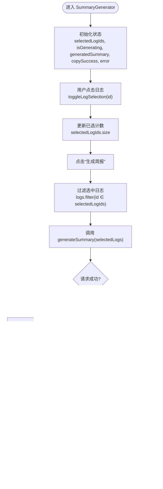

# 前端交互逻辑

<cite>
**本文引用的文件**
- [components/SummaryGenerator.tsx](file://components/SummaryGenerator.tsx)
- [lib/api.ts](file://lib/api.ts)
- [app/page.tsx](file://app/page.tsx)
- [components/Sidebar.tsx](file://components/Sidebar.tsx)
- [lib/types.ts](file://lib/types.ts)
- [lib/utils.ts](file://lib/utils.ts)
- [components/Editor.tsx](file://components/Editor.tsx)
</cite>

## 目录
1. [简介](#简介)
2. [项目结构](#项目结构)
3. [核心组件](#核心组件)
4. [架构总览](#架构总览)
5. [详细组件分析](#详细组件分析)
6. [依赖分析](#依赖分析)
7. [性能考量](#性能考量)
8. [故障排查指南](#故障排查指南)
9. [结论](#结论)
10. [附录](#附录)

## 简介
本文件面向开发者，系统性解析“周报生成器”的前端交互实现，重点围绕 SummaryGenerator 组件的状态管理与交互流程，包括：
- 如何通过 React 状态 selectedLogIds、isGenerating、generatedSummary 控制界面状态
- 日志选择逻辑 toggleLogSelection 的实现与全选/已选计数
- handleGenerate 如何收集选中日志并调用 lib/api.ts 的生成接口
- 生成结果的 Markdown 内容分段渲染策略
- 复制到剪贴板 handleCopy 的实现与成功反馈 copySuccess
- 可扩展性建议：自定义 UI 样式、添加导出功能、扩展选择逻辑

## 项目结构
该功能位于 Next.js 应用中，SummaryGenerator 作为独立组件被页面容器 app/page.tsx 渲染。Sidebar 提供打开周报生成器入口，lib/api.ts 提供后端接口封装，lib/types.ts 定义数据模型，lib/utils.ts 提供通用工具方法。

图表来源
- [app/page.tsx](file://app/page.tsx#L150-L183)
- [components/SummaryGenerator.tsx](file://components/SummaryGenerator.tsx#L1-L237)
- [components/Sidebar.tsx](file://components/Sidebar.tsx#L212-L228)
- [lib/api.ts](file://lib/api.ts#L42-L56)
- [lib/types.ts](file://lib/types.ts#L1-L10)
- [lib/utils.ts](file://lib/utils.ts#L148-L168)
- [components/Editor.tsx](file://components/Editor.tsx#L1-L457)

章节来源
- [app/page.tsx](file://app/page.tsx#L150-L183)
- [components/Sidebar.tsx](file://components/Sidebar.tsx#L212-L228)

## 核心组件
- SummaryGenerator：负责日志选择、生成触发、结果展示与复制反馈
- Sidebar：提供“生成周报”入口，切换视图为 SUMMARY 模式
- api.ts：封装 /api/logs 与 /api/summary 的请求
- types.ts：定义 LogEntry 类型
- utils.ts：提供日期格式化等工具

章节来源
- [components/SummaryGenerator.tsx](file://components/SummaryGenerator.tsx#L1-L237)
- [lib/api.ts](file://lib/api.ts#L1-L56)
- [lib/types.ts](file://lib/types.ts#L1-L10)
- [lib/utils.ts](file://lib/utils.ts#L148-L168)
- [components/Sidebar.tsx](file://components/Sidebar.tsx#L212-L228)

## 架构总览
SummaryGenerator 由三部分组成：日志选择面板、生成按钮区域、结果展示区。页面容器 app/page.tsx 在 SUMMARY 视图下渲染 SummaryGenerator，并将 logs 传入。生成流程通过 lib/api.ts 的 generateSummary 发起请求，返回 Markdown 字符串后进行分段渲染。

图表来源
- [app/page.tsx](file://app/page.tsx#L150-L183)
- [components/SummaryGenerator.tsx](file://components/SummaryGenerator.tsx#L30-L43)
- [lib/api.ts](file://lib/api.ts#L42-L56)

## 详细组件分析

### SummaryGenerator 组件交互与状态管理
- 状态定义
  - selectedLogIds：Set<number>，存储已选日志 id
  - isGenerating：boolean，生成过程中的加载态
  - generatedSummary：string|null，生成的 Markdown 内容
  - copySuccess：boolean，复制成功的短暂反馈
  - error：string|null，生成错误信息
- 关键交互
  - toggleLogSelection：切换单个日志的选中状态
  - handleGenerate：过滤选中日志，调用 generateSummary，设置结果或错误
  - handleCopy：写入剪贴板并设置 copySuccess，2 秒后恢复
  - 全选：通过 setSelectedLogIds(new Set(sortedLogs.map(l => l.id)))
  - 已选计数：selectedLogIds.size
  - 生成按钮禁用条件：selectedLogIds.size === 0 或 isGenerating
  - 结果展示：按行拆分，根据行前缀映射为标题/粗体/列表/段落

图表来源
- [components/SummaryGenerator.tsx](file://components/SummaryGenerator.tsx#L13-L237)
- [lib/api.ts](file://lib/api.ts#L42-L56)

章节来源
- [components/SummaryGenerator.tsx](file://components/SummaryGenerator.tsx#L13-L237)

### 日志选择逻辑与全选/计数
- 单选切换
  - toggleLogSelection：基于 Set 的拷贝与增删操作，更新 selectedLogIds
- 全选
  - 通过 setSelectedLogIds(new Set(sortedLogs.map(l => l.id))) 实现
- 已选计数
  - 直接使用 selectedLogIds.size 显示
- 排序
  - sortedLogs 按 createTime 倒序，确保最新日志在前

章节来源
- [components/SummaryGenerator.tsx](file://components/SummaryGenerator.tsx#L20-L28)
- [components/SummaryGenerator.tsx](file://components/SummaryGenerator.tsx#L84-L93)
- [components/SummaryGenerator.tsx](file://components/SummaryGenerator.tsx#L53-L55)

### 生成接口调用与错误处理
- handleGenerate 流程
  - 设置 isGenerating，清空 error
  - 从 logs 中筛选 selectedLogIds 对应日志
  - 调用 generateSummary(selectedLogs)，捕获异常并设置 error
  - finally 中恢复 isGenerating
- generateSummary
  - POST /api/summary，请求体包含 { logs }
  - 若响应非 ok，抛出错误；成功则返回 data.summary

图表来源
- [components/SummaryGenerator.tsx](file://components/SummaryGenerator.tsx#L30-L43)
- [lib/api.ts](file://lib/api.ts#L42-L56)

章节来源
- [components/SummaryGenerator.tsx](file://components/SummaryGenerator.tsx#L30-L43)
- [lib/api.ts](file://lib/api.ts#L42-L56)

### 结果展示与 Markdown 分段渲染
- 展示区域
  - generatedSummary 存在时显示结果页，包含“返回选择”和“复制周报”按钮
- 渲染策略
  - 将 summary 按换行拆分为多段
  - 行首匹配规则：
    - “##” → 二级标题
    - “**” → 粗体段落
    - “-” → 列表项
    - 其他 → 普通段落
  - 使用对应的语义化标签与样式类，保证可读性与一致性

图表来源
- [components/SummaryGenerator.tsx](file://components/SummaryGenerator.tsx#L190-L230)

章节来源
- [components/SummaryGenerator.tsx](file://components/SummaryGenerator.tsx#L190-L230)

### 复制到剪贴板与成功反馈
- 处理流程
  - handleCopy：若存在 generatedSummary，则写入剪贴板
  - setCopySuccess(true)，并在 2 秒后恢复
- 视觉反馈
  - 复制按钮在 copySuccess 为真时，使用绿色边框与文案“已复制!”

章节来源
- [components/SummaryGenerator.tsx](file://components/SummaryGenerator.tsx#L45-L51)
- [components/SummaryGenerator.tsx](file://components/SummaryGenerator.tsx#L199-L209)

### 与页面容器与侧边栏的集成
- 页面容器 app/page.tsx
  - SUMMARY 视图下渲染 SummaryGenerator，并将 logs 传入
  - onClose 回调切换回编辑视图
- 侧边栏 Sidebar
  - 提供“生成周报”按钮，触发 onOpenSummary，使页面切换到 SUMMARY 视图

图表来源
- [components/Sidebar.tsx](file://components/Sidebar.tsx#L212-L228)
- [app/page.tsx](file://app/page.tsx#L150-L183)
- [components/SummaryGenerator.tsx](file://components/SummaryGenerator.tsx#L13-L237)

章节来源
- [components/Sidebar.tsx](file://components/Sidebar.tsx#L212-L228)
- [app/page.tsx](file://app/page.tsx#L150-L183)

## 依赖分析
- 组件耦合
  - SummaryGenerator 依赖 lib/api.ts 的 generateSummary，依赖 lib/types.ts 的 LogEntry
  - 页面容器 app/page.tsx 依赖 Sidebar 与 SummaryGenerator
  - Sidebar 依赖 lib/utils.ts 的日期格式化
- 外部依赖
  - lucide-react 图标库
  - Tailwind CSS 样式系统

图表来源
- [components/SummaryGenerator.tsx](file://components/SummaryGenerator.tsx#L1-L237)
- [lib/api.ts](file://lib/api.ts#L1-L56)
- [lib/types.ts](file://lib/types.ts#L1-L10)
- [app/page.tsx](file://app/page.tsx#L150-L183)
- [components/Sidebar.tsx](file://components/Sidebar.tsx#L1-L234)
- [lib/utils.ts](file://lib/utils.ts#L148-L168)

章节来源
- [components/SummaryGenerator.tsx](file://components/SummaryGenerator.tsx#L1-L237)
- [lib/api.ts](file://lib/api.ts#L1-L56)
- [lib/types.ts](file://lib/types.ts#L1-L10)
- [app/page.tsx](file://app/page.tsx#L150-L183)
- [components/Sidebar.tsx](file://components/Sidebar.tsx#L1-L234)
- [lib/utils.ts](file://lib/utils.ts#L148-L168)

## 性能考量
- 选择逻辑
  - 使用 Set 存储选中 id，查找/增删均为 O(1)，适合大量日志场景
- 渲染优化
  - 仅在生成完成后渲染结果区域，避免不必要的 DOM 更新
  - Markdown 分段渲染按行处理，复杂度 O(n)，n 为行数
- 请求与状态
  - 生成过程中禁用按钮，防止重复提交
  - 错误与加载态明确，提升用户体验

[本节为通用性能讨论，不直接分析具体文件]

## 故障排查指南
- 生成失败
  - 检查后端 /api/summary 是否返回错误对象，前端会提取 error 字段并显示
  - 确认 selectedLogs 是否为空导致请求体缺失
- 复制失败
  - 确认浏览器支持 navigator.clipboard，且页面处于安全上下文（HTTPS）
  - 检查 generatedSummary 是否存在
- UI 不更新
  - 确认 selectedLogIds 的 Set 更新是否生效
  - 确认 generatedSummary 是否被正确设置

章节来源
- [components/SummaryGenerator.tsx](file://components/SummaryGenerator.tsx#L30-L43)
- [lib/api.ts](file://lib/api.ts#L42-L56)

## 结论
SummaryGenerator 通过简洁的状态机与清晰的交互流程，实现了从日志选择到结果展示的完整闭环。其选择逻辑高效、渲染策略直观、错误与反馈处理完善。后续可在保持现有状态管理不变的前提下，按附录建议进行样式定制、导出增强与选择逻辑扩展。

[本节为总结性内容，不直接分析具体文件]

## 附录

### 自定义 UI 样式建议
- 颜色体系
  - 使用主题色 primary-500/600 与浅色背景，确保对比度与可读性
- 交互反馈
  - 选中态使用圆角边框与阴影，hover 状态使用过渡动画
  - 生成按钮在禁用态使用浅色背景与不可点击样式
- Markdown 渲染
  - 使用 prose 类族统一段落、标题、列表的字体与间距
  - 为复制按钮提供成功态的绿色反馈

章节来源
- [components/SummaryGenerator.tsx](file://components/SummaryGenerator.tsx#L58-L233)

### 扩展导出功能
- 导出选项
  - 在结果页增加“导出 Word/PDF/Markdown”按钮
  - 通过 Blob 与 URL.createObjectURL 实现下载
- 生成流程
  - 在 handleGenerate 成功后，额外提供导出接口调用
  - 导出接口可复用相同日志集合，返回二进制或预签名链接

[本节为概念性扩展建议，不直接分析具体文件]

### 扩展选择逻辑
- 多级选择
  - 增加“按日期范围选择”“按标题关键字筛选”等
- 批量操作
  - 增加“反选”“清除选择”“按标题首字母分组选择”
- 本地持久化
  - 将 selectedLogIds 持久化到 localStorage，刷新后恢复
- 排序与分页
  - 对日志列表进行排序与分页，减少一次性渲染压力

[本节为概念性扩展建议，不直接分析具体文件]