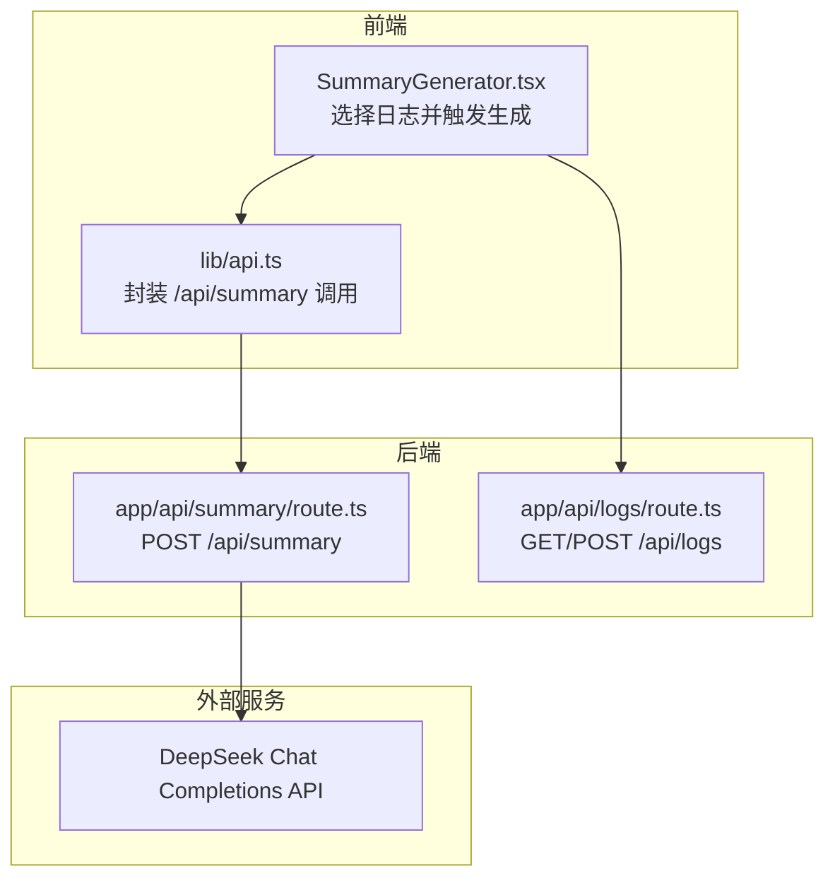
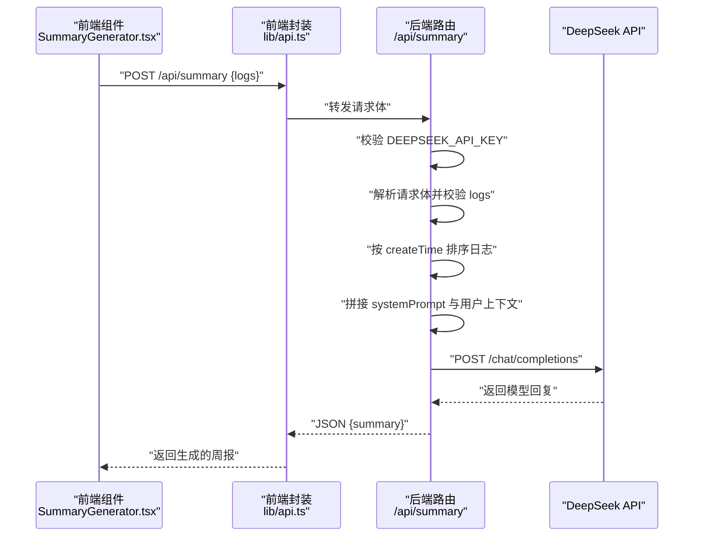
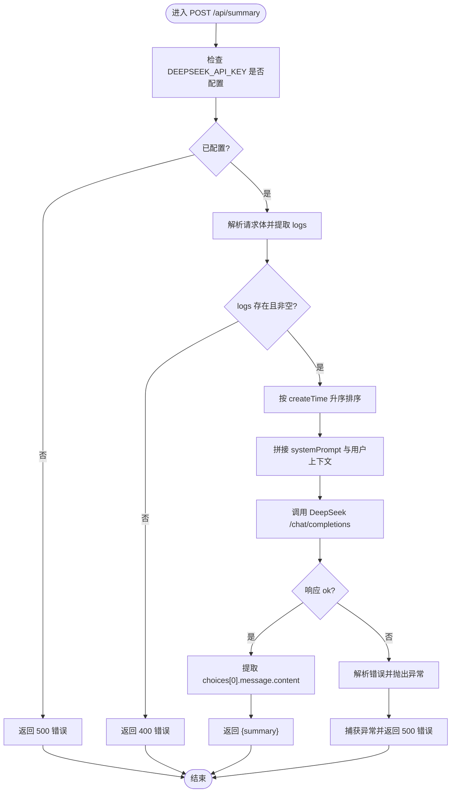
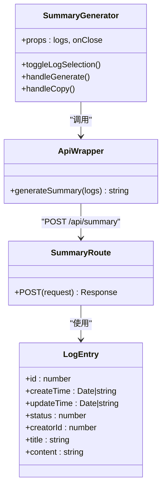

# 后端AI集成

<cite>
**本文引用的文件**
- [app/api/summary/route.ts](file://app/api/summary/route.ts)
- [lib/api.ts](file://lib/api.ts)
- [components/SummaryGenerator.tsx](file://components/SummaryGenerator.tsx)
- [lib/utils.ts](file://lib/utils.ts)
- [lib/types.ts](file://lib/types.ts)
- [app/api/logs/route.ts](file://app/api/logs/route.ts)
- [README.md](file://README.md)
- [config/env.example](file://config/env.example)
</cite>

## 目录
1. [简介](#简介)
2. [项目结构](#项目结构)
3. [核心组件](#核心组件)
4. [架构总览](#架构总览)
5. [详细组件分析](#详细组件分析)
6. [依赖分析](#依赖分析)
7. [性能考虑](#性能考虑)
8. [故障排查指南](#故障排查指南)
9. [结论](#结论)
10. [附录](#附录)

## 简介
本文件面向开发者，系统性解析后端周报生成API的实现机制，重点覆盖以下方面：
- /app/api/summary/route.ts 中 POST 接口的完整处理流程：从 DeepSeek API 密钥校验、请求体解析与日志排序，到提示词工程设计与 DeepSeek 调用参数配置。
- 流式响应处理方式、错误状态码映射与错误日志记录策略。
- 生成结果的格式化输出机制。
- 扩展路径：更换AI模型、优化提示词模板、实现流式传输。

## 项目结构
该项目采用 Next.js App Router 的 API 路由组织方式，前端通过组件调用后端 API，后端负责与第三方大模型服务交互并返回结构化结果。

图表来源
- [components/SummaryGenerator.tsx](file://components/SummaryGenerator.tsx#L1-L237)
- [lib/api.ts](file://lib/api.ts#L1-L56)
- [app/api/summary/route.ts](file://app/api/summary/route.ts#L1-L78)
- [app/api/logs/route.ts](file://app/api/logs/route.ts#L1-L38)

章节来源
- [README.md](file://README.md#L1-L64)
- [config/env.example](file://config/env.example#L1-L7)

## 核心组件
- 后端周报生成路由：负责密钥校验、请求体解析、日志排序、提示词构造、调用 DeepSeek、错误处理与响应。
- 前端周报生成组件：负责日志选择、触发生成、展示结果与复制。
- 前端 API 封装：统一调用后端 /api/summary，并处理错误。
- 工具函数：提供 Markdown 解析与块转换等辅助能力（与周报生成直接相关）。
- 日志管理路由：提供日志的增删改查，供前端选择日志使用。

章节来源
- [app/api/summary/route.ts](file://app/api/summary/route.ts#L1-L78)
- [components/SummaryGenerator.tsx](file://components/SummaryGenerator.tsx#L1-L237)
- [lib/api.ts](file://lib/api.ts#L1-L56)
- [lib/utils.ts](file://lib/utils.ts#L1-L168)
- [app/api/logs/route.ts](file://app/api/logs/route.ts#L1-L38)

## 架构总览
下图展示了从前端到后端再到第三方模型服务的整体调用链路与数据流向。

图表来源
- [components/SummaryGenerator.tsx](file://components/SummaryGenerator.tsx#L1-L237)
- [lib/api.ts](file://lib/api.ts#L1-L56)
- [app/api/summary/route.ts](file://app/api/summary/route.ts#L1-L78)

## 详细组件分析

### 后端周报生成路由（POST /api/summary）
该路由承担了从请求到响应的全部职责，包括密钥校验、输入校验、日志排序、提示词构造、DeepSeek 调用与错误处理。

- 密钥校验
  - 读取环境变量 DEEPSEEK_API_KEY，若为空则返回 500 错误。
- 请求体解析与输入校验
  - 解析 JSON 请求体，提取 logs 字段；若缺失或为空数组，返回 400 错误。
- 日志排序
  - 使用浅拷贝复制数组，按 createTime 升序排序，确保提示词上下文的时间顺序一致。
- 提示词工程
  - systemPrompt：定义角色与结构化输出要求（概述、完成事项、进行中、下周计划），并指定中文 Markdown 输出。
  - 用户上下文 promptContext：遍历排序后的日志，按“日期、标题”分隔，拼接每条日志内容，形成结构化的日志上下文。
- DeepSeek 调用参数
  - 模型：deepseek-chat
  - messages：包含 system 与 user 两条消息
  - temperature：0.7
  - max_tokens：2000
  - Authorization：Bearer + DEEPSEEK_API_KEY
- 响应与错误处理
  - 若上游响应非 ok，尝试解析错误信息并抛出异常，最终捕获并返回 500 错误，同时在控制台打印错误日志。
  - 成功时提取 choices[0].message.content 作为 summary 返回。

图表来源
- [app/api/summary/route.ts](file://app/api/summary/route.ts#L1-L78)

章节来源
- [app/api/summary/route.ts](file://app/api/summary/route.ts#L1-L78)

### 前端周报生成组件（SummaryGenerator.tsx）
- 日志选择与全选：基于 createTime 降序排列，支持多选日志。
- 生成流程：调用 lib/api.ts 的 generateSummary，传入所选日志集合。
- 结果展示：将生成的 Markdown 文本渲染为结构化 HTML。
- 错误处理：捕获生成过程中的异常并显示错误信息。
- 复制功能：一键复制生成的周报文本。

章节来源
- [components/SummaryGenerator.tsx](file://components/SummaryGenerator.tsx#L1-L237)
- [lib/api.ts](file://lib/api.ts#L1-L56)

### 前端 API 封装（lib/api.ts）
- 封装 /api/summary 的 POST 调用，将 logs 数组发送至后端。
- 对响应进行校验：若非 ok，解析错误并抛出异常；成功时返回 summary 字符串。

章节来源
- [lib/api.ts](file://lib/api.ts#L1-L56)

### 工具函数（lib/utils.ts）
- Markdown 解析与块转换：将 Markdown 文本解析为块结构，或将块结构还原为 Markdown。
- 未完成任务提取：支持在 Markdown 中提取未完成的待办事项，并保留其上级标题上下文。
- 日期格式化：提供中文格式的日期字符串与简短日期格式化方法。

章节来源
- [lib/utils.ts](file://lib/utils.ts#L1-L168)

### 日志管理路由（/api/logs）
- GET：按 createTime 降序返回状态正常的日志。
- POST：创建新日志，字段包含标题、内容与创建者 ID。

章节来源
- [app/api/logs/route.ts](file://app/api/logs/route.ts#L1-L38)

## 依赖分析
- 组件耦合
  - SummaryGenerator.tsx 依赖 lib/api.ts 进行 API 调用。
  - lib/api.ts 依赖 Next.js 的 fetch 与 /api/summary 路由。
  - /api/summary 路由依赖环境变量 DEEPSEEK_API_KEY 与 DeepSeek API。
- 外部依赖
  - DeepSeek Chat Completions API：用于生成周报。
- 内部数据结构
  - LogEntry 类型定义了日志的基本字段，用于前后端传递与排序。

图表来源
- [components/SummaryGenerator.tsx](file://components/SummaryGenerator.tsx#L1-L237)
- [lib/api.ts](file://lib/api.ts#L1-L56)
- [app/api/summary/route.ts](file://app/api/summary/route.ts#L1-L78)
- [lib/types.ts](file://lib/types.ts#L1-L34)

章节来源
- [lib/types.ts](file://lib/types.ts#L1-L34)

## 性能考虑
- 日志排序复杂度：当前使用数组浅拷贝与排序，时间复杂度 O(n log n)，空间复杂度 O(n)。对于中等规模日志集合理论上足够高效。
- 提示词构建：按条遍历日志拼接字符串，整体复杂度 O(n)。注意日志数量较多时，上下文长度可能接近模型上下文限制，需结合 max_tokens 与模型上下文上限评估。
- DeepSeek 调用：单次同步请求，无并发优化。若需要提升吞吐，可在后端引入队列或并发控制。
- 前端渲染：将 Markdown 渲染为 HTML 的操作在浏览器端执行，建议对长文本进行分页或懒加载优化。

## 故障排查指南
- 环境变量未配置
  - 现象：后端返回 500 错误，提示未配置 DEEPSEEK_API_KEY。
  - 处理：参考 README 与 env.example，正确设置 DEEPSEEK_API_KEY。
- 请求体缺失或为空
  - 现象：后端返回 400 错误，提示请选择要汇总的日志。
  - 处理：确认前端已选择至少一条日志并传入 logs 数组。
- DeepSeek 调用失败
  - 现象：后端捕获异常并返回 500 错误，控制台打印错误日志。
  - 处理：检查网络连通性、API 密钥有效性、模型可用性与配额情况。
- 响应非 ok
  - 现象：上游响应非 2xx，解析错误信息并抛出异常。
  - 处理：查看上游返回的错误详情，修正请求参数或等待服务恢复。

章节来源
- [app/api/summary/route.ts](file://app/api/summary/route.ts#L1-L78)
- [README.md](file://README.md#L1-L64)
- [config/env.example](file://config/env.example#L1-L7)

## 结论
该实现以简洁清晰的方式完成了“前端选择日志 -> 后端构造提示词 -> DeepSeek 生成 -> 前端展示”的闭环。提示词工程明确、参数配置合理，具备良好的可维护性与扩展性。为进一步增强体验，建议在后端引入流式响应与更细粒度的错误分类，同时在前端增加进度反馈与复制状态提示。

## 附录

### 提示词工程设计要点
- systemPrompt：定义角色、输出结构与语言要求，确保模型输出符合预期格式。
- 用户上下文拼接策略：按时间升序组织日志，便于模型理解事件先后关系；每个日志包含日期与标题，有助于模型区分不同条目。

章节来源
- [app/api/summary/route.ts](file://app/api/summary/route.ts#L1-L78)

### DeepSeek 调用参数配置
- 模型：deepseek-chat
- 温度：0.7（平衡创造性与稳定性）
- 最大 token：2000（可根据实际需求调整）
- Authorization：Bearer + DEEPSEEK_API_KEY

章节来源
- [app/api/summary/route.ts](file://app/api/summary/route.ts#L1-L78)

### 错误状态码与映射规则
- 500：密钥未配置、上游响应非 ok、运行时异常。
- 400：请求体缺失 logs 或为空数组。

章节来源
- [app/api/summary/route.ts](file://app/api/summary/route.ts#L1-L78)

### 生成结果格式化输出机制
- 后端：返回 JSON { summary }，其中 summary 为模型生成的 Markdown 文本。
- 前端：将 Markdown 文本渲染为结构化 HTML，支持标题、粗体与列表等基础语法。

章节来源
- [lib/api.ts](file://lib/api.ts#L1-L56)
- [components/SummaryGenerator.tsx](file://components/SummaryGenerator.tsx#L1-L237)

### 扩展路径建议
- 更换 AI 模型
  - 在后端路由中修改 model 字段与对应参数；如需切换供应商，需调整 URL 与鉴权方式。
- 优化提示词模板
  - 可将 systemPrompt 抽象为可配置模板，支持多语言或多版本模板切换。
- 实现流式传输
  - 将 DeepSeek 的响应改为流式读取，逐步向客户端推送片段，前端实时渲染，提升交互体验。
- 增强错误分类与日志
  - 区分网络错误、鉴权错误、模型错误等，分别返回不同的状态码与错误信息，并记录更详细的上下文日志。

章节来源
- [app/api/summary/route.ts](file://app/api/summary/route.ts#L1-L78)
- [lib/api.ts](file://lib/api.ts#L1-L56)