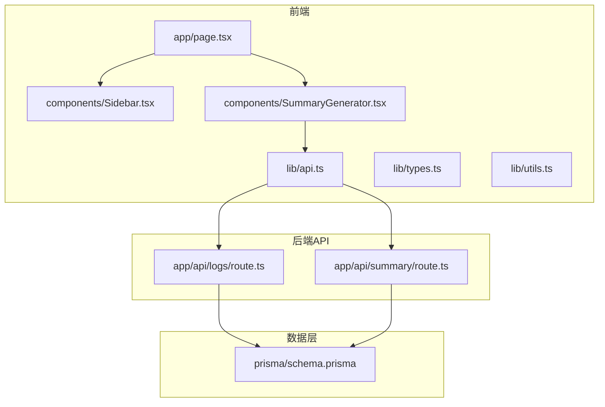
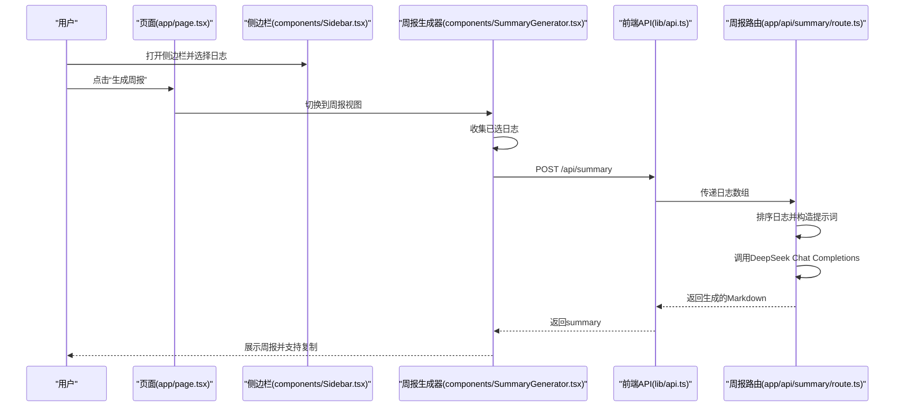
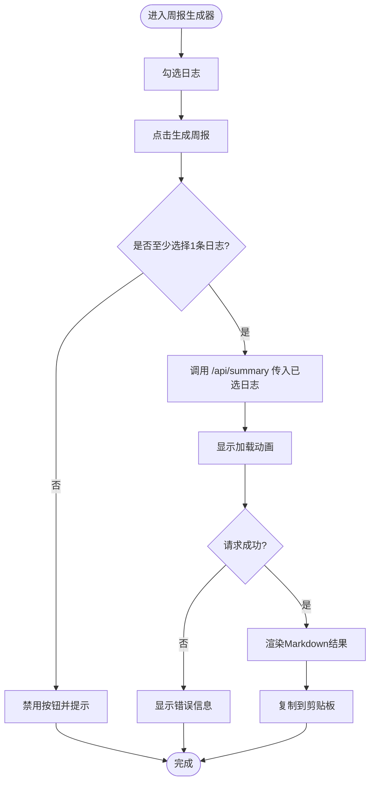
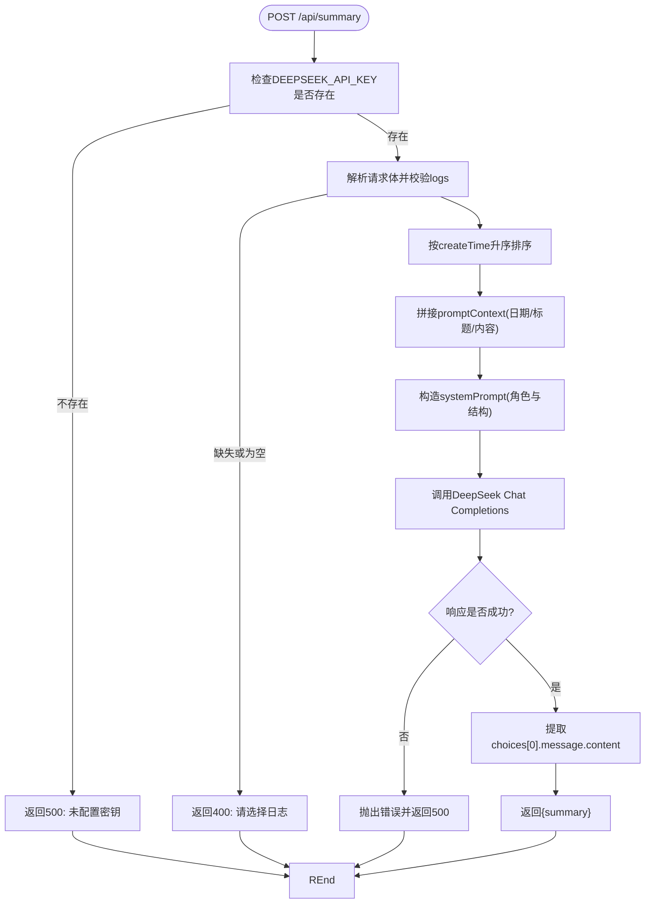
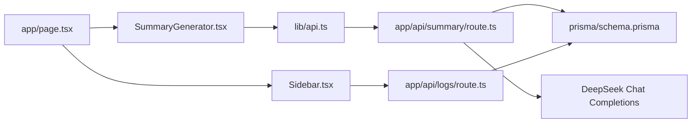

# 周报生成

<cite>
**本文引用的文件**
- [app/page.tsx](file://app/page.tsx)
- [components/Sidebar.tsx](file://components/Sidebar.tsx)
- [components/SummaryGenerator.tsx](file://components/SummaryGenerator.tsx)
- [lib/api.ts](file://lib/api.ts)
- [lib/types.ts](file://lib/types.ts)
- [lib/utils.ts](file://lib/utils.ts)
- [app/api/summary/route.ts](file://app/api/summary/route.ts)
- [app/api/logs/route.ts](file://app/api/logs/route.ts)
- [prisma/schema.prisma](file://prisma/schema.prisma)
- [README.md](file://README.md)
- [package.json](file://package.json)
</cite>

## 目录
1. [简介](#简介)
2. [项目结构](#项目结构)
3. [核心组件](#核心组件)
4. [架构总览](#架构总览)
5. [详细组件分析](#详细组件分析)
6. [依赖分析](#依赖分析)
7. [性能考虑](#性能考虑)
8. [故障排查指南](#故障排查指南)
9. [结论](#结论)
10. [附录](#附录)

## 简介
本项目提供“AI驱动的周报生成功能”。用户在侧边栏选择多条日志后，通过前端组件收集所选日志，调用后端API，后端将日志按时间排序并拼接为提示词，调用DeepSeek大模型生成结构化的周报Markdown，并返回给前端展示。前端支持一键复制生成内容到剪贴板。本文档将深入解析交互流程、前后端实现细节、提示词工程、错误处理与重试策略，并给出替换AI服务提供商、优化提示词模板以及扩展输出格式（如PDF导出）的定制化路径。

## 项目结构
- 前端页面与组件位于 app 与 components 目录，负责用户交互与展示。
- API路由位于 app/api 下，提供日志管理与周报生成接口。
- 数据模型定义在 prisma/schema.prisma，采用SQLite存储。
- 工具函数与类型定义位于 lib 目录，统一API调用与通用逻辑。

图表来源
- [app/page.tsx](file://app/page.tsx#L1-L209)
- [components/Sidebar.tsx](file://components/Sidebar.tsx#L1-L234)
- [components/SummaryGenerator.tsx](file://components/SummaryGenerator.tsx#L1-L237)
- [lib/api.ts](file://lib/api.ts#L1-L56)
- [app/api/logs/route.ts](file://app/api/logs/route.ts#L1-L38)
- [app/api/summary/route.ts](file://app/api/summary/route.ts#L1-L78)
- [prisma/schema.prisma](file://prisma/schema.prisma#L1-L26)

章节来源
- [README.md](file://README.md#L1-L64)
- [package.json](file://package.json#L1-L30)

## 核心组件
- 页面容器与视图切换：app/page.tsx 负责加载日志、维护当前日志与视图模式，并在“周报”视图与“编辑”视图之间切换。
- 侧边栏：components/Sidebar.tsx 展示日志列表、支持拖拽排序、创建/删除日志、打开周报生成器。
- 周报生成器：components/SummaryGenerator.tsx 实现日志选择、生成按钮、结果展示与复制到剪贴板。
- API封装：lib/api.ts 提供统一的fetch封装，包括日志管理与周报生成。
- 类型与工具：lib/types.ts 定义日志与视图模式等类型；lib/utils.ts 提供日期格式化等辅助方法。
- 后端路由：
  - app/api/logs/route.ts：提供日志的增删改查（基于Prisma）。
  - app/api/summary/route.ts：接收前端传入的日志数组，构造提示词并调用DeepSeek API生成周报。

章节来源
- [app/page.tsx](file://app/page.tsx#L1-L209)
- [components/Sidebar.tsx](file://components/Sidebar.tsx#L1-L234)
- [components/SummaryGenerator.tsx](file://components/SummaryGenerator.tsx#L1-L237)
- [lib/api.ts](file://lib/api.ts#L1-L56)
- [lib/types.ts](file://lib/types.ts#L1-L34)
- [lib/utils.ts](file://lib/utils.ts#L148-L168)
- [app/api/logs/route.ts](file://app/api/logs/route.ts#L1-L38)
- [app/api/summary/route.ts](file://app/api/summary/route.ts#L1-L78)

## 架构总览
整体交互链路如下：
- 用户在侧边栏勾选若干日志，点击“生成周报”，前端组件收集所选日志并调用后端API。
- 后端API对日志按创建时间排序，拼接为提示词，调用DeepSeek Chat Completions接口，返回生成的Markdown。
- 前端接收结果后渲染展示，并提供复制到剪贴板能力。

图表来源
- [app/page.tsx](file://app/page.tsx#L150-L183)
- [components/SummaryGenerator.tsx](file://components/SummaryGenerator.tsx#L30-L43)
- [lib/api.ts](file://lib/api.ts#L42-L56)
- [app/api/summary/route.ts](file://app/api/summary/route.ts#L14-L77)

## 详细组件分析

### 周报生成器组件（SummaryGenerator）
- 交互逻辑
  - 支持全选/反选日志，显示已选数量。
  - 点击“生成周报”按钮，禁用条件为未选择任何日志或正在生成。
  - 生成完成后展示结果区域，支持返回选择界面与复制到剪贴板。
- 数据组织
  - 从props接收全部日志，内部维护selectedLogIds集合，生成时过滤出已选日志。
  - 对日志按创建时间降序排序，便于展示与提示词组织。
- 结果展示
  - 将返回的Markdown按行拆分，逐行渲染为标题、粗体、列表或段落，使用prose样式增强可读性。
- 复制到剪贴板
  - 使用navigator.clipboard.writeText写入剪贴板，成功后短暂提示“已复制”。

图表来源
- [components/SummaryGenerator.tsx](file://components/SummaryGenerator.tsx#L20-L51)
- [components/SummaryGenerator.tsx](file://components/SummaryGenerator.tsx#L164-L187)
- [components/SummaryGenerator.tsx](file://components/SummaryGenerator.tsx#L190-L233)

章节来源
- [components/SummaryGenerator.tsx](file://components/SummaryGenerator.tsx#L1-L237)

### 前端API封装（lib/api.ts）
- 提供generateSummary(logs)方法，向/app/api/summary发送POST请求，传入logs数组。
- 对非2xx响应抛出错误，错误消息来自后端返回的error字段。
- 返回后端返回的summary字符串。

章节来源
- [lib/api.ts](file://lib/api.ts#L42-L56)

### 后端周报路由（app/api/summary/route.ts）
- 输入校验
  - 若未配置DEEPSEEK_API_KEY，直接返回500错误。
  - 若请求体缺少logs或为空数组，返回400错误。
- 数据预处理
  - 对传入日志按createTime升序排序，确保提示词按时间顺序组织。
- 提示词工程
  - 生成promptContext：按日期与标题组织每条日志内容。
  - systemPrompt：定义角色与输出结构（本周概述、完成事项、进行中、下周计划），要求使用Markdown中文输出。
- 调用DeepSeek
  - 使用Chat Completions接口，指定model为deepseek-chat，设置temperature与max_tokens。
  - 从choices[0].message.content提取生成内容。
- 错误处理
  - 对非2xx响应读取错误信息并抛出；捕获异常后统一返回500与错误消息。

图表来源
- [app/api/summary/route.ts](file://app/api/summary/route.ts#L1-L78)

章节来源
- [app/api/summary/route.ts](file://app/api/summary/route.ts#L1-L78)

### 页面与侧边栏联动（app/page.tsx 与 components/Sidebar.tsx）
- 页面容器
  - 加载日志列表，维护currentLogId与viewMode，支持移动端菜单开关。
  - 在SUMMARY视图下渲染SummaryGenerator组件。
- 侧边栏
  - 展示日志列表，支持拖拽排序与删除日志。
  - 提供“生成周报”入口，切换到SUMMARY视图。

章节来源
- [app/page.tsx](file://app/page.tsx#L127-L205)
- [components/Sidebar.tsx](file://components/Sidebar.tsx#L1-L234)

### 日志管理API（app/api/logs/route.ts）
- GET：查询status为1的日志，按创建时间降序返回。
- POST：创建新日志，填充title与content，默认creatorId为0。

章节来源
- [app/api/logs/route.ts](file://app/api/logs/route.ts#L1-L38)

### 数据模型（prisma/schema.prisma）
- LogEntry模型包含基础字段（id、createTime、updateTime、status、creatorId）与业务字段（title、content）。
- 默认provider为sqlite，数据库文件为dev.db。

章节来源
- [prisma/schema.prisma](file://prisma/schema.prisma#L1-L26)

## 依赖分析
- 组件耦合
  - SummaryGenerator依赖lib/api.ts进行网络请求；依赖lib/types.ts中的LogEntry类型。
  - app/page.tsx通过Sidebar与SummaryGenerator协作，控制视图切换。
- 外部依赖
  - DeepSeek Chat Completions接口作为外部AI服务。
  - Prisma客户端访问SQLite数据库。
- 潜在循环依赖
  - 当前文件间无循环依赖，模块职责清晰。

图表来源
- [components/SummaryGenerator.tsx](file://components/SummaryGenerator.tsx#L1-L237)
- [lib/api.ts](file://lib/api.ts#L1-L56)
- [app/api/summary/route.ts](file://app/api/summary/route.ts#L1-L78)
- [app/api/logs/route.ts](file://app/api/logs/route.ts#L1-L38)
- [prisma/schema.prisma](file://prisma/schema.prisma#L1-L26)
- [app/page.tsx](file://app/page.tsx#L127-L205)
- [components/Sidebar.tsx](file://components/Sidebar.tsx#L1-L234)

## 性能考虑
- 前端渲染
  - 对生成结果进行逐行渲染，建议在大量内容时采用虚拟滚动或分页展示以提升性能。
- 后端处理
  - 日志排序为O(n log n)，提示词拼接为O(n)；整体复杂度可控。
  - DeepSeek调用为外部I/O，建议在生产环境增加超时与重试策略。
- 网络与缓存
  - 建议在前端对最近一次生成结果做短期缓存，减少重复请求。
- 并发与节流
  - 生成按钮应禁用重复点击；对快速多次点击可采用防抖。

## 故障排查指南
- 环境变量未配置
  - 现象：后端返回500，提示未配置DEEPSEEK_API_KEY。
  - 处理：在环境变量中设置DEEPSEEK_API_KEY。
- 请求体缺失logs
  - 现象：后端返回400，提示请选择日志。
  - 处理：确认前端已正确收集selectedLogIds并传入后端。
- DeepSeek接口异常
  - 现象：后端抛出错误并返回500。
  - 处理：检查API密钥有效性、网络连通性与配额限制；必要时增加重试与熔断。
- 前端复制失败
  - 现象：复制按钮无反应或提示失败。
  - 处理：确认浏览器权限与HTTPS环境；在移动端可能受限。

章节来源
- [app/api/summary/route.ts](file://app/api/summary/route.ts#L1-L20)
- [lib/api.ts](file://lib/api.ts#L42-L56)
- [README.md](file://README.md#L28-L34)

## 结论
该功能通过清晰的前后端分工实现了“选择日志—生成周报”的完整闭环：前端负责交互与展示，后端负责提示词工程与外部模型调用。系统具备良好的可扩展性，可通过替换AI服务提供商、优化提示词模板与扩展输出格式（如PDF导出）进一步提升用户体验。

## 附录

### 提示词工程与定制化路径
- 替换AI服务提供商
  - 修改后端路由中DeepSeek调用地址与鉴权方式，保持输入输出格式一致即可。
  - 关键位置参考：[app/api/summary/route.ts](file://app/api/summary/route.ts#L44-L59)
- 优化提示词模板
  - systemPrompt与promptContext分别定义角色与上下文，可在不改变接口的前提下调整输出风格与结构。
  - 关键位置参考：[app/api/summary/route.ts](file://app/api/summary/route.ts#L27-L43)
- 扩展输出格式（如PDF导出）
  - 前端可将Markdown转换为HTML并使用第三方库导出PDF；或在后端将Markdown转为PDF后再返回。
  - 前端展示与复制逻辑参考：[components/SummaryGenerator.tsx](file://components/SummaryGenerator.tsx#L190-L233)

### 错误重试机制建议
- 后端可对DeepSeek调用增加指数退避重试，最大重试次数与超时阈值需结合实际SLA设定。
- 前端在生成按钮处增加加载态与错误提示，避免重复提交。