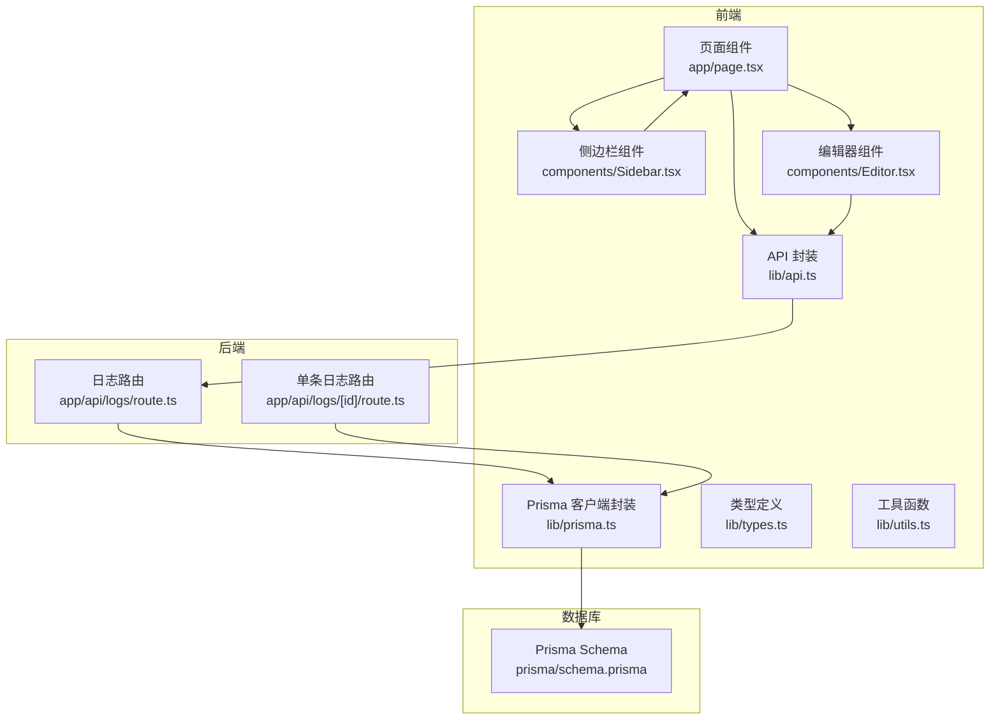
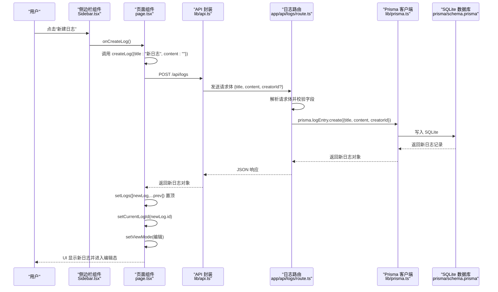
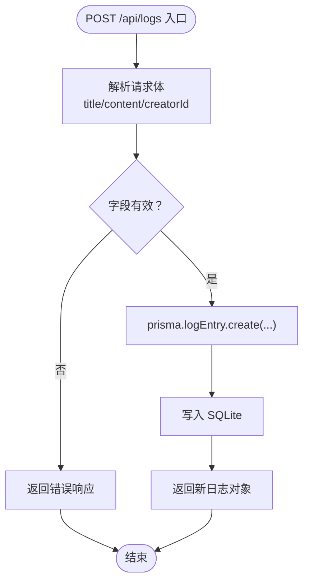
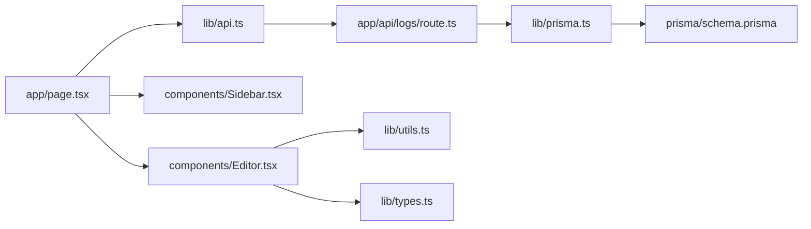

# 日志创建

<cite>
**本文引用的文件**
- [app/page.tsx](file://app/page.tsx)
- [components/Sidebar.tsx](file://components/Sidebar.tsx)
- [lib/api.ts](file://lib/api.ts)
- [app/api/logs/route.ts](file://app/api/logs/route.ts)
- [app/api/logs/[id]/route.ts](file://app/api/logs/[id]/route.ts)
- [lib/prisma.ts](file://lib/prisma.ts)
- [prisma/schema.prisma](file://prisma/schema.prisma)
- [lib/types.ts](file://lib/types.ts)
- [lib/utils.ts](file://lib/utils.ts)
- [components/Editor.tsx](file://components/Editor.tsx)
</cite>

## 目录
1. [简介](#简介)
2. [项目结构](#项目结构)
3. [核心组件](#核心组件)
4. [架构总览](#架构总览)
5. [详细组件分析](#详细组件分析)
6. [依赖分析](#依赖分析)
7. [性能考虑](#性能考虑)
8. [故障排查指南](#故障排查指南)
9. [结论](#结论)
10. [附录](#附录)

## 简介
本文围绕“AI1_Log”项目中“新建日志”的完整实现流程进行深入解析，覆盖从前端交互到后端API处理再到数据库持久化的全过程。重点说明：
- 用户点击“新建日志”按钮触发 handleCreateLog 的前端流程
- 前端通过 lib/api.ts 的 createLog 发起 POST 请求
- 后端 API 路由 app/api/logs/route.ts 接收并处理请求
- 通过 Prisma 写入 SQLite 数据库
- 默认标题与内容的设置逻辑
- 新日志在状态列表中的插入位置（置顶）
- 当前编辑上下文的切换机制
- 错误捕获与日志记录策略
- 结合代码路径说明请求体结构、响应数据处理与 UI 状态同步方式
- 扩展建议：添加创建者信息或初始化模板

## 项目结构
该项目采用 Next.js App Router 的目录组织方式，前端页面与组件位于 app 与 components 目录，API 路由位于 app/api 下，数据访问通过 lib/prisma.ts 与 Prisma 客户端交互，数据库定义位于 prisma/schema.prisma。

图表来源
- [app/page.tsx](file://app/page.tsx#L1-L209)
- [components/Sidebar.tsx](file://components/Sidebar.tsx#L1-L234)
- [components/Editor.tsx](file://components/Editor.tsx#L1-L457)
- [lib/api.ts](file://lib/api.ts#L1-L56)
- [app/api/logs/route.ts](file://app/api/logs/route.ts#L1-L38)
- [app/api/logs/[id]/route.ts](file://app/api/logs/[id]/route.ts#L1-L69)
- [lib/prisma.ts](file://lib/prisma.ts#L1-L12)
- [prisma/schema.prisma](file://prisma/schema.prisma#L1-L26)

章节来源
- [app/page.tsx](file://app/page.tsx#L1-L209)
- [lib/api.ts](file://lib/api.ts#L1-L56)
- [app/api/logs/route.ts](file://app/api/logs/route.ts#L1-L38)
- [lib/prisma.ts](file://lib/prisma.ts#L1-L12)
- [prisma/schema.prisma](file://prisma/schema.prisma#L1-L26)

## 核心组件
- 页面与状态管理：app/page.tsx 负责加载日志列表、维护当前日志 ID、视图模式、移动端菜单开关等状态，并在“新建日志”时调用 createLog 并更新 UI。
- 侧边栏：components/Sidebar.tsx 展示日志列表，支持拖拽排序与删除操作，其中“新建日志”按钮绑定 onCreateLog 回调。
- API 封装：lib/api.ts 统一封装了日志相关的 HTTP 请求，包括创建、更新、删除与摘要生成。
- 后端路由：app/api/logs/route.ts 处理 GET/POST 请求，GET 返回状态正常的日志并按创建时间倒序，POST 创建新日志并写入数据库。
- 单条日志路由：app/api/logs/[id]/route.ts 提供 GET/PUT/DELETE（软删除）能力。
- 数据访问：lib/prisma.ts 提供全局唯一的 PrismaClient 实例，prisma/schema.prisma 定义 SQLite 数据库与 LogEntry 模型。
- 类型与工具：lib/types.ts 定义 LogEntry、ViewMode、Status 等类型；lib/utils.ts 提供 Markdown 与块结构互转、ID 生成、日期格式化等工具。

章节来源
- [app/page.tsx](file://app/page.tsx#L1-L209)
- [components/Sidebar.tsx](file://components/Sidebar.tsx#L1-L234)
- [lib/api.ts](file://lib/api.ts#L1-L56)
- [app/api/logs/route.ts](file://app/api/logs/route.ts#L1-L38)
- [app/api/logs/[id]/route.ts](file://app/api/logs/[id]/route.ts#L1-L69)
- [lib/prisma.ts](file://lib/prisma.ts#L1-L12)
- [prisma/schema.prisma](file://prisma/schema.prisma#L1-L26)
- [lib/types.ts](file://lib/types.ts#L1-L34)
- [lib/utils.ts](file://lib/utils.ts#L1-L168)

## 架构总览
下面以序列图展示“新建日志”的端到端流程：从用户点击按钮到数据库写入与 UI 同步。

图表来源
- [components/Sidebar.tsx](file://components/Sidebar.tsx#L120-L130)
- [app/page.tsx](file://app/page.tsx#L64-L77)
- [lib/api.ts](file://lib/api.ts#L12-L21)
- [app/api/logs/route.ts](file://app/api/logs/route.ts#L18-L37)
- [lib/prisma.ts](file://lib/prisma.ts#L1-L12)
- [prisma/schema.prisma](file://prisma/schema.prisma#L14-L25)

## 详细组件分析

### 前端：页面与侧边栏的交互
- 侧边栏“新建日志”按钮绑定 onCreateLog 回调，该回调直接传递给页面组件，页面组件在 app/page.tsx 中定义 handleCreateLog。
- handleCreateLog 调用 lib/api.ts 的 createLog，传入默认标题与空内容，成功后：
  - 将新日志置顶插入到本地 logs 列表
  - 设置 currentLogId 为新日志 ID
  - 切换视图为编辑模式
  - 在移动端关闭菜单
- 侧边栏根据 logs 列表渲染日志项，支持拖拽排序与删除，但“新建日志”动作由页面组件统一处理。

章节来源
- [components/Sidebar.tsx](file://components/Sidebar.tsx#L120-L130)
- [app/page.tsx](file://app/page.tsx#L64-L77)

### 前端：API 封装与请求体结构
- createLog 函数通过 fetch 发起 POST 请求至 /api/logs，请求头为 application/json，请求体为 Partial<LogEntry>，包含 title、content、creatorId（可选）。
- 成功响应返回完整的 LogEntry 对象，失败则抛出错误，由调用方捕获并记录。

章节来源
- [lib/api.ts](file://lib/api.ts#L12-L21)
- [lib/types.ts](file://lib/types.ts#L1-L10)

### 后端：日志路由处理与数据库写入
- POST /api/logs：
  - 从请求体解析 title、content、creatorId（默认 0）
  - 使用 prisma.logEntry.create 写入数据库，字段映射到 LogEntry 模型
  - 返回新创建的日志对象
- GET /api/logs：
  - 查询状态为正常的日志，按 createTime 降序返回
- 单条日志路由 [id]：
  - GET：按 id 和状态查询
  - PUT：更新 title 与 content
  - DELETE：软删除（status=0）

图表来源
- [app/api/logs/route.ts](file://app/api/logs/route.ts#L18-L37)
- [lib/prisma.ts](file://lib/prisma.ts#L1-L12)
- [prisma/schema.prisma](file://prisma/schema.prisma#L14-L25)

章节来源
- [app/api/logs/route.ts](file://app/api/logs/route.ts#L1-L38)
- [app/api/logs/[id]/route.ts](file://app/api/logs/[id]/route.ts#L1-L69)
- [lib/prisma.ts](file://lib/prisma.ts#L1-L12)
- [prisma/schema.prisma](file://prisma/schema.prisma#L14-L25)

### 默认标题与内容设置逻辑
- 前端在 handleCreateLog 中显式传入 { title: "新日志", content: "" }，确保新日志具备初始标题与空内容。
- 后端在 POST 路由中对 title 与 content 进行兜底：若请求体未提供，则使用默认值，同时 creatorId 默认 0。
- 数据库层 LogEntry 模型要求 title 与 content 字段存在，schema.prisma 中 creatorId 默认 0，createTime 默认 now()，status 默认 1。

章节来源
- [app/page.tsx](file://app/page.tsx#L64-L77)
- [app/api/logs/route.ts](file://app/api/logs/route.ts#L20-L30)
- [prisma/schema.prisma](file://prisma/schema.prisma#L14-L25)

### 新日志在状态列表中的插入位置（置顶）
- 前端在收到后端返回的新日志对象后，将其置顶插入到本地 logs 数组，保证新日志出现在列表顶部。
- 侧边栏渲染时会根据排序规则（localStorage 中的自定义排序优先，其次按创建时间倒序）显示日志，但置顶插入能确保新创建的日志立即可见。

章节来源
- [app/page.tsx](file://app/page.tsx#L64-L77)
- [components/Sidebar.tsx](file://components/Sidebar.tsx#L36-L51)

### 当前编辑上下文的切换机制
- 新日志创建成功后，页面组件：
  - setCurrentLogId 设为新日志 ID
  - setViewMode 切换到编辑模式
  - 在移动端关闭菜单
- 编辑器组件根据当前 log 对象初始化 blocks 与标题，进入可编辑状态；后续变更通过防抖保存与 onUpdate 回调同步到后端。

章节来源
- [app/page.tsx](file://app/page.tsx#L64-L77)
- [components/Editor.tsx](file://components/Editor.tsx#L21-L40)

### 错误捕获与日志记录策略
- 前端：
  - createLog、updateLog、deleteLog 在网络异常或非 2xx 响应时抛出错误，调用方负责捕获并记录。
  - handleCreateLog、handleUpdateLog、handleDeleteLog 中均包含 try/catch 并打印错误日志。
- 后端：
  - 路由函数内部使用 try/catch 包裹数据库操作，发生异常时记录错误并返回 JSON 错误响应与 500 状态码。
- 建议：
  - 前端可在错误时弹窗提示或回退 UI 状态
  - 后端可引入统一的错误中间件或结构化日志输出

章节来源
- [lib/api.ts](file://lib/api.ts#L6-L21)
- [app/page.tsx](file://app/page.tsx#L64-L77)
- [app/api/logs/route.ts](file://app/api/logs/route.ts#L1-L38)

### 请求体结构与响应处理
- 请求体结构（POST /api/logs）：
  - title: 字符串（可选，后端默认“新日志”）
  - content: 字符串（可选，后端默认空字符串）
  - creatorId: 整数（可选，默认 0）
- 响应数据：
  - 返回完整的 LogEntry 对象，包含 id、createTime、updateTime、status、creatorId、title、content
- UI 状态同步：
  - 前端收到响应后，setLogs 置顶插入，setCurrentLogId 切换当前日志，setViewMode 切换为编辑

章节来源
- [lib/api.ts](file://lib/api.ts#L12-L21)
- [app/api/logs/route.ts](file://app/api/logs/route.ts#L20-L30)
- [lib/types.ts](file://lib/types.ts#L1-L10)
- [app/page.tsx](file://app/page.tsx#L64-L77)

### 扩展建议
- 添加创建者信息：
  - 在前端调用 createLog 时传入 creatorId（例如从认证上下文读取）
  - 后端路由保持 creatorId 字段解析与入库
- 初始化模板：
  - 在前端创建时注入默认内容模板（如“今日工作概览”、“明日计划”等），提升用户体验
- 更强的错误处理：
  - 前端统一错误提示与重试机制
  - 后端增加结构化日志与错误码

章节来源
- [app/api/logs/route.ts](file://app/api/logs/route.ts#L20-L30)
- [lib/api.ts](file://lib/api.ts#L12-L21)

## 依赖分析
- 组件耦合与职责分离：
  - 页面组件负责状态与流程编排，API 封装负责网络请求，路由负责业务处理，Prisma 负责数据访问，类型与工具提供基础支撑
- 外部依赖：
  - Next.js App Router、@prisma/client、lucide-react、TailwindCSS
- 数据模型：
  - LogEntry 模型包含基础字段（id、createTime、updateTime、status、creatorId）与业务字段（title、content）

图表来源
- [app/page.tsx](file://app/page.tsx#L1-L209)
- [lib/api.ts](file://lib/api.ts#L1-L56)
- [components/Sidebar.tsx](file://components/Sidebar.tsx#L1-L234)
- [components/Editor.tsx](file://components/Editor.tsx#L1-L457)
- [app/api/logs/route.ts](file://app/api/logs/route.ts#L1-L38)
- [lib/prisma.ts](file://lib/prisma.ts#L1-L12)
- [prisma/schema.prisma](file://prisma/schema.prisma#L1-L26)
- [lib/types.ts](file://lib/types.ts#L1-L34)
- [lib/utils.ts](file://lib/utils.ts#L1-L168)

章节来源
- [app/page.tsx](file://app/page.tsx#L1-L209)
- [lib/api.ts](file://lib/api.ts#L1-L56)
- [app/api/logs/route.ts](file://app/api/logs/route.ts#L1-L38)
- [lib/prisma.ts](file://lib/prisma.ts#L1-L12)
- [prisma/schema.prisma](file://prisma/schema.prisma#L1-L26)

## 性能考虑
- 前端：
  - 新建日志后仅做局部数组更新与状态切换，复杂度 O(1) 插入
  - 编辑器采用防抖保存，减少频繁网络请求
- 后端：
  - 单条写入操作，数据库层面 SQLite 写入开销小
  - GET 接口按状态与时间排序，建议在 createTime 上建立索引以优化查询
- 建议：
  - 对日志列表进行分页或懒加载（当数据量增大时）
  - 对高频接口增加缓存策略（如最近创建的日志列表）

## 故障排查指南
- 前端常见问题：
  - 创建失败：检查 createLog 抛错是否被捕获并记录；确认网络连通性与后端响应
  - UI 未更新：确认 setLogs 是否执行置顶插入；确认 currentLogId 是否正确切换
- 后端常见问题：
  - 数据库连接异常：检查 Prisma 客户端实例与数据库 URL
  - 请求体缺失字段：确认请求头 Content-Type 为 application/json
  - 状态码异常：查看路由返回的错误响应与日志输出

章节来源
- [lib/api.ts](file://lib/api.ts#L6-L21)
- [app/page.tsx](file://app/page.tsx#L64-L77)
- [app/api/logs/route.ts](file://app/api/logs/route.ts#L1-L38)

## 结论
“新建日志”功能在本项目中实现了清晰的前后端分工：前端负责交互与状态管理，API 封装负责网络请求，后端路由负责业务处理与数据库写入。默认标题与内容、置顶插入、当前编辑上下文切换与错误处理策略共同构成了稳定可用的用户体验。后续可在创建者信息、初始化模板与错误处理方面进一步增强。

## 附录
- 数据模型（LogEntry）
  - 字段：id、createTime、updateTime、status、creatorId、title、content
  - 默认值：status=1、creatorId=0、createTime=now()

章节来源
- [prisma/schema.prisma](file://prisma/schema.prisma#L14-L25)
- [lib/types.ts](file://lib/types.ts#L1-L10)