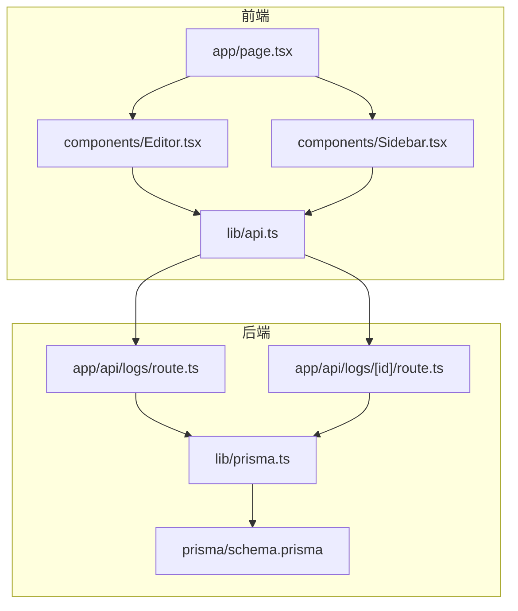
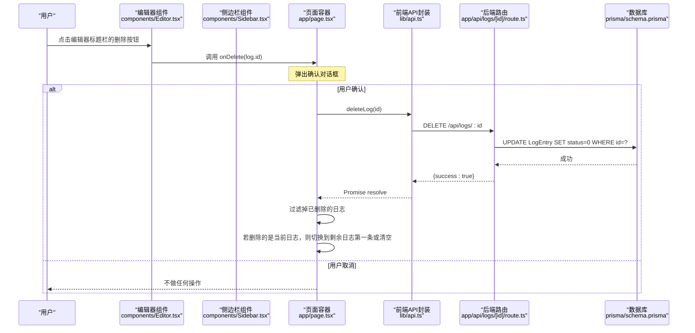
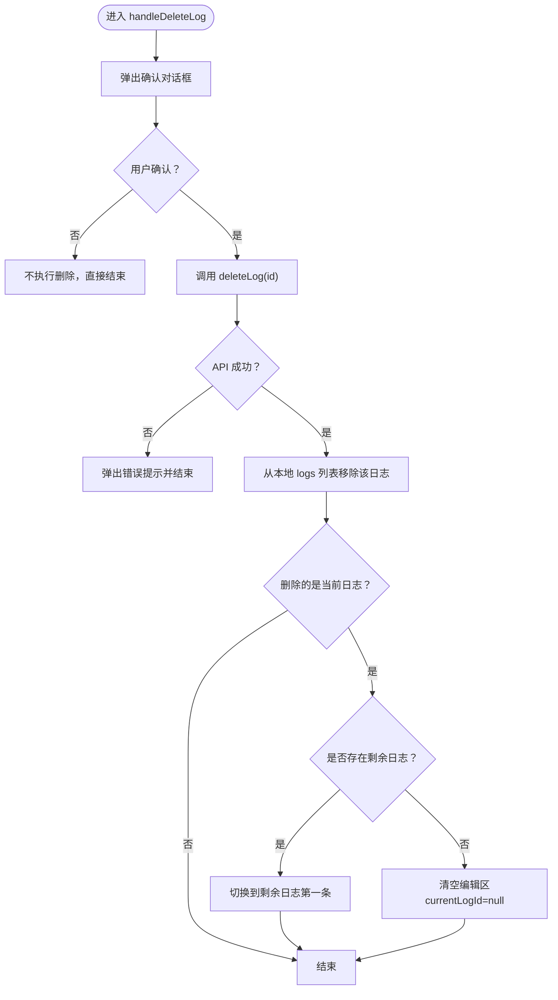
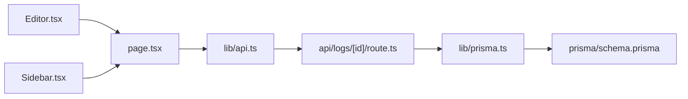

# 日志删除

<cite>
**本文引用的文件**
- [app/page.tsx](file://app/page.tsx)
- [components/Editor.tsx](file://components/Editor.tsx)
- [components/Sidebar.tsx](file://components/Sidebar.tsx)
- [app/api/logs/route.ts](file://app/api/logs/route.ts)
- [app/api/logs/[id]/route.ts](file://app/api/logs/[id]/route.ts)
- [lib/api.ts](file://lib/api.ts)
- [lib/prisma.ts](file://lib/prisma.ts)
- [lib/types.ts](file://lib/types.ts)
- [prisma/schema.prisma](file://prisma/schema.prisma)
</cite>

## 目录
1. [简介](#简介)
2. [项目结构](#项目结构)
3. [核心组件](#核心组件)
4. [架构总览](#架构总览)
5. [详细组件分析](#详细组件分析)
6. [依赖分析](#依赖分析)
7. [性能考虑](#性能考虑)
8. [故障排查指南](#故障排查指南)
9. [结论](#结论)

## 简介
本文件系统性文档化“日志删除”功能的实现细节，覆盖从前端交互到后端软删除的完整链路。重点包括：
- 用户点击删除图标触发的回调链路
- 前端确认对话框后调用 deleteLog API 的过程
- 后端通过 Prisma 将日志 status 字段置为非 1 值（软删除）的实现
- 删除当前编辑日志时的上下文切换逻辑（自动选中剩余日志中的第一条或清空编辑区）
- 错误处理流程（网络失败时的提示）
- 删除操作对排序状态（sortOrder）的影响与清理策略

## 项目结构
该功能涉及以下关键文件：
- 前端入口与状态管理：app/page.tsx
- 编辑器组件：components/Editor.tsx
- 侧边栏组件：components/Sidebar.tsx
- 前端 API 封装：lib/api.ts
- 后端日志路由：app/api/logs/route.ts、app/api/logs/[id]/route.ts
- 数据库客户端：lib/prisma.ts
- 类型定义：lib/types.ts
- 数据库模型：prisma/schema.prisma

图表来源
- [app/page.tsx](file://app/page.tsx#L1-L209)
- [components/Editor.tsx](file://components/Editor.tsx#L1-L457)
- [components/Sidebar.tsx](file://components/Sidebar.tsx#L1-L234)
- [lib/api.ts](file://lib/api.ts#L1-L56)
- [app/api/logs/route.ts](file://app/api/logs/route.ts#L1-L38)
- [app/api/logs/[id]/route.ts](file://app/api/logs/[id]/route.ts#L1-L69)
- [lib/prisma.ts](file://lib/prisma.ts#L1-L12)
- [prisma/schema.prisma](file://prisma/schema.prisma#L1-L26)

章节来源
- [app/page.tsx](file://app/page.tsx#L1-L209)
- [components/Editor.tsx](file://components/Editor.tsx#L1-L457)
- [components/Sidebar.tsx](file://components/Sidebar.tsx#L1-L234)
- [lib/api.ts](file://lib/api.ts#L1-L56)
- [app/api/logs/route.ts](file://app/api/logs/route.ts#L1-L38)
- [app/api/logs/[id]/route.ts](file://app/api/logs/[id]/route.ts#L1-L69)
- [lib/prisma.ts](file://lib/prisma.ts#L1-L12)
- [prisma/schema.prisma](file://prisma/schema.prisma#L1-L26)

## 核心组件
- 页面状态与删除主流程：app/page.tsx 中的 handleDeleteLog 负责弹窗确认、调用 API、更新本地 logs 列表，并在删除当前编辑日志时进行上下文切换。
- 编辑器删除入口：components/Editor.tsx 在标题栏提供删除按钮，点击后调用 onDelete 回调（即父组件传入的 handleDeleteLog）。
- 侧边栏删除入口：components/Sidebar.tsx 在每条日志项右侧显示删除按钮，点击后调用 onDeleteLog 回调。
- 前端 API 封装：lib/api.ts 的 deleteLog 方法封装了删除请求，返回 Promise<void>。
- 后端路由：app/api/logs/[id]/route.ts 的 DELETE 方法执行软删除，将 status 设为 0；app/api/logs/route.ts 的 GET 方法仅查询 status=1 的日志，确保软删除对查询可见性生效。
- 数据库客户端与模型：lib/prisma.ts 提供全局 PrismaClient；prisma/schema.prisma 定义 LogEntry 模型及默认 status=1。

章节来源
- [app/page.tsx](file://app/page.tsx#L88-L103)
- [components/Editor.tsx](file://components/Editor.tsx#L267-L275)
- [components/Sidebar.tsx](file://components/Sidebar.tsx#L192-L205)
- [lib/api.ts](file://lib/api.ts#L34-L41)
- [app/api/logs/[id]/route.ts](file://app/api/logs/[id]/route.ts#L52-L69)
- [app/api/logs/route.ts](file://app/api/logs/route.ts#L4-L16)
- [lib/prisma.ts](file://lib/prisma.ts#L1-L12)
- [prisma/schema.prisma](file://prisma/schema.prisma#L13-L25)

## 架构总览
下面的序列图展示了从用户点击删除图标到后端软删除并更新前端状态的完整流程。

图表来源
- [components/Editor.tsx](file://components/Editor.tsx#L267-L275)
- [components/Sidebar.tsx](file://components/Sidebar.tsx#L192-L205)
- [app/page.tsx](file://app/page.tsx#L88-L103)
- [lib/api.ts](file://lib/api.ts#L34-L41)
- [app/api/logs/[id]/route.ts](file://app/api/logs/[id]/route.ts#L52-L69)
- [prisma/schema.prisma](file://prisma/schema.prisma#L13-L25)

## 详细组件分析

### 前端删除主流程（app/page.tsx）
- 触发点：编辑器与侧边栏均通过回调 onDeleteLog/onDelete 调用 handleDeleteLog。
- 确认对话框：使用浏览器 confirm 弹窗进行二次确认。
- 调用 API：调用 deleteLog(id)，内部发起 DELETE 请求。
- 成功处理：过滤掉已删除的日志；若删除的是当前日志，则自动切换到剩余日志的第一条，否则保持不变；若无剩余日志则清空编辑区。
- 错误处理：捕获异常并弹出提示，同时保留本地状态不变，便于用户重试。

图表来源
- [app/page.tsx](file://app/page.tsx#L88-L103)

章节来源
- [app/page.tsx](file://app/page.tsx#L88-L103)

### 编辑器删除入口（components/Editor.tsx）
- 删除按钮位于标题栏右侧，点击后直接调用 onDelete(log.id)。
- onDelete 是父组件传入的回调，通常指向页面容器的 handleDeleteLog。

章节来源
- [components/Editor.tsx](file://components/Editor.tsx#L267-L275)

### 侧边栏删除入口（components/Sidebar.tsx）
- 每条日志项右侧显示删除按钮，鼠标悬停时出现，点击后调用 onDeleteLog(log.id)。
- onDeleteLog 同样指向页面容器的 handleDeleteLog。

章节来源
- [components/Sidebar.tsx](file://components/Sidebar.tsx#L192-L205)

### 前端 API 封装（lib/api.ts）
- deleteLog(id) 发起 DELETE 请求至 /api/logs/:id。
- 对非 2xx 响应抛出异常，交由调用方处理（例如页面容器的 try/catch）。

章节来源
- [lib/api.ts](file://lib/api.ts#L34-L41)

### 后端软删除实现（app/api/logs/[id]/route.ts）
- DELETE 方法使用 Prisma 更新日志状态为 0，从而实现软删除。
- 查询接口（GET /api/logs/[id]）在读取单条日志时仅允许 status=1 的记录，确保软删除对查询可见性生效。

章节来源
- [app/api/logs/[id]/route.ts](file://app/api/logs/[id]/route.ts#L52-L69)
- [app/api/logs/route.ts](file://app/api/logs/route.ts#L4-L16)

### 数据库模型与默认值（prisma/schema.prisma）
- LogEntry 模型包含 status 字段，默认值为 1。
- 查询日志时默认只取 status=1 的记录，配合后端软删除策略。

章节来源
- [prisma/schema.prisma](file://prisma/schema.prisma#L13-L25)

### 类型与状态约定（lib/types.ts）
- LogEntry 包含 status 字段，配合后端默认值与软删除策略。
- Status 枚举定义了 DELETED=0、ACTIVE=1，便于前后端统一理解状态语义。

章节来源
- [lib/types.ts](file://lib/types.ts#L1-L34)

## 依赖分析
- 组件耦合
  - Editor 与 Sidebar 通过回调 onDelete/onDeleteLog 与页面容器解耦，降低耦合度。
  - 页面容器集中处理删除逻辑，避免重复代码。
- 外部依赖
  - 前端 API 封装依赖 Next.js App Router 的动态路由（/api/logs/[id]）。
  - 后端 Prisma 客户端连接 SQLite 数据库，遵循 schema.prisma 的模型定义。
- 潜在循环依赖
  - 当前结构清晰，无明显循环依赖迹象。

图表来源
- [components/Editor.tsx](file://components/Editor.tsx#L1-L457)
- [components/Sidebar.tsx](file://components/Sidebar.tsx#L1-L234)
- [app/page.tsx](file://app/page.tsx#L1-L209)
- [lib/api.ts](file://lib/api.ts#L1-L56)
- [app/api/logs/[id]/route.ts](file://app/api/logs/[id]/route.ts#L1-L69)
- [lib/prisma.ts](file://lib/prisma.ts#L1-L12)
- [prisma/schema.prisma](file://prisma/schema.prisma#L1-L26)

章节来源
- [components/Editor.tsx](file://components/Editor.tsx#L1-L457)
- [components/Sidebar.tsx](file://components/Sidebar.tsx#L1-L234)
- [app/page.tsx](file://app/page.tsx#L1-L209)
- [lib/api.ts](file://lib/api.ts#L1-L56)
- [app/api/logs/[id]/route.ts](file://app/api/logs/[id]/route.ts#L1-L69)
- [lib/prisma.ts](file://lib/prisma.ts#L1-L12)
- [prisma/schema.prisma](file://prisma/schema.prisma#L1-L26)

## 性能考虑
- 前端过滤与切换：删除后对 logs 数组进行过滤与查找，时间复杂度 O(n)；n 为日志总数。当前应用规模较小，影响有限。
- 排序状态（sortOrder）：删除不会直接影响排序数组，但会影响排序展示。建议在删除后同步清理排序数组中被删除项的残留 ID，避免后续渲染错位。
- 数据库写入：软删除仅更新 status 字段，开销极小，无需额外索引优化。

## 故障排查指南
- 删除后仍出现在列表
  - 检查后端 GET /api/logs 是否正确过滤 status=1（仅返回有效日志）。
  - 确认前端是否在 handleDeleteLog 中正确过滤 logs 并更新 currentLogId。
- 删除后编辑区未清空
  - 确认删除的是当前日志且 logs 中无剩余项时，页面逻辑会将 currentLogId 设为 null。
- 网络失败
  - 前端 deleteLog 对非 2xx 响应会抛出异常，页面容器捕获后弹出提示。请检查网络与后端响应状态码。
- 排序错乱
  - 删除后建议清理 sortOrder 中的已删除 ID，避免后续渲染错位。

章节来源
- [app/api/logs/route.ts](file://app/api/logs/route.ts#L4-L16)
- [app/page.tsx](file://app/page.tsx#L88-L103)
- [lib/api.ts](file://lib/api.ts#L34-L41)

## 结论
本功能采用“软删除”策略，通过将日志 status 置为非 1 值实现不可见删除，既保证了数据完整性，又简化了恢复流程。前端在删除确认后调用 deleteLog API，成功后更新本地状态并处理当前编辑日志的上下文切换。后端路由负责执行软删除并确保查询可见性。整体实现简洁可靠，具备良好的扩展性与维护性。