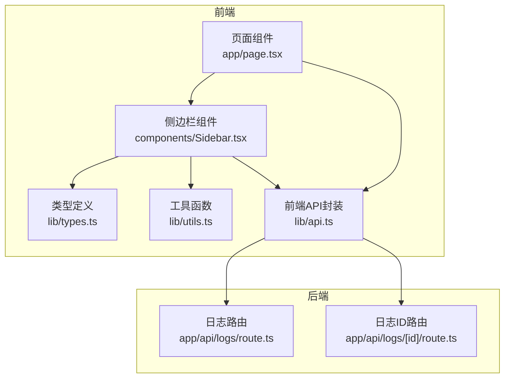
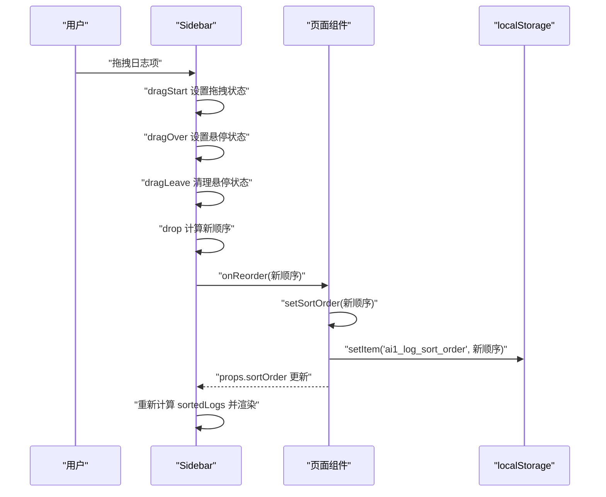
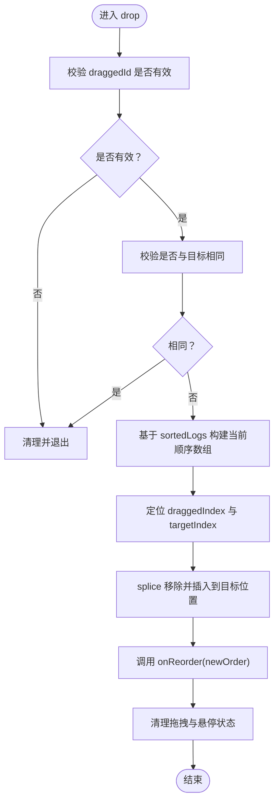
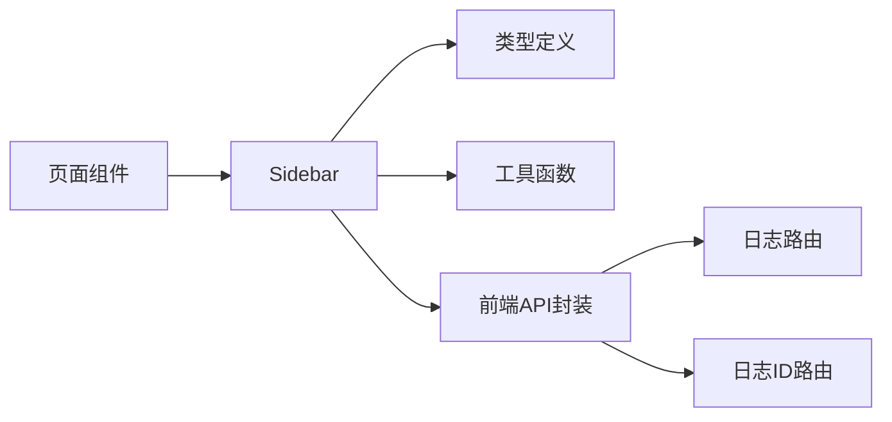

# 日志排序

<cite>
**本文引用的文件**
- [components/Sidebar.tsx](file://components/Sidebar.tsx)
- [app/page.tsx](file://app/page.tsx)
- [lib/types.ts](file://lib/types.ts)
- [lib/utils.ts](file://lib/utils.ts)
- [lib/api.ts](file://lib/api.ts)
- [app/api/logs/route.ts](file://app/api/logs/route.ts)
- [app/api/logs/[id]/route.ts](file://app/api/logs/[id]/route.ts)
</cite>

## 目录
1. [简介](#简介)
2. [项目结构](#项目结构)
3. [核心组件](#核心组件)
4. [架构总览](#架构总览)
5. [详细组件分析](#详细组件分析)
6. [依赖分析](#依赖分析)
7. [性能考虑](#性能考虑)
8. [故障排查指南](#故障排查指南)
9. [结论](#结论)

## 简介
本文件深入解析“日志拖拽排序”功能的技术实现，围绕 Sidebar 组件中的 HTML5 Drag & Drop API 使用，说明 dragStart、dragOver、drop 等事件处理逻辑；解释排序状态（sortOrder）在内存中维护并通过 localStorage 实现持久化存储；阐述 sortedLogs 的排序算法优先级规则：自定义排序优先，未参与排序的日志按创建时间倒序排列；结合代码说明拖拽视觉反馈（半透明效果、高亮边框）的实现方式，并讨论性能优化点（事件防抖与 DOM 引用管理）。

## 项目结构
该功能涉及前端组件与后端 API 的协作：
- 前端页面负责加载日志、维护排序状态、持久化存储，并将排序状态传递给 Sidebar。
- Sidebar 负责渲染日志列表、响应拖拽事件、计算当前可视顺序并回调父组件更新排序。
- 后端提供日志的增删改查接口，确保数据一致性。

图表来源
- [app/page.tsx](file://app/page.tsx#L1-L209)
- [components/Sidebar.tsx](file://components/Sidebar.tsx#L1-L234)
- [lib/types.ts](file://lib/types.ts#L1-L34)
- [lib/utils.ts](file://lib/utils.ts#L148-L168)
- [lib/api.ts](file://lib/api.ts#L1-L56)
- [app/api/logs/route.ts](file://app/api/logs/route.ts#L1-L38)
- [app/api/logs/[id]/route.ts](file://app/api/logs/[id]/route.ts#L1-L69)

章节来源
- [app/page.tsx](file://app/page.tsx#L1-L209)
- [components/Sidebar.tsx](file://components/Sidebar.tsx#L1-L234)
- [lib/types.ts](file://lib/types.ts#L1-L34)
- [lib/utils.ts](file://lib/utils.ts#L148-L168)
- [lib/api.ts](file://lib/api.ts#L1-L56)
- [app/api/logs/route.ts](file://app/api/logs/route.ts#L1-L38)
- [app/api/logs/[id]/route.ts](file://app/api/logs/[id]/route.ts#L1-L69)

## 核心组件
- 页面组件（Home）负责：
  - 初始化并加载日志列表。
  - 从 localStorage 读取排序顺序，若存在则应用，否则默认按最新创建时间选择当前日志。
  - 维护 sortOrder 状态并在用户拖拽排序时更新本地状态与持久化存储。
- Sidebar 组件负责：
  - 基于 sortOrder 与日志 createTime 计算可视顺序（sortedLogs）。
  - 处理拖拽事件（dragStart、dragOver、dragLeave、dragEnd、drop），更新拖拽状态并在放置时回调父组件 onReorder。
  - 渲染日志项，提供拖拽手柄与删除按钮，并根据拖拽状态显示半透明与高亮边框等视觉反馈。

章节来源
- [app/page.tsx](file://app/page.tsx#L1-L209)
- [components/Sidebar.tsx](file://components/Sidebar.tsx#L1-L234)

## 架构总览
下图展示从用户拖拽到状态持久化的完整流程。

图表来源
- [components/Sidebar.tsx](file://components/Sidebar.tsx#L53-L110)
- [app/page.tsx](file://app/page.tsx#L10-L36)

## 详细组件分析

### Sidebar 组件：拖拽交互与排序
- 状态管理
  - 内部状态：hoveredLogId、draggedId、dragOverId。
  - DOM 引用：dragNodeRef 用于对被拖拽元素设置半透明样式。
- 排序逻辑（sortedLogs）
  - 依据 sortOrder 中的 id 位置进行排序；未在 sortOrder 中的日志排在前面，并按 createTime 倒序排列。
  - 该逻辑确保“自定义排序优先”，同时未参与排序的日志仍保持可见性与可访问性。
- 拖拽事件处理
  - dragStart：设置拖拽状态，写入 dataTransfer，延迟半透明样式以保证视觉反馈。
  - dragOver：阻止默认行为，设置 dropEffect，当目标不是拖拽源时设置 dragOverId。
  - dragLeave：清理 dragOverId。
  - dragEnd：清理拖拽与悬停状态，恢复被拖拽元素的不透明度。
  - drop：校验有效性，计算当前可视顺序，移除并插入到目标位置，调用 onReorder 回传新顺序，最后清理状态。
- 视觉反馈
  - 被拖拽元素：降低不透明度。
  - 悬停目标：高亮边框与浅色背景。
  - 拖拽手柄：仅在鼠标悬停时显示，提升可用性。
- 性能与健壮性
  - 使用 useRef 管理被拖拽元素的 DOM 引用，避免每次渲染创建新引用。
  - 在拖拽开始时使用微小延迟设置样式，减少闪烁。
  - 对 drop 前的边界条件进行快速判断（空拖拽、同源放置）。

图表来源
- [components/Sidebar.tsx](file://components/Sidebar.tsx#L89-L110)

章节来源
- [components/Sidebar.tsx](file://components/Sidebar.tsx#L1-L234)

### 页面组件：排序状态维护与持久化
- 初始化与加载
  - 组件挂载时从 localStorage 读取排序顺序，若解析失败则回退为空数组。
  - 加载日志后，若存在排序顺序，则取第一个仍存在的日志作为当前日志；否则默认选择最新日志。
- 排序更新
  - handleReorder 接收新顺序，更新本地状态并写入 localStorage。
- 与 Sidebar 的交互
  - 将 sortOrder 与 onReorder 作为 props 传入 Sidebar，使 Sidebar 能够回调更新排序。

章节来源
- [app/page.tsx](file://app/page.tsx#L10-L36)
- [app/page.tsx](file://app/page.tsx#L38-L62)

### 类型与工具
- 类型定义
  - LogEntry 包含 id、createTime、updateTime、status、creatorId、title、content 等字段，用于 Sidebar 渲染与排序。
- 工具函数
  - formatDate 用于将时间戳格式化为中文本地化字符串，用于 UI 展示。
- API 封装
  - 提供 fetchLogs、createLog、updateLog、deleteLog 等方法，统一错误处理与返回值。

章节来源
- [lib/types.ts](file://lib/types.ts#L1-L34)
- [lib/utils.ts](file://lib/utils.ts#L148-L168)
- [lib/api.ts](file://lib/api.ts#L1-L56)

### 后端 API
- GET /api/logs：按 createTime 降序返回状态为正常的日志列表。
- POST /api/logs：创建新日志。
- PUT /api/logs/[id]：更新指定日志。
- DELETE /api/logs/[id]：将日志状态置为删除（软删除）。

章节来源
- [app/api/logs/route.ts](file://app/api/logs/route.ts#L1-L38)
- [app/api/logs/[id]/route.ts](file://app/api/logs/[id]/route.ts#L1-L69)

## 依赖分析
- 组件耦合
  - Sidebar 依赖页面组件提供的 sortOrder 与 onReorder，形成单向数据流。
  - Sidebar 依赖类型定义与工具函数，用于渲染与排序。
- 外部依赖
  - localStorage 用于持久化排序顺序。
  - 前端 API 封装与后端路由共同保障数据一致性。
- 潜在循环依赖
  - 当前结构为单向依赖（页面 -> Sidebar -> API），无循环依赖风险。

图表来源
- [app/page.tsx](file://app/page.tsx#L1-L209)
- [components/Sidebar.tsx](file://components/Sidebar.tsx#L1-L234)
- [lib/types.ts](file://lib/types.ts#L1-L34)
- [lib/utils.ts](file://lib/utils.ts#L148-L168)
- [lib/api.ts](file://lib/api.ts#L1-L56)
- [app/api/logs/route.ts](file://app/api/logs/route.ts#L1-L38)
- [app/api/logs/[id]/route.ts](file://app/api/logs/[id]/route.ts#L1-L69)

章节来源
- [app/page.tsx](file://app/page.tsx#L1-L209)
- [components/Sidebar.tsx](file://components/Sidebar.tsx#L1-L234)
- [lib/types.ts](file://lib/types.ts#L1-L34)
- [lib/utils.ts](file://lib/utils.ts#L148-L168)
- [lib/api.ts](file://lib/api.ts#L1-L56)
- [app/api/logs/route.ts](file://app/api/logs/route.ts#L1-L38)
- [app/api/logs/[id]/route.ts](file://app/api/logs/[id]/route.ts#L1-L69)

## 性能考虑
- 事件防抖
  - 当前实现未使用显式的防抖策略。在高频拖拽场景中，建议对 dragOver 的状态更新进行节流/防抖，以减少不必要的重渲染与样式切换。
- DOM 引用管理
  - 使用 useRef 管理被拖拽元素的 DOM 引用，避免每次渲染创建新引用，降低 React 与浏览器的开销。
- 排序复杂度
  - sortedLogs 使用 indexOf 查找索引，整体复杂度为 O(n^2)。对于较大的日志列表，可考虑：
    - 将 sortOrder 映射为 id->index 的字典，查找复杂度降为 O(1)。
    - 仅在 sortOrder 或 logs 变更时重新计算排序结果。
- 视觉反馈最小化
  - 仅在必要时修改样式（拖拽开始/结束、悬停变化），避免在 dragOver 中频繁切换类名。
- 本地存储
  - localStorage 写入发生在用户拖拽结束时，避免频繁 IO；解析与序列化在初始化阶段执行，减少运行时负担。

## 故障排查指南
- 拖拽无效或无法放置
  - 检查 drop 事件是否被正确阻止默认行为（preventDefault）。
  - 确认 draggedId 与 targetId 均有效且不相等。
  - 确保 onReorder 回调被正确传入并执行。
- 排序顺序异常
  - 确认 localStorage 中的排序数组与日志 id 集合一致，避免出现不存在的 id。
  - 若存在历史数据损坏，页面组件会回退为空数组，重新拖拽即可修复。
- 视觉反馈不生效
  - 确认拖拽开始时的样式设置是否在微小延迟后执行。
  - 检查被拖拽元素的 ref 是否正确绑定到对应节点。
- 时间排序不符合预期
  - sortedLogs 的未参与排序日志按 createTime 倒序排列，确认 createTime 字段正确且为可解析的时间类型。

章节来源
- [components/Sidebar.tsx](file://components/Sidebar.tsx#L53-L110)
- [app/page.tsx](file://app/page.tsx#L10-L36)

## 结论
该日志拖拽排序功能通过 HTML5 Drag & Drop API 与 React 状态管理实现了直观的用户交互体验。Sidebar 负责事件处理与视觉反馈，页面组件负责状态维护与持久化。排序算法采用“自定义排序优先、未参与排序的日志按创建时间倒序”的策略，兼顾了灵活性与易用性。通过 DOM 引用管理与潜在的事件防抖优化，可在更大规模的数据集上进一步提升性能与稳定性。