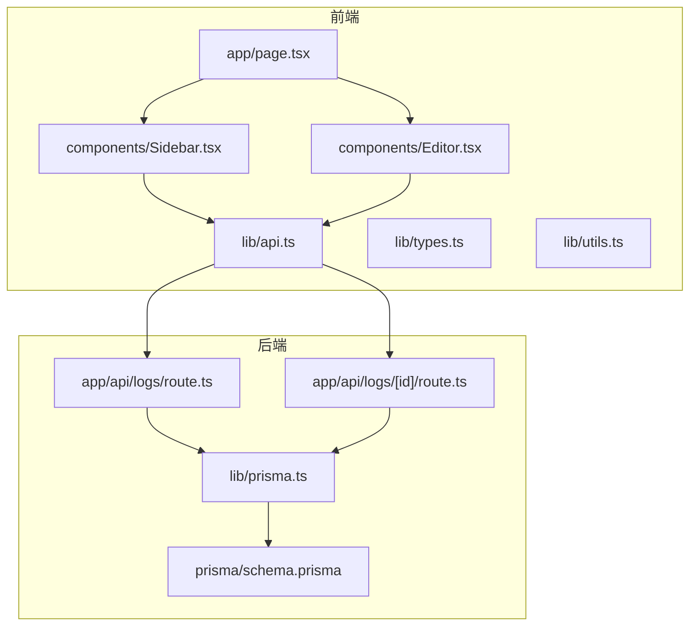
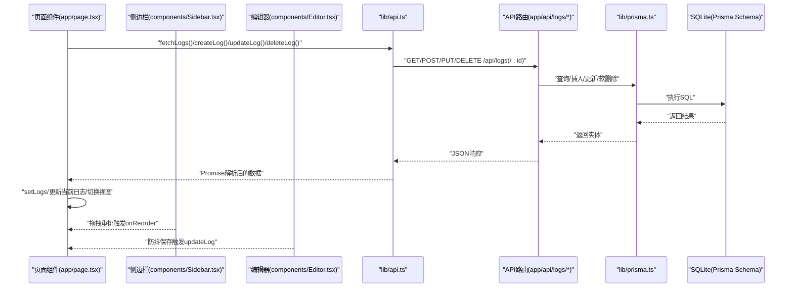
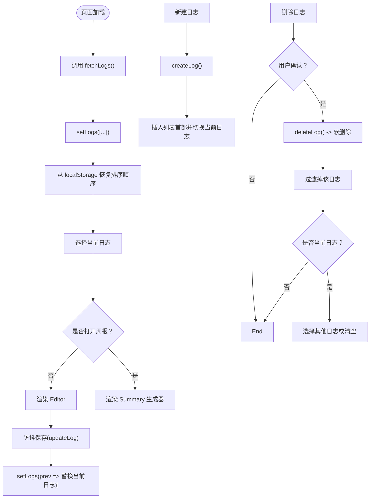
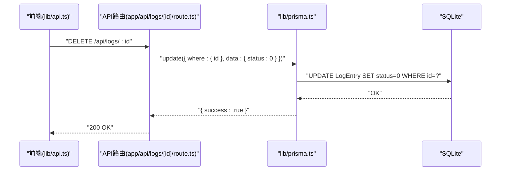
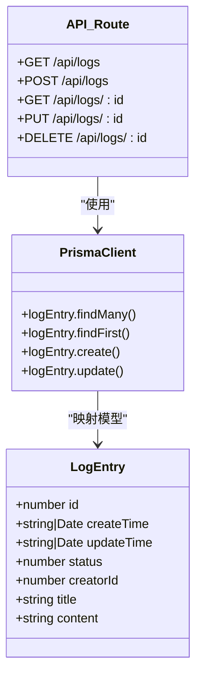
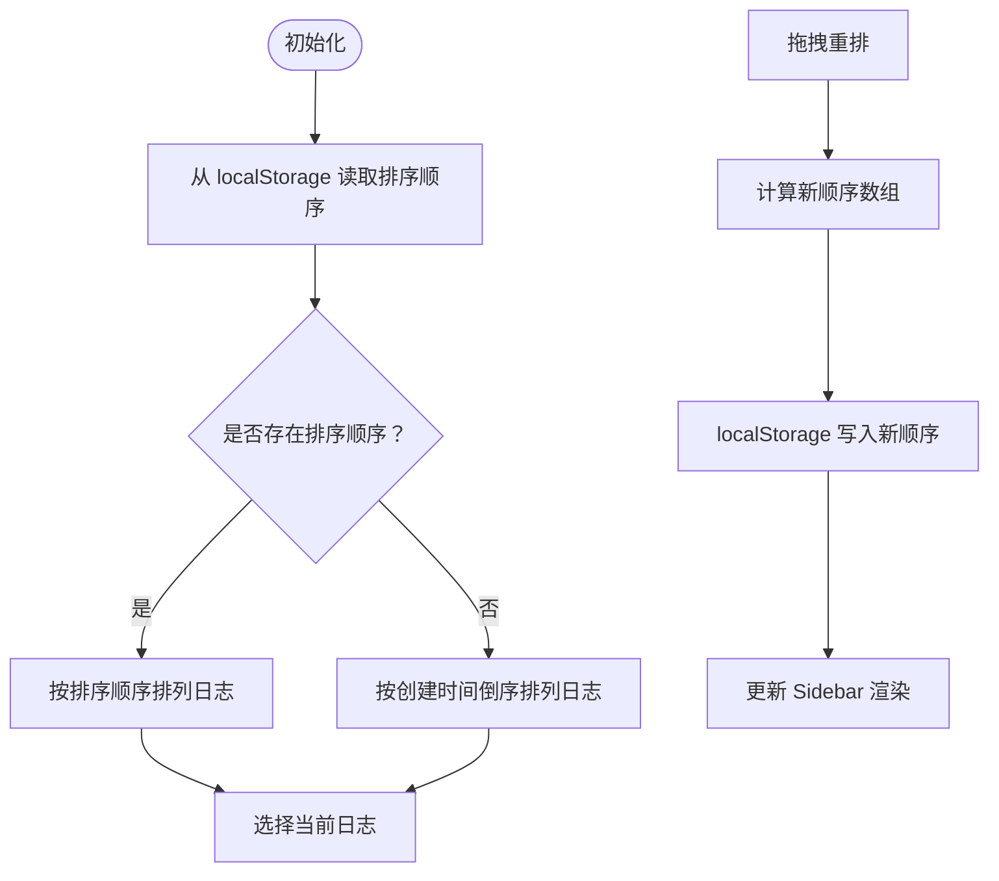
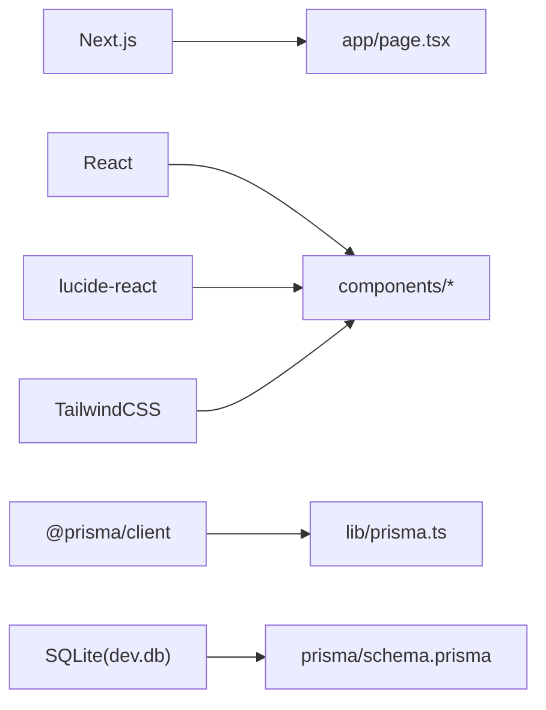

# 日志管理

<cite>
**本文引用的文件**
- [README.md](file://README.md)
- [package.json](file://package.json)
- [app/page.tsx](file://app/page.tsx)
- [app/api/logs/route.ts](file://app/api/logs/route.ts)
- [app/api/logs/[id]/route.ts](file://app/api/logs/[id]/route.ts)
- [lib/api.ts](file://lib/api.ts)
- [lib/prisma.ts](file://lib/prisma.ts)
- [lib/types.ts](file://lib/types.ts)
- [lib/utils.ts](file://lib/utils.ts)
- [components/Sidebar.tsx](file://components/Sidebar.tsx)
- [components/Editor.tsx](file://components/Editor.tsx)
- [prisma/schema.prisma](file://prisma/schema.prisma)
- [config/数据库表规范.md](file://config/数据库表规范.md)
- [doc/数据关系图.md](file://doc/数据关系图.md)
</cite>

## 目录
1. [简介](#简介)
2. [项目结构](#项目结构)
3. [核心组件](#核心组件)
4. [架构总览](#架构总览)
5. [详细组件分析](#详细组件分析)
6. [依赖分析](#依赖分析)
7. [性能考量](#性能考量)
8. [故障排查指南](#故障排查指南)
9. [结论](#结论)
10. [附录](#附录)

## 简介
本项目提供一个简洁的日志记录与管理功能，支持日志的创建、读取、更新、删除（CRUD），采用软删除策略，结合前端本地持久化与后端数据库操作，实现日志列表的排序与实时状态同步。本文档将深入解析前端调用流程（useEffect加载、handleCreateLog等）、API路由处理机制以及Prisma数据库操作链路，并阐述排序逻辑与localStorage持久化的协同工作方式，最后给出扩展生命周期管理或集成回收站功能的实践建议。

## 项目结构
项目采用Next.js应用结构，核心围绕“页面组件 + API路由 + 工具库 + Prisma模型”的分层组织：
- 页面与组件：app/page.tsx负责主界面与状态管理；Sidebar与Editor分别负责侧边栏列表与编辑器。
- API路由：app/api/logs与app/api/logs/[id]提供日志的CRUD接口；app/api/summary提供周报摘要生成接口。
- 工具库：lib/api.ts封装HTTP请求；lib/prisma.ts提供Prisma客户端；lib/types.ts定义类型；lib/utils.ts提供Markdown解析与任务提取等工具。
- 数据库：prisma/schema.prisma定义LogEntry模型；config/数据库表规范.md与doc/数据关系图.md提供表设计规范与ER图。

图表来源
- [app/page.tsx](file://app/page.tsx#L1-L209)
- [components/Sidebar.tsx](file://components/Sidebar.tsx#L1-L234)
- [components/Editor.tsx](file://components/Editor.tsx#L1-L457)
- [lib/api.ts](file://lib/api.ts#L1-L56)
- [app/api/logs/route.ts](file://app/api/logs/route.ts#L1-L38)
- [app/api/logs/[id]/route.ts](file://app/api/logs/[id]/route.ts#L1-L69)
- [lib/prisma.ts](file://lib/prisma.ts#L1-L12)
- [prisma/schema.prisma](file://prisma/schema.prisma#L1-L26)

章节来源
- [README.md](file://README.md#L1-L64)
- [package.json](file://package.json#L1-L30)

## 核心组件
- 页面与状态管理：app/page.tsx通过useState与useEffect管理日志列表、当前日志、视图模式、移动端菜单、加载状态与排序顺序；提供创建、更新、删除日志的事件处理函数。
- 侧边栏：components/Sidebar.tsx展示日志列表，支持拖拽重排、选择日志、删除日志与打开周报生成器；排序逻辑基于localStorage中的自定义顺序与创建时间。
- 编辑器：components/Editor.tsx负责日志内容的块级编辑、自动保存（防抖）、快捷键处理、导入上一条日志未完成任务等功能。
- API封装：lib/api.ts封装fetch请求，统一错误处理与响应解析。
- 数据库：lib/prisma.ts提供全局唯一的PrismaClient实例；prisma/schema.prisma定义LogEntry模型与SQLite数据源。

章节来源
- [app/page.tsx](file://app/page.tsx#L1-L209)
- [components/Sidebar.tsx](file://components/Sidebar.tsx#L1-L234)
- [components/Editor.tsx](file://components/Editor.tsx#L1-L457)
- [lib/api.ts](file://lib/api.ts#L1-L56)
- [lib/prisma.ts](file://lib/prisma.ts#L1-L12)
- [prisma/schema.prisma](file://prisma/schema.prisma#L1-L26)

## 架构总览
从前端到后端的数据流如下：
- 前端通过lib/api.ts发起HTTP请求至app/api/logs与app/api/logs/[id]。
- API路由使用lib/prisma.ts访问PrismaClient，执行数据库查询或写入。
- 前端根据响应更新本地状态，实现UI即时反馈。

图表来源
- [app/page.tsx](file://app/page.tsx#L1-L209)
- [components/Sidebar.tsx](file://components/Sidebar.tsx#L1-L234)
- [components/Editor.tsx](file://components/Editor.tsx#L1-L457)
- [lib/api.ts](file://lib/api.ts#L1-L56)
- [app/api/logs/route.ts](file://app/api/logs/route.ts#L1-L38)
- [app/api/logs/[id]/route.ts](file://app/api/logs/[id]/route.ts#L1-L69)
- [lib/prisma.ts](file://lib/prisma.ts#L1-L12)
- [prisma/schema.prisma](file://prisma/schema.prisma#L1-L26)

## 详细组件分析

### 前端调用逻辑与状态管理
- 首次加载：页面组件在useEffect中调用fetchLogs，拉取状态为“正常”的日志并设置当前日志；同时从localStorage恢复排序顺序。
- 创建日志：handleCreateLog调用createLog，成功后将新日志插入列表首部并切换到编辑视图。
- 更新日志：Editor内部通过防抖保存，当内容或标题变化时调用updateLog，成功后替换本地缓存中的对应日志。
- 删除日志：handleDeleteLog在用户确认后调用deleteLog，执行软删除并将本地列表移除；若删除的是当前日志，则切换到其他日志或清空。
- 视图切换：页面组件维护ViewMode枚举，控制编辑器与周报生成器的显示。

图表来源
- [app/page.tsx](file://app/page.tsx#L1-L209)
- [lib/api.ts](file://lib/api.ts#L1-L56)
- [lib/types.ts](file://lib/types.ts#L1-L34)

章节来源
- [app/page.tsx](file://app/page.tsx#L1-L209)
- [lib/api.ts](file://lib/api.ts#L1-L56)
- [lib/types.ts](file://lib/types.ts#L1-L34)

### API路由处理机制
- GET /api/logs：查询状态为“正常”的日志，按创建时间倒序返回。
- POST /api/logs：创建新日志，默认标题与内容为空，creatorId默认为0。
- GET /api/logs/:id：按ID查询状态为“正常”的日志，不存在则返回404。
- PUT /api/logs/:id：更新指定日志的标题与内容。
- DELETE /api/logs/:id：对指定日志执行软删除，将status置为0。

图表来源
- [app/api/logs/[id]/route.ts](file://app/api/logs/[id]/route.ts#L1-L69)
- [lib/prisma.ts](file://lib/prisma.ts#L1-L12)
- [prisma/schema.prisma](file://prisma/schema.prisma#L1-L26)

章节来源
- [app/api/logs/route.ts](file://app/api/logs/route.ts#L1-L38)
- [app/api/logs/[id]/route.ts](file://app/api/logs/[id]/route.ts#L1-L69)

### Prisma数据库操作链路
- PrismaClient实例：lib/prisma.ts确保开发环境下仅创建一次实例，避免重复连接。
- LogEntry模型：prisma/schema.prisma定义了id、createTime、updateTime、status、creatorId、title、content等字段；status默认为1表示“正常”，删除时置为0表示“软删除”。
- 查询与写入：API路由通过findMany/findFirst/create/update等方法访问数据库；前端通过lib/api.ts封装的fetch进行HTTP调用。

图表来源
- [lib/prisma.ts](file://lib/prisma.ts#L1-L12)
- [prisma/schema.prisma](file://prisma/schema.prisma#L1-L26)
- [app/api/logs/route.ts](file://app/api/logs/route.ts#L1-L38)
- [app/api/logs/[id]/route.ts](file://app/api/logs/[id]/route.ts#L1-L69)

章节来源
- [lib/prisma.ts](file://lib/prisma.ts#L1-L12)
- [prisma/schema.prisma](file://prisma/schema.prisma#L1-L26)
- [config/数据库表规范.md](file://config/数据库表规范.md#L1-L44)
- [doc/数据关系图.md](file://doc/数据关系图.md#L1-L31)

### 日志列表排序逻辑与localStorage持久化
- 排序规则：Sidebar根据localStorage中的自定义顺序（SORT_ORDER_KEY）对日志进行排序；未出现在排序列表中的日志按创建时间倒序排列。
- 拖拽重排：通过HTML5拖拽事件计算当前排序数组，生成新的ID序列并通过onReorder回调更新状态与localStorage。
- 加载策略：页面组件在首次加载时尝试从localStorage恢复排序顺序，若存在则优先使用；否则使用最新日志作为当前日志。

图表来源
- [app/page.tsx](file://app/page.tsx#L1-L209)
- [components/Sidebar.tsx](file://components/Sidebar.tsx#L1-L234)

章节来源
- [app/page.tsx](file://app/page.tsx#L1-L209)
- [components/Sidebar.tsx](file://components/Sidebar.tsx#L1-L234)

### 软删除策略与错误处理
- 软删除：DELETE请求将日志status置为0，API路由返回成功；前端删除逻辑会从本地列表移除并切换当前日志。
- 错误处理：lib/api.ts在响应非ok时抛出错误；页面组件在useEffect与各事件处理器中捕获错误并打印日志；Sidebar与Editor在删除按钮与导入任务等交互中也包含错误提示与确认对话框。
- 用户确认交互：handleDeleteLog在删除前弹出确认框，避免误删。

章节来源
- [app/api/logs/[id]/route.ts](file://app/api/logs/[id]/route.ts#L1-L69)
- [lib/api.ts](file://lib/api.ts#L1-L56)
- [app/page.tsx](file://app/page.tsx#L1-L209)
- [components/Sidebar.tsx](file://components/Sidebar.tsx#L1-L234)
- [components/Editor.tsx](file://components/Editor.tsx#L1-L457)

### 实时状态同步与编辑器防抖保存
- 防抖保存：Editor内部使用useCallback稳定引用与setTimeout实现800ms防抖，避免频繁网络请求；只有内容或标题发生变化时才触发保存。
- 自动聚焦与高度自适应：Editor根据块类型调整输入框高度与光标位置，提升编辑体验。
- 任务继承：Editor提供导入上一条日志未完成任务的功能，自动提取并插入标题上下文与待办事项。

章节来源
- [components/Editor.tsx](file://components/Editor.tsx#L1-L457)
- [lib/utils.ts](file://lib/utils.ts#L1-L168)

## 依赖分析
- 外部依赖：Next.js、React、@prisma/client、lucide-react、TailwindCSS等。
- 开发脚本：db:push用于初始化数据库；build阶段会先生成Prisma客户端。
- 数据库：SQLite作为本地存储，schema.prisma定义LogEntry模型与默认字段。

图表来源
- [package.json](file://package.json#L1-L30)
- [lib/prisma.ts](file://lib/prisma.ts#L1-L12)
- [prisma/schema.prisma](file://prisma/schema.prisma#L1-L26)

章节来源
- [package.json](file://package.json#L1-L30)
- [prisma/schema.prisma](file://prisma/schema.prisma#L1-L26)

## 性能考量
- 防抖保存：编辑器的800ms防抖减少网络请求次数，降低服务器压力。
- 本地排序：Sidebar的排序逻辑在内存中完成，避免每次请求都进行复杂排序。
- 分页与筛选：当前API仅返回“正常”状态的日志，未实现分页；如日志量增大，可考虑增加分页参数与更细粒度的筛选条件。
- 数据库索引：可在高频查询字段（如status、createTime）上建立索引以优化查询性能。

## 故障排查指南
- 数据库初始化失败：执行db:push命令初始化数据库；确认环境变量与SQLite路径正确。
- API请求失败：检查lib/api.ts中的错误抛出与页面组件的错误捕获；查看浏览器Network面板与后端日志。
- 软删除不可见：确认API路由按status=1过滤；前端删除逻辑需同步更新本地状态。
- 排序异常：检查localStorage中排序顺序是否有效；确认Sidebar的排序算法与拖拽逻辑未被覆盖。
- 编辑器无法保存：确认防抖定时器未被清理；检查updateLog调用是否成功返回。

章节来源
- [lib/api.ts](file://lib/api.ts#L1-L56)
- [app/api/logs/route.ts](file://app/api/logs/route.ts#L1-L38)
- [app/api/logs/[id]/route.ts](file://app/api/logs/[id]/route.ts#L1-L69)
- [components/Editor.tsx](file://components/Editor.tsx#L1-L457)
- [components/Sidebar.tsx](file://components/Sidebar.tsx#L1-L234)

## 结论
本项目通过清晰的前后端职责划分与Prisma的ORM能力，实现了日志的CRUD与软删除；前端采用防抖保存与本地排序持久化，提升了用户体验与性能。若需进一步增强，可考虑引入回收站功能、分页与全文检索、更丰富的排序维度与筛选条件，以及更完善的错误提示与回滚机制。

## 附录
- 扩展建议
  - 回收站：新增“回收站”视图，展示status=0的日志，支持批量恢复与彻底删除。
  - 分页与搜索：在GET /api/logs中加入分页参数与关键词搜索，优化大数据量场景。
  - 标签与分类：为LogEntry增加标签字段，支持按标签筛选与聚合统计。
  - 版本历史：记录每次更新的变更快照，支持对比与回滚。
  - 权限与审计：结合creatorId与时间戳，实现操作审计与权限控制。