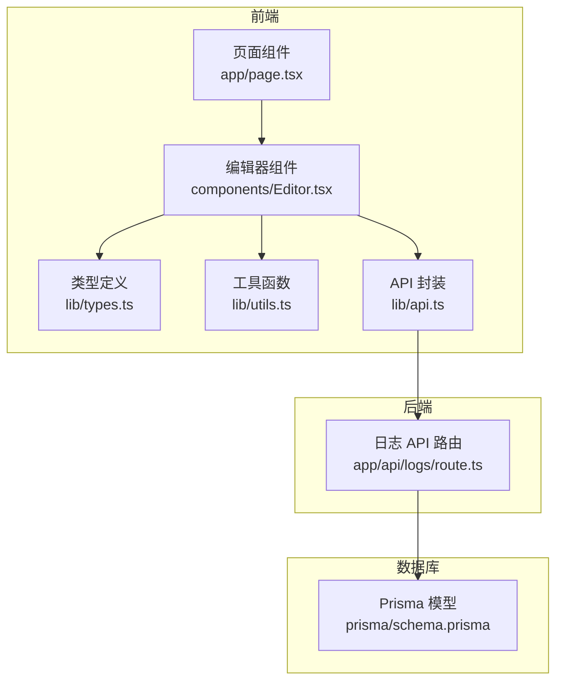
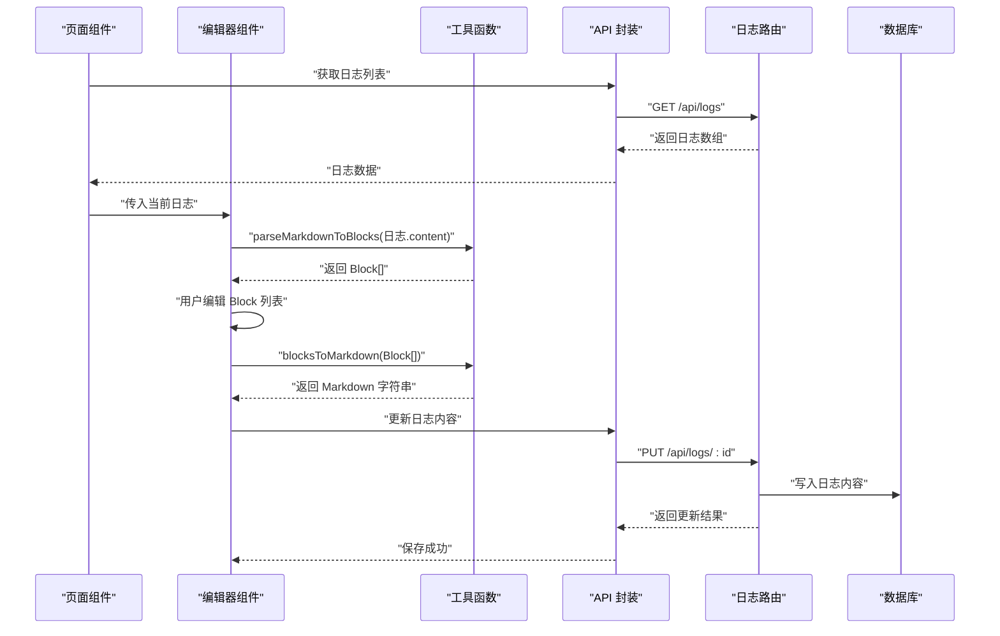
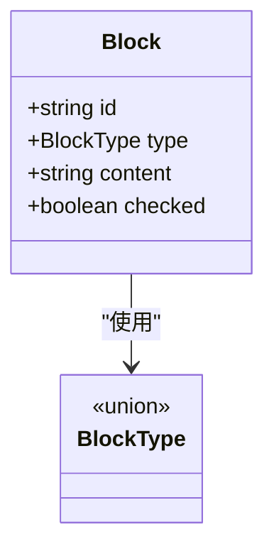
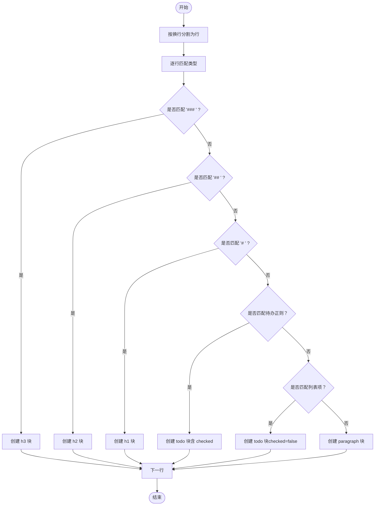
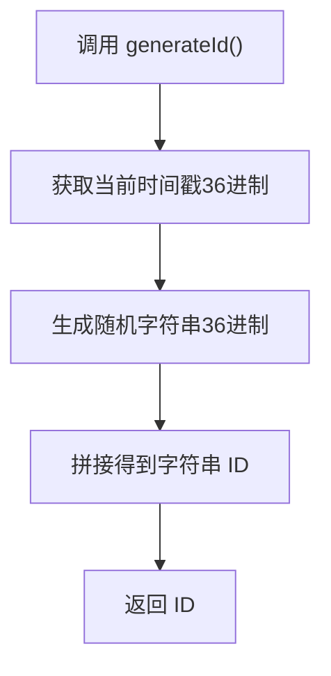
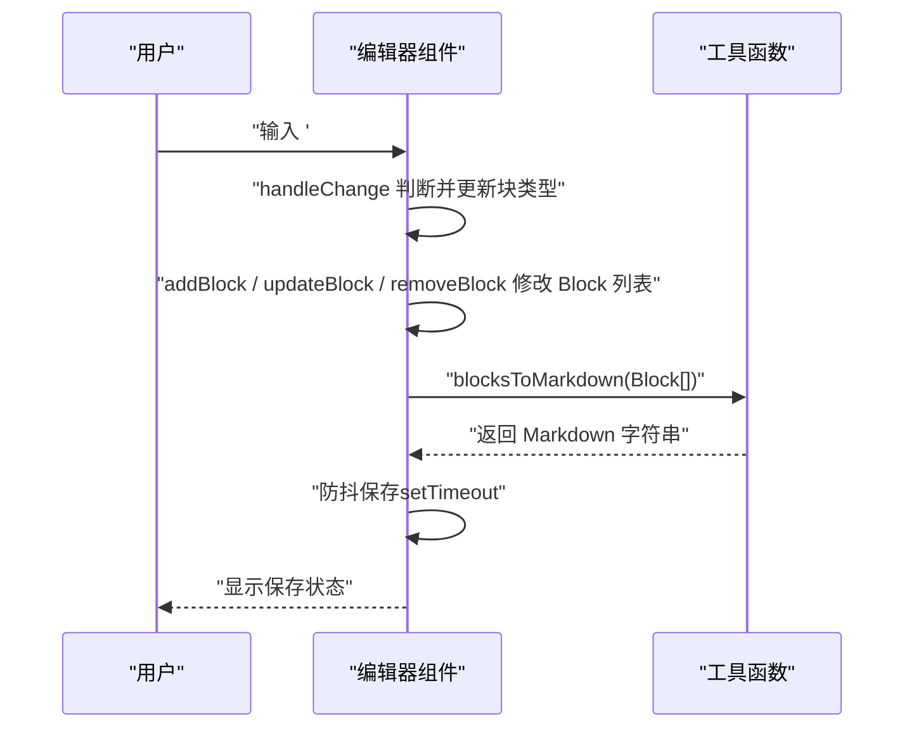
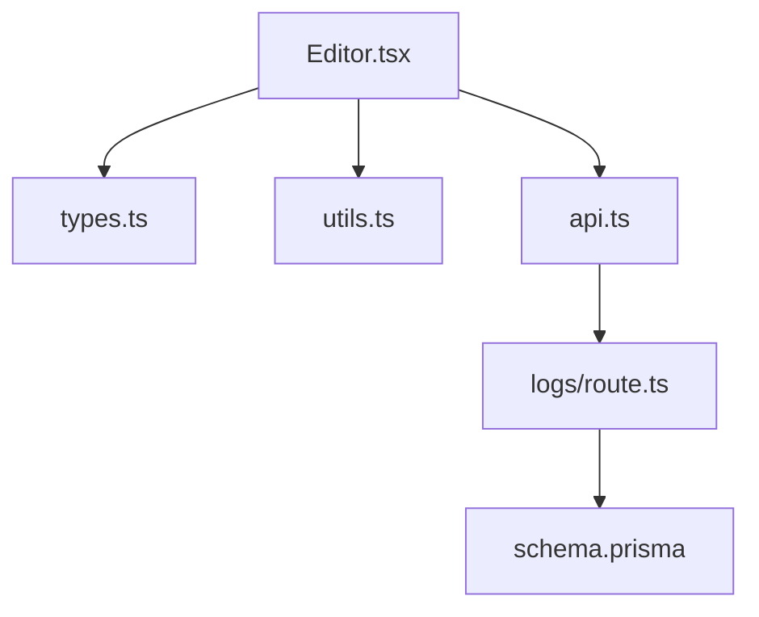

# 块状编辑结构

<cite>
**本文引用的文件**
- [components/Editor.tsx](file://components/Editor.tsx)
- [lib/types.ts](file://lib/types.ts)
- [lib/utils.ts](file://lib/utils.ts)
- [lib/api.ts](file://lib/api.ts)
- [app/api/logs/route.ts](file://app/api/logs/route.ts)
- [app/page.tsx](file://app/page.tsx)
- [prisma/schema.prisma](file://prisma/schema.prisma)
</cite>

## 目录
1. [引言](#引言)
2. [项目结构](#项目结构)
3. [核心组件](#核心组件)
4. [架构总览](#架构总览)
5. [详细组件分析](#详细组件分析)
6. [依赖分析](#依赖分析)
7. [性能考虑](#性能考虑)
8. [故障排查指南](#故障排查指南)
9. [结论](#结论)

## 引言
本文件围绕智能编辑器的“块状数据结构”展开，系统性解析 Block 接口的设计理念与实现细节，并阐明为何采用块结构替代原始字符串存储。我们将从数据模型、编辑器交互、双向转换逻辑、唯一 ID 生成策略等方面进行深入剖析，帮助读者全面理解该设计在结构化操作、状态独立管理与渲染灵活性方面的优势。

## 项目结构
本项目采用 Next.js 应用结构，编辑器功能集中在组件层，数据模型与工具函数位于 lib 层，后端 API 路由负责持久化。与块结构直接相关的关键文件如下：
- lib/types.ts：定义 Block 类型与 BlockType 联合类型
- lib/utils.ts：提供 parseMarkdownToBlocks、blocksToMarkdown、extractUnfinishedTasks、generateId 等工具函数
- components/Editor.tsx：编辑器 UI 与交互逻辑，负责将 Block 列表渲染为可编辑块并处理键盘事件
- app/api/logs/route.ts：后端路由，负责日志的增删改查
- lib/api.ts：前端 API 封装，统一调用后端接口
- app/page.tsx：应用入口，承载日志列表与编辑器视图
- prisma/schema.prisma：数据库模型，日志条目包含 id、title、content 等字段

图表来源
- [app/page.tsx](file://app/page.tsx#L1-L209)
- [components/Editor.tsx](file://components/Editor.tsx#L1-L457)
- [lib/types.ts](file://lib/types.ts#L1-L34)
- [lib/utils.ts](file://lib/utils.ts#L1-L168)
- [lib/api.ts](file://lib/api.ts#L1-L56)
- [app/api/logs/route.ts](file://app/api/logs/route.ts#L1-L38)
- [prisma/schema.prisma](file://prisma/schema.prisma#L1-L25)

章节来源
- [app/page.tsx](file://app/page.tsx#L1-L209)
- [components/Editor.tsx](file://components/Editor.tsx#L1-L457)
- [lib/types.ts](file://lib/types.ts#L1-L34)
- [lib/utils.ts](file://lib/utils.ts#L1-L168)
- [lib/api.ts](file://lib/api.ts#L1-L56)
- [app/api/logs/route.ts](file://app/api/logs/route.ts#L1-L38)
- [prisma/schema.prisma](file://prisma/schema.prisma#L1-L25)

## 核心组件
本节聚焦 Block 接口与 BlockType 联合类型的定义，解释各字段的职责与约束，并说明为什么采用块结构替代原始字符串存储。

- Block 接口字段
  - id：字符串类型，作为块的唯一标识，用于 React 渲染键值与状态追踪
  - type：BlockType 联合类型，限定为 paragraph、todo、h1、h2、h3 之一
  - content：字符串类型，存储块的文本内容
  - checked：布尔可选字段，仅在 todo 类型块中有效，表示任务完成状态

- BlockType 联合类型
  - 支持五种元素：paragraph（普通段落）、todo（待办事项）、h1（一级标题）、h2（二级标题）、h3（三级标题）

- 采用块结构的优势
  - 结构化操作：每个块具备明确类型与状态，便于在编辑器内进行插入、删除、降级、切换等细粒度操作
  - 状态独立管理：todo 的 checked 状态与文本内容分离，UI 与逻辑解耦，提升可维护性
  - 渲染灵活性：不同类型的块可映射到不同的渲染样式与交互控件（如待办复选框、标题菜单）
  - 数据一致性：通过 generateId 生成稳定且低冲突的块 ID，避免因字符串拼接导致的状态错位

章节来源
- [lib/types.ts](file://lib/types.ts#L1-L34)

## 架构总览
编辑器的数据流从后端 API 获取日志内容，进入 Editor 组件后通过 parseMarkdownToBlocks 将 Markdown 字符串解析为 Block 数组；用户编辑时，Editor 通过 updateBlock/addBlock/removeBlock 等方法修改 Block 列表；保存时，Editor 调用 blocksToMarkdown 将 Block 数组还原为 Markdown 字符串并提交到后端。

图表来源
- [app/page.tsx](file://app/page.tsx#L1-L209)
- [components/Editor.tsx](file://components/Editor.tsx#L1-L457)
- [lib/utils.ts](file://lib/utils.ts#L1-L168)
- [lib/api.ts](file://lib/api.ts#L1-L56)
- [app/api/logs/route.ts](file://app/api/logs/route.ts#L1-L38)

## 详细组件分析

### Block 接口与 BlockType 类型定义
- Block 接口字段
  - id：字符串，唯一标识
  - type：BlockType，限定为 paragraph、todo、h1、h2、h3
  - content：字符串，块文本
  - checked：布尔可选，仅 todo 生效
- BlockType 联合类型
  - 五种元素类型，用于区分块的语义与渲染行为

图表来源
- [lib/types.ts](file://lib/types.ts#L1-L34)

章节来源
- [lib/types.ts](file://lib/types.ts#L1-L34)

### Markdown 与块结构的双向转换
- parseMarkdownToBlocks
  - 行分割策略：按换行符拆分为行，逐行匹配类型
  - 正则匹配规则：
    - 三级标题：优先匹配“### ”，再匹配“## ”，最后匹配“# ”
    - 待办事项：支持“- [x] ”、“- [ ] ”、“1. ”、“- ”、“* ”等前缀
    - 普通段落：默认归类为 paragraph
  - 类型推断机制：按优先级顺序匹配，确保“### ”先于“## ”，“## ”先于“# ”，避免误判
- blocksToMarkdown
  - 根据块类型输出对应 Markdown 片段，todo 输出带复选框的格式
  - 使用换行连接所有块，形成最终 Markdown 字符串

图表来源
- [lib/utils.ts](file://lib/utils.ts#L1-L168)

章节来源
- [lib/utils.ts](file://lib/utils.ts#L1-L168)

### 唯一块 ID 生成策略
- generateId
  - 使用时间戳与随机字符串拼接的方式生成字符串 ID，保证在单次运行内的低冲突概率
  - 在解析 Markdown 为块、新增块、导入未完成任务等场景中均调用该函数为块分配唯一 id

图表来源
- [lib/utils.ts](file://lib/utils.ts#L1-L168)

章节来源
- [lib/utils.ts](file://lib/utils.ts#L1-L168)

### 编辑器交互与块状态管理
- 初始化与保存
  - 切换日志时，Editor 使用 parseMarkdownToBlocks 将日志内容解析为 Block 列表
  - 防抖保存：在用户停止编辑一段时间后，调用 blocksToMarkdown 生成 Markdown 并通过 API 更新日志
- 键盘事件与块类型切换
  - Enter：根据当前块类型决定创建 paragraph 还是 todo；空标题降级为 paragraph
  - Backspace：空块时触发降级或删除；todo 空块降级为 paragraph；标题空块按 h1→h2→h3→paragraph 降级
  - 输入“# ”“## ”“### ”：在 paragraph 中触发标题类型切换
  - 输入列表标记：在 paragraph 中触发 todo 类型切换
- 待办状态
  - 点击复选框切换 todo 的 checked 状态
- 导入未完成任务
  - 从上一条日志提取未完成任务，自动补全上级标题上下文，并为每个块重新生成唯一 ID

图表来源
- [components/Editor.tsx](file://components/Editor.tsx#L1-L457)
- [lib/utils.ts](file://lib/utils.ts#L1-L168)

章节来源
- [components/Editor.tsx](file://components/Editor.tsx#L1-L457)
- [lib/utils.ts](file://lib/utils.ts#L1-L168)

### 数据持久化与 API 集成
- 前端 API
  - lib/api.ts 提供 fetchLogs、createLog、updateLog、deleteLog、generateSummary 等封装
- 后端路由
  - app/api/logs/route.ts 实现 GET/POST 等日志 CRUD 接口，读写数据库
- 数据模型
  - prisma/schema.prisma 定义 LogEntry 模型，包含 id、title、content 等字段

图表来源
- [lib/api.ts](file://lib/api.ts#L1-L56)
- [app/api/logs/route.ts](file://app/api/logs/route.ts#L1-L38)
- [prisma/schema.prisma](file://prisma/schema.prisma#L1-L25)

章节来源
- [lib/api.ts](file://lib/api.ts#L1-L56)
- [app/api/logs/route.ts](file://app/api/logs/route.ts#L1-L38)
- [prisma/schema.prisma](file://prisma/schema.prisma#L1-L25)

## 依赖分析
- 组件耦合
  - Editor 依赖 lib/types.ts 的 Block 类型与 lib/utils.ts 的解析/转换/生成 ID 函数
  - Editor 通过 lib/api.ts 调用后端接口，实现数据持久化
- 数据流向
  - parseMarkdownToBlocks 与 blocksToMarkdown 形成闭环，确保编辑器内部状态与后端存储一致
- 外部依赖
  - Next.js 路由与 API 路由
  - Prisma 数据库适配器

图表来源
- [components/Editor.tsx](file://components/Editor.tsx#L1-L457)
- [lib/types.ts](file://lib/types.ts#L1-L34)
- [lib/utils.ts](file://lib/utils.ts#L1-L168)
- [lib/api.ts](file://lib/api.ts#L1-L56)
- [app/api/logs/route.ts](file://app/api/logs/route.ts#L1-L38)
- [prisma/schema.prisma](file://prisma/schema.prisma#L1-L25)

章节来源
- [components/Editor.tsx](file://components/Editor.tsx#L1-L457)
- [lib/types.ts](file://lib/types.ts#L1-L34)
- [lib/utils.ts](file://lib/utils.ts#L1-L168)
- [lib/api.ts](file://lib/api.ts#L1-L56)
- [app/api/logs/route.ts](file://app/api/logs/route.ts#L1-L38)
- [prisma/schema.prisma](file://prisma/schema.prisma#L1-L25)

## 性能考虑
- 解析与渲染
  - parseMarkdownToBlocks 对每行进行一次正则匹配，整体复杂度近似 O(n)，其中 n 为行数
  - blocksToMarkdown 对每个块进行一次格式化输出，复杂度 O(m)，m 为块数
- 防抖保存
  - 编辑器对保存操作设置 800ms 防抖，减少频繁网络请求与数据库写入
- DOM 自适应高度
  - 编辑器根据内容动态调整 textarea 高度，避免滚动与重排开销过大

[本节为通用性能建议，不直接分析具体文件]

## 故障排查指南
- Markdown 解析异常
  - 确认输入格式是否符合正则规则（例如“### ”需在“## ”之前匹配）
  - 检查是否存在空白行导致的空块被错误识别
- 唯一 ID 冲突
  - generateId 使用时间戳与随机字符串拼接，冲突概率较低；若出现异常，检查是否在同一毫秒内大量生成
- 保存失败
  - 查看 API 返回状态与错误信息，确认后端路由与数据库连接正常
- 标题降级逻辑
  - 空标题回车应降级为 paragraph；若未生效，检查键盘事件处理逻辑与块类型判断

章节来源
- [lib/utils.ts](file://lib/utils.ts#L1-L168)
- [components/Editor.tsx](file://components/Editor.tsx#L1-L457)
- [lib/api.ts](file://lib/api.ts#L1-L56)
- [app/api/logs/route.ts](file://app/api/logs/route.ts#L1-L38)

## 结论
采用块状数据结构替代原始字符串存储，使编辑器具备更强的结构化能力与可扩展性。Block 接口清晰定义了块的标识、类型、内容与状态，配合 BlockType 联合类型，实现了对五种元素的统一建模。parseMarkdownToBlocks 与 blocksToMarkdown 提供了稳定的双向转换机制，generateId 确保了块 ID 的唯一性与一致性。编辑器通过键盘事件与状态管理，实现了灵活的块级交互与渲染控制，最终通过 API 与数据库完成持久化，形成完整、可维护的数据流闭环。