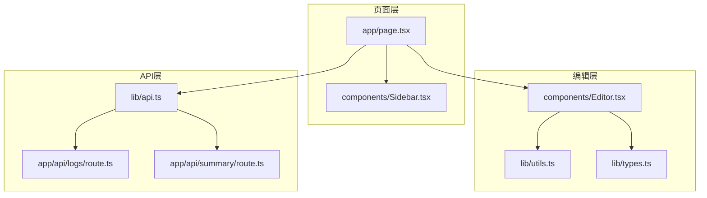
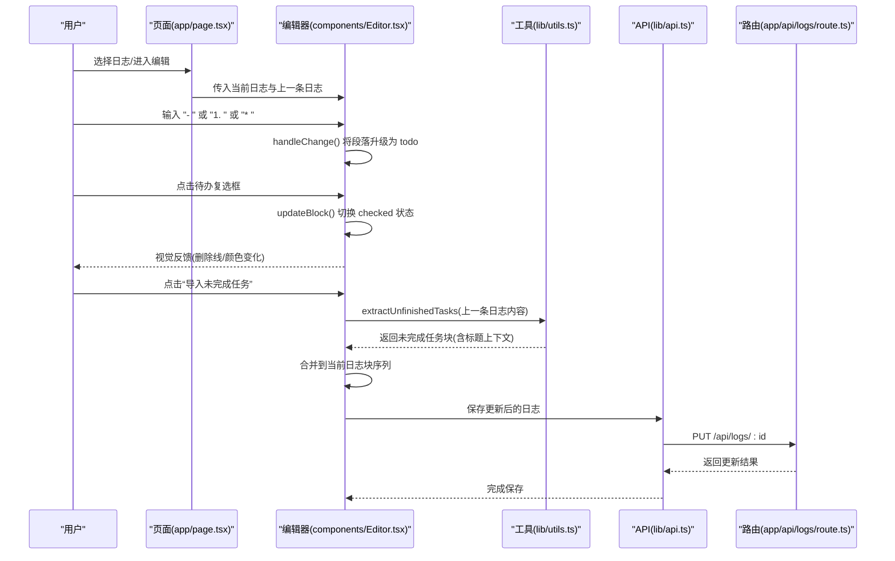
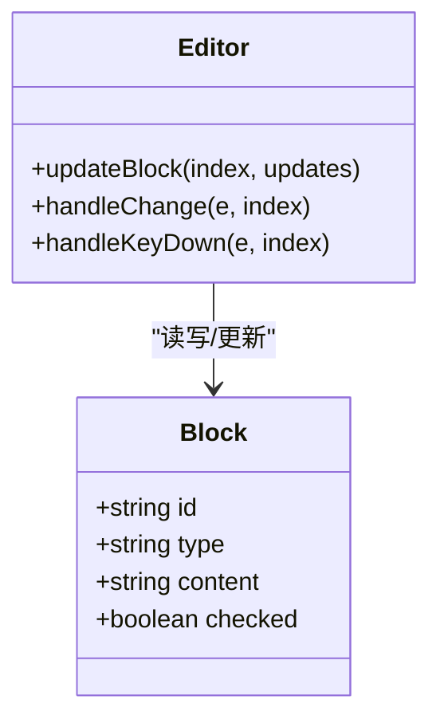
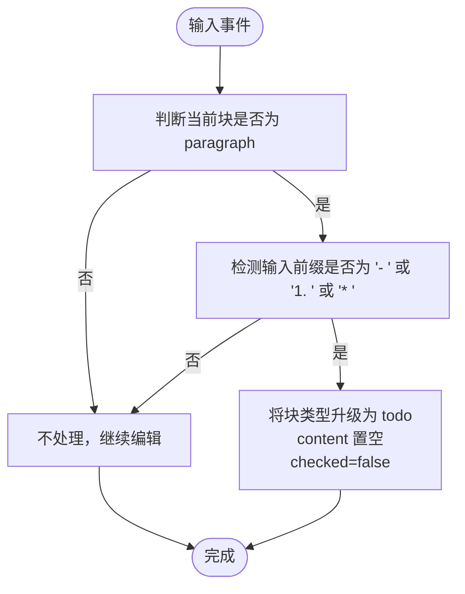
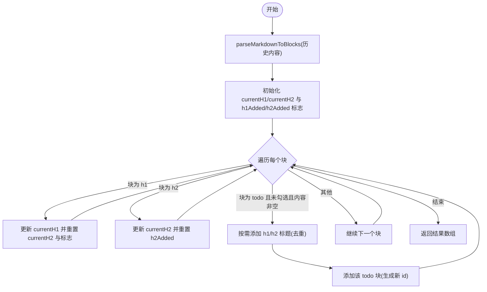
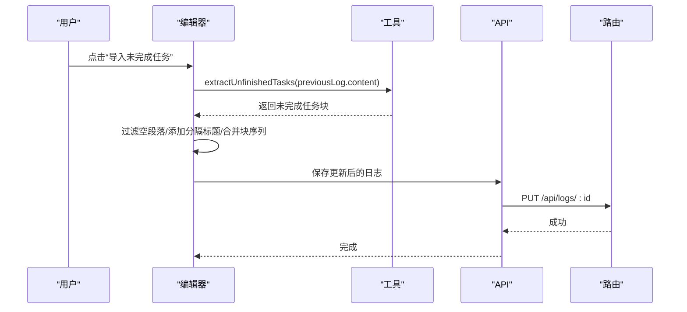
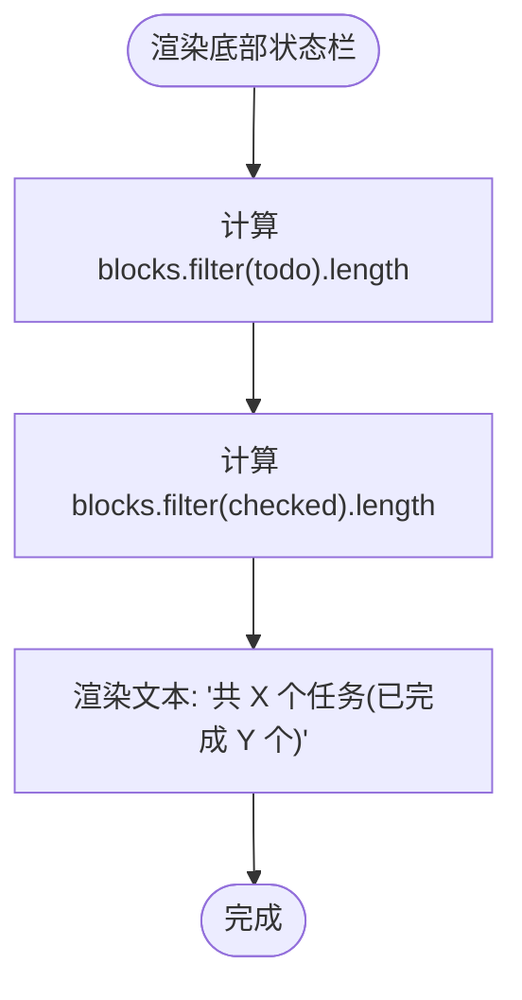
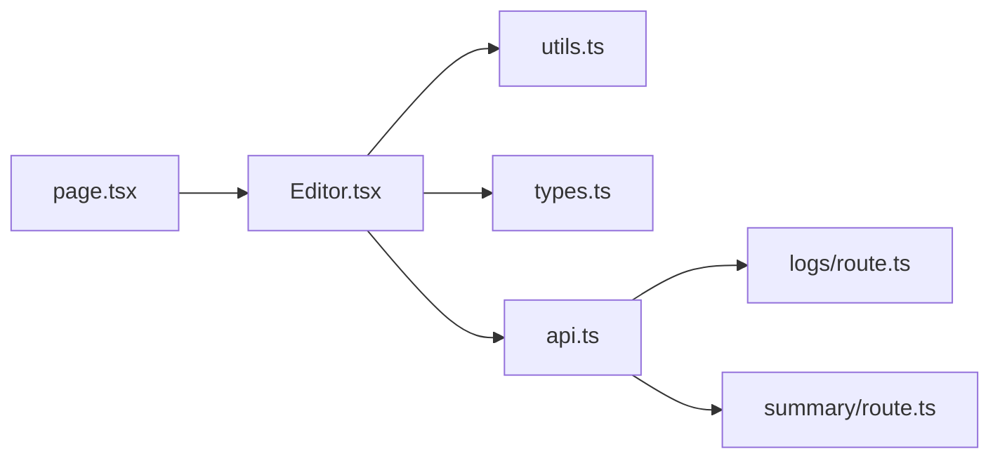

# 待办事项管理

<cite>
**本文引用的文件**
- [app/page.tsx](file://app/page.tsx)
- [components/Editor.tsx](file://components/Editor.tsx)
- [lib/utils.ts](file://lib/utils.ts)
- [lib/types.ts](file://lib/types.ts)
- [lib/api.ts](file://lib/api.ts)
- [components/Sidebar.tsx](file://components/Sidebar.tsx)
- [app/api/logs/route.ts](file://app/api/logs/route.ts)
- [app/api/summary/route.ts](file://app/api/summary/route.ts)
</cite>

## 目录
1. [简介](#简介)
2. [项目结构](#项目结构)
3. [核心组件](#核心组件)
4. [架构总览](#架构总览)
5. [详细组件分析](#详细组件分析)
6. [依赖分析](#依赖分析)
7. [性能考虑](#性能考虑)
8. [故障排查指南](#故障排查指南)
9. [结论](#结论)

## 简介
本文件系统性阐述“待办事项”功能的完整实现方案，围绕以下目标展开：
- 待办块（todo）的数据结构与 checked 字段的状态管理机制
- 用户交互行为：点击复选框触发 updateBlock 更新 checked 状态，视觉上通过 line-through 样式实现删除线效果，并以颜色区分已完成与未完成任务
- 输入转换逻辑：当用户输入特定前缀时，段落自动升级为待办类型
- 结合 extractUnfinishedTasks 工具函数，解释从历史日志提取未完成任务的算法逻辑：遍历块结构、识别未勾选且非空内容的任务项、保留其上下文标题结构
- 展示底部状态栏的任务统计实现方式

## 项目结构
该应用采用前端 React 组件 + Next.js API 路由的前后端分离结构：
- 页面入口负责日志列表、当前日志选择、视图切换与导入未完成任务的上下文准备
- 编辑器负责块级编辑、输入转换、待办状态切换与底部状态栏统计
- 工具函数提供 Markdown 与块结构互转、未完成任务提取、日期格式化等能力
- API 层提供日志 CRUD 与周报生成接口

图表来源
- [app/page.tsx](file://app/page.tsx#L1-L209)
- [components/Editor.tsx](file://components/Editor.tsx#L1-L457)
- [lib/utils.ts](file://lib/utils.ts#L1-L168)
- [lib/types.ts](file://lib/types.ts#L1-L34)
- [lib/api.ts](file://lib/api.ts#L1-L56)
- [components/Sidebar.tsx](file://components/Sidebar.tsx#L1-L234)
- [app/api/logs/route.ts](file://app/api/logs/route.ts#L1-L38)
- [app/api/summary/route.ts](file://app/api/summary/route.ts#L1-L78)

章节来源
- [app/page.tsx](file://app/page.tsx#L1-L209)
- [components/Editor.tsx](file://components/Editor.tsx#L1-L457)
- [lib/utils.ts](file://lib/utils.ts#L1-L168)
- [lib/types.ts](file://lib/types.ts#L1-L34)
- [lib/api.ts](file://lib/api.ts#L1-L56)
- [components/Sidebar.tsx](file://components/Sidebar.tsx#L1-L234)
- [app/api/logs/route.ts](file://app/api/logs/route.ts#L1-L38)
- [app/api/summary/route.ts](file://app/api/summary/route.ts#L1-L78)

## 核心组件
- 待办块数据结构
  - Block 类型定义包含 id、type、content、checked（可选）字段，其中 todo 类型支持 checked 状态
  - 参考路径：[lib/types.ts](file://lib/types.ts#L19-L27)
- 输入转换与块类型升级
  - 当段落处于 paragraph 类型且输入特定前缀时，自动升级为 todo 类型
  - 参考路径：[components/Editor.tsx](file://components/Editor.tsx#L194-L224)
- 待办状态切换与视觉反馈
  - 点击复选框触发 updateBlock 更新 checked 状态
  - 视觉上通过 line-through 样式与颜色区分已完成/未完成
  - 参考路径：[components/Editor.tsx](file://components/Editor.tsx#L383-L422)
- 未完成任务提取算法
  - 从历史日志内容解析为块结构，遍历块序列，仅保留未勾选且非空的 todo 项，并附带其上级标题上下文
  - 参考路径：[lib/utils.ts](file://lib/utils.ts#L93-L146)
- 底部状态栏统计
  - 统计全部任务数与已完成任务数
  - 参考路径：[components/Editor.tsx](file://components/Editor.tsx#L444-L451)

章节来源
- [lib/types.ts](file://lib/types.ts#L19-L27)
- [components/Editor.tsx](file://components/Editor.tsx#L194-L224)
- [components/Editor.tsx](file://components/Editor.tsx#L383-L422)
- [lib/utils.ts](file://lib/utils.ts#L93-L146)
- [components/Editor.tsx](file://components/Editor.tsx#L444-L451)

## 架构总览
整体流程如下：
- 页面层负责加载日志、维护当前日志、提供导入未完成任务的上下文（上一条日志）
- 编辑器层负责块级渲染与交互，包括输入转换、待办状态切换、底部状态栏统计
- 工具函数层提供 Markdown 与块结构互转、未完成任务提取、日期格式化
- API 层提供日志 CRUD 与周报生成接口

图表来源
- [app/page.tsx](file://app/page.tsx#L105-L115)
- [components/Editor.tsx](file://components/Editor.tsx#L89-L117)
- [lib/utils.ts](file://lib/utils.ts#L93-L146)
- [lib/api.ts](file://lib/api.ts#L23-L32)
- [app/api/logs/route.ts](file://app/api/logs/route.ts#L18-L38)

## 详细组件分析

### 待办块数据结构与 checked 状态管理
- 数据结构
  - Block 接口包含 id、type、content、checked（可选），todo 类型支持 checked 字段
  - 参考路径：[lib/types.ts](file://lib/types.ts#L19-L27)
- 状态管理机制
  - 点击复选框调用 updateBlock，将当前块的 checked 字段取反
  - 参考路径：[components/Editor.tsx](file://components/Editor.tsx#L383-L396)
- 视觉呈现
  - 当 todo 未勾选时显示正常文字颜色
  - 当 todo 已勾选时应用 line-through 样式与灰色文字
  - 参考路径：[components/Editor.tsx](file://components/Editor.tsx#L413-L422)

图表来源
- [lib/types.ts](file://lib/types.ts#L19-L27)
- [components/Editor.tsx](file://components/Editor.tsx#L119-L126)

章节来源
- [lib/types.ts](file://lib/types.ts#L19-L27)
- [components/Editor.tsx](file://components/Editor.tsx#L383-L396)
- [components/Editor.tsx](file://components/Editor.tsx#L413-L422)

### 输入转换逻辑：从段落到待办
- 触发条件
  - 当段落为 paragraph 类型时，输入特定前缀会将其升级为 todo 类型
  - 前缀包括："- "、"1. "、"* "
  - 参考路径：[components/Editor.tsx](file://components/Editor.tsx#L194-L224)
- 升级行为
  - 将 type 设为 "todo"，content 清空，checked 默认为 false
  - 参考路径：[components/Editor.tsx](file://components/Editor.tsx#L128-L137)

图表来源
- [components/Editor.tsx](file://components/Editor.tsx#L194-L224)
- [components/Editor.tsx](file://components/Editor.tsx#L128-L137)

章节来源
- [components/Editor.tsx](file://components/Editor.tsx#L194-L224)
- [components/Editor.tsx](file://components/Editor.tsx#L128-L137)

### 未完成任务提取算法：extractUnfinishedTasks
- 目标
  - 从历史日志内容中提取未完成的待办事项，并保留其上级标题上下文（h1/h2）
- 算法步骤
  1) 使用 parseMarkdownToBlocks 将历史内容解析为块序列
  2) 维护当前 h1/h2 上下文，以及是否已添加对应标题的标志位
  3) 遍历块序列：
     - 若遇到 h1，则重置 h2 上下文并重置标题添加标志
     - 若遇到 h2，则更新 h2 上下文并重置 h2 添加标志
     - 若遇到 todo 且未勾选且内容非空：
       - 先按需添加 h1（若存在且未添加过）
       - 再按需添加 h2（若存在且未添加过）
       - 最后添加该 todo 块（并生成新的 id）
  4) 返回结果数组
- 复杂度
  - 时间复杂度：O(n)，n 为历史内容的块数量
  - 空间复杂度：O(n)，用于存储结果数组
- 参考路径
  - [lib/utils.ts](file://lib/utils.ts#L93-L146)

图表来源
- [lib/utils.ts](file://lib/utils.ts#L93-L146)

章节来源
- [lib/utils.ts](file://lib/utils.ts#L93-L146)

### 从历史日志导入未完成任务：用户交互与合并策略
- 上下文准备
  - 页面层根据当前日志筛选上一条日志作为 previousLog
  - 参考路径：[app/page.tsx](file://app/page.tsx#L105-L115)
- 导入流程
  1) 调用 extractUnfinishedTasks(previousLog.content) 获取未完成任务块
  2) 统计 todo 数量，若为 0 则提示无未完成任务
  3) 移除当前日志末尾可能存在的空段落
  4) 添加分隔标题（包含导入时间）
  5) 将提取结果追加到当前块序列
  - 参考路径：[components/Editor.tsx](file://components/Editor.tsx#L89-L117)
- 保存更新
  - 编辑器内部防抖保存，最终通过 API 更新日志
  - 参考路径：[components/Editor.tsx](file://components/Editor.tsx#L42-L56)、[lib/api.ts](file://lib/api.ts#L23-L32)、[app/api/logs/route.ts](file://app/api/logs/route.ts#L18-L38)

图表来源
- [components/Editor.tsx](file://components/Editor.tsx#L89-L117)
- [lib/utils.ts](file://lib/utils.ts#L93-L146)
- [lib/api.ts](file://lib/api.ts#L23-L32)
- [app/api/logs/route.ts](file://app/api/logs/route.ts#L18-L38)

章节来源
- [app/page.tsx](file://app/page.tsx#L105-L115)
- [components/Editor.tsx](file://components/Editor.tsx#L89-L117)
- [lib/api.ts](file://lib/api.ts#L23-L32)
- [app/api/logs/route.ts](file://app/api/logs/route.ts#L18-L38)

### 底部状态栏任务统计
- 统计逻辑
  - 计算全部 todo 数量与已完成（checked=true）的数量
  - 参考路径：[components/Editor.tsx](file://components/Editor.tsx#L444-L451)
- 显示位置
  - 编辑器底部状态栏右侧显示保存状态
  - 参考路径：[components/Editor.tsx](file://components/Editor.tsx#L444-L451)

图表来源
- [components/Editor.tsx](file://components/Editor.tsx#L444-L451)

章节来源
- [components/Editor.tsx](file://components/Editor.tsx#L444-L451)

## 依赖分析
- 组件耦合
  - Editor 依赖 utils 的解析与提取函数、types 的 Block 类型定义
  - 页面层负责提供上一条日志给 Editor，供导入未完成任务使用
- 外部依赖
  - API 层封装了日志 CRUD 与周报生成，Editor 通过 lib/api.ts 调用
  - 周报生成依赖第三方模型服务（DeepSeek），通过 app/api/summary/route.ts 实现
- 潜在循环依赖
  - 未发现直接循环依赖；各模块职责清晰，通过 lib/api.ts 与 app/api/* 路由解耦

图表来源
- [components/Editor.tsx](file://components/Editor.tsx#L1-L40)
- [lib/utils.ts](file://lib/utils.ts#L1-L20)
- [lib/types.ts](file://lib/types.ts#L1-L20)
- [lib/api.ts](file://lib/api.ts#L1-L20)
- [app/page.tsx](file://app/page.tsx#L1-L40)
- [app/api/logs/route.ts](file://app/api/logs/route.ts#L1-L20)
- [app/api/summary/route.ts](file://app/api/summary/route.ts#L1-L20)

章节来源
- [components/Editor.tsx](file://components/Editor.tsx#L1-L40)
- [lib/utils.ts](file://lib/utils.ts#L1-L20)
- [lib/types.ts](file://lib/types.ts#L1-L20)
- [lib/api.ts](file://lib/api.ts#L1-L20)
- [app/page.tsx](file://app/page.tsx#L1-L40)
- [app/api/logs/route.ts](file://app/api/logs/route.ts#L1-L20)
- [app/api/summary/route.ts](file://app/api/summary/route.ts#L1-L20)

## 性能考虑
- 防抖保存
  - 编辑器对变更进行防抖保存，减少频繁网络请求
  - 参考路径：[components/Editor.tsx](file://components/Editor.tsx#L42-L64)
- 块级渲染优化
  - 使用 textarea 自适应高度，避免不必要的重排
  - 参考路径：[components/Editor.tsx](file://components/Editor.tsx#L231-L239)
- 状态栏统计
  - 仅对 todo 类型进行过滤统计，复杂度 O(n)
  - 参考路径：[components/Editor.tsx](file://components/Editor.tsx#L444-L451)
- 工具函数
  - parseMarkdownToBlocks 与 extractUnfinishedTasks 均为单次线性扫描，适合大文本场景
  - 参考路径：[lib/utils.ts](file://lib/utils.ts#L9-L72)、[lib/utils.ts](file://lib/utils.ts#L93-L146)

## 故障排查指南
- 无法导入未完成任务
  - 检查是否存在上一条日志（previousLog 是否为空）
  - 检查 extractUnfinishedTasks 返回是否为空
  - 参考路径：[components/Editor.tsx](file://components/Editor.tsx#L89-L117)
- 待办状态未持久化
  - 确认保存流程是否触发（防抖定时器是否执行）
  - 检查 API 调用与路由响应
  - 参考路径：[components/Editor.tsx](file://components/Editor.tsx#L42-L64)、[lib/api.ts](file://lib/api.ts#L23-L32)、[app/api/logs/route.ts](file://app/api/logs/route.ts#L18-L38)
- 周报生成失败
  - 检查 DEEPSEEK_API_KEY 是否配置
  - 查看路由返回的错误信息
  - 参考路径：[app/api/summary/route.ts](file://app/api/summary/route.ts#L1-L20)

章节来源
- [components/Editor.tsx](file://components/Editor.tsx#L89-L117)
- [components/Editor.tsx](file://components/Editor.tsx#L42-L64)
- [lib/api.ts](file://lib/api.ts#L23-L32)
- [app/api/logs/route.ts](file://app/api/logs/route.ts#L18-L38)
- [app/api/summary/route.ts](file://app/api/summary/route.ts#L1-L20)

## 结论
本实现以简洁的块级数据模型为核心，通过输入前缀自动升级为待办、点击切换 checked 状态、视觉删除线与颜色区分，提供了直观的待办管理体验。配合 extractUnfinishedTasks 的上下文保留策略，实现了从历史日志高效导入未完成任务的能力；底部状态栏则提供了即时的任务统计反馈。整体架构清晰、职责明确，具备良好的扩展性与可维护性。