# 智能编辑器

<cite>
**本文引用的文件**
- [components/Editor.tsx](file://components/Editor.tsx)
- [lib/types.ts](file://lib/types.ts)
- [lib/utils.ts](file://lib/utils.ts)
- [app/page.tsx](file://app/page.tsx)
- [lib/api.ts](file://lib/api.ts)
- [components/Sidebar.tsx](file://components/Sidebar.tsx)
- [components/SummaryGenerator.tsx](file://components/SummaryGenerator.tsx)
- [app/layout.tsx](file://app/layout.tsx)
- [README.md](file://README.md)
</cite>

## 目录
1. [简介](#简介)
2. [项目结构](#项目结构)
3. [核心组件](#核心组件)
4. [架构总览](#架构总览)
5. [详细组件分析](#详细组件分析)
6. [依赖分析](#依赖分析)
7. [性能考虑](#性能考虑)
8. [故障排查指南](#故障排查指南)
9. [结论](#结论)
10. [附录](#附录)

## 简介
本文件面向“智能Markdown编辑器”的功能实现进行系统性解析，重点覆盖：
- 块状编辑结构（Block）的设计原理与数据模型
- 支持的元素类型（段落、H1/H2/H3标题、待办事项）及其渲染逻辑
- 输入前缀触发的自动元素转换机制（如“# ”、“## ”、“### ”、“1. ”、“- ”、“* ”）
- 标题级别切换菜单的实现方式
- 待办事项勾选状态管理与样式控制
- 内容自动高度调整、键盘导航（上下键移动焦点）、回车/退格智能行为
- 通过 parseMarkdownToBlocks 与 blocksToMarkdown 实现 Markdown 与块结构的双向转换

## 项目结构
该应用采用 Next.js 的 app 目录结构，核心编辑器位于 components/Editor.tsx，类型定义与工具函数位于 lib/，页面入口位于 app/page.tsx，并通过 API 层与后端交互。

图表来源
- [app/page.tsx](file://app/page.tsx#L1-L209)
- [components/Editor.tsx](file://components/Editor.tsx#L1-L457)
- [lib/types.ts](file://lib/types.ts#L1-L34)
- [lib/utils.ts](file://lib/utils.ts#L1-L168)
- [lib/api.ts](file://lib/api.ts#L1-L56)
- [components/Sidebar.tsx](file://components/Sidebar.tsx#L1-L234)
- [components/SummaryGenerator.tsx](file://components/SummaryGenerator.tsx#L1-L237)
- [app/layout.tsx](file://app/layout.tsx#L1-L30)

章节来源
- [README.md](file://README.md#L1-L64)
- [app/page.tsx](file://app/page.tsx#L1-L209)

## 核心组件
- 编辑器组件（Editor）：负责块结构的增删改、键盘事件处理、标题级别切换菜单、待办勾选、自动高度调整、防抖保存、导入未完成任务等。
- 类型与工具：定义 Block 数据模型与类型约束，提供 Markdown 与块结构互转、提取未完成任务、生成唯一ID、格式化日期等工具方法。
- 页面入口（Home）：管理日志列表、当前日志、视图模式（编辑/预览/周报），协调 Editor 与 API。
- 侧边栏（Sidebar）：日志列表、拖拽排序、创建/删除日志、打开周报生成器。
- 周报生成器（SummaryGenerator）：选择日志，调用后端生成周报并提供复制能力。

章节来源
- [components/Editor.tsx](file://components/Editor.tsx#L1-L457)
- [lib/types.ts](file://lib/types.ts#L1-L34)
- [lib/utils.ts](file://lib/utils.ts#L1-L168)
- [app/page.tsx](file://app/page.tsx#L1-L209)
- [components/Sidebar.tsx](file://components/Sidebar.tsx#L1-L234)
- [components/SummaryGenerator.tsx](file://components/SummaryGenerator.tsx#L1-L237)

## 架构总览
编辑器采用“块（Block）驱动”的结构，每个块代表一个可编辑单元，支持多种类型。编辑器通过 parseMarkdownToBlocks 将 Markdown 文本解析为块数组，再通过 blocksToMarkdown 将块数组序列化回 Markdown 文本。编辑过程中的键盘事件与状态变更会触发块数组的更新与防抖保存。

```mermaid
sequenceDiagram
participant U as "用户"
participant E as "Editor"
participant T as "类型定义(types)"
participant Utl as "工具(utils)"
participant API as "API(lib/api)"
U->>E : 输入文本/按键
E->>E : 键盘事件处理(回车/退格/上下)
E->>Utl : parseMarkdownToBlocks(首次加载)
Utl-->>E : 块数组
E->>E : 渲染块(标题/待办/段落)
E->>Utl : blocksToMarkdown(保存)
Utl-->>E : Markdown字符串
E->>API : onUpdate(防抖保存)
API-->>E : 成功/失败
E-->>U : 显示保存状态
```

图表来源
- [components/Editor.tsx](file://components/Editor.tsx#L1-L457)
- [lib/utils.ts](file://lib/utils.ts#L1-L168)
- [lib/api.ts](file://lib/api.ts#L1-L56)

## 详细组件分析

### 块数据模型与双向转换
- Block 类型定义
  - 字段：id（字符串）、type（'paragraph' | 'todo' | 'h1' | 'h2' | 'h3'）、content（字符串）、checked（可选布尔，仅 todo 生效）
- Markdown 到块结构
  - 解析策略：逐行匹配，优先处理标题层级与任务标记，其次处理列表项，最后作为普通段落
  - 关键点：三级标题优先于二级标题、二级标题优先于一级标题；任务标记支持多种形式（含有序/无序/任务符号）
- 块结构到 Markdown
  - 渲染策略：根据类型输出对应前缀与内容；todo 输出复选框状态；标题输出对应级别的前缀
- 未完成任务提取
  - 在提取过程中维护当前 h1/h2 上下文，保证导入时保留必要的标题层级

图表来源
- [lib/utils.ts](file://lib/utils.ts#L8-L72)

章节来源
- [lib/types.ts](file://lib/types.ts#L19-L27)
- [lib/utils.ts](file://lib/utils.ts#L8-L91)

### 编辑器交互与智能行为
- 自动高度调整
  - 每次内容变化时，将 textarea 高度设为 auto 后再设置为 scrollHeight，确保随内容增长而自适应
- 键盘导航
  - 上箭头：聚焦上方块
  - 下箭头：聚焦下方块
- 回车智能行为
  - 空待办：回车后转为段落
  - 空标题：回车后转为段落
  - 普通段落：回车后创建下一个块（段落或待办）
- 退格智能行为
  - 当前块为空：
    - 待办：降级为段落
    - 一级标题：降级为二级标题
    - 二级标题：降级为三级标题
    - 三级标题：降级为段落
    - 段落：删除当前块（保留至少一个块）
- 输入前缀触发元素转换
  - “# ”：转为一级标题
  - “## ”：转为二级标题
  - “### ”：转为三级标题
  - “1. ”、“- ”、“* ”：转为待办事项
- 标题级别切换菜单
  - 点击标题图标弹出菜单，支持切换到 h1/h2/h3 或降级为段落
  - 点击外部区域关闭菜单
- 待办勾选与样式控制
  - 点击复选框切换 checked 状态
  - 根据 checked 状态应用不同的样式（如删除线）

图表来源
- [components/Editor.tsx](file://components/Editor.tsx#L148-L191)

章节来源
- [components/Editor.tsx](file://components/Editor.tsx#L148-L224)
- [components/Editor.tsx](file://components/Editor.tsx#L301-L424)

### 标题级别切换菜单实现
- 菜单状态：使用 headingMenuOpen 存储当前打开菜单的块 id
- 菜单项：
  - 一级标题、二级标题、三级标题：切换到对应级别
  - 正文：降级为段落
- 点击外部关闭：监听文档级鼠标事件，若点击目标不在菜单内则关闭

图表来源
- [components/Editor.tsx](file://components/Editor.tsx#L310-L380)

章节来源
- [components/Editor.tsx](file://components/Editor.tsx#L310-L380)

### 待办事项勾选状态管理与样式控制
- 状态：todo 块包含 checked 字段
- 交互：点击复选框切换 checked
- 样式：根据 checked 应用不同颜色与装饰（如删除线）

章节来源
- [lib/types.ts](file://lib/types.ts#L22-L27)
- [components/Editor.tsx](file://components/Editor.tsx#L383-L397)

### 导入未完成任务
- 从上一条日志提取未完成任务，自动插入当前日志末尾
- 插入前会移除末尾空段落，避免产生多余空白
- 为导入内容添加分隔标题，标注来源时间

章节来源
- [components/Editor.tsx](file://components/Editor.tsx#L89-L117)
- [lib/utils.ts](file://lib/utils.ts#L93-L146)

### 防抖保存与状态栏
- 防抖保存：对 blocks 与 title 的变更进行防抖，800ms 后统一保存
- 保存触发条件：内容或标题发生变化
- 状态栏显示：任务总数与已完成数、保存状态提示

章节来源
- [components/Editor.tsx](file://components/Editor.tsx#L42-L64)
- [components/Editor.tsx](file://components/Editor.tsx#L445-L451)

### 页面入口与日志管理
- Home 负责加载日志、创建/更新/删除日志、切换视图模式（编辑/周报）
- 侧边栏提供日志列表、拖拽排序、删除日志、打开周报生成器
- 周报生成器：选择日志，调用后端生成周报并支持复制

章节来源
- [app/page.tsx](file://app/page.tsx#L1-L209)
- [components/Sidebar.tsx](file://components/Sidebar.tsx#L1-L234)
- [components/SummaryGenerator.tsx](file://components/SummaryGenerator.tsx#L1-L237)
- [lib/api.ts](file://lib/api.ts#L1-L56)

## 依赖分析
- 组件耦合
  - Editor 依赖 types（Block 类型）、utils（解析/序列化/提取/格式化）、api（保存）
  - Home 依赖 Sidebar、Editor、SummaryGenerator 与 api
- 外部依赖
  - lucide-react：图标库
  - @prisma/client：数据库客户端
  - next/font/google：字体
  - TailwindCSS：样式框架

图表来源
- [components/Editor.tsx](file://components/Editor.tsx#L1-L40)
- [app/page.tsx](file://app/page.tsx#L1-L209)
- [lib/types.ts](file://lib/types.ts#L1-L34)
- [lib/utils.ts](file://lib/utils.ts#L1-L168)
- [lib/api.ts](file://lib/api.ts#L1-L56)
- [components/Sidebar.tsx](file://components/Sidebar.tsx#L1-L234)
- [components/SummaryGenerator.tsx](file://components/SummaryGenerator.tsx#L1-L237)
- [app/layout.tsx](file://app/layout.tsx#L1-L30)

章节来源
- [package.json](file://package.json#L1-L30)

## 性能考虑
- 防抖保存：对频繁输入进行节流，减少网络请求次数
- 自动高度调整：仅在内容变化时计算 scrollHeight，避免不必要的重排
- 虚拟滚动：当前实现未使用虚拟滚动，建议在大量块时引入以提升渲染性能
- 图标与字体：使用 lucide-react 与 Google Fonts，注意首屏加载优化

## 故障排查指南
- 无法保存
  - 检查 isLocalChange 标记是否被正确设置
  - 确认 blocksToMarkdown 输出与 log.content 是否一致
  - 查看保存状态栏提示
- 标题菜单不关闭
  - 确认点击外部关闭逻辑已绑定并生效
- 待办勾选无效
  - 检查 todo 块的 checked 字段是否更新
  - 确认样式类是否正确应用
- 导入未完成任务无效果
  - 确认上一条日志存在未完成任务
  - 检查 extractUnfinishedTasks 的返回结果

章节来源
- [components/Editor.tsx](file://components/Editor.tsx#L42-L64)
- [components/Editor.tsx](file://components/Editor.tsx#L78-L87)
- [components/Editor.tsx](file://components/Editor.tsx#L383-L397)
- [lib/utils.ts](file://lib/utils.ts#L93-L146)

## 结论
该智能编辑器围绕“块（Block）”构建，实现了简洁高效的 Markdown 编辑体验。通过输入前缀触发的自动转换、标题级别切换菜单、待办勾选与样式控制、键盘导航与智能回车/退格行为，以及 parseMarkdownToBlocks 与 blocksToMarkdown 的双向转换，形成了完整的块结构编辑闭环。配合防抖保存与导入未完成任务等功能，提升了日常记录与周报生成的效率。

## 附录
- 数据模型类图

图表来源
- [lib/types.ts](file://lib/types.ts#L1-L34)