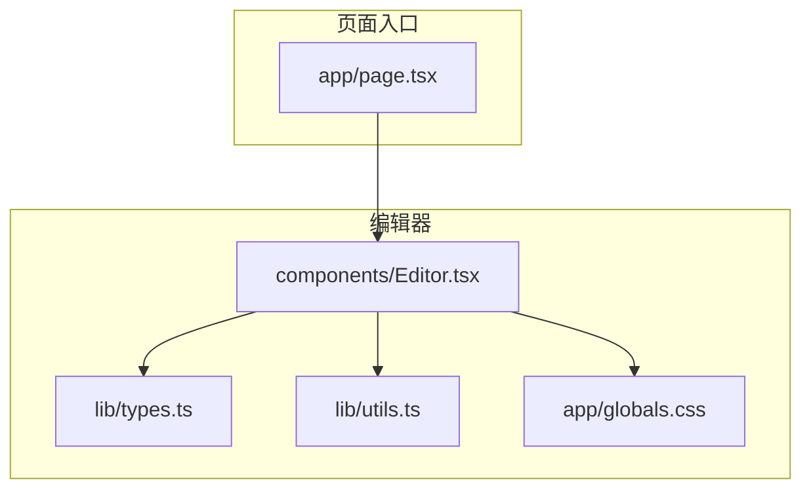
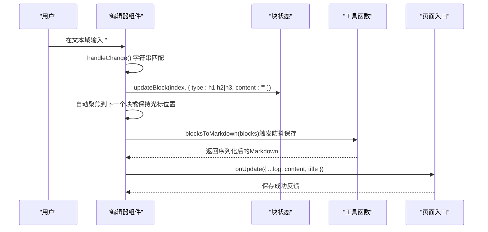
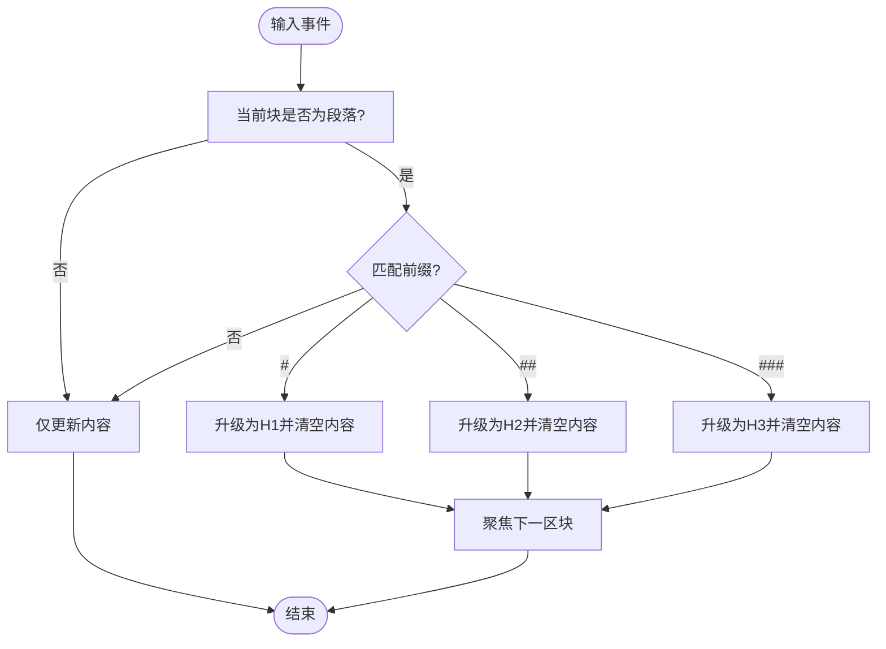
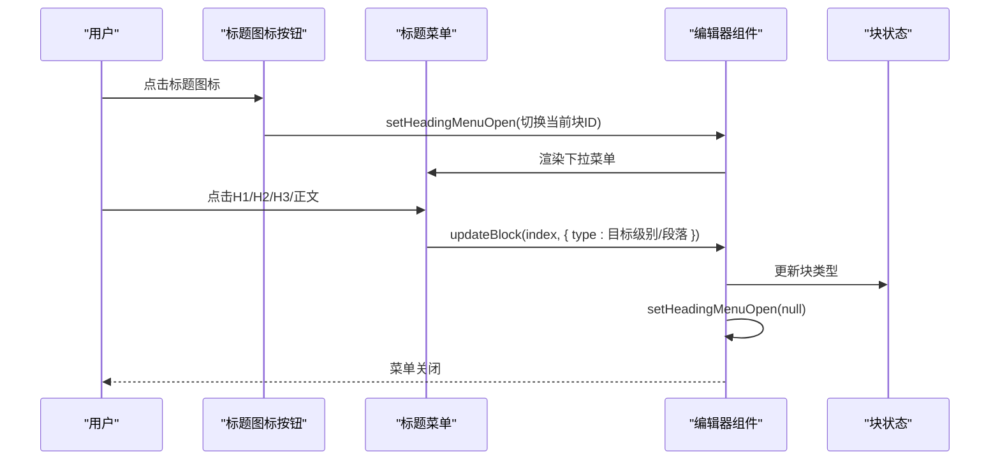
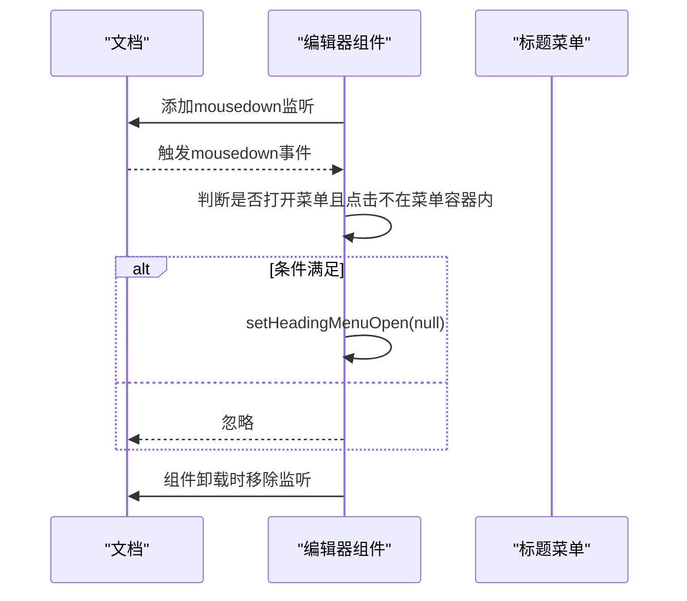
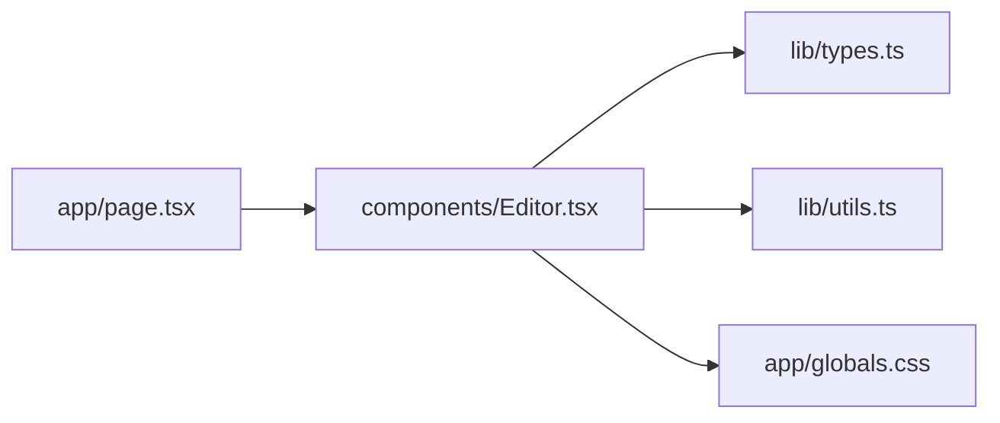

# 标题处理机制

<cite>
**本文引用的文件**
- [components/Editor.tsx](file://components/Editor.tsx)
- [lib/utils.ts](file://lib/utils.ts)
- [lib/types.ts](file://lib/types.ts)
- [app/page.tsx](file://app/page.tsx)
- [app/globals.css](file://app/globals.css)
</cite>

## 目录
1. [引言](#引言)
2. [项目结构](#项目结构)
3. [核心组件](#核心组件)
4. [架构总览](#架构总览)
5. [详细组件分析](#详细组件分析)
6. [依赖分析](#依赖分析)
7. [性能考虑](#性能考虑)
8. [故障排查指南](#故障排查指南)
9. [结论](#结论)
10. [附录](#附录)

## 引言
本文件围绕编辑器中“标题功能”的实现机制进行系统性解析，重点覆盖以下方面：
- 用户输入前缀（如“# ”、“## ”、“### ”）时的自动类型转换逻辑，包括事件监听、字符串匹配、状态更新流程。
- 标题级别切换菜单的设计与交互：点击标题图标展开下拉菜单，提供H1/H2/H3/正文四种选项，通过updateBlock函数修改块类型。
- 不同标题类型的样式渲染规则（字体大小、颜色、行高、间距等）。
- 菜单弹出层的点击外部关闭机制（useEffect + mousedown事件监听）。
- 实际使用场景示例与常见问题（如输入延迟响应的防抖优化建议）。

## 项目结构
编辑器标题功能主要集中在编辑器组件中实现，同时依赖工具函数对Markdown与块模型进行解析与序列化。页面入口负责将日志数据传递给编辑器并处理更新回调。

图表来源
- [app/page.tsx](file://app/page.tsx#L178-L204)
- [components/Editor.tsx](file://components/Editor.tsx#L1-L457)
- [lib/types.ts](file://lib/types.ts#L1-L34)
- [lib/utils.ts](file://lib/utils.ts#L1-L168)
- [app/globals.css](file://app/globals.css#L1-L53)

章节来源
- [app/page.tsx](file://app/page.tsx#L178-L204)
- [components/Editor.tsx](file://components/Editor.tsx#L1-L457)
- [lib/types.ts](file://lib/types.ts#L1-L34)
- [lib/utils.ts](file://lib/utils.ts#L1-L168)
- [app/globals.css](file://app/globals.css#L1-L53)

## 核心组件
- 编辑器组件：负责标题前缀识别、键盘事件处理、标题菜单交互、块状态更新、防抖保存、菜单外部点击关闭等。
- 工具函数：提供Markdown与块模型之间的双向转换，以及未完成任务提取等辅助能力。
- 类型定义：统一块类型（paragraph/todo/h1/h2/h3）与日志条目结构。

章节来源
- [components/Editor.tsx](file://components/Editor.tsx#L1-L457)
- [lib/utils.ts](file://lib/utils.ts#L1-L168)
- [lib/types.ts](file://lib/types.ts#L1-L34)

## 架构总览
编辑器采用“块级模型”组织内容，每个块由类型与内容组成。标题功能通过事件监听与状态更新驱动UI变化，并通过工具函数将块集合序列化为Markdown持久化。

图表来源
- [components/Editor.tsx](file://components/Editor.tsx#L194-L224)
- [components/Editor.tsx](file://components/Editor.tsx#L119-L126)
- [components/Editor.tsx](file://components/Editor.tsx#L42-L64)
- [lib/utils.ts](file://lib/utils.ts#L74-L91)
- [app/page.tsx](file://app/page.tsx#L79-L86)

## 详细组件分析

### 自动类型转换：输入前缀到标题
- 事件监听与匹配
  - 在文本变更事件中，当块类型为段落时，对输入值进行严格匹配：
    - “# ” → 升级为一级标题，清空内容
    - “## ” → 升级为二级标题，清空内容
    - “### ” → 升级为三级标题，清空内容
  - 匹配条件为完整字符串，避免误触；匹配后立即调用updateBlock更新块类型与内容。
- 键盘事件与回车/退格行为
  - 回车键：
    - 若当前块为待办且内容为空 → 转为段落
    - 若当前块为标题且内容为空 → 转为段落
    - 其他情况 → 根据当前块类型决定新建块类型（标题后新建段落，待办后继续待办）
  - 退格键：
    - 当前块内容为空时：
      - 待办 → 转为段落
      - 一级标题 → 降级为二级标题
      - 二级标题 → 降级为三级标题
      - 三级标题 → 降级为段落
- 状态更新流程
  - 所有类型转换均通过updateBlock进行，确保isLocalChange标志位被设置，从而触发防抖保存。

图表来源
- [components/Editor.tsx](file://components/Editor.tsx#L194-L224)
- [components/Editor.tsx](file://components/Editor.tsx#L148-L191)

章节来源
- [components/Editor.tsx](file://components/Editor.tsx#L148-L224)

### 标题级别切换菜单：设计与交互
- 展开与收起
  - 点击标题图标按钮，切换当前块对应的菜单开关状态；菜单容器通过ref绑定，用于后续点击外部关闭检测。
- 菜单选项
  - H1/H2/H3：点击对应按钮将块类型更新为目标级别，并关闭菜单
  - 正文：点击将块类型更新为段落，并关闭菜单
- updateBlock的使用
  - 所有菜单项均通过updateBlock修改块类型，保证状态一致性与防抖保存生效。

图表来源
- [components/Editor.tsx](file://components/Editor.tsx#L310-L381)
- [components/Editor.tsx](file://components/Editor.tsx#L119-L126)

章节来源
- [components/Editor.tsx](file://components/Editor.tsx#L310-L381)

### 样式渲染规则：字体大小、颜色、间距
- 标题级别样式
  - H1：较大字号、加粗、深色文字
  - H2：中等字号、半粗体、中等深浅文字
  - H3：较小字号、半粗体、较浅文字
- 待办样式
  - 未完成：常规颜色
  - 已完成：带删除线与浅色装饰
- 行高与内边距
  - 通过内联style与Tailwind类控制最小高度与行距，确保标题具有合适的视觉高度与阅读间距
- 菜单与图标
  - 菜单采用白色背景、灰色边框与阴影，选项悬停高亮，区分当前选中级别

章节来源
- [components/Editor.tsx](file://components/Editor.tsx#L400-L422)
- [app/globals.css](file://app/globals.css#L1-L53)

### 点击外部关闭机制：useEffect + mousedown事件监听
- 机制说明
  - 通过useEffect监听文档级别的mousedown事件，若当前存在打开的标题菜单且点击目标不在菜单容器内，则关闭菜单
  - 菜单容器通过ref绑定到当前打开块的DOM节点，确保检测范围准确
- 适用场景
  - 用户在菜单外点击空白区域或其它元素时，自动收起菜单，提升交互体验

图表来源
- [components/Editor.tsx](file://components/Editor.tsx#L78-L87)

章节来源
- [components/Editor.tsx](file://components/Editor.tsx#L78-L87)

### Markdown解析与序列化：标题映射
- 解析（Markdown → 块）
  - 逐行解析，优先匹配“### ”“## ”“# ”，再匹配任务/列表，最后作为普通段落
  - 该顺序确保输入前缀能正确识别为标题
- 序列化（块 → Markdown）
  - 将块集合按类型输出为相应前缀的Markdown行，便于持久化与跨模块共享

章节来源
- [lib/utils.ts](file://lib/utils.ts#L8-L71)
- [lib/utils.ts](file://lib/utils.ts#L74-L91)

### 防抖保存与输入延迟响应
- 防抖策略
  - 通过useEffect在isLocalChange为true时延时触发保存，减少频繁写入
  - 保存完成后重置isLocalChange，避免重复触发
- 输入延迟响应建议
  - 对于高频输入场景，可考虑在handleChange中增加更细粒度的节流/防抖策略（例如基于debounce的输入处理），以进一步降低保存频率并提升性能
  - 注意：当前实现已具备基础防抖，若出现明显卡顿，可在输入事件处理中引入更严格的去抖策略

章节来源
- [components/Editor.tsx](file://components/Editor.tsx#L42-L64)

## 依赖分析
- 组件耦合
  - 编辑器组件依赖类型定义与工具函数，形成清晰的边界
  - 页面入口通过onUpdate回调与编辑器解耦，便于扩展与测试
- 外部依赖
  - 使用Tailwind类进行样式控制，减少自定义CSS负担
  - 使用Lucide图标库提供标题与操作图标

图表来源
- [app/page.tsx](file://app/page.tsx#L178-L204)
- [components/Editor.tsx](file://components/Editor.tsx#L1-L457)
- [lib/types.ts](file://lib/types.ts#L1-L34)
- [lib/utils.ts](file://lib/utils.ts#L1-L168)
- [app/globals.css](file://app/globals.css#L1-L53)

章节来源
- [app/page.tsx](file://app/page.tsx#L178-L204)
- [components/Editor.tsx](file://components/Editor.tsx#L1-L457)
- [lib/types.ts](file://lib/types.ts#L1-L34)
- [lib/utils.ts](file://lib/utils.ts#L1-L168)
- [app/globals.css](file://app/globals.css#L1-L53)

## 性能考虑
- 防抖保存：通过延时触发保存，降低数据库压力与网络请求次数
- 动态高度：文本域高度随内容自适应，避免不必要的重排
- 菜单外部点击关闭：减少额外状态管理复杂度，提高交互效率
- 建议
  - 对高频输入场景可引入输入级防抖，避免每次按键都触发保存
  - 对超长日志内容，可考虑分页或虚拟滚动优化渲染性能

[本节为通用指导，不直接分析具体文件]

## 故障排查指南
- 输入前缀无效
  - 确认输入值为完整前缀（“# ”、“## ”、“### ”），且当前块类型为段落
  - 检查handleChange逻辑是否被其他分支提前返回
- 回车/退格行为异常
  - 检查handleKeyDown中针对空内容与块类型的分支逻辑
  - 确保updateBlock调用顺序正确，避免状态错乱
- 菜单无法关闭
  - 确认useEffect外部点击监听已注册且菜单容器ref已绑定
  - 检查菜单容器是否被正确渲染与定位
- 样式不符合预期
  - 检查Tailwind类是否正确应用，确认最小高度与行距设置
  - 确认全局样式未被覆盖

章节来源
- [components/Editor.tsx](file://components/Editor.tsx#L148-L224)
- [components/Editor.tsx](file://components/Editor.tsx#L78-L87)
- [components/Editor.tsx](file://components/Editor.tsx#L400-L422)

## 结论
编辑器的标题功能通过简洁的事件监听与状态更新实现了高效的自动类型转换与菜单交互。配合防抖保存与合理的样式控制，既保证了良好的用户体验，也兼顾了性能与可维护性。未来可在输入级防抖与大文档优化方面进一步完善。

[本节为总结性内容，不直接分析具体文件]

## 附录
- 实际使用场景示例
  - 在段落中输入“# ”快速创建一级标题
  - 在H2上点击标题图标，选择“三级标题”进行降级
  - 在空标题上按回车，自动转为段落并创建新块
- 常见问题与建议
  - 输入延迟响应：建议在输入事件中增加防抖策略
  - 菜单关闭：确保外部点击监听与ref绑定正确

[本节为概念性内容，不直接分析具体文件]