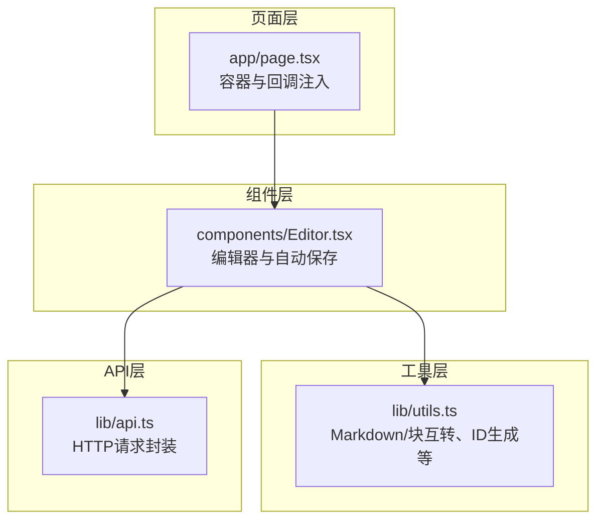
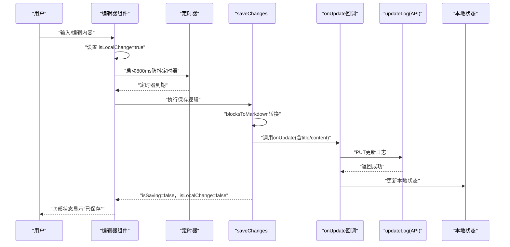
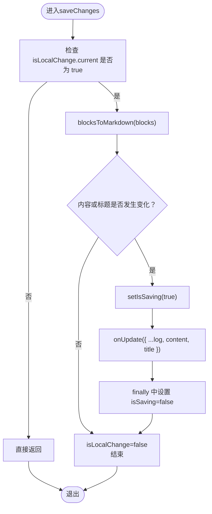
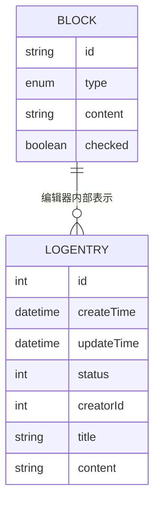
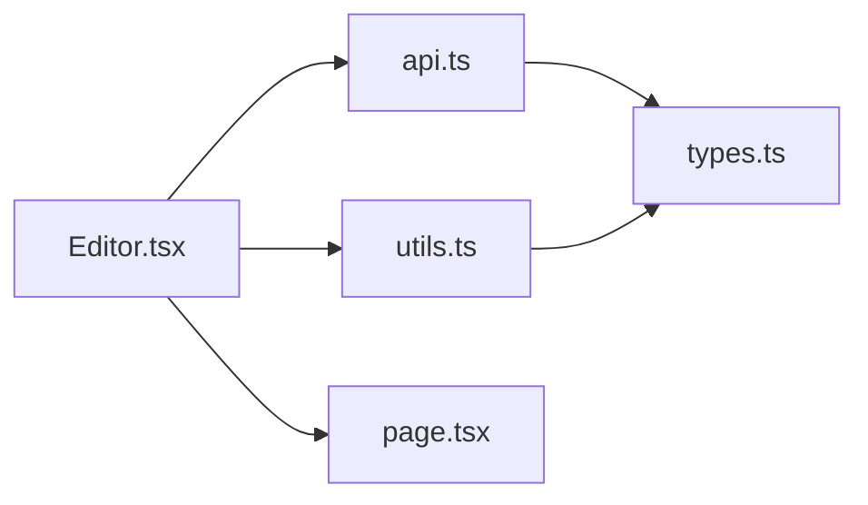

# 自动保存机制

<cite>
**本文引用的文件**
- [components/Editor.tsx](file://components/Editor.tsx)
- [lib/utils.ts](file://lib/utils.ts)
- [lib/api.ts](file://lib/api.ts)
- [app/page.tsx](file://app/page.tsx)
- [lib/types.ts](file://lib/types.ts)
</cite>

## 目录
1. [简介](#简介)
2. [项目结构](#项目结构)
3. [核心组件](#核心组件)
4. [架构总览](#架构总览)
5. [详细组件分析](#详细组件分析)
6. [依赖分析](#依赖分析)
7. [性能考虑](#性能考虑)
8. [故障排查指南](#故障排查指南)
9. [结论](#结论)

## 简介
本文件系统性地文档化编辑器的自动保存功能，重点解释基于 useCallback 和 useEffect 的防抖保存策略：
- 每次内容变更时将 isLocalChange 标记为 true，启动 800ms 延迟定时器；
- 在定时器期间若持续输入则重置计时；
- 停止输入后调用 onUpdate 通过 API 持久化数据；
- saveChanges 函数将 blocks 数组转换为 Markdown 字符串并提交更新；
- 强调 isLocalChange.current 引用的使用目的：避免非用户触发的保存操作；
- 描述 UI 反馈机制：保存中显示“保存中...”，完成后恢复“已保存”。

## 项目结构
围绕自动保存功能的关键文件与职责如下：
- 组件层：编辑器组件负责状态管理、事件处理、防抖保存与 UI 反馈。
- 工具层：提供 Markdown 与块结构互转、ID 生成等能力。
- API 层：封装对后端接口的调用。
- 页面层：作为容器，向编辑器注入 onUpdate 回调，驱动持久化。

图表来源
- [app/page.tsx](file://app/page.tsx#L176-L190)
- [components/Editor.tsx](file://components/Editor.tsx#L1-L60)
- [lib/utils.ts](file://lib/utils.ts#L74-L91)
- [lib/api.ts](file://lib/api.ts#L23-L32)

章节来源
- [app/page.tsx](file://app/page.tsx#L176-L190)
- [components/Editor.tsx](file://components/Editor.tsx#L1-L60)
- [lib/utils.ts](file://lib/utils.ts#L74-L91)
- [lib/api.ts](file://lib/api.ts#L23-L32)

## 核心组件
- 编辑器组件：维护 blocks、title 等状态，使用 useRef 标记本地变更，使用 useCallback 稳定保存函数引用，使用 useEffect 实现防抖保存。
- 工具函数：blocksToMarkdown 将 blocks 转换为 Markdown 字符串；parseMarkdownToBlocks 支持初始内容解析。
- API 封装：updateLog 通过 PUT 请求持久化更新。
- 页面容器：提供 onUpdate 回调，调用 updateLog 并更新本地状态。

章节来源
- [components/Editor.tsx](file://components/Editor.tsx#L21-L60)
- [lib/utils.ts](file://lib/utils.ts#L74-L91)
- [lib/api.ts](file://lib/api.ts#L23-L32)
- [app/page.tsx](file://app/page.tsx#L79-L86)

## 架构总览
自动保存的端到端流程如下：

图表来源
- [components/Editor.tsx](file://components/Editor.tsx#L42-L64)
- [lib/utils.ts](file://lib/utils.ts#L74-L91)
- [lib/api.ts](file://lib/api.ts#L23-L32)
- [app/page.tsx](file://app/page.tsx#L79-L86)

## 详细组件分析

### 自动保存策略与防抖实现
- isLocalChange.current 引用：用于区分是否由用户触发的变更。仅当 isLocalChange 为 true 时才进行保存，避免初始化或非用户触发的同步导致误保存。
- useCallback 稳定引用：saveChanges 使用 useCallback 包裹，确保其引用在 blocks、title、log、onUpdate 不变时保持稳定，从而避免 effect 依赖链反复触发。
- useEffect 防抖：当存在本地变更时，启动 800ms 定时器；在定时器期间若有新的变更，effect 清理旧定时器并重新计时；定时器到期后执行保存。
- saveChanges 流程：
  - 若 isLocalChange 为 false 则直接返回；
  - 将 blocks 转换为 Markdown 字符串；
  - 对比当前 Markdown 与 log.content、title 与 log.title，若任一变化则调用 onUpdate；
  - onUpdate 内部调用 updateLog，成功后更新本地状态；
  - 无论成功与否，均将 isSaving 设为 false，并将 isLocalChange 重置为 false。

图表来源
- [components/Editor.tsx](file://components/Editor.tsx#L42-L56)
- [lib/utils.ts](file://lib/utils.ts#L74-L91)

章节来源
- [components/Editor.tsx](file://components/Editor.tsx#L27-L39)
- [components/Editor.tsx](file://components/Editor.tsx#L42-L56)
- [components/Editor.tsx](file://components/Editor.tsx#L59-L64)

### 数据结构与转换
- Block 类型：包含 id、type、content、checked（可选），支持 paragraph、todo、h1、h2、h3。
- Markdown 与 Block 互转：
  - blocksToMarkdown：将 blocks 数组按规则拼接为 Markdown 字符串；
  - parseMarkdownToBlocks：将 Markdown 字符串解析为 blocks 数组，支持标题、任务、列表等格式识别。

图表来源
- [lib/types.ts](file://lib/types.ts#L19-L27)
- [lib/types.ts](file://lib/types.ts#L1-L10)
- [lib/utils.ts](file://lib/utils.ts#L74-L91)

章节来源
- [lib/types.ts](file://lib/types.ts#L1-L34)
- [lib/utils.ts](file://lib/utils.ts#L74-L91)

### UI 反馈机制
- 保存中状态：isSaving 为 true 时，底部状态栏显示“保存中...”；
- 保存完成：保存流程结束后恢复为“已保存”。

章节来源
- [components/Editor.tsx](file://components/Editor.tsx#L21-L31)
- [components/Editor.tsx](file://components/Editor.tsx#L444-L451)

### 与 onUpdate 回调的依赖关系
- onUpdate 由页面容器传入，内部调用 updateLog 并更新本地状态；
- saveChanges 依赖 onUpdate 执行持久化；
- 由于 saveChanges 使用 useCallback，其依赖项包括 blocks、title、log、onUpdate，这些依赖的变化会触发 effect 重新建立防抖定时器。

章节来源
- [app/page.tsx](file://app/page.tsx#L79-L86)
- [components/Editor.tsx](file://components/Editor.tsx#L42-L56)
- [components/Editor.tsx](file://components/Editor.tsx#L59-L64)

## 依赖分析
- 组件对工具函数的依赖：blocksToMarkdown 用于保存前的数据转换。
- 组件对 API 的依赖：onUpdate -> updateLog -> HTTP PUT。
- 组件对页面容器的依赖：onUpdate 回调由页面容器提供。

图表来源
- [components/Editor.tsx](file://components/Editor.tsx#L1-L20)
- [lib/utils.ts](file://lib/utils.ts#L1-L10)
- [lib/api.ts](file://lib/api.ts#L1-L10)
- [lib/types.ts](file://lib/types.ts#L1-L10)
- [app/page.tsx](file://app/page.tsx#L1-L10)

章节来源
- [components/Editor.tsx](file://components/Editor.tsx#L1-L20)
- [lib/utils.ts](file://lib/utils.ts#L1-L10)
- [lib/api.ts](file://lib/api.ts#L1-L10)
- [lib/types.ts](file://lib/types.ts#L1-L10)
- [app/page.tsx](file://app/page.tsx#L1-L10)

## 性能考虑
- 防抖时间调整
  - 当前为 800ms，适合大多数输入场景；对于快速打字较多的用户，可适当缩短以减少等待；对于长文本编辑或网络较慢时，可适度延长以降低请求频率。
  - 调整点：effect 中的定时器时长。
- 错误重试机制
  - 当前实现未内置重试；可在 onUpdate 中增加重试逻辑（例如指数退避），并在 UI 上提示“保存失败，请重试”。
- 依赖优化
  - saveChanges 使用 useCallback 稳定引用，避免不必要的 effect 重建；
  - effect 依赖项包含 blocks、title、saveChanges，确保在这些值变化时才重新计时。
- 本地变更隔离
  - isLocalChange.current 有效避免非用户触发的保存，减少无效请求。

章节来源
- [components/Editor.tsx](file://components/Editor.tsx#L42-L64)
- [components/Editor.tsx](file://components/Editor.tsx#L27-L39)

## 故障排查指南
- 问题：保存按钮无效或无响应
  - 排查：确认 isLocalChange 是否被正确置为 true；检查 effect 是否被触发；确认 onUpdate 是否被调用。
  - 参考路径：[isLocalChange 设置与 effect 触发](file://components/Editor.tsx#L99-L117)，[防抖 effect](file://components/Editor.tsx#L59-L64)。
- 问题：保存频繁但内容未更新
  - 排查：确认 blocksToMarkdown 转换后的字符串与 log.content 是否一致；title 是否变化。
  - 参考路径：[saveChanges 内容对比与调用](file://components/Editor.tsx#L42-L56)，[blocksToMarkdown](file://lib/utils.ts#L74-L91)。
- 问题：UI 一直显示“保存中...”
  - 排查：onUpdate 是否抛出异常导致 finally 未执行；网络请求是否超时。
  - 参考路径：[保存流程中的状态切换](file://components/Editor.tsx#L42-L56)，[onUpdate 实现](file://app/page.tsx#L79-L86)。
- 问题：初始化时出现误保存
  - 排查：确认切换日志时是否重置 isLocalChange；确认初始化逻辑是否正确。
  - 参考路径：[切换日志时重置 isLocalChange](file://components/Editor.tsx#L33-L40)。

章节来源
- [components/Editor.tsx](file://components/Editor.tsx#L33-L40)
- [components/Editor.tsx](file://components/Editor.tsx#L42-L56)
- [components/Editor.tsx](file://components/Editor.tsx#L59-L64)
- [app/page.tsx](file://app/page.tsx#L79-L86)
- [lib/utils.ts](file://lib/utils.ts#L74-L91)

## 结论
该自动保存机制通过 useRef 标记本地变更、useCallback 稳定保存函数、useEffect 防抖策略，实现了在用户持续输入过程中的高效与节流保存。saveChanges 将 blocks 转换为 Markdown 并通过 onUpdate 调用 API 持久化，同时配合 UI 状态反馈“保存中.../已保存”。为获得更佳体验，建议根据用户行为与网络状况调整防抖时长，并在 onUpdate 中引入错误重试与可视化提示。