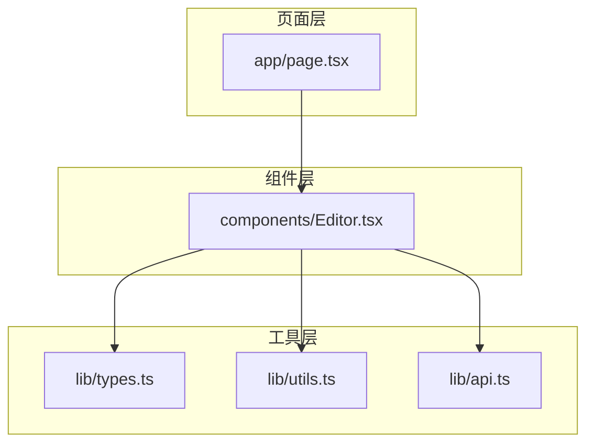
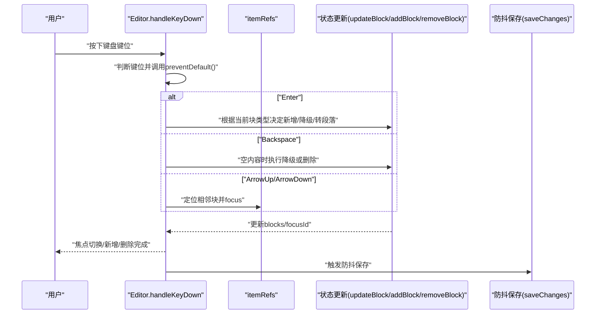
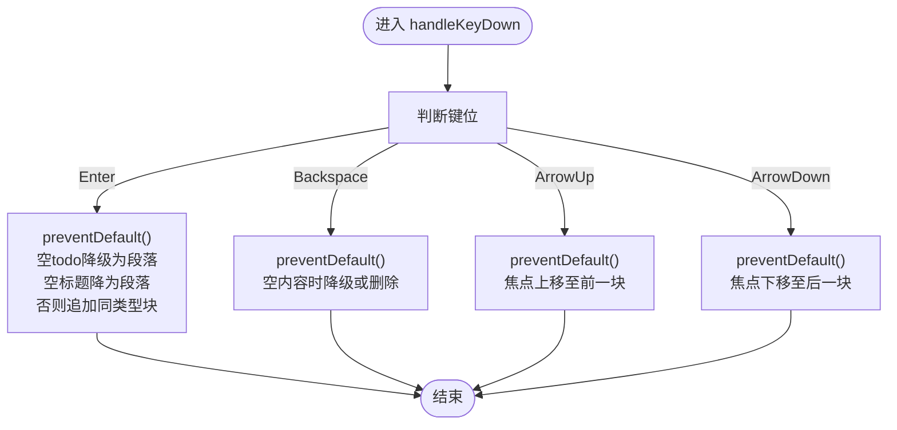
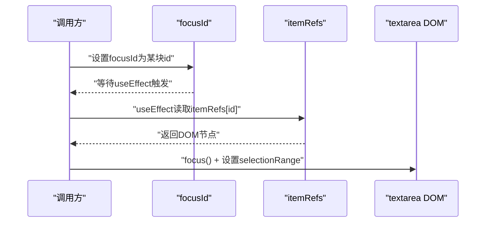
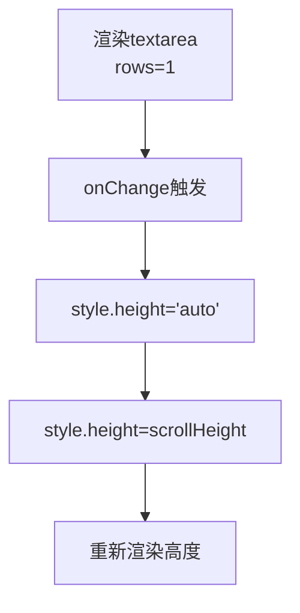
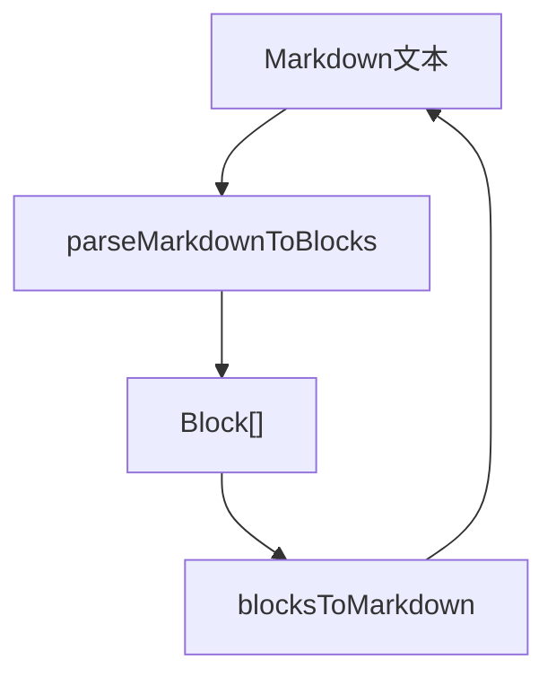
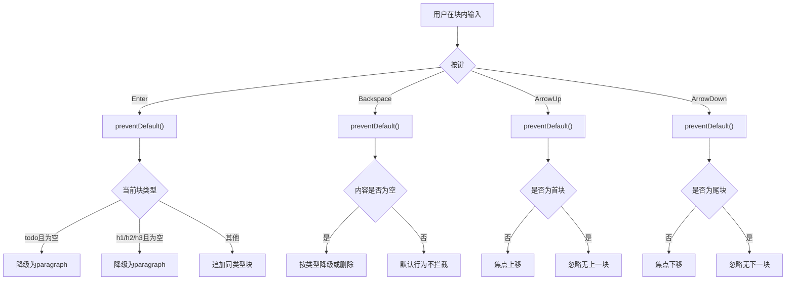
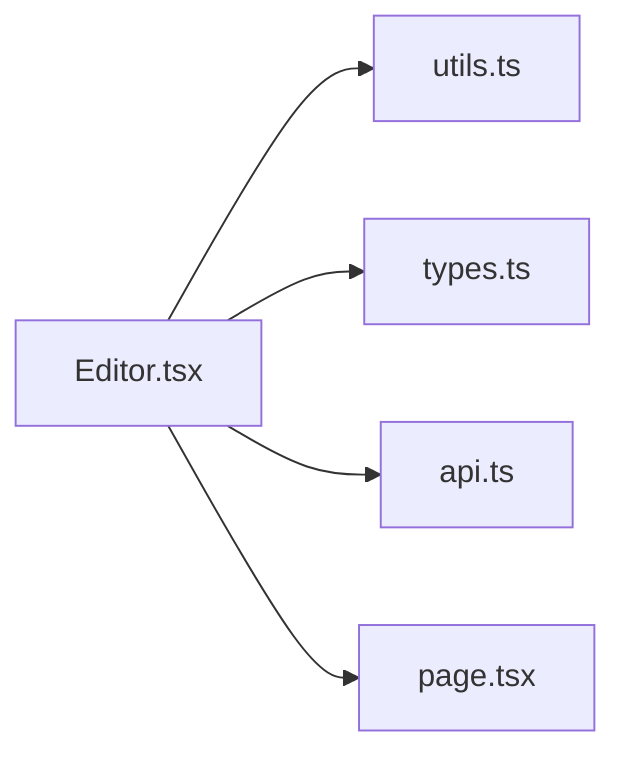

# 键盘导航与智能行为

<cite>
**本文引用的文件**
- [components/Editor.tsx](file://components/Editor.tsx)
- [lib/types.ts](file://lib/types.ts)
- [lib/utils.ts](file://lib/utils.ts)
- [lib/api.ts](file://lib/api.ts)
- [app/page.tsx](file://app/page.tsx)
</cite>

## 目录
1. [引言](#引言)
2. [项目结构](#项目结构)
3. [核心组件](#核心组件)
4. [架构总览](#架构总览)
5. [详细组件分析](#详细组件分析)
6. [依赖分析](#依赖分析)
7. [性能考虑](#性能考虑)
8. [故障排查指南](#故障排查指南)
9. [结论](#结论)
10. [附录](#附录)

## 引言
本文件围绕编辑器的键盘交互设计与智能行为进行系统性说明，重点解析 handleKeyDown 事件处理器对 Enter、Backspace、ArrowUp、ArrowDown 四个关键按键的拦截逻辑，阐述：
- 回车键根据当前块类型创建新块（todo 后继续 todo，标题后转段落），并处理空标题降级与空 todo 的特殊分支；
- 退格键实现空行降级（H1→H2→H3→paragraph）或删除空块；
- 上下箭头实现块间焦点切换；
- 如何通过 preventDefault 阻止默认换行行为；
- 利用 itemRefs 引用管理系统实现焦点控制；
- 结合 textarea 的 rows=1 与动态高度调整（scrollHeight）实现自适应输入框；
- 提供用户操作流程图，并指出边界情况如首尾块导航限制。

## 项目结构
编辑器位于组件层，负责将日志内容解析为块（Block）并渲染为可编辑的多行输入区域；同时通过工具模块实现 Markdown 与块结构之间的双向转换。页面层负责加载日志、维护当前日志与视图状态，并将日志变更回调传递给编辑器。

图表来源
- [app/page.tsx](file://app/page.tsx#L1-L209)
- [components/Editor.tsx](file://components/Editor.tsx#L1-L457)
- [lib/types.ts](file://lib/types.ts#L1-L34)
- [lib/utils.ts](file://lib/utils.ts#L1-L168)
- [lib/api.ts](file://lib/api.ts#L1-L56)

章节来源
- [app/page.tsx](file://app/page.tsx#L1-L209)
- [components/Editor.tsx](file://components/Editor.tsx#L1-L457)
- [lib/types.ts](file://lib/types.ts#L1-L34)
- [lib/utils.ts](file://lib/utils.ts#L1-L168)
- [lib/api.ts](file://lib/api.ts#L1-L56)

## 核心组件
- 编辑器组件（Editor）：管理块集合、标题、焦点、保存策略与键盘交互；负责将 Markdown 内容解析为块、渲染每个块对应的 textarea，并在键盘事件中执行智能行为。
- 类型定义（types）：定义 Block、BlockType、LogEntry 等核心类型，确保块结构与渲染样式的一致性。
- 工具函数（utils）：提供 parseMarkdownToBlocks、blocksToMarkdown、extractUnfinishedTasks、generateId、formatDate 等，支撑编辑器的数据流转与导入功能。
- 页面容器（page）：负责加载日志、维护当前日志与视图模式，并向编辑器注入 onUpdate、onDelete、previousLog 等依赖。

章节来源
- [components/Editor.tsx](file://components/Editor.tsx#L1-L457)
- [lib/types.ts](file://lib/types.ts#L1-L34)
- [lib/utils.ts](file://lib/utils.ts#L1-L168)
- [app/page.tsx](file://app/page.tsx#L1-L209)

## 架构总览
编辑器采用“块（Block）”作为最小编辑单元，每个块对应一个 textarea。键盘事件在 handleKeyDown 中统一拦截，结合 itemRefs 实现跨块焦点切换；通过 updateBlock/addBlock/removeBlock 等方法修改块集合，再由 useEffect 自动触发保存。

图表来源
- [components/Editor.tsx](file://components/Editor.tsx#L148-L192)
- [components/Editor.tsx](file://components/Editor.tsx#L128-L146)
- [components/Editor.tsx](file://components/Editor.tsx#L42-L64)

## 详细组件分析

### 键盘事件处理器：handleKeyDown
- 入口参数：React.KeyboardEvent、当前块索引 index
- 关键行为：
  - Enter：阻止默认换行；当当前块为空且为 todo 或标题时，执行降级或转段落；否则按类型追加新块（todo 后续 todo，标题后段落）。
  - Backspace：当当前块内容为空时，阻止默认删除行为；按类型降级（H1→H2→H3→paragraph）或删除该块。
  - ArrowUp/ArrowDown：阻止默认滚动；若非首/尾块，则通过 itemRefs 将焦点移动到上一块或下一块。
- 边界保护：removeBlock 对块数小于等于 1 的场景直接返回，防止误删全部块。

图表来源
- [components/Editor.tsx](file://components/Editor.tsx#L148-L192)

章节来源
- [components/Editor.tsx](file://components/Editor.tsx#L148-L192)

### 焦点控制系统：itemRefs 与 focusId
- itemRefs：以块 id 为键的引用映射，存储每个块对应的 textarea DOM 节点。
- 自动聚焦：useEffect 监听 focusId，找到对应节点后 focus 并将光标置于末尾。
- 块间导航：ArrowUp/ArrowDown 分支中，直接通过 itemRefs[currentId] 调用 focus，实现跨块跳转。

图表来源
- [components/Editor.tsx](file://components/Editor.tsx#L66-L76)
- [components/Editor.tsx](file://components/Editor.tsx#L181-L191)
- [components/Editor.tsx](file://components/Editor.tsx#L400-L405)

章节来源
- [components/Editor.tsx](file://components/Editor.tsx#L66-L76)
- [components/Editor.tsx](file://components/Editor.tsx#L181-L191)
- [components/Editor.tsx](file://components/Editor.tsx#L400-L405)

### 自适应输入框：rows=1 与动态高度
- 设计要点：textarea 设置 rows=1，初始最小高度由块类型样式控制；通过 onChange 与 useEffect 中的 scrollHeight 动态计算并设置高度，实现单行到多行的平滑扩展。
- 作用：避免出现垂直滚动条，保持紧凑布局，同时保证长文本输入体验。

图表来源
- [components/Editor.tsx](file://components/Editor.tsx#L194-L204)
- [components/Editor.tsx](file://components/Editor.tsx#L231-L239)
- [components/Editor.tsx](file://components/Editor.tsx#L412-L422)

章节来源
- [components/Editor.tsx](file://components/Editor.tsx#L194-L204)
- [components/Editor.tsx](file://components/Editor.tsx#L231-L239)
- [components/Editor.tsx](file://components/Editor.tsx#L412-L422)

### Markdown 与块结构转换
- parseMarkdownToBlocks：将 Markdown 文本拆分为块，识别标题、待办、列表等语法，生成 Block 数组；空内容时默认为段落。
- blocksToMarkdown：将 Block 数组还原为 Markdown 文本，支持 h1/h2/h3/todo/paragraph。
- 用途：初始化编辑器内容、保存时序列化、导入未完成任务时提取上下文标题。

图表来源
- [lib/utils.ts](file://lib/utils.ts#L8-L91)

章节来源
- [lib/utils.ts](file://lib/utils.ts#L8-L91)

### 用户操作流程图（Enter/Backspace/上下箭头）
- Enter：在任意块末尾按下 Enter，会根据当前块类型与内容决定行为；空标题/空 todo 有特殊分支；非空标题/待办则追加同类型块。
- Backspace：在块开头按下 Backspace，若内容为空则降级或删除；H1→H2→H3→paragraph 的降级链路清晰。
- 上下箭头：在块内任意位置按下 ArrowUp/ArrowDown，若非首/尾块则跳转到相邻块；首块不可上移，尾块不可下移。

图表来源
- [components/Editor.tsx](file://components/Editor.tsx#L148-L192)

章节来源
- [components/Editor.tsx](file://components/Editor.tsx#L148-L192)

### 边界情况与注意事项
- 首块导航限制：ArrowUp 在首块无效，仅阻止默认滚动，不执行焦点上移。
- 尾块导航限制：ArrowDown 在尾块无效，仅阻止默认滚动，不执行焦点下移。
- 保护性删除：removeBlock 当块数小于等于 1 时直接返回，避免误删全部块。
- 空标题/空 todo 特殊分支：Enter 时空标题降为段落，空 todo 降为段落，避免产生空标题或空待办块。
- 防抖保存：每次本地变更触发防抖保存，避免频繁网络请求。

章节来源
- [components/Editor.tsx](file://components/Editor.tsx#L139-L146)
- [components/Editor.tsx](file://components/Editor.tsx#L148-L192)
- [components/Editor.tsx](file://components/Editor.tsx#L42-L64)

## 依赖分析
- 组件与工具的耦合关系：
  - Editor 依赖 utils 的解析/序列化与导入工具，依赖 types 的类型定义。
  - Editor 通过 props 接收 onUpdate/onDelete，最终通过 lib/api.ts 进行网络请求。
- 关键依赖链：
  - 键盘事件 → 状态更新 → 防抖保存 → API 更新。
  - 渲染层 → itemRefs → DOM 焦点控制。

图表来源
- [components/Editor.tsx](file://components/Editor.tsx#L1-L457)
- [lib/utils.ts](file://lib/utils.ts#L1-L168)
- [lib/types.ts](file://lib/types.ts#L1-L34)
- [lib/api.ts](file://lib/api.ts#L1-L56)
- [app/page.tsx](file://app/page.tsx#L1-L209)

章节来源
- [components/Editor.tsx](file://components/Editor.tsx#L1-L457)
- [lib/utils.ts](file://lib/utils.ts#L1-L168)
- [lib/types.ts](file://lib/types.ts#L1-L34)
- [lib/api.ts](file://lib/api.ts#L1-L56)
- [app/page.tsx](file://app/page.tsx#L1-L209)

## 性能考虑
- 防抖保存：通过定时器延迟保存，减少频繁写入；仅在 isLocalChange 标记为真时触发。
- 动态高度：仅在输入变化或挂载时计算 scrollHeight，避免不必要的重排。
- 焦点控制：通过 itemRefs 直接访问 DOM，避免额外的查找开销。
- 建议优化：
  - 对超大文档，可考虑虚拟滚动或分页渲染；
  - 键盘事件中尽量减少状态更新次数，合并多次变更。

章节来源
- [components/Editor.tsx](file://components/Editor.tsx#L42-L64)
- [components/Editor.tsx](file://components/Editor.tsx#L194-L204)
- [components/Editor.tsx](file://components/Editor.tsx#L231-L239)

## 故障排查指南
- 焦点无法跳转：
  - 检查 itemRefs 是否正确绑定到每个块的 textarea；
  - 确认 ArrowUp/ArrowDown 分支中的索引边界条件。
- Enter 仍换行：
  - 确认 handleKeyDown 中已调用 preventDefault；
  - 检查块类型与内容判断逻辑是否命中预期分支。
- Backspace 删除异常：
  - 确认内容为空时才执行降级/删除；
  - 注意块数保护逻辑，避免误删。
- 高度不随内容变化：
  - 检查 onChange 与 useEffect 中的高度重置逻辑；
  - 确保 rows=1 且最小高度样式设置正确。

章节来源
- [components/Editor.tsx](file://components/Editor.tsx#L148-L192)
- [components/Editor.tsx](file://components/Editor.tsx#L194-L204)
- [components/Editor.tsx](file://components/Editor.tsx#L231-L239)
- [components/Editor.tsx](file://components/Editor.tsx#L400-L405)

## 结论
本编辑器通过统一的键盘事件处理器与引用式焦点控制，实现了高效的块级编辑体验。Enter/Backspace/ArrowUp/ArrowDown 的智能行为覆盖了常见写作场景，配合自适应输入框与防抖保存，兼顾易用性与性能。建议在后续迭代中进一步完善边界场景与大规模文档的渲染优化。

## 附录
- 类型定义参考：Block、BlockType、LogEntry
- 工具函数参考：parseMarkdownToBlocks、blocksToMarkdown、extractUnfinishedTasks、generateId、formatDate
- API 调用参考：fetchLogs、createLog、updateLog、deleteLog、generateSummary

章节来源
- [lib/types.ts](file://lib/types.ts#L1-L34)
- [lib/utils.ts](file://lib/utils.ts#L1-L168)
- [lib/api.ts](file://lib/api.ts#L1-L56)