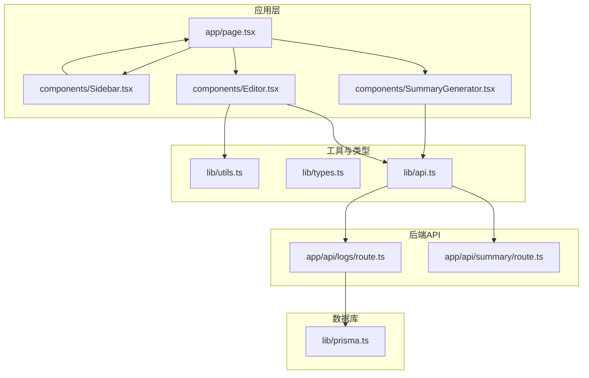
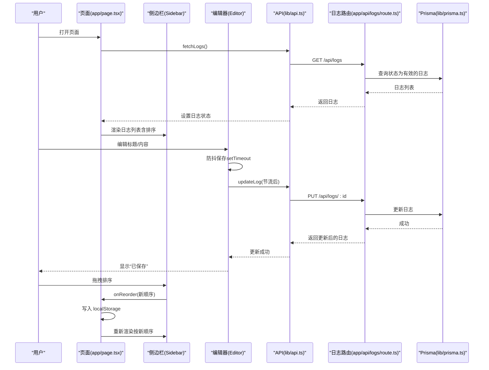
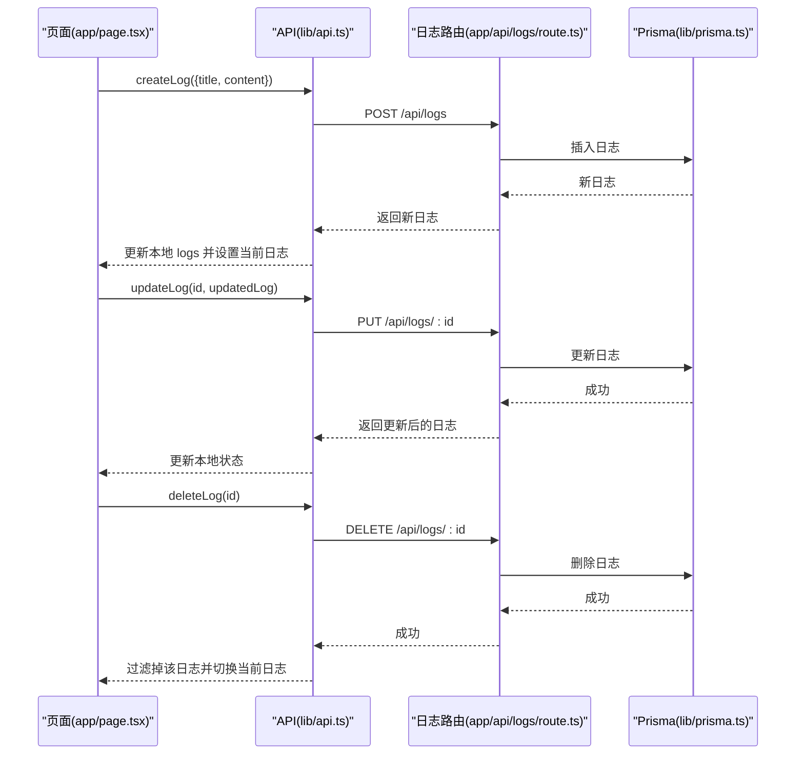
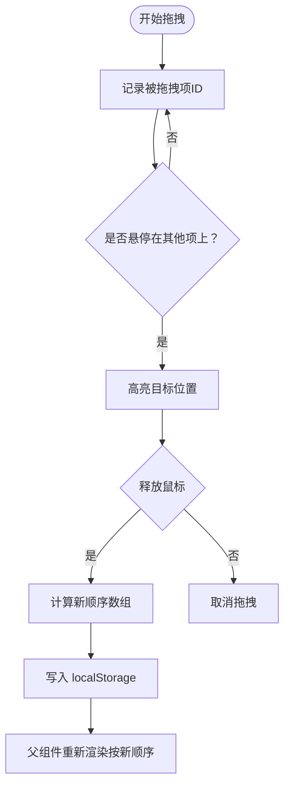
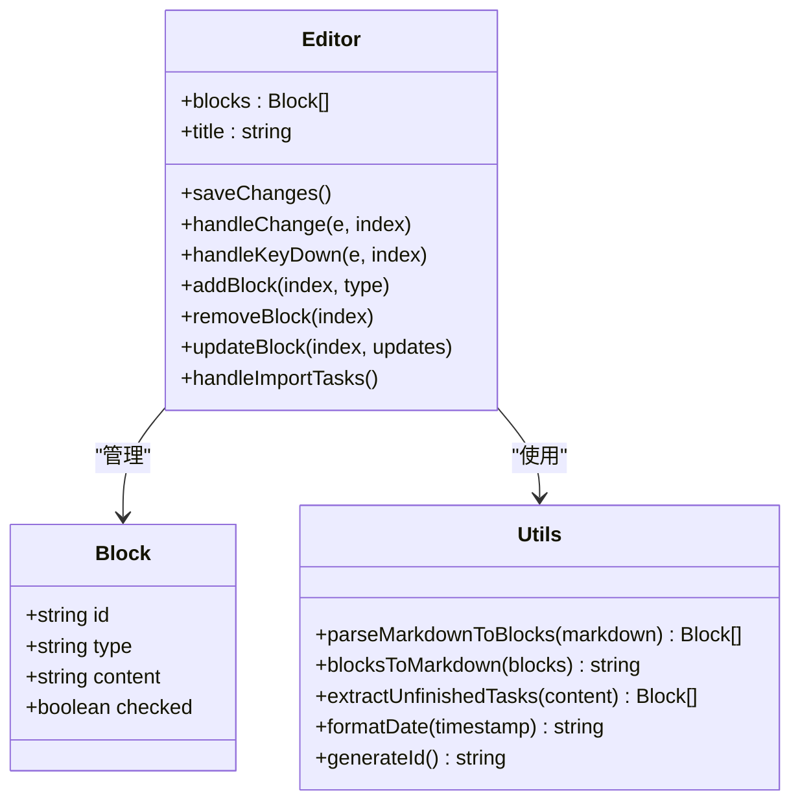
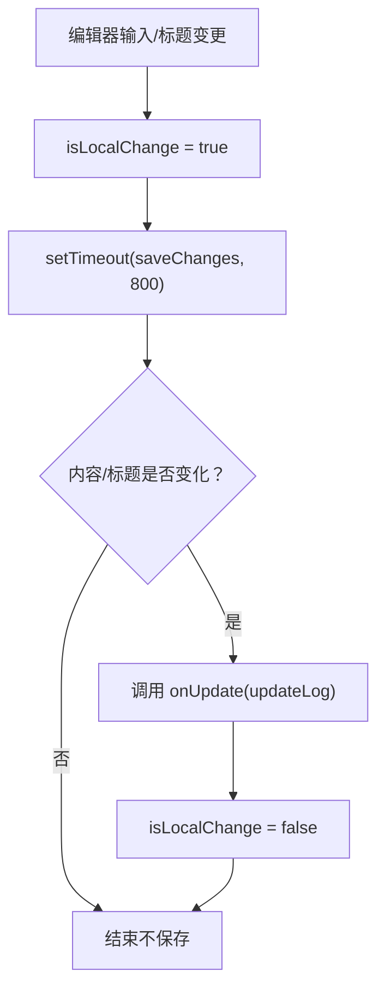
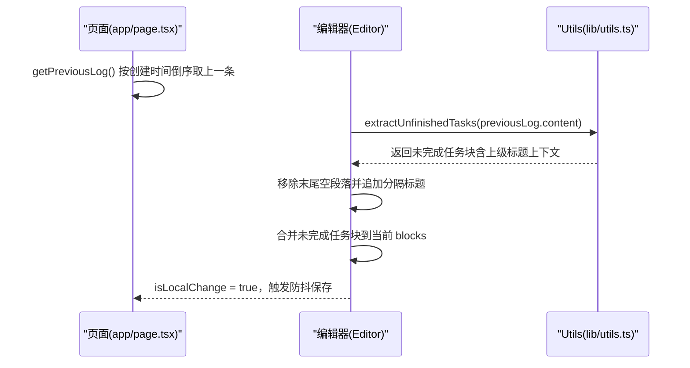
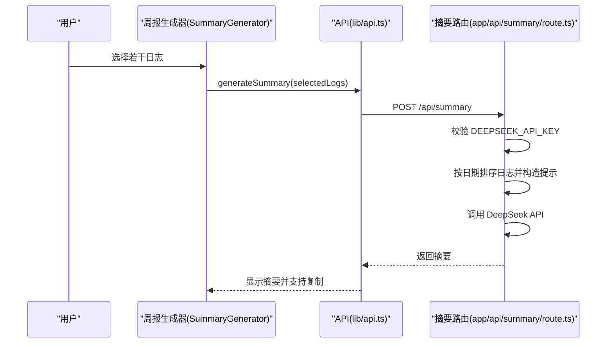
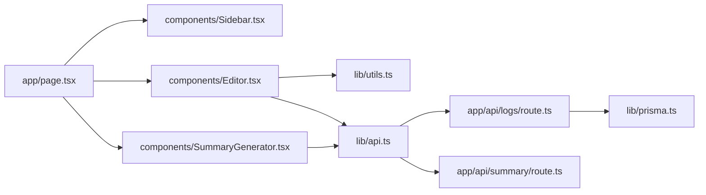

# 核心功能详解

<cite>
**本文引用的文件**
- [README.md](file://README.md)
- [app/page.tsx](file://app/page.tsx)
- [components/Editor.tsx](file://components/Editor.tsx)
- [components/Sidebar.tsx](file://components/Sidebar.tsx)
- [components/SummaryGenerator.tsx](file://components/SummaryGenerator.tsx)
- [lib/api.ts](file://lib/api.ts)
- [lib/utils.ts](file://lib/utils.ts)
- [lib/types.ts](file://lib/types.ts)
- [lib/prisma.ts](file://lib/prisma.ts)
- [app/api/logs/route.ts](file://app/api/logs/route.ts)
- [app/api/summary/route.ts](file://app/api/summary/route.ts)
</cite>

## 目录
1. [简介](#简介)
2. [项目结构](#项目结构)
3. [核心组件](#核心组件)
4. [架构总览](#架构总览)
5. [详细组件分析](#详细组件分析)
6. [依赖分析](#依赖分析)
7. [性能考量](#性能考量)
8. [故障排查指南](#故障排查指南)
9. [结论](#结论)
10. [附录](#附录)

## 简介
本项目是一款帮助记录每日工作并自动生成周报的智能工具。核心目标是通过简洁的 Markdown 式编辑器、基于拖拽的本地排序与持久化、智能的“从上一篇日志导入未完成任务”能力，以及实时自动保存（防抖），显著提升日志记录效率与体验。后端采用 Next.js API 路由与 Prisma 访问 SQLite 数据库，AI 周报功能通过 DeepSeek API 生成。

## 项目结构
- 应用入口与页面组织：app/page.tsx 负责主界面布局、日志列表加载、排序顺序持久化、视图切换与 CRUD 调用。
- 组件层：
  - Sidebar：日志列表、拖拽排序、创建/删除日志、打开周报生成器。
  - Editor：Markdown 块级编辑器、标题层级切换、待办事项管理、自动保存（防抖）、导入上一篇未完成任务。
  - SummaryGenerator：选择日志、调用后端生成周报、复制结果。
- 工具与类型：lib/utils.ts 提供解析/序列化、提取未完成任务、格式化日期等；lib/types.ts 定义日志与块类型；lib/api.ts 封装前端 API 调用。
- 后端 API：
  - app/api/logs/route.ts：GET/POST 日志接口，按创建时间倒序返回有效日志。
  - app/api/summary/route.ts：接收日志数组，按日期排序后调用 DeepSeek API 生成周报摘要。
- 数据库：lib/prisma.ts 提供 PrismaClient 实例，app/api/logs/route.ts 使用 Prisma 查询/插入日志。

图表来源
- [app/page.tsx](file://app/page.tsx#L1-L209)
- [components/Sidebar.tsx](file://components/Sidebar.tsx#L1-L234)
- [components/Editor.tsx](file://components/Editor.tsx#L1-L457)
- [components/SummaryGenerator.tsx](file://components/SummaryGenerator.tsx#L1-L237)
- [lib/utils.ts](file://lib/utils.ts#L1-L168)
- [lib/types.ts](file://lib/types.ts#L1-L34)
- [lib/api.ts](file://lib/api.ts#L1-L56)
- [app/api/logs/route.ts](file://app/api/logs/route.ts#L1-L38)
- [app/api/summary/route.ts](file://app/api/summary/route.ts#L1-L78)
- [lib/prisma.ts](file://lib/prisma.ts#L1-L12)

章节来源
- [README.md](file://README.md#L1-L64)
- [app/page.tsx](file://app/page.tsx#L1-L209)

## 核心组件
- 页面控制器（app/page.tsx）
  - 负责加载日志、维护当前日志、视图模式、移动端菜单、排序顺序的本地持久化与恢复。
  - 提供创建/更新/删除日志的回调，并在删除后自动切换到其他日志或清空。
- 侧边栏（components/Sidebar.tsx）
  - 展示日志列表，支持拖拽排序；根据 localStorage 的排序顺序与创建时间综合排序；提供创建/删除日志、打开周报生成器。
- 编辑器（components/Editor.tsx）
  - 基于块（Block）的 Markdown 编辑器，支持标题层级切换、待办事项勾选、键盘快捷键、自动高度调整、导入上一篇未完成任务、实时自动保存（防抖）。
- 周报生成器（components/SummaryGenerator.tsx）
  - 选择日志集合，调用后端生成周报摘要，支持复制结果。
- 工具与类型（lib/utils.ts、lib/types.ts、lib/api.ts）
  - 类型定义（LogEntry、Block、ViewMode、Status）。
  - 工具函数（parseMarkdownToBlocks、blocksToMarkdown、extractUnfinishedTasks、formatDate、generateId）。
  - 前端 API（fetchLogs、createLog、updateLog、deleteLog、generateSummary）。
- 后端 API（app/api/logs/route.ts、app/api/summary/route.ts）
  - 日志 CRUD：GET/POST。
  - 周报生成：POST，按日期排序日志，调用 DeepSeek API 并返回摘要。

章节来源
- [app/page.tsx](file://app/page.tsx#L1-L209)
- [components/Sidebar.tsx](file://components/Sidebar.tsx#L1-L234)
- [components/Editor.tsx](file://components/Editor.tsx#L1-L457)
- [components/SummaryGenerator.tsx](file://components/SummaryGenerator.tsx#L1-L237)
- [lib/utils.ts](file://lib/utils.ts#L1-L168)
- [lib/types.ts](file://lib/types.ts#L1-L34)
- [lib/api.ts](file://lib/api.ts#L1-L56)
- [app/api/logs/route.ts](file://app/api/logs/route.ts#L1-L38)
- [app/api/summary/route.ts](file://app/api/summary/route.ts#L1-L78)

## 架构总览
整体采用前后端分离的 Next.js API 路由模式：前端负责 UI 与交互，后端负责数据持久化与外部服务集成。编辑器内部状态与本地存储协同，确保用户在不同会话间保持一致的排序与草稿。

图表来源
- [app/page.tsx](file://app/page.tsx#L1-L209)
- [components/Sidebar.tsx](file://components/Sidebar.tsx#L1-L234)
- [components/Editor.tsx](file://components/Editor.tsx#L1-L457)
- [lib/api.ts](file://lib/api.ts#L1-L56)
- [app/api/logs/route.ts](file://app/api/logs/route.ts#L1-L38)
- [lib/prisma.ts](file://lib/prisma.ts#L1-L12)

## 详细组件分析

### 日志增删改查流程（useEffect 监听与 CRUD 回调）
- 加载日志：首次挂载时通过 API 获取日志列表，设置当前日志（优先使用本地保存的排序顺序中的首个有效 ID，否则使用最新日志）。
- 创建日志：调用 createLog，将新日志插入列表顶部并切换到该日志。
- 更新日志：编辑器内部防抖保存，调用 updateLog，仅在内容或标题发生变化时提交。
- 删除日志：调用 deleteLog，同时更新本地状态；若删除的是当前日志，则切换到其他日志或清空。

图表来源
- [app/page.tsx](file://app/page.tsx#L64-L103)
- [lib/api.ts](file://lib/api.ts#L12-L41)
- [app/api/logs/route.ts](file://app/api/logs/route.ts#L18-L38)
- [lib/prisma.ts](file://lib/prisma.ts#L1-L12)

章节来源
- [app/page.tsx](file://app/page.tsx#L39-L103)
- [lib/api.ts](file://lib/api.ts#L1-L56)
- [app/api/logs/route.ts](file://app/api/logs/route.ts#L1-L38)

### 基于拖拽的排序机制（结合 localStorage 持久化）
- 侧边栏根据 sortOrder 与创建时间综合排序；拖拽过程中高亮放置位置，结束后计算新顺序并回调父组件。
- 父组件将新顺序写入 localStorage，并在页面加载时读取恢复。
- 排序顺序键名为固定字符串，保证跨会话一致性。

图表来源
- [components/Sidebar.tsx](file://components/Sidebar.tsx#L36-L111)
- [app/page.tsx](file://app/page.tsx#L10-L36)

章节来源
- [components/Sidebar.tsx](file://components/Sidebar.tsx#L36-L111)
- [app/page.tsx](file://app/page.tsx#L10-L36)

### Markdown 智能编辑器（标题层级切换、待办事项管理）
- 块模型：Block 包含 id、type（paragraph/todo/h1/h2/h3）、content、checked（待办）。
- 标题层级切换：支持点击标题图标弹出菜单，选择 h1/h2/h3/正文；键盘输入“# ”、“## ”、“### ”自动转为对应标题；空标题回退为正文。
- 待办事项：支持勾选/取消；键盘输入“1. ”、“- ”、“* ”自动转为待办；todo 后续回车默认继续 todo。
- 键盘导航：上下箭头在块之间移动焦点；回车在标题为空时转为正文；Backspace 在块为空时降级标题或移除块。
- 自动高度：每个 textarea 根据内容动态调整高度。
- 导入上一篇未完成任务：从上一条日志提取未完成任务，保留其上级标题上下文，插入到当前编辑器末尾。

图表来源
- [components/Editor.tsx](file://components/Editor.tsx#L1-L457)
- [lib/utils.ts](file://lib/utils.ts#L1-L168)
- [lib/types.ts](file://lib/types.ts#L19-L34)

章节来源
- [components/Editor.tsx](file://components/Editor.tsx#L1-L457)
- [lib/utils.ts](file://lib/utils.ts#L1-L168)
- [lib/types.ts](file://lib/types.ts#L1-L34)

### 实时自动保存（防抖处理）
- 编辑器内部使用 isLocalChange 标记与 useRef 记录当前日志 ID，仅当本地变更发生时触发保存。
- 防抖策略：每次输入/标题变更后，延迟 800ms 调用 saveChanges；若期间再次变更则重置计时器。
- saveChanges 会将 blocks 转换为 Markdown，比较与原始内容/标题是否变化，再调用 onUpdate（即 updateLog）。
- 保存状态：显示“保存中/已保存”，避免频繁网络请求。

图表来源
- [components/Editor.tsx](file://components/Editor.tsx#L42-L64)

章节来源
- [components/Editor.tsx](file://components/Editor.tsx#L42-L64)

### 从上一篇日志导入未完成任务的逻辑实现
- 选择逻辑：activeLog 之外按创建时间倒序取最近的一条作为 previousLog。
- 提取规则：使用 extractUnfinishedTasks，仅提取未勾选的待办事项，并自动补全其上级标题（h1/h2）上下文，避免重复添加。
- 插入策略：移除末尾空段落，追加一个二级标题作为分隔，然后插入提取的块列表。
- 用户提示：若上一篇没有未完成任务，给出友好提示。

图表来源
- [app/page.tsx](file://app/page.tsx#L107-L115)
- [components/Editor.tsx](file://components/Editor.tsx#L89-L117)
- [lib/utils.ts](file://lib/utils.ts#L93-L146)

章节来源
- [app/page.tsx](file://app/page.tsx#L107-L115)
- [components/Editor.tsx](file://components/Editor.tsx#L89-L117)
- [lib/utils.ts](file://lib/utils.ts#L93-L146)

### 周报生成功能（AI 集成）
- 选择日志：SummaryGenerator 支持全选/反选，按创建时间倒序展示。
- 生成流程：将选中日志按 createTime 升序拼接为提示上下文，调用 DeepSeek API，返回摘要。
- 错误处理：未配置密钥或请求失败时返回错误信息。
- 结果展示：支持复制结果，返回选择面板可重新选择日志。

图表来源
- [components/SummaryGenerator.tsx](file://components/SummaryGenerator.tsx#L1-L237)
- [lib/api.ts](file://lib/api.ts#L43-L56)
- [app/api/summary/route.ts](file://app/api/summary/route.ts#L1-L78)

章节来源
- [components/SummaryGenerator.tsx](file://components/SummaryGenerator.tsx#L1-L237)
- [lib/api.ts](file://lib/api.ts#L43-L56)
- [app/api/summary/route.ts](file://app/api/summary/route.ts#L1-L78)

## 依赖分析
- 组件耦合
  - app/page.tsx 是全局状态与控制中心，依赖 Sidebar、Editor、SummaryGenerator。
  - Sidebar 仅依赖排序顺序与日志列表，通过回调与父组件通信。
  - Editor 依赖工具函数与 API，内部状态与本地存储解耦。
  - SummaryGenerator 依赖 API 与日志列表，独立于编辑器。
- 外部依赖
  - Next.js API 路由与 Prisma 访问 SQLite。
  - DeepSeek API 用于周报生成。
- 数据流
  - 前端状态：logs、currentLogId、viewMode、sortOrder。
  - 本地持久化：sortOrder 写入 localStorage。
  - 后端数据：日志 CRUD、周报生成。

图表来源
- [app/page.tsx](file://app/page.tsx#L1-L209)
- [components/Sidebar.tsx](file://components/Sidebar.tsx#L1-L234)
- [components/Editor.tsx](file://components/Editor.tsx#L1-L457)
- [components/SummaryGenerator.tsx](file://components/SummaryGenerator.tsx#L1-L237)
- [lib/utils.ts](file://lib/utils.ts#L1-L168)
- [lib/api.ts](file://lib/api.ts#L1-L56)
- [app/api/logs/route.ts](file://app/api/logs/route.ts#L1-L38)
- [app/api/summary/route.ts](file://app/api/summary/route.ts#L1-L78)
- [lib/prisma.ts](file://lib/prisma.ts#L1-L12)

章节来源
- [app/page.tsx](file://app/page.tsx#L1-L209)
- [lib/api.ts](file://lib/api.ts#L1-L56)
- [app/api/logs/route.ts](file://app/api/logs/route.ts#L1-L38)
- [app/api/summary/route.ts](file://app/api/summary/route.ts#L1-L78)
- [lib/prisma.ts](file://lib/prisma.ts#L1-L12)

## 性能考量
- 防抖保存：编辑器对保存进行 800ms 防抖，减少网络请求频率，提升交互流畅度。
- 本地排序：排序逻辑在前端完成，避免不必要的后端请求；localStorage 读写为 O(n)（n 为日志数）。
- 自适应高度：textarea 动态高度计算仅在必要时执行，避免重排开销。
- 周报生成：仅在用户点击生成时发起请求，且对错误进行明确反馈，避免无效重试。
- 数据库：Prisma 查询按创建时间倒序，索引友好；日志状态字段可用于过滤无效数据。

## 故障排查指南
- 无法加载日志
  - 检查后端日志路由是否正常返回；确认数据库连接与权限。
  - 查看浏览器网络面板，确认 /api/logs 是否返回 200。
- 保存失败
  - 确认编辑器防抖定时器是否被清理；查看 onUpdate 调用链路。
  - 检查 updateLog 返回值与错误处理。
- 拖拽排序无效
  - 确认 Sidebar 的 onReorder 回调是否被调用；检查 localStorage 是否写入成功。
  - 确保排序顺序数组包含有效日志 ID。
- 导入未完成任务无反应
  - 检查 previousLog 是否存在；确认 extractUnfinishedTasks 是否返回非空。
  - 确认编辑器 isLocalChange 标记是否被置位。
- 周报生成失败
  - 检查 DEEPSEEK_API_KEY 是否配置；确认 /api/summary 返回的错误信息。
  - 确认选择的日志数量大于 0 且 createTime 可解析。

章节来源
- [lib/api.ts](file://lib/api.ts#L1-L56)
- [app/api/logs/route.ts](file://app/api/logs/route.ts#L1-L38)
- [app/api/summary/route.ts](file://app/api/summary/route.ts#L1-L78)
- [components/Editor.tsx](file://components/Editor.tsx#L89-L117)
- [components/Sidebar.tsx](file://components/Sidebar.tsx#L90-L111)

## 结论
本项目通过“块级 Markdown 编辑器 + 拖拽排序 + 本地持久化 + 防抖自动保存 + 上一篇任务继承”的组合拳，实现了高效、顺滑的日志记录体验。后端 API 与数据库设计简洁可靠，AI 周报功能进一步提升了产出质量。整体架构清晰、职责分明，便于后续扩展与定制。

## 附录
- 开发者扩展建议
  - 编辑器增强：支持更多 Markdown 语法（如表格、代码块）、块级拖拽排序、撤销/重做。
  - 排序策略：支持多维排序（如标题、创建时间、更新时间）与分组视图。
  - 周报定制：允许用户自定义提示词模板，或选择不同的模型与参数。
  - 数据迁移：提供导出/导入功能，便于跨设备同步。
  - 错误边界：在关键组件增加错误边界与重试机制，提升健壮性。