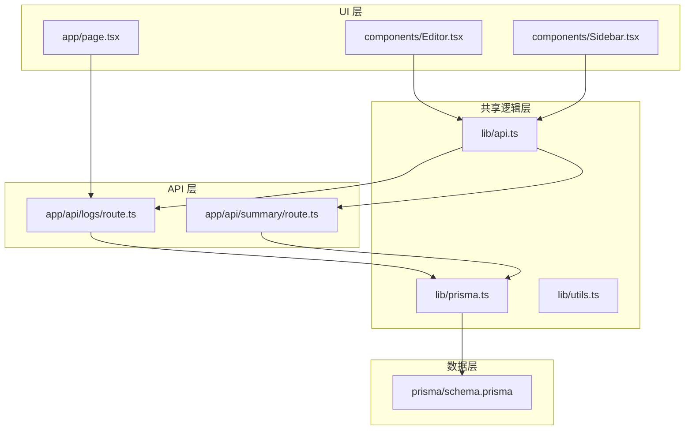
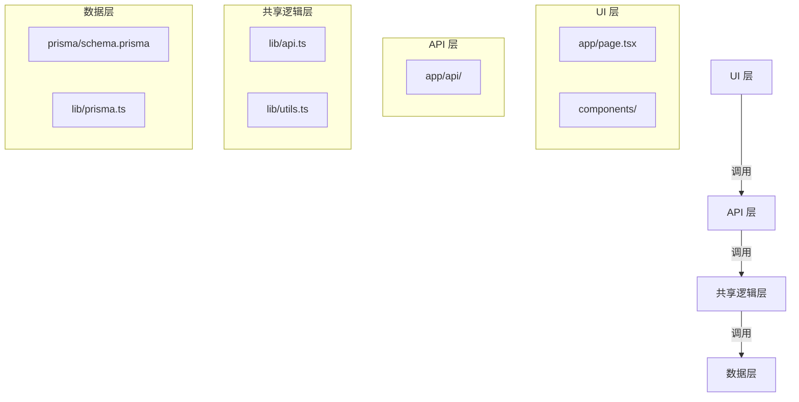

# 目录结构说明

<cite>
**本文档引用的文件**  
- [app/page.tsx](file://app/page.tsx)
- [app/layout.tsx](file://app/layout.tsx)
- [app/api/logs/route.ts](file://app/api/logs/route.ts)
- [app/api/summary/route.ts](file://app/api/summary/route.ts)
- [components/Editor.tsx](file://components/Editor.tsx)
- [components/Sidebar.tsx](file://components/Sidebar.tsx)
- [components/SummaryGenerator.tsx](file://components/SummaryGenerator.tsx)
- [lib/api.ts](file://lib/api.ts)
- [lib/prisma.ts](file://lib/prisma.ts)
- [lib/types.ts](file://lib/types.ts)
- [lib/utils.ts](file://lib/utils.ts)
- [prisma/schema.prisma](file://prisma/schema.prisma)
- [config/数据库表规范.md](file://config/数据库表规范.md)
- [doc/数据关系图.md](file://doc/数据关系图.md)
- [README.md](file://README.md)
</cite>

## 目录结构说明

本项目采用分层架构设计，通过清晰的目录结构实现关注点分离，支持从UI层到数据层的清晰调用链。整体结构遵循Next.js最佳实践，同时结合Prisma进行数据库管理，形成高效、可维护的全栈应用架构。

**图示来源**  
- [app/page.tsx](file://app/page.tsx#L1-L209)
- [app/api/logs/route.ts](file://app/api/logs/route.ts#L1-L38)
- [lib/prisma.ts](file://lib/prisma.ts#L1-L12)
- [prisma/schema.prisma](file://prisma/schema.prisma#L1-L26)

### app/
`app/`目录是Next.js 13+应用的主入口，采用App Router模式，负责UI渲染和API路由管理。

- `app/page.tsx`：主页面组件，实现日志列表、编辑器和周报生成器的布局与状态管理
- `app/layout.tsx`：根布局文件，配置全局样式和字体
- `app/api/`：API路由目录，包含日志和摘要相关的后端接口

该目录体现了Next.js的同构特性，既处理前端渲染，又提供后端API服务，实现全栈功能集成。

**本节来源**  
- [app/page.tsx](file://app/page.tsx#L1-L209)
- [app/layout.tsx](file://app/layout.tsx#L1-L30)

### components/
`components/`目录存放可复用的React UI组件，实现界面功能的模块化。

- `Editor.tsx`：日志编辑器组件，支持Markdown格式输入、待办事项管理、任务继承等功能
- `Sidebar.tsx`：侧边栏组件，显示日志列表并支持创建、删除、排序操作
- `SummaryGenerator.tsx`：周报生成器组件，调用AI接口生成工作总结

这些组件通过props接收数据和回调函数，保持了良好的封装性和可复用性，遵循React的组件化设计原则。

**本节来源**  
- [components/Editor.tsx](file://components/Editor.tsx#L1-L457)
- [components/Sidebar.tsx](file://components/Sidebar.tsx)
- [components/SummaryGenerator.tsx](file://components/SummaryGenerator.tsx)

### config/
`config/`目录管理项目的配置文件和规范文档。

- `env.example`：环境变量模板文件，定义了`DEEPSEEK_API_KEY`等必要配置
- `database-rules.md`：数据库设计规则文档
- `数据库表规范.md`：详细说明数据表结构和字段含义

该目录为项目提供了标准化的配置管理，确保开发环境的一致性。

**本节来源**  
- [config/env.example](file://config/env.example)
- [config/数据库表规范.md](file://config/数据库表规范.md)

### doc/
`doc/`目录存放项目的技术文档和设计图示。

- `数据关系图.md`：可视化展示数据模型之间的关系，辅助理解数据库设计

该目录作为知识库，帮助开发者快速理解系统架构和数据流。

**本节来源**  
- [doc/数据关系图.md](file://doc/数据关系图.md)

### lib/
`lib/`目录封装跨组件共享的逻辑和工具函数，是连接UI层和数据层的桥梁。

- `api.ts`：API客户端封装，提供`fetchLogs`、`createLog`、`generateSummary`等函数
- `prisma.ts`：Prisma客户端实例，处理数据库连接的单例模式
- `types.ts`：类型定义文件，包含`LogEntry`、`ViewMode`等共享类型
- `utils.ts`：工具函数集合，如`parseMarkdownToBlocks`、`extractUnfinishedTasks`等

该目录实现了业务逻辑的集中管理，避免代码重复，提高可维护性。

**本节来源**  
- [lib/api.ts](file://lib/api.ts#L1-L56)
- [lib/prisma.ts](file://lib/prisma.ts#L1-L12)
- [lib/types.ts](file://lib/types.ts#L1-L34)
- [lib/utils.ts](file://lib/utils.ts#L1-L168)

### prisma/
`prisma/`目录负责数据层的定义和管理。

- `schema.prisma`：Prisma数据模型文件，定义`LogEntry`模型及其字段，配置SQLite数据库连接

该目录实现了数据访问层的声明式定义，通过Prisma ORM提供类型安全的数据库操作。

**本节来源**  
- [prisma/schema.prisma](file://prisma/schema.prisma#L1-L26)

## 分层架构分析

本项目采用典型的三层架构模式，各层职责分明，通过清晰的依赖关系实现解耦。

**图示来源**  
- [app/page.tsx](file://app/page.tsx#L1-L209)
- [app/api/logs/route.ts](file://app/api/logs/route.ts#L1-L38)
- [lib/api.ts](file://lib/api.ts#L1-L56)
- [prisma/schema.prisma](file://prisma/schema.prisma#L1-L26)

### 调用流程示例：创建日志
1. UI层：`Editor`组件调用`handleCreateLog`
2. 共享逻辑层：`lib/api.ts`中的`createLog`函数发起API请求
3. API层：`app/api/logs/route.ts`的POST接口接收请求
4. 数据层：通过`lib/prisma.ts`的实例操作数据库

这种分层设计使得代码结构清晰，便于测试和维护，符合现代Web应用的最佳实践。

**本节来源**  
- [app/page.tsx](file://app/page.tsx#L64-L77)
- [lib/api.ts](file://lib/api.ts#L13-L21)
- [app/api/logs/route.ts](file://app/api/logs/route.ts#L18-L37)

## 开发者指南

为帮助开发者快速定位关键模块，以下是常见任务的路径指引：

| 任务 | 关键文件 |
|------|----------|
| 修改主界面布局 | `app/page.tsx`, `app/layout.tsx` |
| 添加新的UI组件 | `components/` 目录 |
| 修改API接口 | `app/api/` 目录 |
| 调整数据模型 | `prisma/schema.prisma` |
| 添加共享工具函数 | `lib/utils.ts` |
| 修改类型定义 | `lib/types.ts` |

项目通过这种结构化的组织方式，降低了新开发者的学习成本，提高了团队协作效率。

**本节来源**  
- [README.md](file://README.md#L1-L64)
- [package.json](file://package.json#L1-L30)