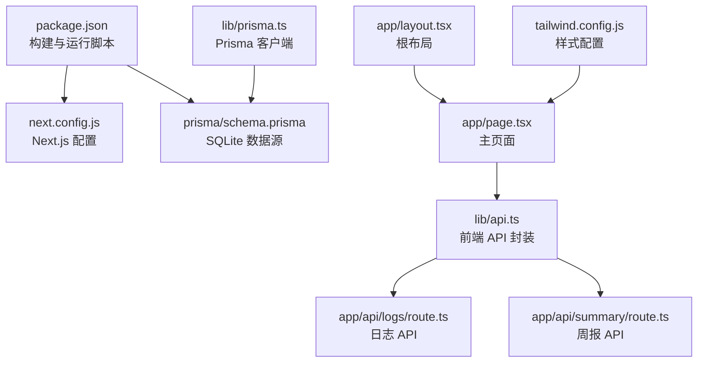
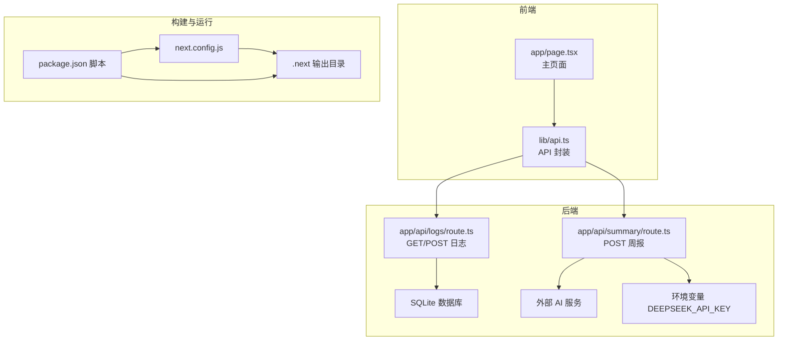
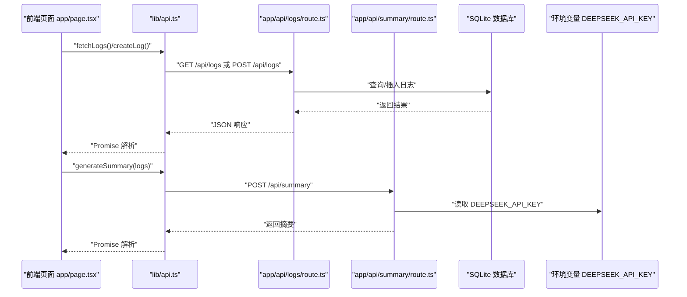
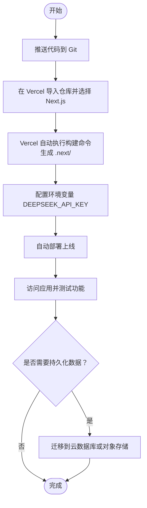
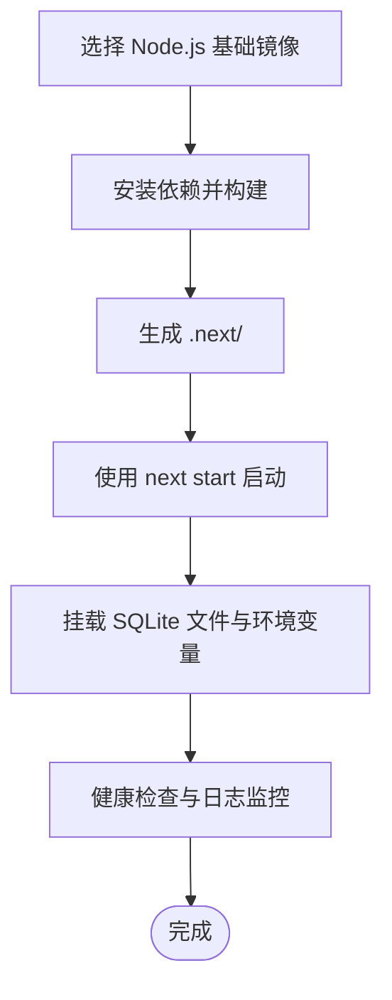
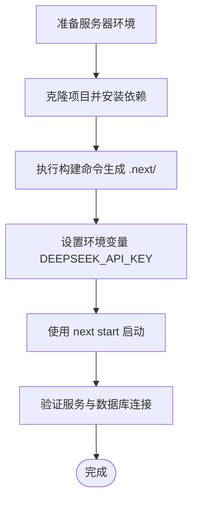
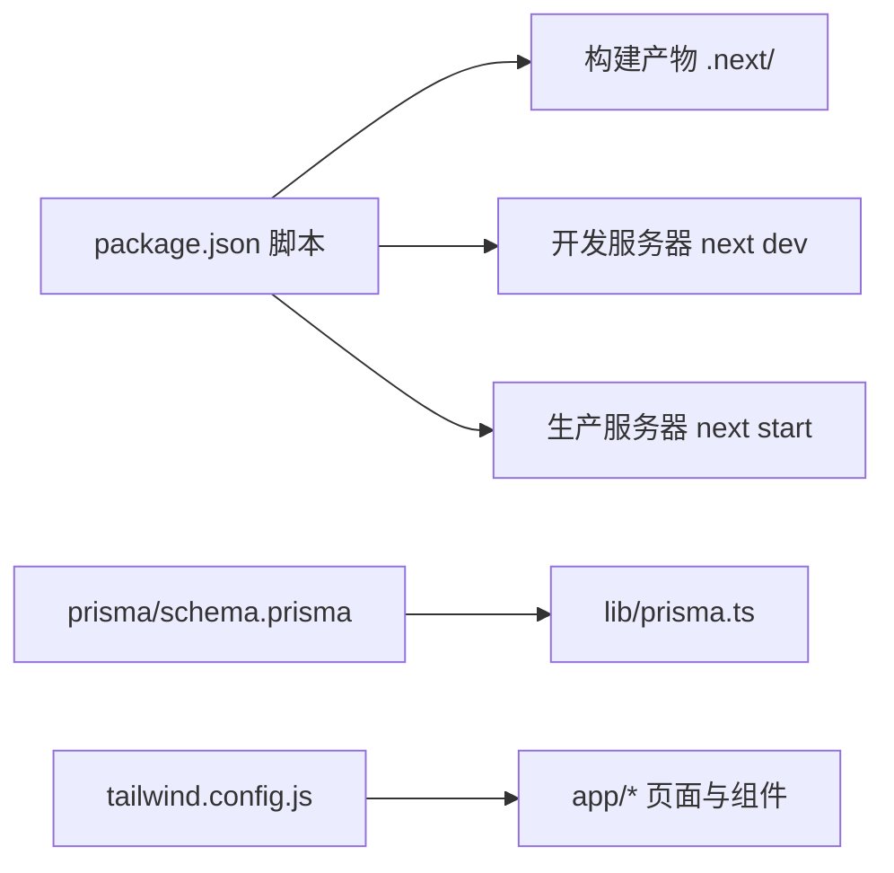

# 部署指南

<cite>
**本文引用的文件**
- [package.json](file://package.json)
- [next.config.js](file://next.config.js)
- [README.md](file://README.md)
- [prisma/schema.prisma](file://prisma/schema.prisma)
- [lib/prisma.ts](file://lib/prisma.ts)
- [lib/api.ts](file://lib/api.ts)
- [app/api/logs/route.ts](file://app/api/logs/route.ts)
- [app/api/summary/route.ts](file://app/api/summary/route.ts)
- [config/env.example](file://config/env.example)
- [tailwind.config.js](file://tailwind.config.js)
- [app/page.tsx](file://app/page.tsx)
- [app/layout.tsx](file://app/layout.tsx)
- [lib/types.ts](file://lib/types.ts)
</cite>

## 目录
1. [简介](#简介)
2. [项目结构](#项目结构)
3. [核心组件](#核心组件)
4. [架构总览](#架构总览)
5. [详细组件分析](#详细组件分析)
6. [依赖分析](#依赖分析)
7. [性能考虑](#性能考虑)
8. [故障排查指南](#故障排查指南)
9. [结论](#结论)
10. [附录](#附录)

## 简介
本指南面向需要将该 Next.js 应用部署到不同平台（Vercel、Docker 容器、传统静态服务器）的用户，提供从构建到运行的完整流程说明。重点覆盖：
- 构建命令与输出目录（npm run build 与 .next/）
- Vercel 自动部署（Git 集成）
- Docker 镜像构建与运行
- 传统服务器使用 next start 启动生产服务
- 环境变量配置、SQLite 文件路径与权限、API 密钥安全

## 项目结构
该仓库采用标准 Next.js App Router 结构，包含应用入口、API 路由、数据库配置与前端组件。关键目录与文件如下：
- app/：Next.js 应用根目录，包含 API 路由与页面
- lib/：通用工具与类型定义，包含 Prisma 客户端与 API 封装
- prisma/：Prisma 数据库 Schema 与 SQLite 数据库文件
- config/：环境变量示例与数据库表规范
- 构建与运行脚本位于 package.json 的 scripts 字段

图表来源
- [package.json](file://package.json#L1-L30)
- [next.config.js](file://next.config.js#L1-L8)
- [prisma/schema.prisma](file://prisma/schema.prisma#L1-L26)
- [lib/prisma.ts](file://lib/prisma.ts#L1-L12)
- [lib/api.ts](file://lib/api.ts#L1-L56)
- [app/api/logs/route.ts](file://app/api/logs/route.ts#L1-L38)
- [app/api/summary/route.ts](file://app/api/summary/route.ts#L1-L78)
- [app/page.tsx](file://app/page.tsx#L1-L209)
- [app/layout.tsx](file://app/layout.tsx#L1-L30)
- [tailwind.config.js](file://tailwind.config.js#L1-L32)

章节来源
- [package.json](file://package.json#L1-L30)
- [next.config.js](file://next.config.js#L1-L8)
- [prisma/schema.prisma](file://prisma/schema.prisma#L1-L26)
- [lib/prisma.ts](file://lib/prisma.ts#L1-L12)
- [lib/api.ts](file://lib/api.ts#L1-L56)
- [app/api/logs/route.ts](file://app/api/logs/route.ts#L1-L38)
- [app/api/summary/route.ts](file://app/api/summary/route.ts#L1-L78)
- [app/page.tsx](file://app/page.tsx#L1-L209)
- [app/layout.tsx](file://app/layout.tsx#L1-L30)
- [tailwind.config.js](file://tailwind.config.js#L1-L32)

## 核心组件
- 构建与运行脚本
  - 构建命令：npm run build（会先执行 Prisma 生成，再执行 Next.js 构建）
  - 运行命令：npm start（生产模式启动）
- 数据库与客户端
  - 使用 Prisma 与 SQLite，数据源 URL 指向本地文件路径
  - Prisma 客户端在 lib/prisma.ts 中按开发/生产模式管理实例
- API 层
  - 日志 API：提供查询与创建日志
  - 周报 API：基于外部 AI 服务生成摘要，依赖环境变量中的 API 密钥
- 前端交互
  - 主页面负责加载日志、编辑日志、生成周报
  - API 封装统一处理请求与错误

章节来源
- [package.json](file://package.json#L1-L30)
- [prisma/schema.prisma](file://prisma/schema.prisma#L1-L26)
- [lib/prisma.ts](file://lib/prisma.ts#L1-L12)
- [lib/api.ts](file://lib/api.ts#L1-L56)
- [app/api/logs/route.ts](file://app/api/logs/route.ts#L1-L38)
- [app/api/summary/route.ts](file://app/api/summary/route.ts#L1-L78)
- [app/page.tsx](file://app/page.tsx#L1-L209)

## 架构总览
应用采用前后端同构架构，前端通过 API 封装调用后端 API，后端 API 使用 Prisma 访问 SQLite 数据库。构建产物输出至 .next/，生产环境通过 next start 提供静态资源与服务。

图表来源
- [app/page.tsx](file://app/page.tsx#L1-L209)
- [lib/api.ts](file://lib/api.ts#L1-L56)
- [app/api/logs/route.ts](file://app/api/logs/route.ts#L1-L38)
- [app/api/summary/route.ts](file://app/api/summary/route.ts#L1-L78)
- [prisma/schema.prisma](file://prisma/schema.prisma#L1-L26)
- [next.config.js](file://next.config.js#L1-L8)
- [package.json](file://package.json#L1-L30)

## 详细组件分析

### 构建与输出目录
- 构建命令
  - npm run build：会先执行 Prisma 生成，再执行 Next.js 构建，生成 .next/ 目录
- 输出目录
  - .next/ 包含静态资源、预渲染 HTML、服务端渲染产物等，生产环境通过 next start 提供
- 开发与生产差异
  - 开发模式使用 next dev，生产模式使用 next start
  - 构建脚本中已包含 Prisma 生成，确保数据库类型与迁移同步

章节来源
- [package.json](file://package.json#L1-L30)
- [next.config.js](file://next.config.js#L1-L8)

### 数据库与 SQLite 配置
- 数据源
  - SQLite 数据源 URL 指向本地文件路径，便于单文件部署
- 客户端初始化
  - 在 lib/prisma.ts 中按开发/生产模式管理 Prisma 实例，避免重复实例化
- 数据迁移
  - 使用 Prisma CLI 初始化数据库与模型，确保生产环境一致

章节来源
- [prisma/schema.prisma](file://prisma/schema.prisma#L1-L26)
- [lib/prisma.ts](file://lib/prisma.ts#L1-L12)

### API 设计与调用链
- 日志 API
  - GET /api/logs：查询状态正常的日志列表
  - POST /api/logs：创建新日志
- 周报 API
  - POST /api/summary：基于传入日志生成摘要，依赖外部 AI 服务
  - 读取环境变量 DEEPSEEK_API_KEY，若缺失则返回错误
- 前端调用
  - lib/api.ts 统一封装 fetch 请求，错误时抛出异常供 UI 处理

图表来源
- [app/page.tsx](file://app/page.tsx#L1-L209)
- [lib/api.ts](file://lib/api.ts#L1-L56)
- [app/api/logs/route.ts](file://app/api/logs/route.ts#L1-L38)
- [app/api/summary/route.ts](file://app/api/summary/route.ts#L1-L78)

章节来源
- [app/api/logs/route.ts](file://app/api/logs/route.ts#L1-L38)
- [app/api/summary/route.ts](file://app/api/summary/route.ts#L1-L78)
- [lib/api.ts](file://lib/api.ts#L1-L56)
- [app/page.tsx](file://app/page.tsx#L1-L209)

### 环境变量与密钥安全
- 环境变量示例
  - config/env.example 提供 DEEPSEEK_API_KEY 示例，需复制为 .env.local 并填写真实密钥
- 密钥读取位置
  - app/api/summary/route.ts 读取 DEEPSEEK_API_KEY 并用于外部 AI 服务鉴权
- 安全建议
  - 不将 .env.local 提交至版本控制
  - 在部署平台（如 Vercel、Docker）中通过平台的环境变量管理注入密钥
  - 限制密钥权限与有效期，定期轮换

章节来源
- [config/env.example](file://config/env.example#L1-L7)
- [app/api/summary/route.ts](file://app/api/summary/route.ts#L1-L78)

### 部署平台指南

#### Vercel 部署（Git 集成自动部署）
- 准备工作
  - 将项目推送到 Git 托管平台（GitHub/GitLab 等）
  - 在 Vercel 中导入对应仓库，选择 Next.js 项目
- 构建与运行
  - Vercel 将自动执行构建命令（由 package.json scripts 决定），输出 .next/
  - 生产环境无需手动运行 next start，Vercel 会托管构建产物
- 环境变量
  - 在 Vercel 项目设置中添加环境变量 DEEPSEEK_API_KEY
  - 确保与 config/env.example 中的键名一致
- 数据持久化
  - 当前 SQLite 数据源指向本地文件路径，Vercel 平台的临时文件系统不保证持久性
  - 建议迁移到云端数据库（如 PlanetScale、Supabase 或 Vercel Postgres），或使用 Vercel Blob 存储替代本地文件

[本图为概念流程图，不直接映射具体源码文件，故不提供图表来源]

#### Docker 容器部署
- 构建建议
  - 使用官方 Node.js 镜像作为基础镜像，安装依赖并执行构建
  - 将 .next/ 作为静态资源提供，使用 next start 启动生产服务
- 关键点
  - 环境变量通过 Docker 环境变量注入（DEEPSEEK_API_KEY）
  - SQLite 文件路径需写入可写卷，避免容器重启后数据丢失
  - 若使用 SQLite，建议将 dev.db 放置于挂载卷中，或改为云数据库
- 镜像构建命令（示例）
  - docker build -t smart-log-reporter .
  - docker run -p 3000:3000 -e DEEPSEEK_API_KEY=your_key smart-log-reporter

[本图为概念流程图，不直接映射具体源码文件，故不提供图表来源]

#### 传统服务器部署（next start）
- 步骤
  - 在服务器上安装 Node.js 与包管理器
  - 克隆项目并安装依赖
  - 执行构建命令生成 .next/
  - 设置环境变量 DEEPSEEK_API_KEY
  - 使用 next start 启动生产服务
- 数据持久化
  - SQLite 文件路径需具备写权限，建议放置于可写目录并配置权限
  - 如需高可用，建议迁移到云数据库

[本图为概念流程图，不直接映射具体源码文件，故不提供图表来源]

## 依赖分析
- 构建与运行
  - package.json 定义了 dev/build/start/lint/db:* 等脚本
  - 构建脚本中包含 Prisma 生成，确保数据库类型与模型一致
- 样式与字体
  - tailwind.config.js 配置了内容扫描范围与主题颜色
- 数据层
  - prisma/schema.prisma 定义了 SQLite 数据源与模型
  - lib/prisma.ts 管理 Prisma 客户端生命周期

图表来源
- [package.json](file://package.json#L1-L30)
- [prisma/schema.prisma](file://prisma/schema.prisma#L1-L26)
- [lib/prisma.ts](file://lib/prisma.ts#L1-L12)
- [tailwind.config.js](file://tailwind.config.js#L1-L32)

章节来源
- [package.json](file://package.json#L1-L30)
- [prisma/schema.prisma](file://prisma/schema.prisma#L1-L26)
- [lib/prisma.ts](file://lib/prisma.ts#L1-L12)
- [tailwind.config.js](file://tailwind.config.js#L1-L32)

## 性能考虑
- 构建优化
  - 使用 Next.js 内置的静态导出与预渲染能力，减少首屏渲染时间
  - 控制 API 调用频率，避免不必要的重复请求
- 数据库性能
  - SQLite 适合小规模数据，若并发较高建议迁移到云数据库
  - 合理索引与查询条件，避免一次性加载过多日志
- 外部服务
  - 周报 API 依赖外部 AI 服务，建议增加超时与重试策略，避免阻塞 UI

[本节为通用建议，不直接分析具体文件，故不提供章节来源]

## 故障排查指南
- 构建失败
  - 检查 package.json 中的构建脚本是否正确
  - 确认 Prisma 生成是否成功，schema 是否存在语法错误
- 数据库问题
  - 确认 SQLite 文件路径是否存在且具备写权限
  - 若使用 Vercel/Docker，注意临时文件系统不持久化，需迁移到云数据库
- API 密钥错误
  - 确认 DEEPSEEK_API_KEY 是否正确配置
  - 在 Vercel/Docker 中检查环境变量是否生效
- 前端无法加载数据
  - 检查 app/api/logs/route.ts 与 app/api/summary/route.ts 的响应状态
  - 查看浏览器网络面板与服务端日志

章节来源
- [package.json](file://package.json#L1-L30)
- [prisma/schema.prisma](file://prisma/schema.prisma#L1-L26)
- [app/api/logs/route.ts](file://app/api/logs/route.ts#L1-L38)
- [app/api/summary/route.ts](file://app/api/summary/route.ts#L1-L78)
- [config/env.example](file://config/env.example#L1-L7)

## 结论
本指南提供了从构建到多平台部署的完整流程，强调了环境变量与数据库持久化的关键点。对于 SQLite 的临时文件系统限制，建议优先迁移到云数据库或对象存储，以获得更好的可靠性与扩展性。在 Vercel 上部署时，务必通过平台的环境变量管理注入 API 密钥，并关注数据持久化方案。

[本节为总结性内容，不直接分析具体文件，故不提供章节来源]

## 附录

### 构建与运行命令
- 开发模式：npm run dev
- 构建：npm run build（内部包含 Prisma 生成）
- 生产运行：npm run start

章节来源
- [package.json](file://package.json#L1-L30)

### 环境变量清单
- DEEPSEEK_API_KEY：外部 AI 服务鉴权密钥
- 建议：在各平台的环境变量管理中配置，不要提交到版本控制

章节来源
- [config/env.example](file://config/env.example#L1-L7)
- [app/api/summary/route.ts](file://app/api/summary/route.ts#L1-L78)

### SQLite 路径与权限
- 当前 schema 指向本地文件路径，部署时需确保路径可写
- 建议：迁移到云数据库或使用对象存储，避免临时文件系统限制

章节来源
- [prisma/schema.prisma](file://prisma/schema.prisma#L1-L26)

### API 路由一览
- GET /api/logs：查询状态正常的日志
- POST /api/logs：创建新日志
- POST /api/summary：基于日志生成摘要（依赖 DEEPSEEK_API_KEY）

章节来源
- [app/api/logs/route.ts](file://app/api/logs/route.ts#L1-L38)
- [app/api/summary/route.ts](file://app/api/summary/route.ts#L1-L78)