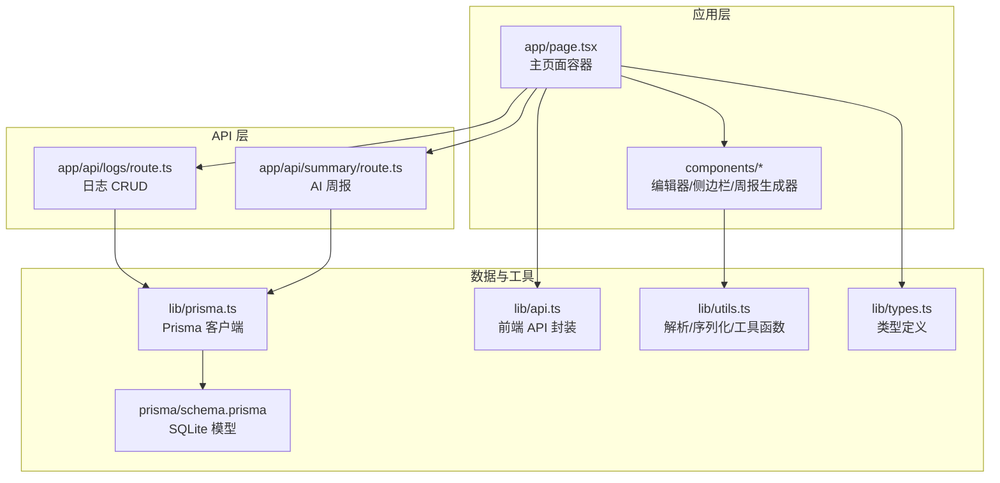
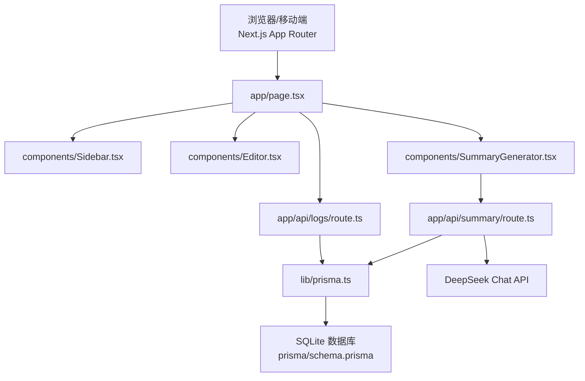
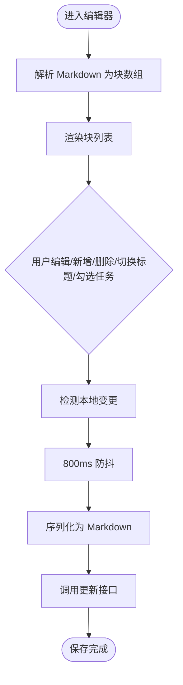
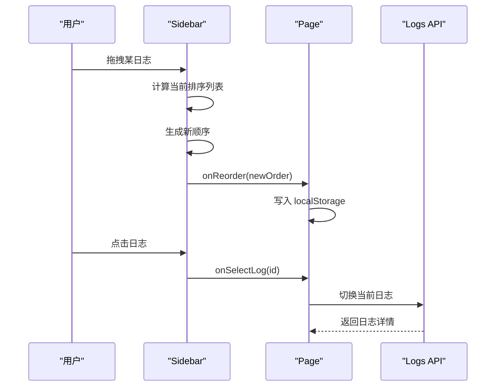
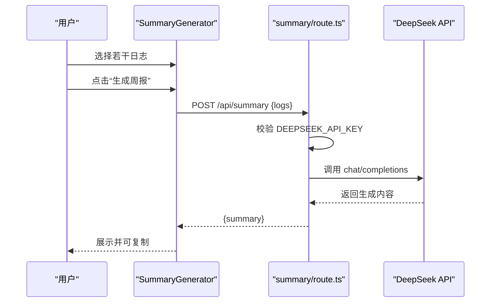
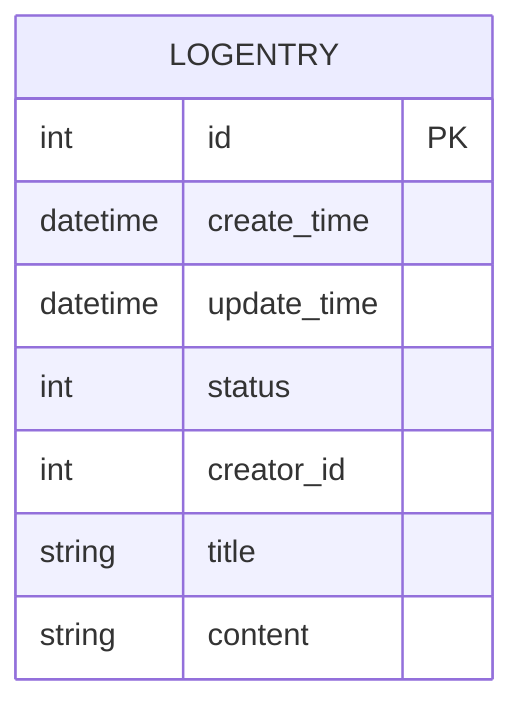
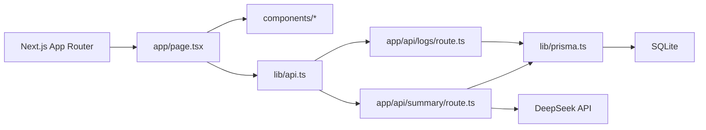

# 项目概述

<cite>
**本文引用的文件**
- [README.md](file://README.md)
- [package.json](file://package.json)
- [next.config.js](file://next.config.js)
- [prisma/schema.prisma](file://prisma/schema.prisma)
- [lib/prisma.ts](file://lib/prisma.ts)
- [lib/types.ts](file://lib/types.ts)
- [lib/utils.ts](file://lib/utils.ts)
- [lib/api.ts](file://lib/api.ts)
- [app/page.tsx](file://app/page.tsx)
- [components/Sidebar.tsx](file://components/Sidebar.tsx)
- [components/Editor.tsx](file://components/Editor.tsx)
- [components/SummaryGenerator.tsx](file://components/SummaryGenerator.tsx)
- [app/api/logs/route.ts](file://app/api/logs/route.ts)
- [app/api/summary/route.ts](file://app/api/summary/route.ts)
</cite>

## 目录
1. [简介](#简介)
2. [项目结构](#项目结构)
3. [核心组件](#核心组件)
4. [架构总览](#架构总览)
5. [详细组件分析](#详细组件分析)
6. [依赖关系分析](#依赖关系分析)
7. [性能考量](#性能考量)
8. [故障排查指南](#故障排查指南)
9. [结论](#结论)
10. [附录](#附录)

## 简介
AI1_Log 是一款基于 Next.js 的全栈智能日志管理系统，旨在帮助用户高效记录每日工作，并通过 AI 自动生成周报。项目强调“任务延续性管理”与“自动化报告生成”，通过简洁的 Markdown 式编辑器、未完成任务导入、拖拽排序、本地存储与响应式 UI，提升日常工作的组织效率与产出质量。

- 设计目标
  - 提升工作效率：通过结构化日志与 AI 汇总减少重复劳动
  - 实现任务延续性管理：一键导入上一条日志的未完成任务
  - 自动化报告生成：基于选定日志，调用 DeepSeek AI 生成结构化周报
  - 本地持久化：SQLite 数据库存储，保障数据安全与离线可用

- 关键特性
  - 响应式 UI：移动端与桌面端一致体验
  - Markdown 编辑器：标题层级、待办清单、自动换行
  - 拖拽排序：自定义日志列表顺序，配合本地持久化
  - 未完成任务导入：从上一条日志自动提取未完成任务并带入当前日志
  - AI 周报：选择日志后一键生成 Markdown 格式的周报

**章节来源**
- [README.md](file://README.md#L1-L64)

## 项目结构
项目采用典型的 Next.js App Router 目录结构，前端页面与 API 路由清晰分离，组件化程度高，便于维护与扩展。

**图表来源**
- [app/page.tsx](file://app/page.tsx#L1-L209)
- [components/Sidebar.tsx](file://components/Sidebar.tsx#L1-L234)
- [components/Editor.tsx](file://components/Editor.tsx#L1-L457)
- [components/SummaryGenerator.tsx](file://components/SummaryGenerator.tsx#L1-L237)
- [app/api/logs/route.ts](file://app/api/logs/route.ts#L1-L38)
- [app/api/summary/route.ts](file://app/api/summary/route.ts#L1-L78)
- [lib/prisma.ts](file://lib/prisma.ts#L1-L12)
- [prisma/schema.prisma](file://prisma/schema.prisma#L1-L26)
- [lib/api.ts](file://lib/api.ts#L1-L56)
- [lib/utils.ts](file://lib/utils.ts#L1-L168)
- [lib/types.ts](file://lib/types.ts#L1-L34)

**章节来源**
- [README.md](file://README.md#L38-L64)
- [package.json](file://package.json#L1-L30)
- [next.config.js](file://next.config.js#L1-L8)

## 核心组件
- 主页面容器（app/page.tsx）
  - 负责加载日志、管理视图模式（编辑/预览/周报）、处理排序与本地持久化、协调侧边栏与编辑器/周报组件
  - 提供创建、更新、删除日志的入口，并在移动端提供抽屉式导航

- 侧边栏（components/Sidebar.tsx）
  - 展示日志列表，支持拖拽排序、悬停删除、选中态高亮
  - 提供“新建日志”、“生成周报”入口，与主页面联动

- 编辑器（components/Editor.tsx）
  - 基于块（Block）的 Markdown 编辑器，支持标题层级、待办清单、自动换行与键盘快捷键
  - 提供“导入上一条日志未完成任务”的能力，自动带入上级标题上下文
  - 防抖保存与本地变更检测，减少网络请求频率

- 周报生成器（components/SummaryGenerator.tsx）
  - 选择日志范围，调用后端 API 生成周报
  - 支持一键复制、错误提示与结果展示（Markdown 渲染）

- API 路由
  - 日志 API：GET/POST 新增日志，返回按创建时间倒序的正常状态日志
  - 周报 API：校验 DeepSeek API Key，构造系统提示词与用户上下文，调用 DeepSeek Chat API 并返回生成结果

- 数据与工具
  - Prisma：SQLite 数据库客户端封装，避免开发模式下重复实例化
  - 类型定义：统一 LogEntry、Block、ViewMode、Status 等类型
  - 工具函数：Markdown 与块结构互转、未完成任务提取、日期格式化、ID 生成

**章节来源**
- [app/page.tsx](file://app/page.tsx#L1-L209)
- [components/Sidebar.tsx](file://components/Sidebar.tsx#L1-L234)
- [components/Editor.tsx](file://components/Editor.tsx#L1-L457)
- [components/SummaryGenerator.tsx](file://components/SummaryGenerator.tsx#L1-L237)
- [app/api/logs/route.ts](file://app/api/logs/route.ts#L1-L38)
- [app/api/summary/route.ts](file://app/api/summary/route.ts#L1-L78)
- [lib/prisma.ts](file://lib/prisma.ts#L1-L12)
- [lib/types.ts](file://lib/types.ts#L1-L34)
- [lib/utils.ts](file://lib/utils.ts#L1-L168)
- [lib/api.ts](file://lib/api.ts#L1-L56)

## 架构总览
系统采用前后端分离的 API 路由模式：
- 前端：Next.js App Router 页面与组件，负责 UI 与交互
- API 层：Next.js API 路由，提供日志 CRUD 与 AI 周报接口
- 数据层：Prisma + SQLite，模型定义在 schema.prisma，运行时通过 lib/prisma.ts 注入
- AI 集成：DeepSeek Chat API，通过 app/api/summary/route.ts 调用

**图表来源**
- [app/page.tsx](file://app/page.tsx#L1-L209)
- [components/Sidebar.tsx](file://components/Sidebar.tsx#L1-L234)
- [components/Editor.tsx](file://components/Editor.tsx#L1-L457)
- [components/SummaryGenerator.tsx](file://components/SummaryGenerator.tsx#L1-L237)
- [app/api/logs/route.ts](file://app/api/logs/route.ts#L1-L38)
- [app/api/summary/route.ts](file://app/api/summary/route.ts#L1-L78)
- [lib/prisma.ts](file://lib/prisma.ts#L1-L12)
- [prisma/schema.prisma](file://prisma/schema.prisma#L1-L26)

## 详细组件分析

### 编辑器组件（Markdown 编辑器）
- 功能要点
  - 块结构解析与序列化：将 Markdown 转换为块数组，再还原为 Markdown，保证编辑体验与数据一致性
  - 标题层级切换：支持 h1/h2/h3 与正文切换，菜单式操作
  - 待办清单：支持勾选、回车自动延续、空标题降级
  - 键盘快捷键：Enter/Backspace/方向键优化输入流
  - 未完成任务导入：自动提取上一条日志的未完成任务，并带入上级标题上下文
  - 防抖保存：本地变更检测，800ms 防抖触发一次网络请求
  - 自动高度：textarea 根据内容高度自适应

**图表来源**
- [components/Editor.tsx](file://components/Editor.tsx#L1-L457)
- [lib/utils.ts](file://lib/utils.ts#L1-L168)
- [lib/api.ts](file://lib/api.ts#L1-L56)

**章节来源**
- [components/Editor.tsx](file://components/Editor.tsx#L1-L457)
- [lib/utils.ts](file://lib/utils.ts#L1-L168)
- [lib/api.ts](file://lib/api.ts#L1-L56)

### 侧边栏组件（日志列表与排序）
- 功能要点
  - 日志列表：按本地排序优先，其次按创建时间倒序
  - 拖拽排序：拖拽手柄可视化，拖拽过程中高亮放置位置，最终将新顺序写入本地存储
  - 交互：选中态高亮、悬停删除、点击切换日志、移动端抽屉式导航

**图表来源**
- [components/Sidebar.tsx](file://components/Sidebar.tsx#L1-L234)
- [app/page.tsx](file://app/page.tsx#L1-L209)
- [app/api/logs/route.ts](file://app/api/logs/route.ts#L1-L38)

**章节来源**
- [components/Sidebar.tsx](file://components/Sidebar.tsx#L1-L234)
- [app/page.tsx](file://app/page.tsx#L1-L209)

### 周报生成流程（AI 集成）
- 功能要点
  - 选择日志：按创建时间正序拼接上下文
  - 系统提示词：定义周报结构（概述、完成事项、进行中、下周计划），要求输出 Markdown
  - DeepSeek 调用：携带 Authorization 与消息体，返回生成内容
  - 错误处理：未配置密钥、请求失败、空日志等场景的错误提示

**图表来源**
- [components/SummaryGenerator.tsx](file://components/SummaryGenerator.tsx#L1-L237)
- [app/api/summary/route.ts](file://app/api/summary/route.ts#L1-L78)

**章节来源**
- [components/SummaryGenerator.tsx](file://components/SummaryGenerator.tsx#L1-L237)
- [app/api/summary/route.ts](file://app/api/summary/route.ts#L1-L78)

### 数据模型与 Prisma 集成
- 数据模型
  - LogEntry：包含基础字段（id、时间戳、状态、创建者）与业务字段（标题、内容）
  - SQLite：本地开发数据库，文件路径在 schema.prisma 中定义
- 客户端封装
  - lib/prisma.ts：全局单例模式，避免开发模式下重复实例化

**图表来源**
- [prisma/schema.prisma](file://prisma/schema.prisma#L1-L26)
- [lib/prisma.ts](file://lib/prisma.ts#L1-L12)

**章节来源**
- [prisma/schema.prisma](file://prisma/schema.prisma#L1-L26)
- [lib/prisma.ts](file://lib/prisma.ts#L1-L12)

## 依赖关系分析
- 技术栈与版本
  - Next.js 14：App Router、SSR/CSR 混合
  - Prisma：数据库 ORM，SQLite 本地存储
  - TailwindCSS：原子化样式框架
  - TypeScript：类型安全
  - DeepSeek API：AI 周报生成
- 组件耦合
  - app/page.tsx 作为中枢，耦合 Sidebar、Editor、SummaryGenerator
  - lib/api.ts 作为前端 API 封装，被页面与组件共享
  - app/api/* 作为后端 API，依赖 lib/prisma.ts 与环境变量
- 外部依赖
  - DeepSeek Chat API：需配置 DEEPSEEK_API_KEY
  - SQLite：本地数据库，无需额外服务

**图表来源**
- [package.json](file://package.json#L1-L30)
- [app/page.tsx](file://app/page.tsx#L1-L209)
- [lib/api.ts](file://lib/api.ts#L1-L56)
- [app/api/logs/route.ts](file://app/api/logs/route.ts#L1-L38)
- [app/api/summary/route.ts](file://app/api/summary/route.ts#L1-L78)
- [lib/prisma.ts](file://lib/prisma.ts#L1-L12)

**章节来源**
- [package.json](file://package.json#L1-L30)

## 性能考量
- 前端
  - 防抖保存：编辑器对变更进行 800ms 防抖，降低网络请求频率
  - 本地排序与持久化：排序顺序存入 localStorage，避免每次请求排序逻辑
  - 组件懒加载：Next.js 默认按需加载页面与组件
- 后端
  - 日志查询按状态与时间排序，SQLite 在小规模数据下性能稳定
  - AI 生成接口为同步请求，建议在生产环境考虑缓存与并发控制
- 数据库
  - SQLite 适合本地开发与轻量使用，如需高并发建议迁移至关系型数据库

[本节为通用指导，不直接分析具体文件]

## 故障排查指南
- 无法生成周报
  - 检查 DEEPSEEK_API_KEY 是否正确配置
  - 确认选择了至少一条日志
  - 查看后端返回的错误信息，确认网络连通性
- 编辑器保存失败
  - 检查网络请求是否成功，查看前端错误提示
  - 确认本地防抖定时器未阻塞后续保存
- 日志列表排序异常
  - 检查 localStorage 中的排序键是否存在且可解析
  - 清除浏览器缓存后重试
- 数据库初始化
  - 执行数据库推送命令以生成本地 SQLite 文件

**章节来源**
- [app/api/summary/route.ts](file://app/api/summary/route.ts#L1-L78)
- [lib/api.ts](file://lib/api.ts#L1-L56)
- [app/page.tsx](file://app/page.tsx#L1-L209)
- [README.md](file://README.md#L19-L34)

## 结论
AI1_Log 通过简洁的 UI 与强大的功能组合，实现了“日志记录 + 任务延续 + AI 周报”的完整闭环。其基于 Next.js 的现代架构、Prisma 的本地数据库与 DeepSeek 的 AI 集成，既满足初学者的快速上手，也为高级开发者提供了清晰的扩展点。未来可考虑引入更丰富的模板、导出 PDF、团队协作与权限控制等功能，进一步提升生产力与协作效率。

[本节为总结性内容，不直接分析具体文件]

## 附录
- 快速开始
  - 安装依赖、初始化数据库、配置环境变量、启动开发服务器
- 项目结构概览
  - app/、components/、lib/、prisma/、doc/ 等目录职责明确
- 环境变量
  - DEEPSEEK_API_KEY：用于调用 DeepSeek Chat API

**章节来源**
- [README.md](file://README.md#L19-L34)