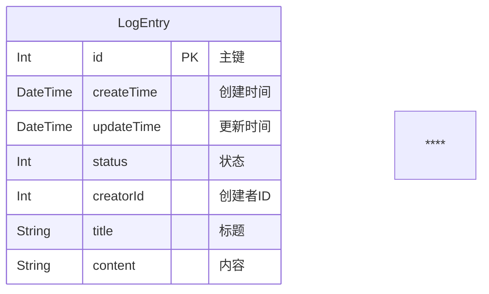

# 数据关系图

## ER 图

## 表结构

### LogEntry (日志条目)

| 字段       | 类型     | 约束     | 默认值 | 说明                 |
| ---------- | -------- | -------- | ------ | -------------------- |
| id         | Int      | PK, 自增 | AUTO   | 主键                 |
| createTime | DateTime | NOT NULL | now()  | 创建时间             |
| updateTime | DateTime | NOT NULL | AUTO   | 更新时间             |
| status     | Int      | NOT NULL | 1      | 状态：0=删除，1=正常 |
| creatorId  | Int      | NOT NULL | 0      | 创建者ID             |
| title      | String   | NOT NULL | -      | 日志标题             |
| content    | String   | NOT NULL | -      | 日志内容             |
****